# KHÓA LUẬN TỐT NGHIỆP

## HỆ THỐNG BÃI GIỮ XE THÔNG MINH PARKSMART

### Smart Parking System with AI, IoT, and Microservices Architecture

**Sinh viên thực hiện:** Nguyễn Hải Minh

---

## LỜI CẢM ƠN

_(Phần này dành cho sinh viên tự viết)_

---

## LỜI CAM ĐOAN

Tác giả xin cam đoan rằng khóa luận tốt nghiệp với đề tài **"Xây dựng hệ thống bãi giữ xe thông minh ParkSmart ứng dụng IoT và nhận diện biển số tự động"** là công trình nghiên cứu và phát triển do chính tác giả thực hiện dưới sự hướng dẫn của giảng viên.

Các số liệu, kết quả trình bày trong khóa luận là trung thực và chưa từng được công bố trong bất kỳ công trình nào khác. Các thông tin tham khảo, trích dẫn trong khóa luận đều được ghi rõ nguồn gốc tại phần Tài liệu tham khảo.

Tác giả xin chịu hoàn toàn trách nhiệm về nội dung và tính trung thực của khóa luận này.

TP. Hồ Chí Minh, tháng 4 năm 2026

**Sinh viên thực hiện**

Nguyễn Hải Minh

---

## TÓM TẮT

Sự gia tăng nhanh chóng của phương tiện cá nhân tại các đô thị lớn ở Việt Nam đã khiến mô hình bãi giữ xe thủ công bộc lộ nhiều bất cập: tắc nghẽn cổng ra/vào, rủi ro mất vé và gian lận, doanh thu khó kiểm soát, và thiếu dữ liệu vận hành để phân tích. Khóa luận này trình bày quá trình nghiên cứu và phát triển **ParkSmart** — hệ thống bãi giữ xe thông minh tích hợp trí tuệ nhân tạo (AI), Internet vạn vật (IoT), và kiến trúc Microservices nhằm khắc phục toàn diện các bất cập nêu trên.

Hệ thống vận hành trên **10 microservices** (4 Django 5.2.12 + 4 FastAPI 0.134.0 + 2 Go 1.22), đóng gói trong **15 Docker containers** và giao tiếp qua một API Gateway duy nhất. Về khía cạnh AI, hệ thống tích hợp **3 pipeline** chuyên biệt: nhận diện biển số xe (YOLOv8 + TrOCR cascade), phát hiện trạng thái ô đỗ (YOLO11n), và phân loại mệnh giá tiền Việt Nam (MobileNetV3-Large multi-branch, 9 mệnh giá từ 1.000đ đến 500.000đ). Trợ lý ảo chatbot sử dụng Google Gemini (gemini-3-flash-preview) với **7 giai đoạn xử lý** (Wizard → Intent → Confidence Gate → Safety → Action → Response → Memory), hỗ trợ **16 loại ý định** và đặt chỗ qua hội thoại tiếng Việt tự nhiên.

Giao diện người dùng là ứng dụng React 18 SPA gồm **28 trang** (19 root + 9 admin) và **73 UI components** (51 shadcn/ui + 22 tùy biến). Phần cứng IoT bao gồm ESP32 kết nối WiFi giao tiếp HTTP với máy chủ AI, Arduino điều khiển servo barrier qua UART, màn hình OLED và camera IP. Bộ mô phỏng Digital Twin trên Unity 2022.3 LTS với **30 C# scripts**, **6 camera ảo**, và **158 ô đỗ** tạo procedural hỗ trợ kiểm thử toàn bộ pipeline mà không cần phần cứng thực tế.

Các kết quả chính gồm: quy trình check-in/check-out hoàn toàn tự động, đặt chỗ trực tuyến với bản đồ thời gian thực qua WebSocket, chatbot AI tiếng Việt hoạt động 24/7, nhận dạng mệnh giá tiền tại quầy phục vụ thanh toán, và bảng điều khiển quản trị phân tích doanh thu.

**Từ khóa:** Bãi giữ xe thông minh, Nhận diện biển số tự động, Internet of Things, Microservices, Chatbot AI, Digital Twin.

---

## ABSTRACT

This thesis presents the design and implementation of **ParkSmart** — a smart parking system integrating Artificial Intelligence, Internet of Things, and Microservices Architecture. The system addresses critical limitations of traditional parking lots in Vietnam, including gate congestion, ticket fraud, opaque revenue management, and lack of analytical data.

ParkSmart comprises **10 microservices** (4 Django 5.2.12 + 4 FastAPI 0.134.0 + 2 Go 1.22) deployed across **15 Docker containers**. The AI subsystem features **3 pipelines** for license plate recognition (YOLOv8 + TrOCR cascade with tiered fallback), parking slot occupancy detection (YOLO11n), and Vietnamese banknote denomination recognition (MobileNetV3-Large multi-branch, 9-class classifier from 1,000 VND to 500,000 VND). An AI chatbot powered by Google Gemini processes Vietnamese natural language through a **7-stage pipeline** supporting 16 intent types and conversational booking.

The frontend is a React 18 SPA with **28 pages** and **73 UI components**. The IoT hardware consists of an ESP32 WiFi gateway communicating via HTTP with the AI server, an Arduino controlling servo barriers via UART, an OLED display, and IP cameras. A Unity 2022.3 LTS Digital Twin simulator with 6 virtual cameras and 158 procedurally-generated parking slots enables end-to-end testing without physical hardware.

Key results include fully autonomous check-in/check-out, online booking with real-time WebSocket maps, 24/7 Vietnamese AI chatbot support, cash recognition at kiosks, and a comprehensive admin analytics dashboard.

**Keywords:** Smart Parking, Automatic Number Plate Recognition, IoT, Microservices, AI Chatbot, Digital Twin.

---

## DANH MỤC TỪ VIẾT TẮT

| Từ viết tắt | Giải thích                                                                     |
| ----------- | ------------------------------------------------------------------------------ |
| AI          | Artificial Intelligence — Trí tuệ nhân tạo                                     |
| AMQP        | Advanced Message Queuing Protocol — Giao thức hàng đợi tin nhắn nâng cao       |
| ANPR        | Automatic Number Plate Recognition — Nhận diện biển số tự động                 |
| API         | Application Programming Interface — Giao diện lập trình ứng dụng               |
| ASGI        | Asynchronous Server Gateway Interface — Giao diện cổng máy chủ bất đồng bộ     |
| BFS         | Breadth-First Search — Tìm kiếm theo chiều rộng                                |
| CNN         | Convolutional Neural Network — Mạng nơ-ron tích chập                           |
| CORS        | Cross-Origin Resource Sharing — Chia sẻ tài nguyên nguồn gốc chéo              |
| CRUD        | Create, Read, Update, Delete — Tạo, Đọc, Cập nhật, Xóa                         |
| CSRF        | Cross-Site Request Forgery — Giả mạo yêu cầu liên trang                        |
| CSP         | Content Security Policy — Chính sách bảo mật nội dung                          |
| CV          | Computer Vision — Thị giác máy tính                                            |
| DI          | Dependency Injection — Tiêm phụ thuộc                                          |
| DRF         | Django REST Framework                                                          |
| DTO         | Data Transfer Object — Đối tượng truyền dữ liệu                                |
| ERD         | Entity Relationship Diagram — Sơ đồ quan hệ thực thể                           |
| FSM         | Finite State Machine — Máy trạng thái hữu hạn                                  |
| GPIO        | General Purpose Input/Output — Cổng vào/ra đa dụng                             |
| GPS         | Global Positioning System — Hệ thống định vị toàn cầu                          |
| HMR         | Hot Module Replacement — Thay thế module nóng                                  |
| HSV         | Hue, Saturation, Value — Sắc độ, Bão hòa, Giá trị                              |
| HTTP        | HyperText Transfer Protocol — Giao thức truyền siêu văn bản                    |
| HSTS        | HTTP Strict Transport Security — Bảo mật vận chuyển nghiêm ngặt HTTP           |
| I2C         | Inter-Integrated Circuit — Mạch tích hợp liên kết                              |
| IoT         | Internet of Things — Internet Vạn Vật                                          |
| IoU         | Intersection over Union — Giao trên Hợp                                        |
| JWT         | JSON Web Token — Mã thông báo Web JSON                                         |
| LBP         | Local Binary Pattern — Mẫu nhị phân cục bộ                                     |
| LLM         | Large Language Model — Mô hình ngôn ngữ lớn                                    |
| LPR         | License Plate Recognition — Nhận diện biển số xe                               |
| LTS         | Long Term Support — Hỗ trợ dài hạn                                             |
| MQTT        | Message Queuing Telemetry Transport — Vận chuyển đo lường hàng đợi tin nhắn    |
| NLU         | Natural Language Understanding — Hiểu ngôn ngữ tự nhiên                        |
| OCR         | Optical Character Recognition — Nhận dạng ký tự quang học                      |
| OLED        | Organic Light-Emitting Diode — Diode phát quang hữu cơ                         |
| ORM         | Object-Relational Mapping — Ánh xạ đối tượng-quan hệ                           |
| OTA         | Over-The-Air — Cập nhật qua không dây                                          |
| PWM         | Pulse Width Modulation — Điều chế độ rộng xung                                 |
| QR          | Quick Response — Phản hồi nhanh                                                |
| RAG         | Retrieval-Augmented Generation — Sinh văn bản có bổ trợ truy xuất              |
| RDBMS       | Relational Database Management System — Hệ quản trị CSDL quan hệ               |
| REST        | Representational State Transfer — Chuyển giao trạng thái đại diện              |
| RTSP        | Real Time Streaming Protocol — Giao thức truyền phát thời gian thực            |
| SPA         | Single Page Application — Ứng dụng trang đơn                                   |
| SQL         | Structured Query Language — Ngôn ngữ truy vấn có cấu trúc                      |
| SRP         | Scriptable Render Pipeline — Pipeline render có thể lập trình                  |
| TLS         | Transport Layer Security — Bảo mật tầng vận chuyển                             |
| TTA         | Test-Time Augmentation — Tăng cường dữ liệu lúc suy luận                       |
| TTL         | Time To Live — Thời gian sống                                                  |
| UART        | Universal Asynchronous Receiver-Transmitter — Bộ thu phát bất đồng bộ vạn năng |
| UDP         | User Datagram Protocol — Giao thức gói dữ liệu người dùng                      |
| URP         | Universal Render Pipeline — Pipeline render phổ quát                           |
| UUID        | Universally Unique Identifier — Định danh duy nhất toàn cục                    |
| WS          | WebSocket — Ổ cắm Web                                                          |
| WSGI        | Web Server Gateway Interface — Giao diện cổng máy chủ Web                      |
| YOLO        | You Only Look Once — Chỉ nhìn một lần                                          |

---

## MỤC LỤC

_(Mục lục được tạo tự động khi xuất bản — xem cấu trúc heading bên dưới)_

- Chương 1. TỔNG QUAN ĐỀ TÀI
- Chương 2. CƠ SỞ LÝ THUYẾT
- Chương 3. HỆ THỐNG PHÁT TRIỂN BÃI GIỮ XE THÔNG MINH ỨNG DỤNG IOT VÀ NHẬN DIỆN BIỂN SỐ TỰ ĐỘNG
- Chương 4. KẾT LUẬN VÀ HƯỚNG PHÁT TRIỂN
- TÀI LIỆU THAM KHẢO
- PHỤ LỤC

---

# Chương 1. TỔNG QUAN ĐỀ TÀI

---

## 1.1. Giới thiệu đề tài

Hiện nay, số lượng phương tiện cá nhân ngày càng gia tăng đã gây ra sức ép lớn lên các hệ thống bãi giữ xe hiện hành. Phần lớn các bãi xe vẫn vận hành theo phương thức thủ công: nhân viên bảo vệ phát vé giấy khi xe vào, đối chiếu vé khi xe ra, thu phí tiền mặt và ghi chép sổ sách bằng tay. Bên cạnh đó, một số bãi xe tại các trung tâm thương mại và tòa nhà văn phòng đã trang bị hệ thống **bán tự động** — người dùng nhấn nút lấy thẻ từ tại cổng vào, barrier tự động mở; khi ra, đút thẻ vào máy đọc là barrier mở lại. Tuy nhiên, hệ thống dạng này chủ yếu chỉ phù hợp với các bãi xe miễn phí hoặc tính phí đồng giá đơn giản; khi cần phân biệt nhiều mức giá, quản lý nhiều gói thời gian, hoặc xử lý các tình huống ngoại lệ như mất thẻ hay xe đậu quá giờ, quy trình lại quay về thao tác thủ công của nhân viên trực.

Điểm chung đáng chú ý là **cả hai mô hình trên đều thiếu vắng những khả năng then chốt** mà một hệ thống bãi xe hiện đại cần có. Thứ nhất, người dùng không thể **đặt chỗ trước** qua ứng dụng — họ chỉ biết bãi xe còn chỗ hay không khi đã đến nơi, gây lãng phí thời gian di chuyển nếu bãi đã đầy. Thứ hai, xe vào bãi được đậu tùy ý mà không có sự **phân định ô đỗ cụ thể**, dẫn đến tình trạng xe đậu lộn xộn, khó tìm chỗ trong giờ cao điểm, và không thể thống kê chính xác công suất sử dụng từng khu vực. Thứ ba, dù một số bãi có gắn camera an ninh, đó chỉ là camera **ghi hình thụ động** — không có khả năng nhận diện biển số tự động, phát hiện xe đậu sai vị trí, hay theo dõi trạng thái từng ô đỗ theo thời gian thực. Thứ tư, việc **thanh toán chỉ diễn ra tại cổng ra** bằng tiền mặt hoặc thẻ vật lý, không có phương thức thanh toán trực tuyến linh hoạt. Và cuối cùng, chủ bãi xe hoàn toàn **thiếu công cụ phân tích doanh thu** — không có dữ liệu điện tử để thống kê lưu lượng xe, tính toán hiệu suất vận hành, hay đưa ra quyết định kinh doanh dựa trên số liệu.

Xuất phát từ thực trạng đó, đề tài **"Xây dựng hệ thống bãi giữ xe thông minh ParkSmart ứng dụng IoT và nhận diện biển số tự động"** được thực hiện nhằm phát triển một giải pháp toàn diện, lấp đầy khoảng trống mà cả bãi xe thủ công lẫn bán tự động chưa đáp ứng được. Hệ thống cho phép người dùng **đặt chỗ trực tuyến trước khi đến bãi**, mỗi xe được phân bổ một **ô đỗ xác định**. Tại cổng ra/vào, hệ thống **camera AI tự động nhận diện biển số** và xác minh với thông tin booking mà không cần nhân viên can thiệp. Trong bãi, camera giám sát kết hợp trí tuệ nhân tạo **theo dõi trạng thái từng ô đỗ** theo thời gian thực — xe đậu đúng chỗ hay sai chỗ đều được phát hiện. Người dùng có thể **thanh toán trực tuyến** ngay trên ứng dụng hoặc thanh toán tiền mặt tại quầy với hệ thống AI nhận dạng mệnh giá. Toàn bộ quá trình vận hành — từ xe vào, đậu, đến xe ra — đều được ghi nhận và hiển thị trên **bảng điều khiển quản trị** với biểu đồ phân tích doanh thu, lưu lượng, và hiệu suất theo ngày/tuần/tháng. Ngoài ra, hệ thống tích hợp **chatbot trợ lý ảo AI** hỗ trợ tiếng Việt 24/7, giúp người dùng tra cứu chỗ trống, đặt chỗ qua hội thoại, và nhận thông báo chủ động về trạng thái booking.

Hệ thống ParkSmart — đối tượng nghiên cứu và phát triển của đề tài — được thiết kế như một hệ sinh thái toàn diện. Lõi kiến trúc của hệ thống vận hành theo **mô hình phân tán (Microservices)**, giúp đảm bảo khả năng mở rộng dịch vụ và chịu tải tốt khi xử lý đồng thời lượng giao dịch lớn.

Đóng vai trò "bộ não" của hệ thống là cụm dịch vụ **Trí tuệ nhân tạo (AI/Computer Vision)** với nhiệm vụ số hóa tự động toàn bộ quá trình vận hành vật lý: từ nhận diện chính xác biển số xe tại cổng ra/vào, phát hiện trạng thái ô đỗ trống theo thời gian thực, cho đến nhận dạng mệnh giá tiền mặt tại quầy thanh toán.

Về mặt tương tác vật lý, mảng **Internet vạn vật (IoT)** được triển khai qua các vi điều khiển làm nhiệm vụ trạm biên (gateway), phụ trách giao tiếp với cảm biến, hiển thị thông báo và tự động điều khiển chốt chặn (barrier) đồng bộ với kết quả từ AI phân tích. Giao diện người dùng và hệ thống quản trị được hợp nhất thành các ứng dụng nền web linh hoạt, song hành cùng một **Trợ lý ảo (Chatbot AI)** giao tiếp bằng ngôn ngữ tự nhiên để hỗ trợ trải nghiệm tiện lợi 24/7. Đặc biệt, để tối ưu quy trình nghiên cứu và kiểm thử, toàn bộ nghiệp vụ vật lý của bãi xe được ánh xạ lên một **Trình mô phỏng không gian 3D (Digital Twin)**, cho phép tái tạo chính xác hoạt động của phương tiện trong không gian ảo. Chi tiết về danh sách công nghệ và mô hình cụ thể áp dụng cho từng trụ cột trên sẽ được trình bày tại phần Phương pháp thực hiện (mục 1.4) và thiết kế hệ thống (Chương 3).

---

## 1.2. Lý do chọn đề tài

### 1.2.1. Xu hướng bãi xe thông minh toàn cầu

Trên thế giới, **Smart Parking** đang trở thành tiêu chuẩn của hệ sinh thái đô thị thông minh. Các giải pháp tiên tiến hiện nay tập trung mạnh vào việc tự động hóa và số hóa quy trình vận hành thông qua nhiều khía cạnh. Tiên quyết là công nghệ nhận diện biển số (ALPR) bằng camera AI nhằm thay thế hoàn toàn vé giấy truyền thống. Kế đến là khả năng giám sát ô đỗ bằng cảm biến IoT và camera để truyền tải trạng thái chỗ trống theo thời gian thực. Bên cạnh đó, các dịch vụ trực tuyến qua ứng dụng di động cũng được đẩy mạnh để hỗ trợ tìm kiếm, đặt chỗ trước và thanh toán không tiền mặt. Cuối cùng, hệ thống phân tích dữ liệu ứng dụng AI sẽ đánh giá dữ liệu lịch sử để dự báo lưu lượng và tự động điều chỉnh giá dịch vụ, tối ưu hóa lợi nhuận.

### 1.2.2. Cơ hội và tính khả thi công nghệ tại Việt Nam

Sự phát triển mạnh mẽ của AI và phần cứng IoT hiện nay cho phép số hóa hoàn toàn bãi giữ xe với chi phí rất hợp lý. Cốt lõi là công nghệ Thị giác máy tính (Computer Vision), khi trí tuệ nhân tạo đạt độ chính xác rất cao trong bóc tách hình ảnh với các mô hình ngày càng được thu gọn, đủ nhẹ để trích xuất dữ liệu tức thời ngay tại thiết bị biên (edge computing), thay thế hiệu quả nhiệm vụ quan sát của con người. Đồng thời, sự phổ biến của phần cứng IoT giá rẻ, điển hình là các vi điều khiển WiFi có giá thành thấp, khiến việc kết nối mạng và điều khiển phần cứng cơ điện (như chốt chặn, màn hình LED) trở nên dễ tiếp cận hơn. Ngoài ra, sự bùng nổ của các Mô hình ngôn ngữ lớn (LLM) vốn xử lý xuất sắc tiếng Việt đã mở ra kỷ nguyên xây dựng các trợ lý ảo tư vấn tự động như một nhân viên thực thụ. Cuối cùng, việc áp dụng kiến trúc phần mềm phân tán (Microservices) giúp hệ thống kết nối dễ dàng nhiều cụm chức năng khác nhau (AI, Web, IoT) vào chung vòng đời một sản phẩm ổn định, cho phép khả năng linh hoạt nâng cấp về sau.

### 1.2.3. Động lực từ nhu cầu trải nghiệm cá nhân

Bên cạnh yếu tố thực trạng và xu thế công nghệ, đề tài được thực hiện xuất phát từ khát khao ứng dụng các công nghệ hiện đại đã học vào một bài toán thực tiễn. Mục tiêu đặt ra là thiết kế một hệ thống bãi giữ xe vận hành hoàn toàn tự động, loại bỏ sự phụ thuộc vào nhân sự túc trực hay giám sát thủ công.

Hệ thống hướng tới việc tối ưu hóa trải nghiệm người dùng theo tiêu chí "tự phục vụ" (self-service) và không điểm chạm (touchless). Người dùng hoàn toàn làm chủ chu trình gửi xe của mình: từ việc chủ động đặt chỗ từ xa một cách tiện lợi, ra vào bãi nhanh gọn thông qua mạng lưới camera giám sát AI (không cần xuất trình vé), cho đến việc tự thanh toán với mức giá định sẵn minh bạch, rõ ràng. Khát vọng xây dựng một không gian đỗ xe thông minh, an toàn, nơi quy trình được quản lý tự động, riêng tư và không cần bất kỳ sự can thiệp nào của nhân viên bảo vệ, chính là động lực nguyên bản để phát triển dự án này.

---

## 1.3. Mục tiêu đề tài

Mục tiêu cốt lõi của đề tài là thiết kế và xây dựng một hệ thống bãi giữ xe vận hành hoàn toàn tự động, triệt tiêu sự phụ thuộc vào nhân sự túc trực. Đề tài tập trung tự động hóa toàn diện vòng đời gửi và nhận xe; qua đó mang đến một trải nghiệm giao dịch và lưu trữ phương tiện nhanh gọn, an toàn, tiện lợi và minh bạch tuyệt đối cho người sử dụng.

Để hiện thực hóa định hướng vĩ mô trên, hệ thống đặt ra các công năng mục tiêu cụ thể cấu thành nên một giải pháp hoàn chỉnh:

Thứ nhất, xây dựng cơ chế nhận diện tự động phương tiện với độ chính xác cao tại khu vực cổng ra/vào, đồng bộ hóa tín hiệu kiểm soát truy cập với hệ thống chốt chặn (barrier) cơ điện. Tiến trình này phải đảm bảo lưu lượng xe di chuyển hai chiều không bị gián đoạn, thao tác xác thực danh tính xe diễn ra trong tích tắc mà không cần tới nhân viên phát vé thủ công.

Thứ hai, phát triển nền tảng ứng dụng trực tuyến cho phép khách hàng đặt chỗ đậu xe từ xa một cách chủ động. Nền tảng này cần cung cấp bản đồ số hóa nhằm dẫn đường phương tiện di chuyển chính xác đến bến đỗ nội khu, đồng thời áp dụng phương thức thanh toán điện tử với bảng giá dịch vụ niêm yết công khai. Đặc biệt, người dùng có quyền tự giám sát trực diện và liên tục trạng thái an toàn của xe mình qua hệ thống truyền phát hình ảnh trực tiếp.

Cuối cùng, nhằm số hóa công tác chăm sóc khách hàng, hệ thống tích hợp một trợ lý tư vấn túc trực 24/7 nhằm tiếp nhận truy vấn số lượng ô đậu trống và hỗ trợ thao tác đặt hầm. Trong những tình huống phát sinh sự cố ngoại lệ, hệ thống phải cung cấp cổng liên lạc trực tuyến kết nối tức thì với ban quản lý bãi xe. Toàn bộ chuỗi vận hành này hòa quyện tạo thành quy trình phục vụ không điểm chạm (touchless), giải phóng triệt để công sức lao động chân tay.

---

## 1.4. Phương pháp thực hiện

### 1.4.1. Khảo sát và đánh giá thực trạng

Bước đi đầu tiên trong phương pháp thực hiện đề tài là tiến hành khảo sát và phân tích mô hình hoạt động của các bãi giữ xe truyền thống (vé giấy, thu tiền mặt) và bán tự động (thẻ từ, quẹt thẻ thủ công) hiện nay. Qua đánh giá thực tiễn, hầu hết các hệ thống này đều bộc lộ những điểm nghẽn nghiêm trọng. Trở ngại lớn nhất nằm ở nút thắt tại cổng kiểm soát, khi việc phụ thuộc vào nhân viên phát và thu vé vô hình trung tạo ra sự ùn tắc kéo dài vào các khung giờ cao điểm; các vật phẩm vật lý như vé giấy hay thẻ từ mang đến rủi ro hư hỏng, thất lạc và gian lận rất lớn. Tiếp đến là lỗ hổng trong quản trị không gian; sau khi phương tiện đi qua cổng, người dùng phải tự tìm kiếm chỗ đỗ bằng mắt thường, ban quản lý hoàn toàn mất dấu phương tiện và không biết xe nào đang đậu ở ô nào, dẫn đến thống kê sức chứa luôn bị sai lệch. Hơn nữa, việc tiếp cận dịch vụ hiện tại rất thụ động vì khách hàng không thể biết trước tình trạng bãi xe cho đến khi đến tận nơi, đồng thời các phương thức thanh toán vẫn mang nặng tính địa phương hóa. Cuối cùng là sự thiếu hụt dữ liệu phân tích; quy trình vận hành rời rạc khiến chủ bãi xe không thể thu thập các luồng dữ liệu thời gian thực (real-time data) để xây dựng hệ thống báo cáo doanh thu thông minh hay tối ưu hóa giá trị dịch vụ.

Từ việc đánh giá chuyên sâu các "nỗi đau" (pain points) kể trên, dự án xác định rõ yêu cầu phải xây dựng một hạ tầng có tính **Tự động hóa số hóa hoàn toàn** (bỏ vé vật lý, tự động nhận diện), có năng lực **Giám sát không gian 24/7** (camera theo dõi từng vị trí đỗ), và ứng dụng **Dịch vụ tự phục vụ** (đặt chỗ và tra cứu từ xa). Những định hướng khắt khe này là tiền đề trực tiếp để lựa chọn danh sách các giải pháp công nghệ sau.

### 1.4.2. Giải pháp công nghệ

Dựa trên kết quả khảo sát và phân tích yêu cầu, nhóm đề xuất giải pháp tổng thể với 5 trụ cột công nghệ chính:

**a) Kiến trúc Microservices**

Hệ thống được thiết kế theo kiến trúc microservices với 10 dịch vụ độc lập, mỗi dịch vụ đảm nhận một chức năng nghiệp vụ cụ thể. Kiến trúc đa ngôn ngữ (Python, Go) cho phép lựa chọn công nghệ phù hợp nhất cho từng loại tác vụ, đồng thời hỗ trợ phát triển, kiểm thử, và triển khai từng dịch vụ một cách độc lập. Toàn bộ hệ thống được đóng gói trong Docker container, quản lý bằng Docker Compose, giao tiếp qua API Gateway duy nhất, chia sẻ cơ sở dữ liệu MySQL 8.0, cache Redis 7, và message broker RabbitMQ. Danh sách chi tiết từng dịch vụ và bảng công nghệ được trình bày tại **Mục 3.1**.

**b) Trí tuệ nhân tạo (AI)**

AI pipeline được xây dựng tại ai-service-fastapi với 3 pipeline xử lý chuyên biệt. Đầu tiên là Plate Recognition Pipeline (nhận diện biển số), sử dụng mô hình YOLO fine-tuned để phát hiện vùng biển số Việt Nam, sau đó đưa qua chuỗi OCR cascade dự phòng từng tầng (TrOCR → EasyOCR → Tesseract) nhằm đạt độ chính xác cao nhất. Thứ hai là Slot Detection Pipeline (phát hiện ô đỗ), ứng dụng biến thể YOLO11n (nano) để phát hiện phương tiện trên camera overview, sau đó dùng thuật toán IoU matching với tọa độ ô đỗ đã cấu hình để xác định tình trạng trống. Thứ ba là Banknote Recognition Pipeline (nhận dạng tiền giấy), có khả năng phân loại mệnh giá tiền Việt Nam bằng phương pháp Hybrid kết hợp giữa phân tích không gian màu HSV (fast path) và phân loại sâu bằng EfficientNetV2-S (fallback), đồng thời áp dụng Test-Time Augmentation (TTA) ×5 để tăng cường độ bền vững trước nhiễu ảnh lúc suy luận.

**c) Internet of Things (IoT)**

Hệ thống phần cứng IoT được bố trí tại cổng ra/vào bãi xe, bao gồm bộ vi điều khiển ESP32 đóng vai trò IoT gateway, chịu trách nhiệm kết nối WiFi, nhận lệnh từ nút nhấn, gửi request đến AI server, hiển thị kết quả trên màn hình OLED và phát lệnh điều khiển qua UART. Tiếp theo là vi điều khiển Arduino có nhiệm vụ trực tiếp điều khiển hai servo motor tại cổng vào và cổng ra dựa trên lệnh nhận được từ ESP32. Đồng thời, hệ thống sử dụng Camera IP (DroidCam trên smartphone) và camera giám sát RTSP (EZVIZ) để cung cấp luồng hình ảnh thời gian thực cho các mô hình AI xử lý.

**d) Chatbot AI**

Chatbot service được xây dựng theo kiến trúc Hexagonal (Domain/Application/Infrastructure), pipeline 7 giai đoạn (Wizard → Intent → Confidence Gate → Safety → Action → Response → Memory) tích hợp Google Gemini LLM, hỗ trợ tiếng Việt, với booking wizard đa bước cho phép đặt chỗ hoàn toàn qua hội thoại. Bên cạnh đó, chatbot còn tích hợp **Retrieval-Augmented Generation (RAG)** sử dụng Chroma vector database và mô hình embedding đa ngôn ngữ `paraphrase-multilingual-MiniLM-L12-v2` để trả lời chính xác các câu hỏi về chính sách, quy định, giờ hoạt động, và thông tin bãi xe cụ thể — tránh hallucination của LLM bằng cách chỉ trả lời dựa trên knowledge base đã kiểm duyệt.

**e) Trình mô phỏng Digital Twin (Unity 3D)**

Nhằm kiểm thử toàn diện các pipeline AI, IoT và giao thức mạng trong giai đoạn nghiên cứu mà không phụ thuộc vào thiết lập phần cứng thực tế, hệ thống tích hợp một trình mô phỏng bãi giữ xe 3D xây dựng bằng Unity Game Engine. Trình mô phỏng này đóng vai trò như một bản sao kỹ thuật số (Digital Twin), tái tạo chính xác quy mô bãi đỗ, luồng phương tiện di chuyển, thao tác check-in/out, trích xuất hình ảnh camera ảo (virtual camera) gửi về server xử lý, và kết nối WebSocket để phản hồi thời gian thực.

Về phương pháp phát triển phần mềm, dự án áp dụng quy trình Agile/Scrum, phát triển theo từng sprint kéo dài từ 1–2 tuần với ưu tiên đặt vào các sản phẩm hoàn thiện (deliverable). Quy trình quản lý mã nguồn (Git workflow) tuân thủ nghiêm ngặt các quy tắc Conventional commits, chia nhánh tính năng (feature branching) và thực hiện code review. Việc kiểm thử (Testing) được tiến hành kỹ lưỡng bao gồm Unit test (với pytest, vitest), E2E test (sử dụng Playwright [30]), và integration test. Cuối cùng, khâu triển khai được tự động hóa qua hệ thống CI/CD thông qua Docker build và Docker Compose.

---

## 1.5. Bố cục đề tài

Đề tài được trình bày trong 4 chương với nội dung như sau:

**Chương 1: Tổng quan đề tài** — Giới thiệu đề tài, lý do chọn đề tài, mục tiêu và phương pháp thực hiện. Chương này đặt nền tảng cho toàn bộ báo cáo bằng việc phân tích bối cảnh thực tế, xác định vấn đề cần giải quyết, và đề xuất giải pháp tổng thể.

**Chương 2: Cơ sở lý thuyết** — Trình bày nền tảng lý thuyết của 9 nhóm công nghệ cốt lõi được sử dụng trong đề tài: Hạ tầng và kiến trúc Microservices (MySQL, Redis, RabbitMQ, Docker, Nginx), Trí tuệ nhân tạo và Thị giác máy tính (nhận diện biển số, phát hiện phương tiện, nhận dạng tiền), Internet of Things (phần cứng nhúng ESP32, Arduino), Django REST Framework (backend API), FastAPI (backend bất đồng bộ), Go với Gin và WebSocket (API Gateway và real-time), ReactJS (giao diện người dùng), Chatbot AI (trợ lý ảo tích hợp Gemini), và Unity Game Engine (mô phỏng 3D Digital Twin). Các nhóm công nghệ được sắp xếp theo mức độ quan trọng đối với hệ thống. Mỗi nhóm công nghệ được phân tích từ góc độ giới thiệu, lý do lựa chọn (kèm bảng so sánh với giải pháp thay thế), kiến trúc, kỹ thuật cụ thể áp dụng, đến đánh giá ưu nhược điểm trong bối cảnh dự án.

**Chương 3: Phân tích và thiết kế hệ thống** — Phân tích yêu cầu hệ thống thông qua sơ đồ use case, đặc tả chi tiết các chức năng. Trình bày thiết kế kiến trúc microservices, sơ đồ cơ sở dữ liệu, thiết kế API, và luồng xử lý nghiệp vụ. Giới thiệu kết quả giao diện và demo chức năng đã phát triển.

**Chương 4: Kết luận và hướng phát triển** — Tổng kết kết quả đạt được, đánh giá ưu nhược điểm, và đề xuất hướng phát triển tương lai cho hệ thống ParkSmart.

---

# Chương 2. CƠ SỞ LÝ THUYẾT

---

Chương này trình bày cơ sở lý thuyết của **mười nhóm công nghệ** được ParkSmart áp dụng, sắp xếp theo **mức độ trọng yếu đối với đóng góp khoa học của đề tài** — ưu tiên trình bày các công nghệ cốt lõi tạo nên sự khác biệt trước, sau đó mới đến các framework phát triển ứng dụng và cuối cùng là hạ tầng hỗ trợ.

Mở đầu là **kiến trúc Microservices** (Mục 2.1) — bộ khung tổng thể định hình toàn bộ cách các dịch vụ trong hệ thống giao tiếp, triển khai và mở rộng độc lập. Tiếp theo, ba trụ cột công nghệ mang tính đặc thù của đề tài được trình bày tuần tự: **Trí tuệ nhân tạo và Thị giác máy tính** (Mục 2.2) — ba pipeline AI xử lý nhận diện biển số, phát hiện ô đỗ, và nhận dạng tiền giấy; **Chatbot AI** (Mục 2.3) — trợ lý ảo tiếng Việt sử dụng mô hình ngôn ngữ lớn Google Gemini với pipeline bảy giai đoạn; và **Internet of Things** (Mục 2.4) — hệ thống phần cứng ESP32–Arduino điều khiển barrier vật lý tại cổng bãi xe. Mục 2.5 giới thiệu **bộ mô phỏng Unity Digital Twin** — công cụ kiểm thử toàn bộ pipeline ParkSmart trong môi trường 3D mà không cần phần cứng thực tế, giúp nhóm phát triển lặp nhanh trong giai đoạn nghiên cứu.

Các mục 2.6 đến 2.9 trình bày **các framework phát triển ứng dụng**: **Django REST Framework** cho bốn dịch vụ backend nghiệp vụ (Mục 2.6), **FastAPI** cho bốn dịch vụ backend bất đồng bộ và AI (Mục 2.7), **ngôn ngữ Go cùng Gin Framework và Gorilla WebSocket** cho hai dịch vụ hiệu năng cao là Gateway và Realtime (Mục 2.8), và **ReactJS kết hợp TypeScript** cho ứng dụng giao diện người dùng dạng Single Page Application (Mục 2.9). Kết thúc chương, Mục 2.10 tổng hợp các **dịch vụ hạ tầng và triển khai** bao gồm MySQL, Redis, RabbitMQ, Docker và Nginx — những thành phần vận hành nền tảng được chia sẻ giữa tất cả các microservice.

Mỗi nhóm công nghệ được trình bày thuần theo tính chất **cơ sở lý thuyết**, với bốn tiểu mục tiêu chuẩn: (1) **giới thiệu khái niệm** — định nghĩa công nghệ, lịch sử ra đời, tác giả và vị trí trong hệ sinh thái phần mềm; (2) **kiến trúc và nguyên lý hoạt động** — các thành phần chính, sơ đồ kiến trúc chung và các khái niệm kỹ thuật nền tảng; (3) **so sánh với các công nghệ thay thế** — bảng đánh giá song song với hai đến ba phương án tương đương, kèm đoạn biện luận ngắn về lý do đề tài lựa chọn công nghệ này; (4) **ưu điểm và nhược điểm** — đánh giá các đặc tính kỹ thuật vốn có của công nghệ trong khung tham chiếu phổ quát.

Chi tiết về **cách đề tài ParkSmart triển khai và áp dụng** từng công nghệ cụ thể — bao gồm cấu hình, phiên bản thư viện, tham số thuật toán, kiến trúc thư mục mã nguồn, và các quyết định thiết kế gắn với bài toán bãi giữ xe — được trình bày tại **Chương 3** (Hệ thống phát triển bãi giữ xe thông minh ứng dụng IoT và nhận diện biển số tự động). Cách phân tách này tuân thủ nguyên tắc **"cơ sở lý thuyết thuần túy"** của chuẩn khóa luận tốt nghiệp: Chương 2 trả lời câu hỏi _"công nghệ này là gì và hoạt động ra sao?"_, trong khi Chương 3 trả lời câu hỏi _"đề tài đã sử dụng công nghệ này như thế nào?"_. Sự phân tách rõ ràng giữa hai câu hỏi giúp người đọc có thể tiếp cận Chương 2 như một tài liệu giới thiệu công nghệ độc lập, và Chương 3 như một mô tả kỹ thuật triển khai có đủ chiều sâu.

> **Ghi chú về thứ tự và nguyên tắc trình bày**: Thứ tự các mục 2.1 → 2.10 được tái cấu trúc theo triết lý "Core and Unique First" — đưa các đóng góp khoa học đặc thù của đề tài lên trước, dồn các hạ tầng hỗ trợ phổ biến xuống sau. Nội dung các mục được viết theo nguyên tắc **lý thuyết thuần túy**, hạn chế lồng ghép chi tiết triển khai cụ thể của ParkSmart. Bảng ánh xạ với phiên bản cũ, danh sách các phần đã được chuyển sang Chương 3, và hướng dẫn tra cứu chéo được trình bày tại tài liệu phụ trợ `docs/BAO_CAO_PLAN_REORDER_GUIDE.md`.

## 2.1. Hạ tầng và Triển khai hệ thống

Một hệ thống microservices với nhiều dịch vụ độc lập không thể vận hành nếu chỉ có mã nguồn ứng dụng — nó cần một **hạ tầng kỹ thuật** bao gồm cơ sở dữ liệu lưu trữ, hệ thống cache và message broker cho giao tiếp giữa các dịch vụ, nền tảng containerization đảm bảo tính nhất quán môi trường, và reverse proxy phục vụ traffic production. Phần này trình bày lý thuyết về các thành phần hạ tầng cốt lõi và mô hình kiến trúc microservices mà ParkSmart áp dụng.

### 2.1.1. MySQL — Hệ quản trị cơ sở dữ liệu quan hệ

MySQL là hệ quản trị cơ sở dữ liệu quan hệ (Relational Database Management System — RDBMS) mã nguồn mở phổ biến nhất thế giới, được phát triển bởi Oracle Corporation [16]. Phiên bản sử dụng trong ParkSmart là **MySQL 8.0** — phiên bản lớn nhất tính đến thời điểm hiện tại, mang đến nhiều cải tiến quan trọng so với MySQL 5.x: hỗ trợ kiểu dữ liệu JSON native, window functions, Common Table Expressions (CTEs), cải thiện hiệu năng InnoDB engine, và tăng cường bảo mật với caching_sha2_password làm plugin xác thực mặc định.

MySQL hoạt động theo mô hình client-server: MySQL Server (mysqld) chạy như một tiến trình daemon, lắng nghe kết nối trên port 3306, tiếp nhận câu lệnh SQL từ client, thực thi truy vấn trên dữ liệu lưu trong storage engine (mặc định là InnoDB), và trả kết quả về client. InnoDB engine đảm bảo tính **ACID** (Atomicity, Consistency, Isolation, Durability) — bốn thuộc tính nền tảng của giao dịch cơ sở dữ liệu đáng tin cậy: mỗi giao dịch hoặc hoàn thành toàn bộ hoặc rollback hoàn toàn (Atomicity), dữ liệu luôn ở trạng thái hợp lệ sau mỗi giao dịch (Consistency), các giao dịch đồng thời không ảnh hưởng lẫn nhau (Isolation), và dữ liệu đã commit không bị mất ngay cả khi server crash (Durability). InnoDB còn hỗ trợ row-level locking (khóa ở mức dòng thay vì toàn bảng), foreign key constraints, và full-text search — tất cả cần thiết cho ứng dụng đa dịch vụ truy cập đồng thời như ParkSmart.

Trong kiến trúc ParkSmart, MySQL đóng vai trò **cơ sở dữ liệu duy nhất** của toàn hệ thống, lưu trữ trong một database đơn `parksmartdb`. Tất cả 9 dịch vụ Python đều kết nối đến cùng MySQL instance — tuy nhiên, mỗi dịch vụ sở hữu và quản lý tập bảng riêng của mình, không truy cập trực tiếp vào bảng của dịch vụ khác. Đây là pattern **Database-per-Service (logical)** — một biến thể phổ biến trong microservices nơi chi phí vận hành nhiều database instance riêng biệt chưa cần thiết. Về mặt triển khai, MySQL chạy trong Docker container với port mapping 3307 (host) → 3306 (container), sử dụng UUID dạng CHAR(36) làm primary key cho tất cả các bảng — đảm bảo tính duy nhất toàn cục (globally unique) mà không cần đồng bộ auto-increment giữa các dịch vụ.

**Lý do lựa chọn MySQL cho ParkSmart:**

ParkSmart yêu cầu một RDBMS có tính nhất quán cao (ACID), hỗ trợ quan hệ phức tạp giữa các thực thể (user–vehicle–booking–parking slot), tích hợp tốt với Django ORM (framework chính của 4/9 Python services), và dễ triển khai trong môi trường Docker. Bảng dưới so sánh MySQL 8.0 với ba lựa chọn phổ biến khác:

| Tiêu chí                     | MySQL 8.0          | PostgreSQL 16        | MongoDB 7            | SQLite 3          |
| ---------------------------- | ------------------ | -------------------- | -------------------- | ----------------- |
| Mô hình dữ liệu              | Quan hệ (SQL)      | Quan hệ (SQL)        | Tài liệu (NoSQL)     | Quan hệ (SQL)     |
| ACID compliance              | ✅ Đầy đủ (InnoDB) | ✅ Đầy đủ            | ⚠️ Ở mức document    | ✅ Đầy đủ         |
| Quan hệ phức tạp (FK, JOINs) | ✅ Tốt             | ✅ Rất tốt           | ❌ Không native      | ⚠️ Hạn chế        |
| Hỗ trợ JSON native           | ✅ (từ 5.7+)       | ✅ (JSONB, mạnh hơn) | ✅ (native document) | ❌ Không          |
| Django ORM tích hợp          | ✅ First-class     | ✅ First-class       | ⚠️ Cần djongo        | ✅ Mặc định       |
| Concurrent connections       | ✅ Hàng ngàn       | ✅ Hàng ngàn         | ✅ Hàng ngàn         | ❌ Một writer/lần |
| Cộng đồng và hosting         | ⭐⭐⭐⭐⭐         | ⭐⭐⭐⭐             | ⭐⭐⭐⭐             | ⭐⭐              |
| Hiệu năng ghi (writes)       | ⭐⭐⭐⭐           | ⭐⭐⭐⭐⭐           | ⭐⭐⭐⭐⭐           | ⭐⭐              |
| Docker deployment            | ✅ Official image  | ✅ Official image    | ✅ Official image    | ❌ Embedded       |

MySQL và PostgreSQL đều đáp ứng tốt yêu cầu ACID, quan hệ phức tạp, và Django ORM — hai ứng cử viên hàng đầu. PostgreSQL có ưu thế ở JSON processing (JSONB nhanh hơn MySQL JSON) và một số advanced features (partial indexes, materialized views, array types). Tuy nhiên, MySQL được lựa chọn cho ParkSmart vì ba lý do: (1) đội ngũ phát triển đã có kinh nghiệm làm việc với MySQL, giảm learning curve; (2) MySQL có cộng đồng sử dụng lớn nhất, tài liệu phong phú, dễ tìm hỗ trợ khi gặp vấn đề; (3) các tính năng advanced của PostgreSQL (JSONB, materialized views) chưa cần thiết cho scope hiện tại của ParkSmart — dữ liệu chủ yếu là quan hệ (user, vehicle, booking, slot), lượng JSON data không lớn. MongoDB bị loại vì ParkSmart có mô hình dữ liệu quan hệ rõ ràng (foreign keys giữa booking–user–vehicle–slot) mà document model không phù hợp. SQLite bị loại vì không hỗ trợ concurrent writes — hệ thống 10 services truy cập đồng thời sẽ gặp lock contention nghiêm trọng.

### 2.1.2. Redis — In-memory Cache và Message Broker

Redis (Remote Dictionary Server) là hệ thống lưu trữ dữ liệu **in-memory** (trong bộ nhớ RAM) theo mô hình key-value, được phát triển bởi Salvatore Sanfilippo [17]. Phiên bản sử dụng trong ParkSmart là **Redis 7** (image: redis:7-alpine). Khác với MySQL lưu dữ liệu trên đĩa cứng, Redis lưu toàn bộ dữ liệu trong RAM — cho tốc độ đọc/ghi ở mức **sub-millisecond** (dưới 1 mili-giây), nhanh hơn hàng trăm lần so với truy vấn database truyền thống. Redis hỗ trợ nhiều cấu trúc dữ liệu phong phú: strings, hashes, lists, sets, sorted sets, streams, và HyperLogLog — vượt xa mô hình key-value đơn giản. Ngoài ra, Redis còn cung cấp cơ chế **Pub/Sub** (Publish/Subscribe) cho messaging thời gian thực và khả năng **persistence** (lưu snapshot dữ liệu xuống đĩa qua RDB/AOF) để phục hồi sau restart.

Trong kiến trúc ParkSmart, Redis đảm nhận **năm vai trò đồng thời** — biến một công cụ duy nhất thành thành phần đa năng nhất của hạ tầng:

**Thứ nhất — Celery Broker và Result Backend (DB 0)**: Booking Service sử dụng Celery 5.4.0 cho các tác vụ bất đồng bộ — kiểm tra booking hết hạn, dọn dẹp định kỳ, gửi thông báo async. Redis DB 0 đóng vai trò message broker: khi Celery Beat lên lịch một task, nó đẩy message vào Redis queue; Celery Worker liên tục lắng nghe queue, lấy message ra và thực thi task; kết quả task được lưu lại trong cùng Redis DB 0 để tra cứu trạng thái.

**Thứ hai — Session Store cho Gateway (DB 1)**: Gateway Service (Go) lưu trữ session data người dùng trong Redis DB 1. Mỗi khi user đăng nhập, Auth Service tạo session và lưu vào Redis; mỗi request tiếp theo, Gateway tra cứu session trong Redis với độ trễ sub-millisecond để xác thực. Sử dụng Redis cho session (thay vì cookie-based JWT) cho phép **server-side session revocation** — khi user logout hoặc bị khóa tài khoản, chỉ cần xóa key trong Redis là session bị vô hiệu ngay lập tức.

**Thứ ba — Cache Layer cho các microservices (DB 2–4)**: Booking Service (DB 2), Parking Service và Chatbot Service (DB 3), và Vehicle Service (DB 4) sử dụng Redis để cache dữ liệu thường xuyên truy cập — thông tin parking slot, danh sách booking active, thông tin vehicle. Cache giúp giảm tải cho MySQL: thay vì mỗi request đều query database, service kiểm tra Redis trước — nếu dữ liệu đã có trong cache (cache hit), trả về ngay với latency sub-millisecond; nếu không (cache miss), query MySQL rồi lưu kết quả vào Redis cho lần sau.

**Thứ tư — Pub/Sub Channel cho Real-time Events (DB 5)**: Khi trạng thái bãi xe thay đổi (xe vào/ra slot), Parking Service publish event vào Redis pub/sub channel (DB 5). Realtime Service (Go) subscribe channel này và nhận event gần như tức thời, sau đó broadcast qua WebSocket đến tất cả client đang kết nối. Cơ chế pub/sub cho phép giao tiếp giữa Python services và Go services mà hai bên không cần biết nhau tồn tại — cùng một Redis instance làm trung gian.

**Thứ năm — Chatbot Conversation Cache (DB 6)**: Chatbot Service lưu ngữ cảnh hội thoại (conversation context) của từng user vào Redis DB 6, cho phép chatbot nhớ nội dung trao đổi trước đó trong cùng phiên hội thoại mà không cần query database mỗi lượt. Redis tự động xóa dữ liệu hết hạn (TTL — Time To Live), phù hợp cho conversation cache chỉ cần giữ trong thời gian ngắn.

Việc phân chia 7 logical databases (DB 0–6) trong cùng một Redis instance giúp ParkSmart tách biệt dữ liệu theo mục đích sử dụng mà không cần vận hành nhiều Redis server. Mỗi database hoạt động như một namespace riêng — data trong DB 0 (Celery) không xung đột với DB 1 (session), lệnh `FLUSHDB` chỉ xóa dữ liệu trong database hiện tại mà không ảnh hưởng database khác.

### 2.1.3. RabbitMQ — Message Broker theo chuẩn AMQP

RabbitMQ là hệ thống message broker mã nguồn mở, triển khai chuẩn giao thức **AMQP** (Advanced Message Queuing Protocol) — giao thức tiêu chuẩn cho truyền tải message đáng tin cậy giữa các ứng dụng phân tán [18]. Phiên bản sử dụng trong ParkSmart là **RabbitMQ 3** (image: rabbitmq:3-management-alpine), bao gồm giao diện quản trị web tại port 15672 và kết nối AMQP tại port 5672. RabbitMQ hoạt động theo mô hình **producer → exchange → queue → consumer**: producer gửi message đến exchange, exchange định tuyến message vào các queue dựa trên routing rules, consumer lắng nghe queue và xử lý message. Đặc điểm quan trọng nhất của RabbitMQ là **message persistence** (lưu trữ message trên đĩa) và **acknowledgment mechanism** (consumer xác nhận đã xử lý xong message) — đảm bảo không có message nào bị mất, ngay cả khi consumer bị crash giữa chừng.

Trong ParkSmart, RabbitMQ phục vụ làm broker cho **event-driven messaging giữa các microservices** — không phải cho Celery tasks (Celery sử dụng Redis DB 0 [17]): khi Auth Service tạo tài khoản mới, Booking Service tạo booking, hoặc Parking Service cập nhật trạng thái bãi xe, các service này publish event vào RabbitMQ. Chatbot Service subscribe các event này để gửi thông báo chủ động (proactive notification) đến người dùng — ví dụ: "Booking của bạn đã được xác nhận" hoặc "Xe của bạn đã rời bãi." Python client sử dụng thư viện aio-pika 9.4.0 (async AMQP client) để giao tiếp với RabbitMQ không chặn event loop.

**Lý do sử dụng RabbitMQ song song với Redis Pub/Sub:**

ParkSmart đã sử dụng Redis pub/sub (DB 5) cho real-time events — vậy tại sao cần thêm RabbitMQ? Câu trả lời nằm ở sự khác biệt cơ bản giữa hai cơ chế:

- **Redis Pub/Sub** hoạt động theo mô hình **gửi và quên**: khi publisher gửi message, subscriber đang online sẽ nhận được; nhưng nếu subscriber offline (bị restart, mất kết nối), message **bị mất hoàn toàn** — Redis không lưu trữ message chưa được nhận. Điều này chấp nhận được cho real-time slot updates (nếu client bỏ lỡ một cập nhật, vài giây sau sẽ có cập nhật mới) nhưng không chấp nhận được cho thông báo booking.
- **RabbitMQ** hoạt động theo mô hình **lưu và chuyển tiếp**: message được lưu trữ trong hàng đợi trên đĩa cho đến khi consumer xác nhận đã xử lý xong (acknowledgment). Nếu consumer bị crash, message vẫn nằm trong queue và sẽ được gửi lại khi consumer khởi động lại. Đây chính là **đảm bảo giao nhận** — đảm bảo message không bị mất.

ParkSmart sử dụng cả hai: Redis pub/sub cho real-time UI updates (latency thấp, mất message không nghiêm trọng), RabbitMQ cho critical business events (booking notifications, payment confirmations — PHẢI được gửi đến user, không được mất).

### 2.1.4. Docker và Docker Compose — Containerization

Docker là nền tảng **containerization** mã nguồn mở cho phép đóng gói ứng dụng cùng toàn bộ dependencies (thư viện, runtime, cấu hình) vào một đơn vị triển khai di động gọi là **container** [15]. Container chia sẻ kernel hệ điều hành host nhưng cô lập hoàn toàn filesystem, network, và process space — nhẹ hơn nhiều so với máy ảo (Virtual Machine) vốn phải chạy cả một guest OS riêng biệt. Mỗi service trong ParkSmart được đóng gói thành một Docker image thông qua **Dockerfile** — file cấu hình mô tả các bước xây dựng image (base image, copy source code, install dependencies, expose port, start command).

**Docker Compose** là công cụ orchestration cho phép định nghĩa và quản lý ứng dụng **multi-container** bằng một file cấu hình YAML duy nhất. Thay vì chạy 15 lệnh `docker run` riêng lẻ, Docker Compose cho phép khai báo toàn bộ 15 containers cùng volumes, networks, environment variables, health checks, và dependency order trong file `docker-compose.yml`, sau đó khởi động toàn bộ hệ thống bằng một lệnh `docker compose up`. Compose cũng quản lý vòng đời container: khởi động theo thứ tự phụ thuộc (MySQL khởi động trước services cần database), restart khi container crash, và dọn dẹp khi dừng hệ thống.

Trong ParkSmart, Docker Compose quản lý tổng cộng **15 containers** (16 trong production với Nginx):

- **3 containers hạ tầng**: MySQL 8.0, Redis 7 (Alpine), RabbitMQ 3 (Management Alpine)
- **4 containers Django services**: Auth Service, Booking Service, Parking Service, Vehicle Service — mỗi service chạy trên Gunicorn 22.0.0 (WSGI production server)
- **4 containers FastAPI services**: AI Service, Chatbot Service, Payment Service, Notification Service — mỗi service chạy trên Uvicorn (ASGI production server)
- **2 containers Go services**: Gateway Service, Realtime Service — mỗi service là compiled binary chạy trực tiếp
- **2 containers Celery**: Worker (xử lý task) và Beat (lên lịch task định kỳ) cho Booking Service
- **1 container Nginx** (chỉ production): reverse proxy và static file serving

Tất cả containers giao tiếp qua Docker internal network (`parksmart-network`, bridge mode) — mỗi container có hostname trùng với service name, cho phép service gọi nhau bằng tên (ví dụ: `http://booking-service:8002`) thay vì IP address. Dữ liệu bền vững được lưu trong Docker volumes: `mysql_data`, `redis_data`, `rabbitmq_data` cho infrastructure, `ai_models` và `ai_datasets` cho file mô hình AI.

**Lý do lựa chọn Docker cho ParkSmart:**

| Tiêu chí                       | Docker Container                    | Máy ảo (VM)                    | Bare Metal        | Serverless (FaaS)           |
| ------------------------------ | ----------------------------------- | ------------------------------ | ----------------- | --------------------------- |
| Mức độ cô lập                  | ⭐⭐⭐⭐ (process-level)            | ⭐⭐⭐⭐⭐ (OS-level)          | ⭐ (không cô lập) | ⭐⭐⭐⭐⭐ (function-level) |
| Thời gian khởi động            | Vài giây                            | Vài phút                       | Không áp dụng     | Mili-giây                   |
| Overhead tài nguyên            | Thấp (~10MB/container)              | Cao (~1GB/VM)                  | Không có          | Biến thiên                  |
| Tính tái tạo (reproducibility) | ⭐⭐⭐⭐⭐ (Dockerfile = blueprint) | ⭐⭐⭐ (cần provisioning tool) | ⭐ (cài thủ công) | ⭐⭐⭐ (vendor lock-in)     |
| Dev-Prod parity                | ✅ Cùng image cho mọi môi trường    | ⚠️ Khó đảm bảo                 | ❌ Khác biệt lớn  | ❌ Khác biệt lớn            |
| Multi-language support         | ✅ Mỗi container = runtime riêng    | ✅ Mỗi VM = OS riêng           | ⚠️ Phức tạp       | ⚠️ Giới hạn runtime         |

Docker là lựa chọn tối ưu cho ParkSmart vì hai lý do cốt lõi: (1) **Tái tạo môi trường** — Dockerfile đóng vai trò "bản thiết kế" cho mỗi service, đảm bảo môi trường phát triển (máy tính lập trình viên), staging, và production hoàn toàn giống nhau — loại bỏ lỗi "chỉ chạy được trên máy của lập trình viên"; (2) **Multi-language support** — ParkSmart sử dụng đồng thời Python 3.11+ và Go 1.22, mỗi ngôn ngữ cần runtime khác nhau — Docker cho phép mỗi service có container riêng với đúng runtime cần thiết, không xung đột dependencies. VM bị loại vì overhead quá lớn (chạy 15 VM đòi hỏi hàng chục GB RAM). Serverless bị loại vì ParkSmart cần WebSocket connections dài hạn (realtime service) và AI model loading nặng (ai-service) — không phù hợp với mô hình function-as-a-service ngắn hạn.

### 2.1.5. Nginx — Reverse Proxy và Web Server

**Nginx** (phát âm "engine-x") là phần mềm máy chủ web và reverse proxy mã nguồn mở, được phát triển bởi **Igor Sysoev** và phát hành lần đầu vào năm 2004. Nginx nổi bật nhờ kiến trúc **event-driven, non-blocking I/O** — cho phép xử lý hàng chục nghìn kết nối đồng thời trên một tiến trình duy nhất mà không cần tạo thread riêng cho mỗi kết nối như mô hình truyền thống của Apache HTTP Server. Nhờ đặc tính này, Nginx trở thành một trong những máy chủ web được sử dụng rộng rãi nhất trên thế giới, chiếm hơn 30% thị phần theo thống kê của W3Techs (2025).

Trong kiến trúc ứng dụng web hiện đại, Nginx thường đảm nhận bốn vai trò chính:

**Thứ nhất — phục vụ tài nguyên tĩnh (static file serving):** Nginx được thiết kế chuyên biệt để phân phối các tệp tĩnh (HTML, CSS, JavaScript, hình ảnh) với hiệu năng vượt trội so với các application server như Gunicorn hay Uvicorn. Khi người dùng truy cập ứng dụng web dạng Single Page Application, Nginx trả về tệp `index.html` ban đầu — từ đó framework phía client (React, Vue, Angular) tự xử lý điều hướng nội bộ (client-side routing) mà không cần gửi thêm yêu cầu đến máy chủ ứng dụng.

**Thứ hai — reverse proxy cho các yêu cầu API:** Nginx đóng vai trò lớp trung gian giữa trình duyệt người dùng và các dịch vụ backend phía sau. Mọi yêu cầu HTTP có đường dẫn phù hợp (ví dụ `/api/*`) được Nginx chuyển tiếp đến máy chủ ứng dụng tương ứng. Phía người dùng chỉ nhìn thấy một điểm truy cập duy nhất mà không cần biết hệ thống phía sau bao gồm bao nhiêu dịch vụ riêng biệt. Trong quá trình chuyển tiếp, Nginx truyền kèm các header quan trọng như `X-Real-IP`, `X-Forwarded-For` và `Host` để dịch vụ đích nhận được thông tin chính xác về máy khách gốc.

**Thứ ba — nâng cấp kết nối WebSocket:** Đối với các yêu cầu đến đường dẫn kết nối thời gian thực (ví dụ `/ws/*`), Nginx thực hiện quy trình nâng cấp giao thức từ HTTP sang WebSocket thông qua các header `Connection: Upgrade` và `Upgrade: websocket`. Sau khi nâng cấp thành công, Nginx duy trì kết nối hai chiều liên tục (persistent connection) giữa trình duyệt và dịch vụ xử lý thời gian thực, cho phép máy chủ chủ động đẩy dữ liệu đến máy khách mà không cần máy khách gửi yêu cầu lặp lại.

**Thứ tư — bổ sung các header bảo mật và tối ưu hiệu năng truyền tải:** Nginx có khả năng tự động thêm các HTTP security header theo khuyến nghị của OWASP — bao gồm `Content-Security-Policy` (CSP) nhằm ngăn chặn tấn công XSS, `Strict-Transport-Security` (HSTS) bắt buộc trình duyệt chỉ giao tiếp qua HTTPS, `X-Frame-Options` chống clickjacking, và `X-Content-Type-Options` ngăn trình duyệt tự suy đoán kiểu nội dung (MIME type sniffing). Về mặt hiệu năng, Nginx hỗ trợ nén Gzip giúp giảm đáng kể kích thước dữ liệu truyền tải trên đường truyền, đồng thời cho phép cấu hình chính sách cache dài hạn cho các tệp tĩnh có mã băm nội dung (content hash) trong tên tệp — nhờ đó trình duyệt có thể tái sử dụng các tài nguyên đã tải mà không cần tải lại, giảm thiểu băng thông và cải thiện tốc độ hiển thị trang.

### 2.1.6. Kiến trúc Microservices — Mô hình phát triển phần mềm

**Microservices** (kiến trúc vi dịch vụ) là mô hình thiết kế phần mềm trong đó một ứng dụng được phân rã thành tập hợp các **dịch vụ nhỏ, độc lập**, mỗi dịch vụ đảm nhận một chức năng nghiệp vụ cụ thể và giao tiếp qua các giao thức nhẹ như HTTP REST hoặc hàng đợi tin nhắn [23]. Thuật ngữ này được **Martin Fowler** và **James Lewis** chính thức định nghĩa vào năm 2014, kế thừa các ý tưởng từ kiến trúc hướng dịch vụ (SOA) nhưng đặt trọng tâm vào **độc lập hóa triển khai** và **tự trị nghiệp vụ** ở mức chi tiết hơn.

Kiến trúc microservices đối lập với mô hình **Monolithic** — nơi toàn bộ ứng dụng nằm trong một mã nguồn duy nhất, chia sẻ chung một connection pool cơ sở dữ liệu, và mọi thay đổi đều yêu cầu triển khai lại toàn bộ hệ thống. Monolithic đơn giản khi khởi đầu nhưng bộc lộ hạn chế khi ứng dụng lớn lên: cập lệ (coupling) giữa các module tăng cao, khó kiểm thử riêng từng phần, và một lỗi cục bộ có thể kéo theo sự cố toàn hệ thống.

**Các nguyên tắc thiết kế cốt lõi:**

1. **Single Responsibility**: Mỗi dịch vụ đảm nhận đúng một miền nghiệp vụ (bounded context), không can thiệp vào miền của dịch vụ khác.
2. **Independent Deployment**: Một dịch vụ có thể được cập nhật, triển khai, hoặc khôi phục độc lập với các dịch vụ còn lại.
3. **Decentralized Data Management**: Mỗi dịch vụ sở hữu cơ sở dữ liệu riêng; mọi trao đổi dữ liệu phải đi qua API công khai hoặc sự kiện bất đồng bộ.
4. **Failure Isolation**: Một dịch vụ gặp sự cố không làm sập các dịch vụ khác, nhờ cơ chế timeout, retry, và circuit breaker.
5. **Technology Heterogeneity**: Mỗi dịch vụ có thể dùng ngôn ngữ lập trình và cơ sở dữ liệu phù hợp nhất với bài toán của nó.

**Các mẫu thiết kế phổ biến:**

- **API Gateway Pattern**: Toàn bộ yêu cầu từ client đi qua một điểm vào duy nhất đảm nhiệm xác thực, định tuyến, và giới hạn tần suất.
- **Database per Service**: Mỗi microservice sở hữu cơ sở dữ liệu riêng (vật lý hoặc logic) để đảm bảo cô lập schema.
- **Service Discovery**: Các dịch vụ đăng ký địa chỉ vào một registry trung tâm để tra cứu lẫn nhau mà không cần mã hóa cứng địa chỉ.
- **Circuit Breaker**: Tạm thời ngừng gọi đến dịch vụ đang gặp sự cố, ngăn chặn hiện tượng **cascade failure** lan ra toàn hệ thống.
- **Event-Driven Architecture**: Các dịch vụ giao tiếp bất đồng bộ qua sự kiện thông qua message broker, giảm cập lệ giữa publisher và subscriber.
- **Saga Pattern**: Chia một giao dịch nghiệp vụ dài thành chuỗi giao dịch cục bộ, mỗi bước có cơ chế compensate khi bước sau thất bại — giải pháp thay thế two-phase commit trong môi trường phân tán.

**So sánh với các kiến trúc phần mềm thay thế:**

| Tiêu chí                     | Microservices             | Monolithic               | Serverless (FaaS)       |
| ---------------------------- | ------------------------- | ------------------------ | ----------------------- |
| Độ phức tạp ban đầu          | Cao                       | Thấp                     | Trung bình              |
| Khả năng mở rộng             | ✅ Từng dịch vụ độc lập   | ❌ Phải mở rộng toàn bộ  | ✅ Tự động per-function |
| Hỗ trợ đa ngôn ngữ lập trình | ✅ Mỗi dịch vụ tùy chọn   | ❌ Một ngôn ngữ duy nhất | ⚠️ Giới hạn runtime     |
| Cô lập lỗi                   | ✅ Mức dịch vụ            | ❌ Một lỗi sập toàn bộ   | ✅ Mức function         |
| Triển khai độc lập           | ✅                        | ❌                       | ✅                      |
| Nhất quán dữ liệu            | ⚠️ Eventual consistency   | ✅ ACID trong 1 database | ⚠️ Eventual consistency |
| Chi phí hạ tầng              | Cao                       | Thấp                     | Thấp (pay per use)      |
| Độ phức tạp gỡ lỗi           | Cao (distributed tracing) | Thấp                     | Rất cao (ephemeral)     |

Microservices là lựa chọn tối ưu khi dự án cần sử dụng đồng thời nhiều ngôn ngữ lập trình, có các thành phần với yêu cầu tài nguyên khác biệt rõ rệt, hoặc yêu cầu cô lập lỗi nghiêm ngặt giữa các chức năng. Chi tiết phân rã các microservice cụ thể của đề tài ParkSmart được trình bày tại **Chương 3, Mục 3.1.2**.

### 2.1.7. Ưu và nhược điểm của kiến trúc Microservices

**Ưu điểm:**

- **Mở rộng độc lập**: Mỗi dịch vụ được scale theo nhu cầu riêng, tối ưu chi phí hạ tầng so với monolithic vốn phải scale toàn bộ ứng dụng.
- **Cô lập lỗi**: Một dịch vụ gặp sự cố không kéo theo toàn hệ thống sập, kết hợp với circuit breaker cho phép hệ thống **tự phục hồi** khỏi các sự cố cục bộ.
- **Triển khai nhanh chóng**: Các dịch vụ được triển khai độc lập nhiều lần mỗi ngày, rút ngắn chu kỳ phản hồi với người dùng.
- **Tự do công nghệ**: Mỗi dịch vụ có thể sử dụng ngôn ngữ và cơ sở dữ liệu phù hợp nhất với bài toán — tận dụng thế mạnh của từng công nghệ thay vì ràng buộc bởi một lựa chọn đa năng.

**Nhược điểm:**

- **Vận hành phức tạp**: Quản lý nhiều dịch vụ cùng lúc đòi hỏi kinh nghiệm DevOps và các công cụ monitoring, logging, service discovery — rào cản với đội nhỏ.
- **Gỡ lỗi khó khăn**: Một request đi qua nhiều dịch vụ nối tiếp cần công cụ truy vết phân tán như Jaeger hoặc OpenTelemetry để xác định nguyên nhân lỗi.
- **Giao dịch phân tán**: Không thể đảm bảo ACID xuyên qua nhiều dịch vụ theo cách truyền thống; phải áp dụng Saga hoặc chấp nhận **nhất quán dần dần (eventual consistency)**.
- **Chi phí hạ tầng cao hơn**: Nhiều container và tiến trình đồng thời làm tăng tổng chi phí so với monolithic — lợi ích chỉ được bù đắp khi dự án đủ lớn.

Mặc dù có các nhược điểm nêu trên, microservices vẫn là kiến trúc chuẩn mực cho các hệ thống phần mềm quy mô trung bình đến lớn hiện nay, được các công ty như Netflix, Amazon, Uber, và Spotify áp dụng rộng rãi từ đầu thập niên 2010.

---

## 2.2. Trí tuệ nhân tạo và Thị giác máy tính

Phần này trình bày trụ cột công nghệ cốt lõi tạo nên sự khác biệt của ParkSmart so với bãi xe truyền thống: **Trí tuệ nhân tạo (Artificial Intelligence — AI)** và **Thị giác máy tính (Computer Vision — CV)**. Trước khi đi vào các ứng dụng cụ thể trong dự án, cần hiểu rõ nền tảng lý thuyết của các lĩnh vực này — từ khái niệm AI tổng quát, qua Machine Learning và Deep Learning, đến Computer Vision và kiến trúc mạng nơ-ron tích chập (CNN) — bởi đây chính là nền tảng khoa học mà mọi pipeline AI trong ParkSmart được xây dựng lên.

### 2.2.1. Trí tuệ nhân tạo (Artificial Intelligence)

**Trí tuệ nhân tạo (Artificial Intelligence — AI)** là lĩnh vực khoa học máy tính nghiên cứu và phát triển các hệ thống có khả năng thực hiện những nhiệm vụ thường đòi hỏi trí tuệ con người — bao gồm nhận diện hình ảnh, hiểu ngôn ngữ tự nhiên, ra quyết định, và giải quyết vấn đề. Thuật ngữ "Artificial Intelligence" được chính thức đề xuất bởi John McCarthy tại hội nghị Dartmouth năm 1956, đánh dấu sự ra đời của AI như một ngành học thuật độc lập.

Trước đó, Alan Turing đã đặt nền móng lý thuyết với bài báo "Computing Machinery and Intelligence" (1950), đề xuất **Turing Test** — tiêu chí đánh giá khả năng "suy nghĩ" của máy tính thông qua việc liệu một người đánh giá có thể phân biệt được phản hồi của máy với phản hồi của con người hay không. Ý tưởng cốt lõi của Turing đã trở thành kim chỉ nam cho nghiên cứu AI trong nhiều thập kỷ.

**Các nhánh chính của AI:**

| Nhánh                                 | Mô tả                                                                                                           | Ví dụ ứng dụng                         |
| ------------------------------------- | --------------------------------------------------------------------------------------------------------------- | -------------------------------------- |
| **Machine Learning (ML)**             | Hệ thống học từ dữ liệu, cải thiện hiệu năng theo thời gian mà không cần lập trình cụ thể từng quy tắc          | Dự đoán spam email, đề xuất sản phẩm   |
| **Deep Learning (DL)**                | Nhánh con của ML sử dụng mạng nơ-ron nhiều tầng (deep neural networks) để học các biểu diễn phức tạp từ dữ liệu | Nhận diện khuôn mặt, dịch máy          |
| **Computer Vision (CV)**              | Máy tính "nhìn" và hiểu nội dung hình ảnh/video                                                                 | Phát hiện đối tượng, nhận dạng biển số |
| **Natural Language Processing (NLP)** | Máy tính hiểu và xử lý ngôn ngữ tự nhiên của con người                                                          | Chatbot, tóm tắt văn bản               |
| **Robotics**                          | Hệ thống tự động thực hiện hành động vật lý trong thế giới thực                                                 | Robot công nghiệp, xe tự lái           |
| **Expert Systems**                    | Hệ thống mô phỏng khả năng ra quyết định của chuyên gia trong lĩnh vực cụ thể                                   | Chẩn đoán y tế, hệ thống tư vấn        |

**Phân loại AI theo năng lực:**

- **Narrow AI (AI hẹp)**: Hệ thống AI được thiết kế và huấn luyện cho một nhiệm vụ cụ thể. Đây là dạng AI duy nhất đã đạt được trong thực tế hiện nay — ví dụ: hệ thống nhận diện biển số xe, trợ lý ảo Siri/Alexa, AlphaGo. Mỗi hệ thống chỉ giỏi trong phạm vi nhiệm vụ nó được huấn luyện.
- **General AI (AI tổng quát / AGI)**: Hệ thống AI có khả năng nhận thức, học hỏi và thực hiện bất kỳ nhiệm vụ trí tuệ nào mà con người có thể làm. AGI hiện vẫn là mục tiêu nghiên cứu dài hạn, chưa đạt được.
- **Super AI (Siêu AI / ASI)**: AI vượt qua trí tuệ con người ở mọi lĩnh vực — hiện chỉ là khái niệm lý thuyết.

Tất cả các ứng dụng AI trong đề tài này (nhận diện biển số, phát hiện ô đỗ, nhận dạng tiền giấy, chatbot) đều thuộc dạng **Narrow AI** — mỗi pipeline được huấn luyện chuyên biệt cho một bài toán duy nhất.

### 2.2.2. Học máy và Học sâu (Machine Learning & Deep Learning)

**Machine Learning (Học máy)** là nhánh quan trọng nhất của AI, nghiên cứu các thuật toán cho phép máy tính tự động cải thiện hiệu năng thông qua kinh nghiệm (dữ liệu) mà không cần được lập trình một cách tường minh cho từng tình huống. Theo định nghĩa kinh điển của Tom Mitchell (1997): "Một chương trình máy tính được gọi là học từ kinh nghiệm E đối với một lớp nhiệm vụ T và thước đo hiệu năng P, nếu hiệu năng của nó trên T, được đo bằng P, cải thiện theo E."

**Ba phương pháp học máy cơ bản:**

1. **Supervised Learning (Học có giám sát)**: Học từ dữ liệu đã được gán nhãn (labeled data). Mô hình nhận đầu vào X và đầu ra mong muốn Y, học ánh xạ f: X → Y. Ví dụ: phân loại ảnh (đầu vào = ảnh, nhãn = "chó" hoặc "mèo"), nhận diện biển số (đầu vào = ảnh xe, nhãn = vị trí biển số). Đây là phương pháp được sử dụng chính trong đề tài.
2. **Unsupervised Learning (Học không giám sát)**: Học từ dữ liệu không có nhãn, tìm cấu trúc ẩn trong dữ liệu. Ví dụ: phân cụm (clustering) khách hàng, giảm chiều dữ liệu (dimensionality reduction).
3. **Reinforcement Learning (Học tăng cường)**: Agent tương tác với môi trường, nhận phần thưởng (reward) hoặc hình phạt (penalty) cho mỗi hành động, học chiến lược tối ưu theo thời gian. Ví dụ: AlphaGo, xe tự lái.

**Deep Learning (Học sâu)** là nhánh con của Machine Learning sử dụng **mạng nơ-ron nhân tạo (Artificial Neural Network — ANN)** với nhiều tầng ẩn (hidden layers) để tự động học các đặc trưng (features) phức tạp từ dữ liệu thô, thay vì phải thiết kế đặc trưng thủ công (manual feature engineering) như ML truyền thống.

**Kiến trúc mạng nơ-ron nhân tạo cơ bản:**

- **Neuron nhân tạo (Perceptron)**: Đơn vị tính toán cơ bản, mô phỏng neuron sinh học. Nhận nhiều đầu vào x₁, x₂, ..., xₙ, mỗi đầu vào có trọng số (weight) w₁, w₂, ..., wₙ, tính tổng có trọng số z = Σ(wᵢ·xᵢ) + b (bias), rồi đưa qua hàm kích hoạt (activation function) để tạo đầu ra.
- **Hàm kích hoạt (Activation Function)**: Đưa phi tuyến vào mạng, cho phép mô hình học các patterns phức tạp. Các hàm phổ biến: **ReLU** (f(x) = max(0, x) — đơn giản, hiệu quả, giải quyết vanishing gradient), **Sigmoid** (f(x) = 1/(1+e⁻ˣ) — nén output về [0,1]), **Softmax** (chuẩn hóa vector thành phân phối xác suất — dùng cho bài toán phân loại nhiều lớp).
- **Tầng (Layer)**: Các neuron được tổ chức thành tầng: Input Layer (nhận dữ liệu thô), Hidden Layers (trích xuất đặc trưng, càng nhiều tầng → "càng sâu" → học đặc trưng phức tạp hơn), Output Layer (trả kết quả cuối cùng).

**Quá trình huấn luyện (Training Process):**

1. **Forward Propagation (Lan truyền thuận)**: Dữ liệu đầu vào đi qua các tầng từ input → hidden → output, mỗi tầng thực hiện phép biến đổi toán học (nhân ma trận trọng số + hàm kích hoạt).
2. **Loss Function (Hàm mất mát)**: Đo lường sai lệch giữa kết quả dự đoán và kết quả thực tế. Ví dụ: Cross-Entropy Loss cho phân loại, Mean Squared Error cho hồi quy.
3. **Backpropagation (Lan truyền ngược)**: Tính gradient (đạo hàm riêng) của loss function theo từng trọng số, lan truyền ngược từ output về input thông qua quy tắc chuỗi (chain rule).
4. **Gradient Descent (Hạ gradient)**: Cập nhật trọng số theo hướng giảm gradient: w_new = w_old − η·∂L/∂w, với η là tốc độ học (learning rate). Các biến thể cải tiến: **SGD** (Stochastic Gradient Descent), **Adam** (Adaptive Moment Estimation — kết hợp momentum và adaptive learning rate, được sử dụng rộng rãi nhất hiện nay).

**Mối quan hệ bao hàm: AI ⊃ ML ⊃ DL**

```
┌──────────────────────────────────────────────────────────┐
│  Artificial Intelligence (AI)                            │
│  Hệ thống thể hiện hành vi thông minh                   │
│                                                          │
│  ┌────────────────────────────────────────────────────┐  │
│  │  Machine Learning (ML)                             │  │
│  │  Học từ dữ liệu, không cần lập trình tường minh   │  │
│  │                                                    │  │
│  │  ┌──────────────────────────────────────────────┐  │  │
│  │  │  Deep Learning (DL)                          │  │  │
│  │  │  Mạng nơ-ron nhiều tầng                      │  │  │
│  │  │  Tự động trích xuất đặc trưng                │  │  │
│  │  │                                              │  │  │
│  │  │  CNN, RNN, Transformer, GAN, ...             │  │  │
│  │  └──────────────────────────────────────────────┘  │  │
│  │                                                    │  │
│  │  SVM, Random Forest, KNN, Naive Bayes, ...        │  │
│  └────────────────────────────────────────────────────┘  │
│                                                          │
│  Expert Systems, Logic-based AI, Search Algorithms, ...  │
└──────────────────────────────────────────────────────────┘
```

Điểm khác biệt then chốt giữa ML truyền thống và Deep Learning nằm ở **trích xuất đặc trưng**: ML truyền thống yêu cầu người thiết kế phải tự chọn đặc trưng đầu vào (ví dụ: histogram màu, HOG descriptor, LBP texture — đây gọi là **feature engineering**), trong khi Deep Learning tự động học đặc trưng tối ưu từ dữ liệu thô thông qua nhiều tầng biểu diễn (representation learning). Khả năng này giúp Deep Learning vượt trội ở các bài toán xử lý dữ liệu phi cấu trúc như ảnh, âm thanh, và văn bản.

### 2.2.3. Thị giác máy tính (Computer Vision)

**Thị giác máy tính (Computer Vision — CV)** là lĩnh vực nghiên cứu liên ngành tập trung vào việc phát triển các phương pháp giúp máy tính có khả năng **hiểu nội dung hình ảnh và video kỹ thuật số ở mức ngữ nghĩa** — tức là không chỉ thu nhận dữ liệu điểm ảnh (pixel) mà còn rút trích được ý nghĩa từ dữ liệu đó: nhận diện đối tượng, đọc chữ viết, hiểu bối cảnh không gian, và đưa ra quyết định dựa trên thông tin thị giác. Quá trình này tương tự cách hệ thống thị giác sinh học của con người tiếp nhận và xử lý thông tin hình ảnh từ môi trường xung quanh, tuy nhiên máy tính thực hiện thông qua các mô hình toán học và thuật toán tính toán thay vì các cơ chế sinh lý thần kinh. Thị giác máy tính nằm ở giao điểm của ba lĩnh vực: khoa học máy tính (cung cấp thuật toán và năng lực tính toán), toán học ứng dụng (cung cấp nền tảng đại số tuyến tính, xác suất thống kê và tối ưu hóa), và khoa học nhận thức (cung cấp hiểu biết về cơ chế tri giác của con người).

**Lịch sử phát triển:**

Thị giác máy tính khởi nguồn từ các nghiên cứu tại MIT vào thập niên 1960, phát triển qua giai đoạn xử lý ảnh cổ điển (phát hiện cạnh Canny, trích xuất đặc trưng SIFT/HOG), và đạt bước ngoặt vào năm 2012 khi mạng nơ-ron tích chập sâu **AlexNet** giành chiến thắng cuộc thi ImageNet — mở ra kỷ nguyên Học sâu cho toàn bộ lĩnh vực. Các kiến trúc quan trọng sau đó bao gồm **ResNet** (2015, mạng sâu hàng trăm tầng), **YOLO** (2016, phát hiện đối tượng thời gian thực), và **Vision Transformer** (2020, ứng dụng Transformer vào thị giác).

**Các bài toán cơ bản trong thị giác máy tính:**

Thị giác máy tính bao gồm nhiều nhóm bài toán, trong đó sáu nhóm bài toán cơ bản nhất được tổng hợp trong bảng dưới đây:

| Bài toán                                        | Mô tả                                                                         | Đầu ra                                      | Mô hình tiêu biểu               |
| ----------------------------------------------- | ----------------------------------------------------------------------------- | ------------------------------------------- | ------------------------------- |
| **Phân loại ảnh** (Image Classification)        | Xác định toàn bộ ảnh thuộc lớp đối tượng nào                                  | Nhãn lớp kèm xác suất                       | ResNet, MobileNet, EfficientNet |
| **Phát hiện đối tượng** (Object Detection)      | Xác định vị trí (hộp bao — bounding box) và loại của từng đối tượng trong ảnh | Danh sách các bộ [hộp bao, lớp, độ tin cậy] | YOLO, Faster R-CNN, SSD         |
| **Phân đoạn ngữ nghĩa** (Semantic Segmentation) | Phân loại từng điểm ảnh (pixel) trong ảnh thuộc lớp đối tượng nào             | Mặt nạ (mask) cùng kích thước ảnh gốc       | U-Net, DeepLab, FCN             |
| **Phân đoạn thực thể** (Instance Segmentation)  | Phân loại từng điểm ảnh đồng thời phân biệt các thực thể riêng lẻ cùng lớp    | Mặt nạ kèm định danh thực thể               | Mask R-CNN, YOLACT              |
| **Nhận dạng ký tự quang học** (OCR)             | Phát hiện và đọc chữ viết có trong ảnh                                        | Chuỗi ký tự văn bản                         | TrOCR, Tesseract, EasyOCR       |
| **Ước lượng tư thế** (Pose Estimation)          | Phát hiện các điểm khớp (keypoints) trên cơ thể người hoặc đối tượng          | Tọa độ các điểm khớp                        | OpenPose, MediaPipe             |

Trong số các bài toán nêu trên, ba nhóm bài toán được ứng dụng trực tiếp trong lĩnh vực bãi giữ xe thông minh là: **phát hiện đối tượng** (xác định vùng biển số xe trong ảnh, phát hiện phương tiện trong ô đỗ), **phân loại ảnh** (nhận dạng mệnh giá tiền giấy tại quầy thanh toán), và **nhận dạng ký tự quang học** (đọc các ký tự trên biển số xe sau khi đã phát hiện vùng biển số). Chi tiết cách ứng dụng ba bài toán này vào hệ thống cụ thể được trình bày tại Chương 3.

### 2.2.4. Mạng nơ-ron tích chập (Convolutional Neural Network — CNN)

**Mạng nơ-ron tích chập (CNN)** là kiến trúc mạng nơ-ron sâu được thiết kế đặc biệt cho dữ liệu có cấu trúc lưới (grid-like topology), đặc biệt là hình ảnh. CNN là nền tảng của hầu hết các mô hình Computer Vision hiện đại — từ image classification đến object detection, OCR, và segmentation. Ý tưởng CNN được khởi nguồn từ nghiên cứu sinh học thần kinh thị giác của Hubel & Wiesel (1962) về cách vỏ não thị giác (visual cortex) của động vật có vú xử lý thông tin hình ảnh thông qua các tế bào thần kinh phản ứng với các vùng nhỏ trong trường thị giác (receptive fields).

**Các tầng cơ bản trong kiến trúc CNN:**

1. **Convolutional Layer (Tầng tích chập)**: Đây là tầng cốt lõi đặc trưng của CNN. Sử dụng các bộ lọc (filter/kernel) — ma trận trọng số nhỏ (thường 3×3 hoặc 5×5) — trượt qua toàn bộ ảnh đầu vào, thực hiện phép tích chập (convolution) tại mỗi vị trí để tạo ra **feature map** (bản đồ đặc trưng). Mỗi bộ lọc học cách phát hiện một đặc trưng cụ thể: cạnh ngang, cạnh dọc, góc, kết cấu, v.v. Tầng tích chập có hai đặc điểm quan trọng: **parameter sharing** (cùng bộ lọc dùng chung cho mọi vị trí trên ảnh, giảm đáng kể số tham số so với fully connected) và **translation invariance** (phát hiện đặc trưng bất kể vị trí trong ảnh).

2. **Pooling Layer (Tầng gộp)**: Giảm kích thước không gian (spatial dimensions) của feature map, giữ lại thông tin quan trọng nhất. Hai loại phổ biến: **Max Pooling** (lấy giá trị lớn nhất trong vùng cửa sổ, ví dụ 2×2 → giảm kích thước một nửa) và **Average Pooling** (lấy trung bình). Max Pooling được sử dụng phổ biến hơn vì giữ lại các đặc trưng nổi bật nhất. Pooling giúp giảm tính toán, tăng receptive field, và tạo tính bất biến nhỏ với dịch chuyển (slight translation invariance).

3. **Fully Connected Layer (Tầng kết nối đầy đủ)**: Sau khi các tầng tích chập và pooling trích xuất đặc trưng, feature maps được làm phẳng (flatten) thành vector 1D, đưa qua tầng fully connected để thực hiện phân loại cuối cùng. Tầng cuối thường dùng hàm Softmax (phân loại nhiều lớp) hoặc Sigmoid (phân loại nhị phân).

4. **Batch Normalization**: Chuẩn hóa đầu ra của mỗi tầng theo batch, giúp ổn định và tăng tốc quá trình huấn luyện, cho phép sử dụng learning rate cao hơn.

5. **Dropout**: Kỹ thuật regularization — ngẫu nhiên "tắt" một tỷ lệ neuron trong quá trình huấn luyện, chống overfitting (mô hình học thuộc lòng dữ liệu huấn luyện thay vì tổng quát hóa).

**Hệ thống phân cấp đặc trưng (Feature Hierarchy):**

Điểm mạnh cốt lõi của CNN là khả năng tự động học đặc trưng theo thứ bậc:

```
Tầng đầu (shallow):     Cạnh, góc, gradient cục bộ
         ↓
Tầng giữa (middle):     Kết cấu, họa tiết, bộ phận nhỏ
         ↓
Tầng sâu (deep):        Đối tượng hoàn chỉnh, khuôn mặt, biển số xe
```

Ví dụ: trong bài toán nhận diện biển số xe, tầng đầu học phát hiện cạnh viền biển số, tầng giữa học kết hợp cạnh thành hình chữ nhật và ký tự, tầng sâu nhận diện toàn bộ biển số với bố cục đặc trưng.

**Các kiến trúc CNN tiêu biểu trong lịch sử:**

| Kiến trúc               | Năm       | Đặc điểm chính                                                                                  | Số tầng | Tham số  |
| ----------------------- | --------- | ----------------------------------------------------------------------------------------------- | ------- | -------- |
| **LeNet-5**             | 1998      | CNN đầu tiên thành công (nhận diện chữ viết tay), LeCun                                         | 7       | ~60K     |
| **AlexNet**             | 2012      | Bước ngoặt ImageNet, ReLU activation, GPU training                                              | 8       | ~60M     |
| **VGG-16**              | 2014      | Kiến trúc đơn giản, chỉ dùng filter 3×3, rất sâu                                                | 16      | ~138M    |
| **GoogLeNet/Inception** | 2014      | Inception module (multi-scale convolution song song)                                            | 22      | ~7M      |
| **ResNet**              | 2015      | **Skip connections** (residual learning) — giải quyết vanishing gradient, cho phép mạng cực sâu | 50–152  | ~25–60M  |
| **MobileNet**           | 2017–2019 | **Depthwise separable convolution** — CNN nhẹ cho mobile/edge                                   | ~28     | ~3–5M    |
| **EfficientNet**        | 2019      | Compound scaling (cân bằng width, depth, resolution)                                            | ~30–80  | ~5–66M   |
| **EfficientNetV2**      | 2021      | Progressive learning + fused-MBConv block, 4–11× training speedup so với V1                     | ~40–90  | ~22–120M |

Trong đề tài ParkSmart, các kiến trúc CNN được sử dụng trực tiếp bao gồm: **EfficientNetV2-S** (backbone cho nhận dạng tiền giấy phiên bản production hiện tại, thay thế ResNet50 và MobileNetV3 ở các phiên bản cũ — xem Mục 2.2.8), và mạng CNN trong **YOLO** (backbone CSPDarknet cho object detection biển số + ô đỗ).

**Transfer Learning — Học chuyển giao:**

Một kỹ thuật quan trọng liên quan đến CNN là **Transfer Learning** — sử dụng mô hình đã được huấn luyện trước (pre-trained) trên tập dữ liệu lớn (thường ImageNet với 14 triệu ảnh, 1000 lớp) làm điểm khởi đầu, sau đó tinh chỉnh (fine-tune) trên tập dữ liệu nhỏ hơn cho bài toán cụ thể. Transfer Learning giải quyết hai vấn đề thực tế: (1) thiếu dữ liệu huấn luyện cho bài toán cụ thể, và (2) chi phí tính toán cao khi huấn luyện từ đầu. Trong ParkSmart, tất cả mô hình đều sử dụng Transfer Learning: YOLO pre-trained trên COCO → fine-tune trên dữ liệu biển số Việt Nam; MobileNetV3 pre-trained trên ImageNet → fine-tune cho nhận dạng tiền giấy.

### 2.2.5. Ứng dụng AI và Computer Vision trong bãi xe thông minh

Dựa trên nền tảng lý thuyết AI, Machine Learning, Deep Learning, Computer Vision, và CNN đã trình bày ở các mục 2.2.1–2.2.4, phần này trình bày cách áp dụng các kiến thức đó vào lĩnh vực bãi giữ xe thông minh — và cụ thể là trong hệ thống ParkSmart.\r

Trong lĩnh vực bãi giữ xe thông minh, Computer Vision được ứng dụng cho ba bài toán chính:

- **Nhận diện biển số xe tự động (License Plate Recognition — LPR)**, còn gọi là ANPR (Automatic Number Plate Recognition): phát hiện vùng biển số trên hình ảnh (Object Detection), sau đó đọc các ký tự trên biển số (OCR). Đây là bài toán cốt lõi cho check-in/check-out tự động, thay thế hoàn toàn vé giấy bằng biển số xe làm định danh duy nhất.
- **Phát hiện trạng thái ô đỗ (Slot Occupancy Detection)**: sử dụng Object Detection để phát hiện phương tiện trên bản đồ bãi xe, xác định ô đỗ nào đang trống, đang có xe, từ đó cập nhật bản đồ real-time cho người dùng và nhà quản lý.
- **Nhận dạng mệnh giá tiền giấy (Banknote Recognition)**: sử dụng Image Classification để phân loại mệnh giá tiền Việt Nam từ hình ảnh camera, phục vụ thanh toán tiền mặt tại quầy thu phí.

ParkSmart tích hợp ba pipeline AI phục vụ ba bài toán trên, sử dụng tổng cộng ba kiến trúc mô hình Deep Learning khác nhau (YOLO — object detection, TrOCR — sequence-to-sequence OCR, EfficientNetV2-S — image classification) kết hợp với các kỹ thuật xử lý ảnh cổ điển (phân tích không gian màu HSV, Test-Time Augmentation, phát hiện cạnh). Chiến lược thiết kế xuyên suốt là **xử lý dự phòng theo tầng (cascade fallback)** — mỗi pipeline có nhiều tầng xử lý, khi tầng trước thất bại thì tầng sau tiếp quản — đảm bảo hệ thống vẫn hoạt động ngay cả trong điều kiện không lý tưởng (ánh sáng yếu, biển số mờ, camera rung).

Các mục tiếp theo trình bày lần lượt từng công nghệ AI/CV được sử dụng: YOLO (object detection), TrOCR (optical character recognition), EfficientNetV2-S (image classification), OpenCV (xử lý ảnh), và kiến trúc tổng thể của các pipeline.

### 2.2.6. YOLO — Phát hiện đối tượng thời gian thực

**YOLO (You Only Look Once)** là kiến trúc mạng nơ-ron phát hiện đối tượng (object detection) thuộc nhóm **one-stage detector** — phát hiện vị trí và phân loại đối tượng chỉ trong một lần chạy qua mạng (single forward pass), thay vì hai bước tách biệt như các phương pháp truyền thống. Ý tưởng cốt lõi: chia hình ảnh đầu vào thành lưới ô vuông (grid), mỗi ô dự đoán đồng thời bounding box (vị trí, kích thước) và xác suất thuộc từng lớp đối tượng — tất cả trong một lần tính toán duy nhất.

YOLO được giới thiệu lần đầu vào năm 2016 bởi Joseph Redmon và cộng sự tại Đại học Washington [10], đánh dấu bước đột phá trong object detection thời gian thực. Kiến trúc YOLO đã trải qua nhiều phiên bản cải tiến: YOLOv1 (2016) → YOLOv2/YOLO9000 (2017) → YOLOv3 (2018, thêm multi-scale detection) → YOLOv4 (2020, Alexey Bochkovskiy) → YOLOv5 (2020, Ultralytics — phiên bản đầu tiên trên framework PyTorch thuần, dễ fine-tune) → YOLOv8 (2023, Ultralytics — thiết kế không cần neo (anchor-free), cải thiện accuracy đáng kể) → YOLO11 (2024, Ultralytics — phiên bản mới nhất với kiến trúc tối ưu hơn). Từ YOLOv5 trở đi, công ty Ultralytics đã phát triển framework chuẩn hóa cho YOLO [9], cung cấp CLI và Python API thống nhất cho training, fine-tuning, inference, và export mô hình.

Một đặc điểm quan trọng của YOLO hiện đại là hệ thống **variant theo kích thước**: mỗi phiên bản có nhiều biến thể từ nano (n), small (s), medium (m), large (l) đến extra-large (x) — cùng kiến trúc nhưng khác nhau về số lượng tham số. Biến thể nano (~6MB, ~3 triệu tham số) được thiết kế cho thiết bị biên (edge devices) và ứng dụng yêu cầu tốc độ cao, trong khi biến thể extra-large (~130MB) cho độ chính xác tối đa. Sự linh hoạt này cho phép chọn mô hình phù hợp với ràng buộc phần cứng cụ thể.

**ParkSmart sử dụng ba mô hình YOLO cho ba bài toán khác nhau:**

1. **YOLOv8 fine-tuned** cho phát hiện biển số xe: Mô hình YOLOv8 được tinh chỉnh (fine-tuned) trên tập dữ liệu biển số xe Việt Nam, chuyên phát hiện vùng chứa biển số trong ảnh chụp từ camera. Sau khi phát hiện, vùng biển số được cắt ra và chuyển sang bước OCR để đọc ký tự. File mô hình: license-plate-finetune-v1m.pt.
2. **YOLO11n (nano)** cho phát hiện trạng thái ô đỗ: Biến thể nano của YOLO phiên bản 11, được sử dụng để phát hiện các phương tiện (xe hơi, xe máy, xe buýt, xe tải) trên hình ảnh bản đồ bãi xe. Kết quả phát hiện được so khớp với bounding box của từng ô đỗ đã đăng ký để xác định ô nào đang có xe, ô nào trống.
3. **YOLOv8n (nano)** cho phát hiện vùng tiền giấy: Bước đầu tiên trong pipeline nhận dạng tiền mặt — phát hiện và cắt vùng chứa tờ tiền từ ảnh camera trước khi chuyển sang bước phân loại mệnh giá.

Cả ba mô hình đều chạy trên framework Ultralytics phiên bản 8.4.18, với cấu hình chung: ngưỡng tin cậy (confidence threshold) 0.25 — chỉ giữ lại phát hiện có độ tin cậy từ 25% trở lên, và ngưỡng IoU (Intersection over Union) 0.15 — loại bỏ các bounding box trùng lặp qua Non-Maximum Suppression.

**Lý do chọn YOLO — So sánh với các kiến trúc object detection khác:**

| Tiêu chí                  | YOLO (v8/11)        | SSD             | Faster R-CNN | DETR        |
| ------------------------- | ------------------- | --------------- | ------------ | ----------- |
| Tốc độ inference          | ⭐⭐⭐⭐⭐          | ⭐⭐⭐⭐        | ⭐⭐         | ⭐⭐⭐      |
| Độ chính xác (mAP)        | ⭐⭐⭐⭐            | ⭐⭐⭐          | ⭐⭐⭐⭐⭐   | ⭐⭐⭐⭐    |
| Khả năng chạy real-time   | ✅                  | ✅              | ❌           | ❌          |
| Dễ dàng fine-tune         | ⭐⭐⭐⭐⭐          | ⭐⭐⭐          | ⭐⭐         | ⭐⭐        |
| Kích thước mô hình (nano) | ~6 MB               | Trung bình      | Lớn          | Lớn         |
| Framework hỗ trợ          | Ultralytics CLI/API | Nhiều framework | Detectron2   | HuggingFace |

- **SSD (Single Shot MultiBox Detector)**: Cũng là one-stage detector, tốc độ tốt nhưng accuracy thấp hơn YOLO v8+ trên hầu hết benchmark, và không có ecosystem fine-tuning tiện lợi như Ultralytics.
- **Faster R-CNN**: Two-stage detector (Region Proposal Network + classifier), accuracy cao nhất nhưng chậm gấp 5–10 lần YOLO — không phù hợp cho xử lý video stream real-time từ camera bãi xe.
- **DETR (Detection Transformer)**: Kiến trúc dựa trên Transformer của Facebook AI, loại bỏ hoàn toàn anchor boxes, nhưng inference chậm hơn YOLO và yêu cầu tài nguyên GPU lớn hơn.

ParkSmart chọn YOLO vì ba yếu tố quyết định: **(1)** yêu cầu xử lý real-time từ camera stream — mỗi frame cần được phân tích trong vài chục millisecond; **(2)** biến thể nano cho phép chạy trên server không có GPU chuyên dụng mạnh; **(3)** Ultralytics framework cung cấp quy trình fine-tune đơn giản — chỉ cần chuẩn bị dataset theo chuẩn và chạy một lệnh, không cần viết training loop thủ công.

### 2.2.7. TrOCR — Nhận dạng ký tự quang học bằng Transformer

**TrOCR (Transformer-based Optical Character Recognition)** là mô hình nhận dạng ký tự quang học do Microsoft Research phát triển [11], sử dụng kiến trúc Transformer end-to-end cho bài toán đọc chữ từ hình ảnh. Khác với phương pháp OCR truyền thống phải tách riêng từng bước (phát hiện dòng text → phân đoạn ký tự → nhận dạng từng ký tự → ghép lại), TrOCR thực hiện toàn bộ quy trình trong một mạng nơ-ron duy nhất: nhận đầu vào là ảnh chứa text, trả đầu ra trực tiếp là chuỗi ký tự.

Kiến trúc TrOCR gồm hai thành phần chính: **Vision Encoder** dựa trên Vision Transformer (ViT) — chia ảnh đầu vào thành các patch nhỏ, mã hóa thành chuỗi embedding biểu diễn nội dung hình ảnh; và **Text Decoder** theo kiến trúc tương tự GPT-2 — sinh ra từng ký tự một cách tuần tự (autoregressive) dựa trên biểu diễn hình ảnh từ encoder. Mô hình được huấn luyện trước (pre-trained) trên hàng triệu cặp ảnh-text, sau đó có thể fine-tune cho domain cụ thể. Microsoft cung cấp nhiều phiên bản trên HuggingFace: trocr-small-printed, trocr-base-printed, trocr-large-printed (cho chữ in), và các phiên bản handwritten (cho chữ viết tay).

**ParkSmart sử dụng mô hình microsoft/trocr-base-printed** (phiên bản base, tối ưu cho chữ in — phù hợp với font chữ trên biển số xe) làm bộ đọc ký tự chính (Priority #1) trong pipeline nhận diện biển số. Sau khi YOLO phát hiện và cắt ra vùng biển số, ảnh biển số được đưa vào TrOCR để đọc chuỗi ký tự. Mô hình được tải từ kho HuggingFace và chạy inference thông qua thư viện Transformers.

- **Ưu điểm**: Accuracy cao cho printed text nhờ pre-training trên dữ liệu lớn; kiến trúc end-to-end loại bỏ bước phân đoạn ký tự (character segmentation) — vốn rất khó với biển số bị nghiêng, mờ, hoặc bị che một phần; khả năng fine-tune cho font chữ đặc thù (biển số Việt Nam).
- **Nhược điểm**: Chậm hơn đáng kể so với OCR dựa trên luật (rule-based OCR) hoặc các engine nhẹ — do kiến trúc Transformer với hàng triệu tham số cần nhiều phép tính hơn; yêu cầu GPU cho inference nhanh (trên CPU, mỗi ảnh biển số mất khoảng 1–3 giây).

**Lý do chọn TrOCR — So sánh với các phương pháp OCR khác:**

| Tiêu chí                    | TrOCR                        | Tesseract               | EasyOCR        | PaddleOCR      |
| --------------------------- | ---------------------------- | ----------------------- | -------------- | -------------- |
| Kiến trúc                   | Transformer (end-to-end)     | Rule-based + LSTM       | CRAFT + CRNN   | Nhiều pipeline |
| Độ chính xác (printed text) | ⭐⭐⭐⭐⭐                   | ⭐⭐⭐                  | ⭐⭐⭐⭐       | ⭐⭐⭐⭐       |
| Tốc độ (CPU)                | Chậm (~1–3s/ảnh)             | Nhanh                   | Trung bình     | Trung bình     |
| Tốc độ (GPU)                | Nhanh (~0.1–0.3s/ảnh)        | Không hỗ trợ GPU        | Nhanh          | Nhanh          |
| Pre-trained models          | HuggingFace (nhiều ngôn ngữ) | Nhiều ngôn ngữ          | Nhiều ngôn ngữ | Nhiều ngôn ngữ |
| Yêu cầu fine-tune           | Thấp (pre-trained tốt)       | Cao (cần training data) | Trung bình     | Trung bình     |

- **Tesseract**: Engine OCR mã nguồn mở lâu đời nhất (HP, 1985; Google duy trì từ 2006). Nhanh, nhẹ, chạy hoàn toàn trên CPU, nhưng accuracy thấp hơn với ảnh biển số chất lượng kém (nghiêng, mờ, ánh sáng không đều). Trong ParkSmart, Tesseract đóng vai trò **fallback cuối cùng** (Priority #3) khi cả TrOCR và EasyOCR đều không trả về kết quả tin cậy.
- **EasyOCR**: Thư viện OCR dựa trên deep learning (CRAFT text detector + CRNN recognizer), hỗ trợ hơn 80 ngôn ngữ. Cân bằng giữa accuracy và tốc độ, chạy được trên CPU với thời gian chấp nhận được. Trong ParkSmart, EasyOCR phiên bản 1.7.2 đóng vai trò **fallback thứ hai** (Priority #2) — được gọi khi TrOCR không khả dụng hoặc trả về kết quả không đạt ngưỡng tin cậy.
- **PaddleOCR**: Thư viện OCR của Baidu, hiệu năng tốt, nhưng hệ sinh thái phụ thuộc PaddlePaddle framework — thêm dependency lớn bên cạnh PyTorch đã dùng cho YOLO và EfficientNetV2-S.

Chiến lược **cascade fallback** (TrOCR → EasyOCR → Tesseract) đảm bảo reliability tối đa: TrOCR cho accuracy cao nhất khi điều kiện lý tưởng; EasyOCR tiếp quản khi TrOCR gặp vấn đề; Tesseract là "lưới an toàn" cuối cùng — nhẹ nhất, nhanh nhất, luôn trả về kết quả (dù accuracy thấp hơn). Sau khi bất kỳ engine nào trả về kết quả, hệ thống áp dụng bước hậu xử lý: kiểm tra chuỗi ký tự có khớp định dạng biển số Việt Nam hay không (regex pattern matching), cho phép fuzzy matching với ngưỡng tối đa 3 ký tự sai.

### 2.2.8. EfficientNetV2-S — Backbone CNN cho nhận dạng tiền giấy

**EfficientNetV2** là kiến trúc mạng nơ-ron tích chập hiện đại do Google Brain phát triển và công bố năm 2021 [12], kế thừa EfficientNet (2019) với hai cải tiến cốt lõi: **progressive learning** (huấn luyện tăng dần kích thước ảnh + độ mạnh augmentation) và **fused-MBConv block** (thay thế các khối depthwise convolution ở tầng đầu bằng convolution thông thường để tận dụng GPU hiệu quả hơn). EfficientNetV2 có ba biến thể chính: **S (Small)** với ~22 triệu tham số, **M (Medium)** ~54 triệu, và **L (Large)** ~120 triệu. Tất cả đều được pre-trained trên tập ImageNet và đạt Top-1 accuracy cao hơn 4–11× training speedup so với EfficientNet V1 ở cùng accuracy level.

**ParkSmart sử dụng EfficientNetV2-S** làm backbone chính cho bài toán phân loại 9 mệnh giá tiền Việt Nam (1K, 2K, 5K, 10K, 20K, 50K, 100K, 200K, 500K). Mô hình được huấn luyện bằng **transfer learning** — khởi tạo từ weights pre-trained ImageNet, thay lớp classifier cuối cùng thành `Linear(1280 → 9)`, rồi fine-tune trên bộ dữ liệu tiền Việt Nam thu thập từ camera. Các kỹ thuật training chính:

- **WeightedRandomSampler** — bù class imbalance: lớp 200K có ít samples hơn các lớp khác (1.3× weight boost) để tránh bias.
- **CrossEntropyLoss với label smoothing ε=0.1** — làm mềm nhãn cứng thành phân bố xác suất (0.9, 0.0125, ...) giúp mô hình không quá tự tin, giảm overfitting.
- **AdamW optimizer (lr=1e-4, weight_decay=1e-4)** — trọng số phân rã Kaiming style, ngăn exploding gradient trên weighted loss.
- **CosineAnnealingLR scheduler** — giảm learning rate theo hàm cosine qua 25 epochs, ổn định hội tụ ở cuối training.
- **Albumentations augmentation pipeline** — xoay ±15°, thay đổi độ sáng/tương phản, thêm nhiễu Gaussian/motion blur, mô phỏng điều kiện camera thực tế (rung, mờ, ánh sáng kém).
- **Test-Time Augmentation (TTA) ×5 lúc inference** — chạy 5 biến thể ảnh (gốc, flip ngang, brightness ±, blur nhẹ) rồi trung bình xác suất, tăng độ bền với nhiễu đầu vào.

**Kết quả training (25 epochs, ~10 giờ trên GTX 1650 4GB fp32):**

- **Best val_loss = 0.4848** (epoch 22), **val_acc = 100.00%** trên 3.818 ảnh val.
- Precision/recall/F1 = 1.00 cho **tất cả 9 mệnh giá**, bao gồm lớp 200K (115 samples) — lớp này trước đó hoàn toàn bị bỏ lỡ ở mô hình v1 (ResNet50).
- Precision-at-accept ≥ 99.5% ở ngưỡng (conf ≥ 0.85, margin ≥ 0.25), cho phép hệ thống từ chối (reject) trường hợp không chắc chắn thay vì đoán bừa — phù hợp kịch bản thanh toán đòi hỏi precision-first.

**Lý do chọn EfficientNetV2-S — So sánh với các kiến trúc CNN phân loại ảnh:**

| Tiêu chí                  | **EfficientNetV2-S** |   MobileNetV3-Large    |  ResNet50   |   VGG16    |
| ------------------------- | :------------------: | :--------------------: | :---------: | :--------: |
| Số tham số                |      ~22 triệu       |       ~5.4 triệu       | ~25.6 triệu | ~138 triệu |
| Kích thước mô hình        |        ~82 MB        |         ~22 MB         |   ~98 MB    |  ~528 MB   |
| Top-1 Accuracy (ImageNet) |        83.9%         |         75.2%          |    76.1%    |   71.6%    |
| Val accuracy (9 lớp tiền) |     **100.00%**      | ~95% (v1 multi-branch) |  ~92% (v0)  |    N/A     |
| Tốc độ inference (GPU)    |       ⭐⭐⭐⭐       |       ⭐⭐⭐⭐⭐       |   ⭐⭐⭐    |    ⭐⭐    |
| Fused-MBConv block        |          ✅          |           ❌           |     ❌      |     ❌     |

- **MobileNetV3-Large**: Nhẹ hơn và nhanh hơn trên CPU, nhưng accuracy bị giới hạn trên tập tiền giấy — đặc biệt ở các mệnh giá có màu tương tự (10K xanh lá vs 100K xanh dương) và lớp hiếm (200K). Phiên bản trước (v3 multi-branch với MobileNetV3 + Gabor/LBP/Edge features) không giải quyết được vấn đề lớp thiểu số.
- **ResNet50**: Kiến trúc cổ điển, nặng hơn EfficientNetV2-S mà accuracy thấp hơn đáng kể. Đã từng dùng ở v1 (`cash_recognition_best.pth`) nhưng bị thay thế do hiệu năng kém.
- **VGG16**: Quá nặng (528 MB), accuracy thấp, không phù hợp deployment.

**So sánh v1 (ResNet50) / v1.5 (MobileNetV3 multi-branch) / v2 (EfficientNetV2-S):**

| Phiên bản | Backbone                       | Lớp 200K    | Val acc  | Model size | Ghi chú                        |
| --------- | ------------------------------ | ----------- | -------- | ---------- | ------------------------------ |
| v1        | ResNet50                       | ❌ Thiếu    | ~92%     | 98 MB      | Legacy, đã rút khỏi production |
| v1.5      | MobileNetV3-L + Gabor/LBP/Edge | ❌ Thiếu    | ~95%     | 22 MB      | Multi-branch, phức tạp         |
| **v2**    | **EfficientNetV2-S + TTA ×5**  | ✅ **100%** | **100%** | 82 MB      | **Production hiện tại**        |

EfficientNetV2-S được chọn vì cân bằng tốt giữa accuracy (tăng 5% so với v1.5), robust với lớp hiếm (200K từ 0% → 100%), và latency chấp nhận được cho use case offline (thanh toán tại quầy, không yêu cầu real-time <50ms). Bước decoupled HSV color-first filter (Mục 2.2.9) vẫn giữ lại để giảm 70–80% số lần gọi AI inference — chỉ fall back sang EfficientNetV2-S khi color branch không đủ tin cậy.

### 2.2.9. OpenCV — Thư viện xử lý ảnh nền tảng

**OpenCV (Open Source Computer Vision Library)** là thư viện xử lý ảnh và thị giác máy tính mã nguồn mở phổ biến nhất thế giới, được khởi tạo bởi Intel Research (Gary Bradski) vào năm 1999 và phát hành phiên bản đầu tiên năm 2000 dưới giấy phép BSD. Trải qua hơn 25 năm phát triển với sự đóng góp từ cộng đồng toàn cầu (hơn 2.500 thuật toán tối ưu), OpenCV đã trở thành nền tảng không thể thiếu cho hầu hết mọi ứng dụng computer vision — từ nghiên cứu học thuật đến sản phẩm thương mại [24]. Thư viện hỗ trợ nhiều ngôn ngữ (C++, Python, Java, JavaScript), trong đó Python binding là phổ biến nhất nhờ sự gọn nhẹ của cú pháp.

Trong ParkSmart, OpenCV phiên bản 4.10.0.84 (biến thể headless — không cần GUI, tối ưu cho server) đóng vai trò **nền tảng xử lý ảnh** xuyên suốt tất cả các pipeline AI, thực hiện nhiều chức năng thiết yếu:

- **Tiền xử lý ảnh (Image Preprocessing)**: Chuyển đổi không gian màu (BGR sang HSV, RGB sang grayscale), cân bằng sáng (white balance), giảm nhiễu, resize ảnh về kích thước chuẩn trước khi đưa vào mô hình AI — đảm bảo đầu vào nhất quán dù ảnh gốc từ nhiều nguồn camera khác nhau.
- **Chuyển đổi không gian màu HSV**: Phân tích phân bố màu sắc của tiền giấy trong không gian HSV (Hue-Saturation-Value) — bước đầu tiên trong pipeline nhận dạng tiền mặt, cho phép phân loại nhanh dựa trên màu sắc đặc trưng của mỗi mệnh giá mà không cần gọi mô hình AI (giảm tải tính toán).
- **Augmentation lúc inference (TTA)**: Sinh 5 biến thể ảnh đầu vào (gốc, flip ngang, thay đổi độ sáng/tương phản, blur nhẹ) để chạy song song qua EfficientNetV2-S rồi trung bình xác suất — tăng độ bền của banknote classifier với nhiễu camera thực tế.
- **Thu nhận khung hình từ camera**: Kết nối và đọc video stream từ camera IP qua giao thức RTSP (camera EZVIZ) và HTTP (DroidCam trên điện thoại) — cung cấp ảnh đầu vào cho toàn bộ pipeline xử lý.

OpenCV không phải mô hình AI — nó là tầng xử lý ảnh cơ sở (image processing layer) mà tất cả các mô hình AI trong hệ thống đều phụ thuộc vào: YOLO cần OpenCV để đọc ảnh và resize, TrOCR cần OpenCV để cắt vùng biển số, EfficientNetV2-S cần OpenCV để tiền xử lý + tạo biến thể TTA cho banknote classifier. Sự kết hợp giữa kỹ thuật xử lý ảnh cổ điển (OpenCV, HSV color analysis) và deep learning hiện đại (YOLO, TrOCR, EfficientNetV2-S) phản ánh xu hướng thiết kế AI pipeline thực tế — không hoàn toàn "end-to-end deep learning" mà kết hợp linh hoạt giữa hai paradigm để đạt hiệu quả tối ưu.

### 2.2.10. Kiến trúc AI/Computer Vision Pipeline

Một hệ thống AI/Computer Vision hoàn chỉnh được tổ chức thành các **pipeline** — chuỗi xử lý tuần tự biến đổi dữ liệu thô (ảnh, video) thành kết quả có ý nghĩa (nhận dạng, phân loại, đọc chữ). Phần này trình bày kiến trúc pipeline tổng quát trong lĩnh vực thị giác máy tính.

**Computer Vision Pipeline tổng quát**

Mọi ứng dụng CV đều tuân theo luồng xử lý cơ bản:

```
Input            Preprocessing       Detection/         Recognition/       Postprocessing     Output
(Camera/Image) → (Resize, Normalize, → Segmentation    → Classification  → (NMS, Filtering, → (Kết quả
                  Color Convert,       (Tìm vùng         (Hiểu nội dung     Validation,        cuối cùng)
                  Denoise)             quan tâm - ROI)    vùng ROI)          Format)
```

- **Preprocessing**: chuẩn hóa đầu vào — resize về kích thước chuẩn cho model, chuyển đổi không gian màu (BGR → RGB, HSV), cân bằng sáng, giảm nhiễu. Bước này đảm bảo model nhận input nhất quán dù ảnh gốc từ nhiều nguồn khác nhau.
- **Detection/Segmentation**: xác định vùng quan tâm (Region of Interest — ROI) trong ảnh — bounding box quanh đối tượng (detection) hoặc mask pixel-level (segmentation).
- **Recognition/Classification**: hiểu nội dung vùng ROI — đọc ký tự (OCR), phân loại đối tượng thuộc category nào, hoặc nhận diện danh tính.
- **Postprocessing**: lọc và tinh chỉnh kết quả — Non-Maximum Suppression (NMS) loại bounding box trùng, confidence thresholding, format validation, business logic filtering.

Trong thực tế, nhiều bài toán CV sử dụng mô hình **2 giai đoạn (two-stage)**: giai đoạn 1 detect/crop vùng quan tâm, giai đoạn 2 phân tích chi tiết vùng đó — ví dụ: detect biển số (stage 1) → đọc ký tự trên biển số (stage 2).

**Training Pipeline vs Inference Pipeline**

Hai pipeline riêng biệt phục vụ hai mục đích khác nhau:

- **Training Pipeline**: Thu thập dữ liệu → Gán nhãn (annotation) → Tăng cường dữ liệu (augmentation — lật, xoay, thay đổi sáng/tương phản để tăng đa dạng) → Huấn luyện model (forward + backward + weight update) → Đánh giá trên tập validation → Export model (ONNX, TorchScript, CoreML). **Transfer learning** là workflow phổ biến: lấy model pre-trained trên dataset lớn (ImageNet, COCO), thay lớp classification cuối, fine-tune trên dataset nhỏ chuyên biệt — tiết kiệm thời gian và dữ liệu huấn luyện.
- **Inference Pipeline**: Load model đã export → Preprocess input → Forward pass (chỉ tính toán, không cập nhật weight) → Postprocess output → Trả kết quả. Inference pipeline yêu cầu tối ưu latency và throughput — áp dụng kỹ thuật batch processing, model quantization (giảm precision từ FP32 → FP16/INT8), và hardware acceleration (GPU, TensorRT).

**Object Detection Paradigm**

Hai trường phái chính trong phát hiện đối tượng:

- **One-stage detectors** (YOLO, SSD, RetinaNet): xử lý ảnh trong một lần forward pass duy nhất — chia ảnh thành grid, dự đoán đồng thời bounding box và class probability tại mỗi cell. Ưu điểm: tốc độ nhanh (real-time capable). Nhược điểm: accuracy thấp hơn trên đối tượng nhỏ.
- **Two-stage detectors** (Faster R-CNN, Mask R-CNN): stage 1 sinh region proposals (vùng có khả năng chứa đối tượng), stage 2 phân loại và tinh chỉnh bounding box từng proposal. Ưu điểm: accuracy cao hơn. Nhược điểm: chậm hơn 5–10 lần, không phù hợp real-time.
- **Non-Maximum Suppression (NMS)**: bước postprocessing bắt buộc — khi detector sinh nhiều bounding box trùng lặp cho cùng một đối tượng, NMS loại bỏ box có confidence thấp hơn nếu IoU (Intersection over Union) với box confidence cao vượt ngưỡng.

**OCR Pipeline (Optical Character Recognition)**

OCR chuyển đổi hình ảnh chứa chữ thành chuỗi ký tự số, gồm hai cách tiếp cận:

- **Modular approach**: Text Detection (tìm vùng chứa chữ trong ảnh, ví dụ: CRAFT, EAST) → Text Recognition (đọc ký tự từ vùng đã crop, ví dụ: CRNN, Tesseract). Mỗi module tối ưu độc lập.
- **End-to-end approach**: Một model duy nhất nhận ảnh và trả ra chuỗi ký tự (ví dụ: TrOCR sử dụng Vision Transformer encoder + Text Transformer decoder). Đơn giản hóa pipeline nhưng yêu cầu model lớn hơn.

**Model Serving Patterns**

Các pattern phổ biến khi triển khai nhiều model AI:

- **Cascade/Fallback**: chạy model chính trước, nếu confidence thấp hoặc thất bại → chuyển sang model dự phòng. Ưu tiên reliability — hệ thống luôn trả kết quả trong mọi điều kiện.
- **Ensemble**: chạy song song nhiều model, kết hợp kết quả (voting, averaging) để tăng accuracy. Tốn tài nguyên hơn nhưng robust hơn.
- **Pipeline Chaining**: output model A là input model B — ví dụ: detection model crop vùng → recognition model đọc nội dung. Mô hình multi-stage phổ biến nhất trong CV thực tế.

### 2.2.11. Các kỹ thuật chính

Bên cạnh các mô hình và kiến trúc pipeline đã trình bày, ParkSmart áp dụng sáu kỹ thuật AI/CV cốt lõi xuyên suốt hệ thống:

- **Fine-tuning (Tinh chỉnh mô hình)**: Kỹ thuật transfer learning — lấy mô hình đã pre-trained trên tập dữ liệu lớn tổng quát, huấn luyện thêm trên tập dữ liệu nhỏ chuyên biệt để thích ứng với domain cụ thể. ParkSmart fine-tune YOLO cho biển số xe Việt Nam (khác biệt về font, kích thước, định dạng so với biển số quốc tế) và MobileNetV3 cho tiền giấy Việt Nam (8 mệnh giá với đặc điểm hình ảnh riêng).
- **Cascade fallback pattern**: Chuỗi nhiều phương pháp xử lý theo thứ tự ưu tiên — phương pháp chính xác nhất chạy trước, nếu thất bại thì phương pháp dự phòng tiếp quản. Pattern này được áp dụng nhất quán trong OCR (TrOCR → EasyOCR → Tesseract) và nhận dạng tiền (màu sắc → AI model), đảm bảo hệ thống luôn trả về kết quả trong mọi điều kiện.
- **IoU matching (Intersection over Union)**: Phương pháp đo mức độ trùng khớp giữa hai bounding box bằng cách tính tỷ lệ diện tích giao nhau chia cho diện tích hợp nhất. Giá trị IoU nằm trong khoảng 0 (không trùng) đến 1 (trùng hoàn toàn). Trong phát hiện trạng thái ô đỗ, IoU so khớp bounding box phương tiện phát hiện bởi YOLO với bounding box ô đỗ đã đăng ký, ngưỡng 0.15 đủ nhạy để phát hiện xe đỗ lệch tâm.
- **Multi-branch feature fusion**: Kỹ thuật kết hợp đặc trưng từ nhiều nguồn khác nhau — thay vì chỉ dựa vào một loại đặc trưng (CNN hoặc đặc trưng thủ công), mô hình tổng hợp đặc trưng từ cả deep learning (CNN backbone 960 chiều) và kỹ thuật xử lý ảnh cổ điển (Gabor 24 chiều + LBP 10 chiều + Edge 36 chiều) thành vector duy nhất, cho mô hình phân loại cuối cùng "nhìn" được nhiều khía cạnh khác nhau của hình ảnh.
- **Vietnamese plate format validation**: Hậu xử lý đặc thù cho biển số Việt Nam — kiểm tra chuỗi ký tự OCR có khớp với các mẫu biển số hợp lệ (biển xe máy, biển ô tô, biển ngoại giao) bằng regex pattern matching, kết hợp fuzzy matching cho phép tối đa 3 ký tự sai — bù đắp cho sai số OCR trong điều kiện ảnh kém.
- **HSV color analysis**: Phân tích phân bố màu sắc trong không gian HSV (Hue — sắc độ, Saturation — bão hòa, Value — độ sáng) trước khi gọi mô hình AI — bước lọc nhanh giúp phân loại ngay các trường hợp dễ (tiền mệnh giá có màu sắc đặc trưng rõ rệt) mà không cần inference AI tốn kém, giảm tải tính toán cho server.

**Ba pipeline AI cụ thể trong hệ thống ParkSmart:**

- **Pipeline nhận diện biển số (Plate Recognition)**: YOLO fine-tuned phát hiện vùng biển số → OCR cascade (TrOCR → EasyOCR → Tesseract) đọc ký tự → hậu xử lý chuẩn hóa (loại ký tự đặc biệt, chuyển chữ hoa) → xác thực định dạng biển số Việt Nam (regex + fuzzy matching tối đa 3 ký tự sai).
- **Pipeline phát hiện trạng thái ô đỗ (Slot Detection)**: YOLO11n phát hiện phương tiện trên ảnh bản đồ bãi xe → so khớp IoU giữa bounding box phương tiện và bounding box ô đỗ đã đăng ký (ngưỡng IoU ≥ 0.15) → cập nhật trạng thái "có xe" / "trống" real-time.
- **Pipeline nhận dạng tiền giấy (Banknote Recognition)**: Tiền xử lý + YOLOv8n phát hiện vùng tiền → phân loại nhanh bằng phân tích màu HSV → nếu không đủ tin cậy, chuyển sang **EfficientNetV2-S + TTA ×5** (v2 production, val_acc 100%). Chiến lược "color-first, AI-second" giúp ~70–80% trường hợp được giải quyết nhanh mà không cần AI inference; ngưỡng chấp nhận hai tầng (conf ≥ 0.85 + margin ≥ 0.25, hoặc conf ≥ 0.80 + margin ≥ 0.40) đảm bảo precision-first — hệ thống từ chối thay vì đoán sai khi không chắc chắn.

### 2.2.12. Ưu và nhược điểm tổng thể của giải pháp AI/CV

**Ưu điểm:**

- **Đa dạng pipeline, cascade fallback đảm bảo reliability**: Ba pipeline AI phục vụ ba bài toán khác nhau, mỗi pipeline có cơ chế dự phòng đa tầng — hệ thống không phụ thuộc vào bất kỳ mô hình đơn lẻ nào, giảm thiểu rủi ro thất bại hoàn toàn.
- **Mô hình nano cho xử lý thời gian thực**: Biến thể nano của YOLO (chỉ ~6MB) đủ nhanh để phân tích từng frame từ camera stream mà không cần GPU chuyên dụng — phù hợp với hạ tầng server phổ thông.
- **Tiếp cận đa tầng precision-first**: Banknote pipeline kết hợp phân tích nhanh bằng HSV color (xử lý ~70–80% case dễ không cần AI) với EfficientNetV2-S + TTA ×5 (fallback chính xác cao) và ngưỡng (conf, margin) hai tầng — hệ thống từ chối dự đoán thay vì đoán sai khi không chắc chắn, phù hợp kịch bản thanh toán đòi hỏi accuracy 100%.
- **Mô hình đã huấn luyện sẵn giảm yêu cầu dữ liệu huấn luyện**: Tất cả mô hình đều khởi đầu từ trọng số được huấn luyện sẵn trên tập dữ liệu lớn (ImageNet, COCO, text corpus) — chỉ cần lượng nhỏ dữ liệu chuyên biệt (biển số VN, tiền VN) để fine-tune, không cần xây dựng dataset hàng triệu mẫu từ đầu.

**Nhược điểm và cách khắc phục:**

- **Phụ thuộc chất lượng camera và điều kiện ánh sáng**: Mô hình AI hoạt động tốt nhất khi ảnh đầu vào rõ nét, đủ sáng — trong điều kiện ánh sáng yếu, ngược sáng, hoặc camera mờ, accuracy giảm đáng kể. → _Khắc phục_: Pipeline tiền xử lý ảnh (cân bằng sáng, giảm nhiễu) kết hợp cascade fallback nhiều engine — nếu engine chính không đọc được, engine phụ với thuật toán khác có thể bù đắp.
- **TrOCR yêu cầu GPU cho inference nhanh**: Trên CPU, TrOCR xử lý mỗi ảnh biển số mất 1–3 giây — chấp nhận được cho xe vào lẻ nhưng gây chậm khi nhiều xe cùng lúc. → _Khắc phục_: Cascade fallback sang EasyOCR (nhanh hơn trên CPU, accuracy vẫn khá) hoặc Tesseract (nhanh nhất) khi cần throughput cao; trên server có GPU, TrOCR chạy chỉ ~0.1–0.3 giây/ảnh.
- **Dữ liệu huấn luyện biển số Việt Nam còn hạn chế**: Biển số Việt Nam có nhiều biến thể (cũ/mới, xe máy/ô tô, biển vàng/xanh/đỏ) và chưa có tập dữ liệu chuẩn công khai quy mô lớn, khiến mô hình fine-tuned có thể gặp khó với biến thể chưa thấy trong training set. → _Khắc phục_: Fuzzy matching cho phép tối đa 3 ký tự sai trong kết quả OCR so với mẫu biển số hợp lệ — tăng recall mà không cần training data hoàn hảo; kết hợp Vietnamese plate format validation để loại bỏ false positive.
- **Quản lý phiên bản mô hình (model versioning) phức tạp**: Hệ thống sử dụng nhiều file mô hình AI (YOLOv8 plate, YOLO11n slot, EfficientNetV2-S banknote weights, TrOCR) cần được đồng bộ đúng phiên bản giữa môi trường phát triển và sản xuất, và cần cập nhật khi re-train. → _Khắc phục_: Các file mô hình được tách riêng khỏi mã nguồn, deploy qua Docker volume mount hoặc file system local — cho phép cập nhật mô hình mà không cần rebuild; đặt tên file có version tag (ví dụ `banknote_effv2s.pth`) để tránh nhầm lẫn.

---

## 2.3. Internet of Things (IoT)

### 2.3.1. Giới thiệu Internet of Things

Internet of Things (IoT — Internet Vạn Vật) là mô hình hệ thống trong đó các đối tượng vật lý được định danh, gắn cảm biến hoặc cơ cấu chấp hành, kết nối mạng và có khả năng trao đổi dữ liệu với nền tảng xử lý trung tâm. Mục tiêu cốt lõi của IoT là đưa dữ liệu từ thế giới vật lý vào không gian số theo thời gian thực, từ đó hỗ trợ giám sát, điều khiển và tự động hóa.

Về mặt lý thuyết, IoT được đặc trưng bởi bốn thành phần nền tảng: thiết bị biên (things) để thu thập hoặc tác động vật lý, lớp kết nối truyền dữ liệu, nền tảng xử lý lưu trữ và lớp ứng dụng cung cấp dịch vụ cho người dùng. Chu trình vận hành điển hình gồm bốn bước: sensing, transmission, processing và actuation. Chu trình này tạo thành vòng lặp phản hồi liên tục, giúp hệ thống thích nghi theo trạng thái môi trường thay vì vận hành tĩnh.

Các công nghệ trụ cột của IoT bao gồm nhận dạng thiết bị (RFID, ID-based addressing), truyền thông máy với máy (M2M), giao thức nhẹ cho thiết bị hạn chế tài nguyên (MQTT, CoAP), và nền tảng phân tích dữ liệu trên cloud hoặc edge. Trong thiết kế thực tế, kiến trúc IoT hiện đại thường kết hợp edge computing để giảm độ trễ, cloud computing để mở rộng lưu trữ và xử lý, cùng cơ chế bảo mật theo nhiều lớp như xác thực thiết bị, mã hóa kênh truyền và kiểm soát quyền truy cập.

Trong dự án bãi giữ xe thông minh, IoT được triển khai theo mô hình edge-to-cloud với các công nghệ đã áp dụng thực tế gồm ESP32 DevKit V1 (IoT gateway), Arduino Uno (điều khiển chấp hành), camera IP/RTSP và DroidCam (thu nhận dữ liệu hình ảnh), giao tiếp UART giữa ESP32-Arduino, truyền dẫn WiFi/HTTP đến dịch vụ AI-backend, cùng các phần tử hiển thị và phản hồi tại biên như OLED SSD1306, LED trạng thái và servo barrier. Trên luồng vận hành, camera AI nhận diện sự kiện vào/ra, hệ thống trung tâm xử lý điều kiện nghiệp vụ, ESP32 nhận phản hồi và phát lệnh cho Arduino điều khiển barrier theo thời gian thực; nhờ đó quy trình được tự động hóa, dữ liệu vận hành đồng bộ hơn, hiệu quả quản lý được cải thiện, chi phí thủ công giảm và trải nghiệm người dùng được nâng cao.

### 2.3.2. Kiến trúc hệ thống IoT

Kiến trúc hệ thống IoT được thiết kế theo nhiều mô hình tham chiếu, trong đó phổ biến nhất là **mô hình 4 lớp (Four-Stage IoT Architecture)** — mô hình nền tảng được ITU-T và nhiều tổ chức tiêu chuẩn quốc tế áp dụng:

```
╔══════════════════════════════════════════════════════════╗
║  APPLICATION LAYER (Lớp Ứng dụng)                       ║
║  • Smart Applications and Management                     ║
║  • Giao diện người dùng, dashboard, API, web/mobile    ║
╠══════════════════════════════════════════════════════════╣
║  DATA PROCESSING LAYER (Lớp Xử lý Dữ liệu)              ║
║  • Processing Unit                                       ║
║  • Data Analytics / Decision Unit                        ║
║  • AI/ML inference, xử lý logic nghiệp vụ               ║
╠══════════════════════════════════════════════════════════╣
║  NETWORK LAYER (Lớp Mạng)                                ║
║  • Internet Gateway / Network Gateway                    ║
║  • Giao thức: WiFi, BLE, LoRa, 4G/5G, MQTT, HTTP        ║
║  • Truyền dẫn dữ liệu từ cảm biến đến xử lý             ║
╠══════════════════════════════════════════════════════════╣
║  SENSING LAYER (Lớp Cảm biến)                            ║
║  • Physical Object                                       ║
║  • Cảm biến (sensors): nhiệt độ, siêu âm, camera        ║
║  • Cơ cấu chấp hành (actuators): motor, relay, LED      ║
║  • Vi điều khiển: ESP32, Arduino, STM32, Raspberry Pi    ║
╚══════════════════════════════════════════════════════════╝
```

Trong mô hình này, **Lớp Cảm biến (Sensing Layer)** là nơi tiếp xúc trực tiếp với môi trường vật lý, bao gồm cảm biến, cơ cấu chấp hành và vi điều khiển như ESP32 hoặc Arduino để thu thập dữ liệu, điều khiển thiết bị và gửi dữ liệu thô lên tầng trên. Phía trên là **Lớp Mạng (Network Layer)**, đảm nhiệm kết nối thiết bị biên với hệ thống trung tâm thông qua gateway và các công nghệ truyền thông như WiFi, BLE, LoRa, 4G/5G cùng các giao thức HTTP/HTTPS, MQTT hoặc CoAP.

Sau khi dữ liệu được truyền đi, **Lớp Xử lý Dữ liệu (Data Processing Layer)** thực hiện phân tích, suy luận AI/ML, áp dụng logic nghiệp vụ và lưu trữ dữ liệu; tầng này có thể triển khai theo mô hình Edge, Cloud hoặc Hybrid tùy yêu cầu độ trễ và tài nguyên. Cuối cùng, **Lớp Ứng dụng (Application Layer)** cung cấp giao diện người dùng, dashboard, API và các chức năng quản lý hệ thống. Nhìn tổng thể, dữ liệu di chuyển theo chuỗi **Sensing → Network → Data Processing → Application**, còn lệnh điều khiển được truyền ngược từ lớp ứng dụng xuống lớp cảm biến để tạo thành vòng phản hồi khép kín.

### 2.3.3. Lý do lựa chọn ESP32 + Arduino cho ParkSmart

Giải pháp IoT cho ParkSmart yêu cầu: kết nối WiFi giao tiếp HTTP với server, điều khiển barrier vật lý, hiển thị thông tin trên màn hình, và xử lý input từ người dùng. Dưới đây là các so sánh công nghệ đã cân nhắc:

**a) Vi điều khiển IoT Gateway:**

| Tiêu chí               |     **ESP32**      |    Raspberry Pi    |        STM32        |        ESP8266         |
| ---------------------- | :----------------: | :----------------: | :-----------------: | :--------------------: |
| WiFi tích hợp          |     ✅ Có sẵn      |     ✅ Có sẵn      | ❌ Cần module ngoài |       ✅ Có sẵn        |
| Chi phí                |     ~120.000₫      |     ~900.000₫      |      ~80.000₫       |        ~60.000₫        |
| GPIO đa dụng           |     ✅ 34 pins     |     ✅ 40 pins     |      ✅ Nhiều       |  ⚠️ 11 pins (hạn chế)  |
| I2C + UART đồng thời   |   ✅ Hỗ trợ tốt    |   ✅ Hỗ trợ tốt    |    ✅ Hỗ trợ tốt    | ⚠️ Chỉ 1 UART hardware |
| Tiêu thụ điện          |    Thấp (~80mA)    |  Cao (~500–700mA)  |      Rất thấp       |      Thấp (~80mA)      |
| Độ phức tạp triển khai | Thấp (Arduino IDE) | Cao (cần OS setup) |  Trung bình (HAL)   |   Thấp (Arduino IDE)   |

**ESP32 được chọn** vì: WiFi tích hợp kết nối trực tiếp server không cần module ngoài; chi phí thấp phù hợp quy mô đồ án; đủ GPIO cho OLED (I2C) + UART + nút nhấn + LED đồng thời; lập trình qua Arduino IDE quen thuộc [19]. Raspberry Pi bị loại vì chi phí cao gấp 7 lần và tiêu thụ điện nhiều — quá mức cần thiết khi ESP32 chỉ gửi HTTP request chứ không chạy AI inference. ESP8266 bị loại vì chỉ có 1 UART hardware — không đủ khi cần Serial debug + UART giao tiếp Arduino đồng thời. STM32 không có WiFi tích hợp và hệ sinh thái thư viện phức tạp hơn.

**b) Tại sao tách ESP32 + Arduino thay vì chỉ dùng ESP32?**

ESP32 hoàn toàn đủ GPIO để điều khiển servo trực tiếp. Tuy nhiên, ParkSmart tách thành 2 board vì lý do **phân tách trách nhiệm (Separation of Concerns)**: ESP32 chuyên networking (WiFi, HTTP) + hiển thị (OLED) + logic điều phối; Arduino [20] chuyên điều khiển actuator (servo barrier) + xử lý PWM chính xác. Sự phân tách này đem lại: **(1) Độ tin cậy** — nếu ESP32 crash do WiFi timeout, Arduino vẫn duy trì barrier ở trạng thái an toàn (đóng); **(2) Dễ debug** — test barrier độc lập qua Serial Monitor mà không cần kết nối server; **(3) Mở rộng** — thêm barrier chỉ cần thêm Arduino, không ảnh hưởng ESP32.

**c) Giao thức kết nối IoT Gateway — Cloud Server:**

| Tiêu chí               |           **HTTP REST**           |           MQTT           |          LoRa           |
| ---------------------- | :-------------------------------: | :----------------------: | :---------------------: |
| Mô hình giao tiếp      |         Request-Response          |    Publish-Subscribe     |    Long-range radio     |
| Phù hợp pattern        | Event-driven (nhấn nút → gọi API) | Streaming data liên tục  | Khoảng cách xa, outdoor |
| Tương thích backend    |     ✅ Trực tiếp với FastAPI      | ⚠️ Cần MQTT broker riêng |   ❌ Cần LoRa gateway   |
| Độ phức tạp triển khai |               Thấp                |        Trung bình        |           Cao           |

**HTTP REST được chọn** vì ParkSmart hoạt động theo mô hình **event-driven** (nhấn nút → gọi API → nhận kết quả), phù hợp request-response. AI Service đã có sẵn REST endpoints — ESP32 giao tiếp trực tiếp không cần broker trung gian. MQTT phù hợp hơn cho cảm biến streaming data liên tục (nhiệt độ, độ ẩm), không phải pattern check-in/check-out theo sự kiện. LoRa dành cho khoảng cách xa (km), không cần thiết khi bãi xe có WiFi.

**d) Màn hình hiển thị:**

| Tiêu chí                 |  **OLED SSD1306**   |          LCD 16×2          |      LED Matrix      |
| ------------------------ | :-----------------: | :------------------------: | :------------------: |
| Độ phân giải             |    128×64 pixels    |     16 ký tự × 2 dòng      |       8×8 dots       |
| Hiển thị biển số đầy đủ  |  ✅ Đồ họa + text   |     ⚠️ Giới hạn ký tự      | ❌ Không đủ chi tiết |
| Giao tiếp                |     I2C (2 dây)     | Parallel (6+ dây) hoặc I2C |     SPI hoặc I2C     |
| Độ tương phản ngoài trời | Cao (self-emitting) | Trung bình (cần backlight) |         Cao          |

**OLED SSD1306 được chọn** vì: hiển thị biển số xe đầy đủ (nhiều ký tự + formatting), hỗ trợ đồ họa cho icon trạng thái, giao tiếp I2C chỉ 2 dây tiết kiệm GPIO, tương phản cao dễ đọc ngoài trời. LCD 16×2 quá ít ký tự để hiển thị biển số + thông tin booking.

### 2.3.4. Các kỹ thuật chính áp dụng trong ParkSmart

Thay vì đi sâu vào chi tiết firmware, kiến trúc hệ thống ứng dụng nhiều kỹ thuật IoT cốt lõi để đảm bảo vận hành đồng bộ. Tiêu biểu là giao tiếp UART giữa ESP32 và Arduino qua chuẩn nối tiếp 9600 baud bằng các tập lệnh text tùy chỉnh, kết hợp cơ chế phản hồi (ACK) giúp truyền thông tin hai chiều tin cậy. Song song đó, giao tiếp I2C được sử dụng cho màn hình OLED SSD1306 nhằm tiết kiệm GPIO khi hiển thị thời gian thực các sự kiện. Về kết nối mạng, ESP32 thiết lập giao tiếp HTTP REST/JSON với AI Server, đi kèm lớp xác thực header (`X-Gateway-Secret`) và token. Quá trình giám sát trạng thái thiết bị được duy trì qua cơ chế device registration và gửi heartbeat mỗi 10 giây; kèm theo đó là tính năng lọc nhiễu UART (Anti-noise filtering) để tránh việc đóng mở barrier do nhiễu tín hiệu điện từ. Hệ thống còn tích hợp cơ chế auto-close với dual-timer độc lập trên cả ESP32 và Arduino nhằm đảm bảo an toàn tuyệt đối. Tổng thể, luồng check-in/check-out diễn ra hoàn toàn tự động từ lúc người dùng nhấn nút, gateway gọi API, server phân tích dữ liệu, đến lúc barrier mở và tự động đóng sau thời gian quy định.

**Ưu điểm:**

Giải pháp IoT của ParkSmart mang lại một số lợi thế nổi bật trong bối cảnh hệ thống bãi xe thông minh. Việc phân tách rõ trách nhiệm giữa ESP32 (xử lý mạng, giao tiếp server) và Arduino (điều khiển barrier, xử lý PWM) giúp hệ thống hoạt động ổn định ngay cả khi một thành phần gặp sự cố — nếu ESP32 mất kết nối WiFi, Arduino vẫn giữ barrier ở trạng thái đóng an toàn. Chi phí phần cứng thấp (khoảng 250.000₫/cổng) phù hợp với quy mô đồ án, trong khi cơ chế device registration và heartbeat định kỳ cho phép giám sát trạng thái từng thiết bị theo thời gian thực. Đáng chú ý, toàn bộ logic AI được đặt trên cloud, nên việc cập nhật model nhận diện biển số hay phát hiện trạng thái chỗ đỗ không yêu cầu can thiệp vào firmware thiết bị biên.

**Nhược điểm:**

Tuy nhiên, giải pháp hiện tại vẫn tồn tại một số hạn chế cần lưu ý. Hệ thống phụ thuộc hoàn toàn vào kết nối WiFi — khi mạng gián đoạn, ESP32 không thể nhận lệnh từ server và luồng check-in/check-out bị dừng lại; tính năng tự kết nối lại đã được tích hợp nhưng chưa xử lý được kịch bản offline hoàn toàn. Ngoài ra, servo motor SG90/MG996R chỉ phù hợp với mô hình demo — trong môi trường thực tế cần thay bằng motor DC hoặc stepper có công suất lớn hơn. Một điểm hạn chế khác là giao tiếp giữa ESP32 và server hiện dùng HTTP thay vì HTTPS do giới hạn bộ nhớ của thiết bị; rủi ro này được kiểm soát tạm thời bằng xác thực qua gateway secret token, và định hướng dài hạn là triển khai VPN nội bộ hoặc nâng cấp lên ESP32-S3 có khả năng TLS đầy đủ.

---

## 2.4. Django REST Framework

### 2.4.1. Giới thiệu Django REST Framework

**Django REST Framework (DRF)** là bộ công cụ mã nguồn mở được xây dựng trên nền tảng **Django** [1] — web framework phổ biến nhất của Python — nhằm đơn giản hóa việc xây dựng Web API theo kiến trúc RESTful [2]. DRF được phát triển bởi **Tom Christie** và cộng đồng mã nguồn mở từ năm 2011, trở thành một trong những lựa chọn hàng đầu cho Python API development.

Django là web framework theo triết lý **"batteries included"** — đi kèm sẵn ORM (Object-Relational Mapping), hệ thống migration, admin panel, authentication framework và middleware pipeline. DRF kế thừa toàn bộ hệ sinh thái này và bổ sung các thành phần chuyên biệt cho API: **Serializer** (chuyển đổi và validation dữ liệu), **ViewSet** (xử lý request tự động theo chuẩn REST), **Router** (sinh URL pattern tự động), **Authentication/Permission** (bảo mật đa tầng), **Browsable API** (giao diện test tương tác trên trình duyệt), cùng hệ thống **Filtering** và **Pagination** tích hợp sẵn.

### 2.4.2. Kiến trúc Django REST Framework

DRF tuân theo mô hình kiến trúc **Model – Serializer – View**, là biến thể chuyên biệt cho API development của mô hình MVT (Model–View–Template) truyền thống trong Django. Luồng xử lý một HTTP request đi qua các tầng:

```
HTTP Request (GET / POST / PUT / PATCH / DELETE)
  → URL Router — Ánh xạ URL pattern đến View/ViewSet
    → Middleware Chain — CORS, Logging, Exception handling
      → Authentication Backend — Xác minh danh tính
        → Permission Classes — Kiểm tra quyền truy cập
          → Throttle Classes — Kiểm tra rate limit
            → View / ViewSet — Xử lý logic nghiệp vụ
              → Serializer — Validate input / Serialize output
                → Model / Django ORM — Tương tác Database
                  → HTTP Response (JSON)
```

**Các thành phần chính:**

Kiến trúc DRF bao gồm các thành phần trọng yếu hoạt động phối hợp chặt chẽ. Cốt lõi là Model (Django ORM), định nghĩa cấu trúc dữ liệu và tự động ánh xạ thành bảng SQL, đồng thời quản lý thay đổi schema qua hệ thống migration. Tiếp đó, Serializer đảm nhận vai trò chuyển đổi và xác thực dữ liệu hai chiều giữa Model instances và JSON, hỗ trợ xử lý cả các quan hệ phức tạp như ForeignKey hay ManyToMany. Pattern ViewSet và Router là trái tim của DRF, giúp tự động sinh các endpoint chuẩn RESTful chỉ với vài dòng cấu hình, tiết kiệm tối đa mã lặp. Cuối cùng, hệ thống Authentication, Permission và Throttling thiết lập các lớp bảo mật đa tầng, từ xác minh danh tính, kiểm tra quyền hạn đến giới hạn tần suất yêu cầu truy cập nhằm đảm bảo an toàn cho API.

### 2.4.3. Các kỹ thuật Django REST Framework sử dụng trong ParkSmart

Bốn dịch vụ Django (Auth, Booking, Parking, Vehicle) trong ParkSmart áp dụng một bộ kỹ thuật DRF thống nhất, tận dụng tối đa các thành phần tích hợp sẵn để giảm boilerplate và đảm bảo nhất quán trên toàn hệ thống. Phần này tóm tắt các kỹ thuật chính ở mức kiến trúc — chi tiết cấu hình từng service được trình bày tại **Chương 3**.

- **ModelViewSet + DefaultRouter — sinh endpoint CRUD tự động**: Thay vì viết riêng 5 view cho mỗi resource (list, retrieve, create, update, destroy), mỗi service khai báo một `ModelViewSet` rồi đăng ký với `DefaultRouter()` — framework tự sinh đủ 5 endpoint chuẩn RESTful theo HTTP method (GET/POST/PATCH/DELETE) + URL pattern. Với 7 resource chính (User, Vehicle, Booking, ParkingLot, Floor, Zone, Slot), kỹ thuật này tiết kiệm ~35 handler functions, giúp codebase ngắn gọn và nhất quán về format response.

- **ModelSerializer + `depth` + nested serializer — chuyển đổi và validation hai chiều**: Mỗi resource có một `ModelSerializer` tự động sinh field từ model metadata. Quan hệ phức tạp như `Booking → Vehicle → User` được xử lý qua _nested serializer_ (serializer lồng nhau) hoặc `PrimaryKeyRelatedField` tùy use case (list response dùng ID, detail response dùng nested object). Custom validation logic (ví dụ kiểm tra booking không trùng thời gian, biển số đúng định dạng Việt Nam) được đặt trong method `validate_<field>()` hoặc `validate()` cấp object — đảm bảo business rules được kiểm tra trước khi đi vào database.

- **Gateway-based authentication — middleware thay cho DRF `authentication_classes`**: Do kiến trúc API Gateway Pattern (Mục 3.4.1), không service Django nào tự xác thực user. Thay vào đó, middleware tùy chỉnh `GatewayAuthMiddleware` (trong `shared/gateway_middleware.py`) kiểm tra header `X-Gateway-Secret` và reject 403 nếu không khớp — trừ các path public (`/auth/login/`, `/health/`, `/admin/`, OAuth callbacks). Gateway inject `X-User-ID` và `X-User-Email` vào request, middleware set thành `request.user_id` và `request.user_email`. DRF `permission_classes` (ví dụ `IsGatewayAuthenticated`) tiếp tục kiểm tra ở tầng view. Toàn bộ các dịch vụ KHÔNG dùng `django.contrib.auth.User` mặc định của Django — định danh user là UUID string đến từ Auth Service.

- **Custom permission classes — phân quyền ngữ cảnh**: Mỗi service định nghĩa permission riêng theo business rule. Ví dụ: `IsOwnerOrAdmin` (chỉ owner của booking hoặc admin mới được sửa/hủy), `IsStaffForParkingLot` (nhân viên thuộc bãi mới được chỉnh sửa slot). Các permission class này kế thừa `BasePermission` và override `has_permission()` / `has_object_permission()` — DRF tự động gọi khi request đi qua `permission_classes` khai báo trên ViewSet.

- **DjangoFilterBackend + SearchFilter + OrderingFilter — truy vấn linh hoạt**: Ba filter backend tích hợp được khai báo ở `DEFAULTS` trong `settings.py`. Mỗi ViewSet chỉ cần khai báo `filterset_fields`, `search_fields`, `ordering_fields` — client truy vấn bằng query params (`?status=confirmed&search=29A12345&ordering=-created_at`) mà không cần viết logic lọc thủ công. Đặc biệt hữu ích cho trang danh sách booking, vehicle, slot với nhiều tiêu chí lọc.

- **PageNumberPagination — phân trang nhất quán**: Tất cả list endpoint trả về response phân trang theo format chuẩn `{count, next, previous, results}` với `page_size` mặc định = 20, tối đa 100. Client pass `?page=2&page_size=50` để phân trang — tránh tải toàn bộ record khi database lớn.

- **Django ORM + F-expressions + `select_related` / `prefetch_related` — tối ưu query**: Các query có quan hệ nhiều bảng (ví dụ list booking kèm user + vehicle + slot) sử dụng `select_related()` cho quan hệ ForeignKey (JOIN một lần) và `prefetch_related()` cho ManyToMany/reverse FK (query riêng rồi Python join) — tránh N+1 query. Các cập nhật atomic (ví dụ giảm số slot trống) dùng F-expression (`F('available_slots') - 1`) để tránh race condition mà không cần explicit transaction.

- **Django Migrations — quản lý schema evolution an toàn**: Mọi thay đổi model được captured vào file migration (`0001_initial.py`, `0002_add_qr_code.py`, …) bằng `python manage.py makemigrations`. Migration files được commit vào git; khi deploy, `python manage.py migrate` áp dụng lần lượt trên database sản xuất. Ưu điểm: rollback được qua `migrate <app> <previous_number>`, không cần viết SQL DDL thủ công.

- **Celery + Redis broker — tác vụ nền**: `booking-service` tích hợp Celery để chạy các tác vụ ngoài request/response cycle: sinh mã QR booking (I/O nặng với PIL), gửi email xác nhận, auto-cancel booking hết hạn (scheduled task qua Celery Beat). Broker dùng Redis DB 0, kết quả lưu cùng backend — không chiếm worker Django cho I/O-bound tasks.

- **Django Admin (bị tắt có chủ đích)**: Thông thường DRF tận dụng Django Admin để quản trị dữ liệu. Tuy nhiên, trong ParkSmart, Django Admin bị **disable** (`# 'django.contrib.admin'` được comment out trong `INSTALLED_APPS` của các service trừ auth-service) — vì admin dashboard đã được xây dựng riêng trong frontend React với phân quyền phức tạp hơn. Việc tắt Django Admin giảm attack surface (mặc định Admin có endpoint `/admin/` công khai) và kích thước image Docker.

- **Structured logging + PredictionLog model**: Các API nhận diện (AI inference callback, booking state change) log structured JSON (không PII, không token) vào stdout — dễ parse bằng log aggregator. Một số event quan trọng (check-in/out, plate scan) được persist vào bảng `PredictionLog` phục vụ audit + analytics.

- **DRF Browsable API (bật ở development)**: Cấu hình `BrowsableAPIRenderer` được bật trong môi trường dev — cho phép gõ URL trực tiếp vào trình duyệt để thấy form POST/PATCH tương tác, gỡ lỗi nhanh mà không cần Postman/curl. Production disable để giảm attack surface và response payload.

### 2.4.4. So sánh với các framework thay thế

| Tiêu chí                     | **DRF (Django)** |     Flask + Marshmallow     |    Express.js (Node)    |      Spring Boot (Java)      |
| ---------------------------- | :--------------: | :-------------------------: | :---------------------: | :--------------------------: |
| Tốc độ phát triển CRUD       |    ⭐⭐⭐⭐⭐    |           ⭐⭐⭐            |         ⭐⭐⭐          |             ⭐⭐             |
| ORM + Migration tích hợp     |    ✅ Có sẵn     | ❌ Cần SQLAlchemy + Alembic | ❌ Cần Sequelize/Prisma |       ✅ JPA + Flyway        |
| Admin Panel quản trị dữ liệu | ✅ Django Admin  |         ❌ Không có         |       ❌ Không có       |  ⚠️ Spring Admin (hạn chế)   |
| Browsable API                |    ✅ Có sẵn     |         ❌ Không có         |       ❌ Không có       | ⚠️ Swagger UI (cần cấu hình) |
| Hệ sinh thái ngôn ngữ        |      Python      |           Python            |       JavaScript        |             Java             |
| Async / Real-time native     |    ⚠️ Hạn chế    |         ⚠️ Hạn chế          |  ✅ Mạnh (Event-loop)   |        ⚠️ Trung bình         |
| Learning curve               |    Trung bình    |            Thấp             |          Thấp           |             Cao              |

DRF là lựa chọn tối ưu cho các dự án có nhiều **CRUD-heavy services** trên hệ sinh thái Python: ModelViewSet kết hợp Router cho phép triển khai một dịch vụ hoàn chỉnh (validation, permission, pagination, filtering) chỉ trong vài dòng cấu hình, trong khi các phương án thay thế thường yêu cầu tích hợp nhiều thư viện rời rạc. Django Admin Panel cung cấp giao diện quản trị dữ liệu mặc định — tính năng mà Flask, Express.js và Spring Boot không có sẵn.

**Lý do ParkSmart sử dụng DRF:** đề tài có bốn dịch vụ backend nghiệp vụ (quản lý xác thực, đặt chỗ, bãi xe và phương tiện) đều là CRUD-heavy với mô hình dữ liệu quan hệ phức tạp giữa User, Vehicle, Booking, ParkingLot, Floor, Zone và Slot. DRF cho phép triển khai nhanh các dịch vụ này nhờ ViewSet + Router, đồng thời tận dụng Django Admin để quản trị dữ liệu mà không cần phát triển giao diện riêng. Chi tiết triển khai được trình bày tại **Chương 3**.

### 2.4.5. Ưu và nhược điểm

**Ưu điểm:**

Việc ứng dụng DRF mang lại tốc độ phát triển cực cao nhờ pattern ViewSet và Router giúp giảm thiểu mã lặp mẫu (boilerplate), tạo điều kiện triển khai nhanh chóng một CRUD service hoàn chỉnh. Nền tảng Django ORM và hệ thống Migration đi kèm cho phép quản trị schema cơ sở dữ liệu an toàn, giải quyết dễ dàng các quan hệ phức tạp. Thêm vào đó, DRF tận dụng hoàn toàn Admin Panel tích hợp sẵn để cung cấp giao diện quản lý dữ liệu tiện lợi mà không đòi hỏi chi phí phát triển thêm. Điểm sáng khác là công cụ Browsable API, hỗ trợ thử nghiệm trực tiếp trên trình duyệt, thúc đẩy quá trình gỡ lỗi nhanh chóng. Cuối cùng, DRF được hậu thuẫn bởi một cộng đồng lớn, cung cấp tài liệu phong phú và đa dạng các thư viện mở rộng.

**Nhược điểm:**

Tuy nhiên, DRF vẫn đối mặt với một số nhược điểm nhất định. Do bản chất Django là synchronous framework, mỗi request sẽ chiếm dụng một thread nên hệ thống sẽ bộc lộ điểm yếu khi xử lý các tác vụ I/O-bound nặng như AI inference hay streaming. Mặt khác, cấu trúc dự án Django có phần phức tạp, đòi hỏi nhiều file cấu hình (settings, urls, admin, serializers, views), điều này đôi khi tạo ra sự cồng kềnh không cần thiết đối với các microservice quy mô nhỏ. Ngoài ra, framework cũng có nhược điểm về thời gian khởi động (cold start) do cần nạp toàn bộ bộ công cụ Django khi khởi động container, gây ảnh hưởng đến hiệu suất trong các kịch bản triển khai linh hoạt.

---

## 2.5. FastAPI

### 2.5.1. Giới thiệu FastAPI

**FastAPI** là một web framework hiện đại cho Python, được phát triển bởi **Sebastián Ramírez** và phát hành lần đầu vào năm 2018 [3]. Khác với các framework Python truyền thống như Flask (2010) hay Django (2005) vốn hoạt động trên giao thức **WSGI** (Web Server Gateway Interface) — xử lý đồng bộ, mỗi request chiếm một worker thread cho đến khi hoàn tất — FastAPI được xây dựng hoàn toàn trên nền **ASGI** (Asynchronous Server Gateway Interface). ASGI cho phép xử lý bất đồng bộ (async/await) ngay từ core framework: một worker có thể nhận request mới trong khi chờ I/O hoàn tất, tăng đáng kể throughput cho các tác vụ I/O-bound.

FastAPI được xây dựng trên hai thành phần nền tảng: **Starlette** — toolkit cung cấp HTTP routing, middleware, WebSocket và background tasks — và **Pydantic** — thư viện data validation sử dụng Python type hints. Triết lý thiết kế cốt lõi là **type hints vừa là tài liệu, vừa là validation, vừa là schema**: lập trình viên chỉ cần khai báo kiểu dữ liệu một lần trong function signature, framework tự động thực hiện validation input, serialization output và sinh tài liệu OpenAPI 3.0 tương tác qua Swagger UI và ReDoc.

### 2.5.2. Kiến trúc FastAPI

FastAPI kết hợp ba lớp chính: **Starlette** (web layer — HTTP routing, middleware, WebSocket), **Pydantic** (data layer — validation và serialization) và **OpenAPI auto-generation** (documentation layer). Luồng xử lý một HTTP request đi qua các tầng:

```
Client Request
  → ASGI Server (Uvicorn: event loop, HTTP parsing)
    → Middleware Chain (CORS, Logging, Error Handler)
      → Route Matching (Starlette router: path + method → endpoint)
        → Dependency Resolution (Depends(): DB session, auth, config)
          → Pydantic Validation (request body/query/path → 422 nếu sai)
            → Endpoint Function (business logic, async hoặc sync)
              → Response Model Serialization (Pydantic → JSON)
                → JSON Response
```

**Các thành phần kiến trúc chính:**

Kiến trúc FastAPI xoay quanh một số thành phần chủ chốt. Hệ thống Dependency Injection (thông qua `Depends()`) là một điểm nhấn, cho phép tách biệt các cross-cutting concerns (như xác thực, truy cập database) ra khỏi logic nghiệp vụ, đồng thời đơn giản hóa việc mock trong unit test. Trong khi đó, Pydantic đảm nhận vai trò trọng yếu trong việc validation và định hình response model; framework sẽ tự động kiểm tra tính hợp lệ của request dựa trên schema khai báo và tự động sinh tài liệu OpenAPI tương ứng. Điểm khác biệt lớn nhất là cơ chế xử lý Async/Await trên ASGI do Uvicorn cung cấp. Thay vì khóa luồng chờ I/O, event loop (uvloop) cho phép worker chuyển đổi ngữ cảnh để xử lý hàng trăm request đồng thời một cách mượt mà mà không cần đến kỹ thuật đa luồng phức tạp.

### 2.5.3. So sánh với các framework thay thế

| Tiêu chí                 |   **FastAPI**    |       Flask        |      Django       | Express.js (Node) |
| ------------------------ | :--------------: | :----------------: | :---------------: | :---------------: |
| Async native (ASGI)      |      ✅ Có       |  ❌ Không (WSGI)   |  ❌ Không (WSGI)  |       ✅ Có       |
| Auto API docs (OpenAPI)  | ✅ Swagger+ReDoc |  ❌ Cần extension  | ⚠️ DRF Browsable  | ❌ Cần extension  |
| Data validation tích hợp |   ✅ Pydantic    | ❌ Cần Marshmallow | ✅ DRF Serializer |  ❌ Cần thư viện  |
| Hệ sinh thái AI/ML       | ✅ Python đầy đủ |  ✅ Python đầy đủ  | ✅ Python đầy đủ  |  ❌ Không hỗ trợ  |
| Hiệu năng I/O-bound      |    ⭐⭐⭐⭐⭐    |        ⭐⭐        |       ⭐⭐        |     ⭐⭐⭐⭐      |
| Learning curve           |    Trung bình    |        Thấp        |        Cao        |       Thấp        |

FastAPI là lựa chọn tối ưu cho các dịch vụ có đặc thù **xử lý bất đồng bộ cao** như AI inference, streaming dữ liệu thời gian thực, và tích hợp nhiều lời gọi HTTP bên ngoài. Trên cùng hệ sinh thái Python, FastAPI cho phép sử dụng trực tiếp các thư viện AI/ML (PyTorch, OpenCV, transformers, ultralytics) mà không cần cầu nối ngôn ngữ — lợi thế mà Express.js không có.

**Lý do ParkSmart sử dụng FastAPI:** đề tài có bốn dịch vụ yêu cầu xử lý bất đồng bộ cao — AI Service chạy inference YOLO và TrOCR (mỗi lần ~300–500ms), Chatbot Service streaming phản hồi từ LLM, Payment Service chờ callback từ cổng thanh toán, và Notification Service push đa kênh. Django WSGI đồng bộ không phù hợp cho các tác vụ này do sẽ block worker thread khi chờ I/O. FastAPI đáp ứng cả bốn yêu cầu cốt lõi: async native, hệ sinh thái Python cho thư viện AI, tự động sinh tài liệu OpenAPI hỗ trợ tích hợp với firmware IoT, và kiểm tra kiểu dữ liệu nghiêm ngặt qua Pydantic. Chi tiết triển khai được trình bày tại **Chương 3**.

### 2.5.4. Ưu và nhược điểm

**Ưu điểm:**

- **Hiệu năng async cao**: Theo benchmark TechEmpower, FastAPI đạt ~15.000–20.000 requests/giây cho JSON serialization trên single process — ngang ngửa Node.js và Go, cao hơn ~4 lần so với Flask.
- **Type hints = validation = documentation**: Một khai báo type hint duy nhất tự động tạo ra bốn artifact — input validation, output serialization, OpenAPI schema và interactive docs — loại bỏ sự trùng lặp giữa validation code và tài liệu API.
- **Dependency Injection chuyên nghiệp**: Hệ thống DI tích hợp giúp tách biệt cross-cutting concerns khỏi business logic và hỗ trợ kiểm thử dễ dàng qua dependency override.
- **Tài liệu API tương tác tự động**: Swagger UI (`/docs`) và ReDoc (`/redoc`) có sẵn không cần cấu hình thêm — đặc biệt hữu ích khi tích hợp với các client khác (firmware IoT, mobile app, frontend).

**Nhược điểm:**

- **Hệ sinh thái nhỏ hơn Django**: Ít gói mở rộng bên thứ ba và middleware sẵn có hơn Django (đã phát triển từ 2005) — nhiều tính năng cần tự xây dựng.
- **Không có Admin Panel tích hợp**: Không có giao diện quản trị dữ liệu có sẵn như Django Admin — phải tự xây dựng hoặc dùng công cụ riêng.
- **SQLAlchemy + Alembic phức tạp hơn Django ORM**: Django ORM cung cấp migration tự động từ model changes; SQLAlchemy yêu cầu cấu hình Alembic riêng biệt và viết migration script thủ công hơn.

---

## 2.6. Ngôn ngữ Go và Framework Gin

Trong khi các mục trước đã trình bày Python (Django REST Framework và FastAPI) — ngôn ngữ chính cho business logic và AI trong ParkSmart — phần này giới thiệu Go, ngôn ngữ thứ hai được sử dụng trong hệ thống cho hai service đặc thù yêu cầu concurrency cao và latency thấp: API Gateway và Realtime WebSocket. Lựa chọn sử dụng hai ngôn ngữ (kiến trúc đa ngôn ngữ) là quyết định kiến trúc có chủ đích, và phần này trình bày lý do lựa chọn, đặc điểm kỹ thuật của Go, Gin Framework và Gorilla WebSocket, cùng cách áp dụng trong ParkSmart.

### 2.6.1. Giới thiệu ngôn ngữ Go

Go (còn gọi là Golang) là ngôn ngữ lập trình mã nguồn mở do Google phát triển [4], được thiết kế bởi Robert Griesemer, Rob Pike và Ken Thompson — ba kỹ sư với nền tảng sâu về hệ điều hành và ngôn ngữ lập trình hệ thống (Ken Thompson đồng sáng tạo UNIX và ngôn ngữ C, Rob Pike đồng sáng tạo UTF-8). Go ra mắt phiên bản đầu tiên vào năm 2009 với mục tiêu rõ ràng: giải quyết các vấn đề mà Google gặp phải khi xây dựng hệ thống phân tán quy mô lớn bằng C++ và Java — đặc biệt là thời gian biên dịch lâu, quản lý dependency phức tạp, và mô hình concurrency cồng kềnh.

Go là ngôn ngữ biên dịch — mã nguồn được biên dịch trực tiếp thành mã máy mà không cần trình thông dịch hay máy ảo trung gian. Điểm khác biệt cốt lõi so với Python (thông dịch) hay Java (JVM bytecode) là Go tạo ra **tệp thực thi đơn tĩnh** — một file thực thi duy nhất chứa toàn bộ thư viện phụ thuộc, không cần cài môi trường chạy trên máy đích. Đồng thời, Go có bộ thu gom rác tự động quản lý bộ nhớ (tương tự Java, Python) nhưng với thời gian tạm dừng cực thấp (~0.1ms từ Go 1.8+), phù hợp cho ứng dụng yêu cầu độ trễ thấp.

Đặc điểm quan trọng nhất của Go là mô hình concurrency dựa trên **Goroutines** và **Channels**, lấy cảm hứng từ lý thuyết CSP (Communicating Sequential Processes) của Tony Hoare. Goroutine là luồng nhẹ do Go runtime quản lý — mỗi goroutine chỉ chiếm khoảng 2KB bộ nhớ stack (so với ~1MB cho luồng hệ điều hành trong Java, hay ~100KB cho Python thread), và Go runtime có thể ghép kênh hàng triệu goroutines trên một số lượng nhỏ luồng hệ điều hành. Channel là cơ chế giao tiếp an toàn kiểu giữa các goroutines — cho phép truyền dữ liệu an toàn mà không cần khóa/mutex, tuân theo triết lý "Không giao tiếp bằng cách chia sẻ bộ nhớ; hãy chia sẻ bộ nhớ bằng cách giao tiếp" (Don't communicate by sharing memory; share memory by communicating).

Một đặc điểm thiết kế quan trọng khác của Go là cơ chế **error handling tường minh** (explicit error handling). Thay vì sử dụng ngoại lệ với try/catch như Python, Java, hay JavaScript — nơi lỗi có thể bị "nuốt" nếu lập trình viên quên bắt — Go buộc lập trình viên xử lý lỗi ngay tại mỗi lời gọi hàm qua giá trị trả về nhiều: hàm trả về `(result, error)`, và Go compiler cảnh báo nếu biến error không được kiểm tra. Triết lý này ban đầu gây khó chịu vì code dài hơn (nhiều `if err != nil` blocks), nhưng đảm bảo mọi error path đều được xử lý rõ ràng — đặc biệt quan trọng cho gateway service nơi một lỗi không được handle có thể ảnh hưởng toàn bộ hệ thống.

Nhờ hiệu năng gần C/C++ (trong benchmark xử lý JSON, HTTP routing, Go chỉ chậm hơn C khoảng 10–20%) kết hợp với cú pháp đơn giản (chỉ 25 từ khóa, không có class/inheritance), Go đã trở thành lựa chọn phổ biến cho infrastructure software và microservices. Các dự án nổi bật viết bằng Go bao gồm Docker (container runtime), Kubernetes (container orchestration), Prometheus (monitoring), Terraform (infrastructure as code), và Cloudflare Workers runtime — tất cả đều là hệ thống yêu cầu concurrency cao và latency thấp.

ParkSmart sử dụng Go phiên bản 1.22 — bản phát hành chính thức tháng 2/2024, bổ sung cải tiến quan trọng cho `for` range loops (hỗ trợ integers và function iterators), enhanced routing patterns trong standard library `net/http` (hỗ trợ HTTP method matching và wildcard trong route patterns), và profile-guided optimization (PGO) tự động — compiler sử dụng profiling data từ production để tối ưu binary. Phiên bản này ổn định, đã qua nhiều patch releases, phù hợp cho production deployment.

Ngoài ngôn ngữ, Go nổi bật với bộ công cụ phát triển tích hợp sẵn (toolchain) — không cần cài thêm công cụ bên thứ ba cho các tác vụ cơ bản: `go fmt` (định dạng mã thống nhất), `go vet` (phát hiện lỗi phổ biến tại thời điểm biên dịch), `go test` (framework kiểm thử tích hợp), `go build` (biên dịch đa nền tảng), và `go mod` (quản lý phụ thuộc). Triết lý "tích hợp sẵn đầy đủ" này giảm thiểu thời gian cấu hình môi trường phát triển — lập trình viên chỉ cần cài Go là đủ để bắt đầu viết mã, biên dịch, kiểm thử, và triển khai.

### 2.6.2. Giới thiệu Gin Framework

Gin là HTTP web framework cho Go, nổi tiếng với hiệu năng cao nhất trong hệ sinh thái Go framework [5]. Về mặt kiến trúc nội bộ, Gin xây dựng HTTP router dựa trên cấu trúc dữ liệu **radix tree** (prefix tree nén) — khi một request đến, router tra cứu route matching với độ phức tạp O(log n) dựa trên số ký tự trong URL path, thay vì O(n) quét tuần tự qua danh sách routes như nhiều framework khác. Điều này đảm bảo hiệu năng routing không suy giảm khi số lượng routes tăng lên — quan trọng cho API Gateway với hàng chục route patterns.

Gin cung cấp các tính năng cần thiết cho việc xây dựng RESTful API hiện đại: chuỗi phần mềm trung gian (mỗi yêu cầu đi qua: logging → CORS → xác thực → xử lý, có thể thêm/bớt linh hoạt), xuất JSON tối ưu, nhóm đường dẫn theo tiền tố (ví dụ: nhóm `/api/v1/` chứa tất cả endpoint có phiên bản), tự động ánh xạ tham số từ query/body/header vào cấu trúc dữ liệu Go, và phần mềm trung gian khôi phục lỗi (tự động bắt panic trong xử lý, trả về 500 thay vì crash toàn dịch vụ).

So với các Go framework khác — Echo (tương tự Gin nhưng ít phổ biến hơn), Fiber (lấy cảm hứng từ Express.js, dùng fasthttp thay vì net/http standard), hay net/http standard library (cung cấp HTTP server cơ bản nhưng cần viết nhiều mã lặp mẫu cho routing, middleware, JSON handling) — Gin cân bằng tốt giữa hiệu năng, tính năng sẵn có, và cộng đồng hỗ trợ lớn (76.000+ GitHub stars, top 3 Go projects trên GitHub). Trong benchmark, Gin xử lý ~40.000–60.000 requests/giây cho JSON serialization trên single core, nhanh hơn Flask (~3.000–5.000 req/s) khoảng 10 lần và nhanh hơn Express.js (~15.000–25.000 req/s) khoảng 2–3 lần.

Gin có thể hiểu như tương đương Express.js trong hệ sinh thái Node.js: đủ nhẹ để không gây overhead đáng kể, đủ đầy đủ để không cần viết lại các chức năng cơ bản. ParkSmart sử dụng Gin phiên bản 1.10.0 cùng gin-contrib/cors 1.7.2 cho CORS middleware.

### 2.6.3. Giới thiệu Gorilla WebSocket

WebSocket là giao thức truyền thông full-duplex (hai chiều đồng thời) hoạt động trên một TCP connection duy nhất, được chuẩn hóa trong RFC 6455 (2011). Khác với HTTP truyền thống theo mô hình request-response (client gửi request → server trả response → connection có thể đóng), WebSocket cho phép cả client và server gửi dữ liệu bất kỳ lúc nào sau khi connection được thiết lập — phù hợp cho ứng dụng real-time như live dashboard, chat, hay cập nhật trạng thái liên tục. Đây là sự khác biệt bản chất: HTTP là "client hỏi, server trả lời", còn WebSocket là "cả hai bên nói chuyện tự do".

Quy trình thiết lập WebSocket bắt đầu bằng **HTTP Upgrade handshake**: client gửi HTTP GET request với header `Connection: Upgrade` và `Upgrade: websocket`, kèm theo `Sec-WebSocket-Key` (random base64 string). Server xác nhận bằng response 101 Switching Protocols với `Sec-WebSocket-Accept` (hash của key + magic string). Sau khi handshake thành công, TCP connection được "nâng cấp" từ HTTP sang WebSocket protocol — connection duy trì mở (persistent) và hai bên trao đổi dữ liệu qua message frames nhỏ gọn (2–14 bytes header) mà không cần HTTP headers lặp lại — giảm đáng kể overhead so với polling (gửi HTTP request định kỳ, mỗi request ~800 bytes headers) hay long-polling (giữ HTTP request mở chờ data).

Gorilla WebSocket [6] (phiên bản 1.5.3) là thư viện WebSocket phổ biến và ổn định nhất trong hệ sinh thái Go, cung cấp API đầy đủ cho: connection upgrade (nâng cấp HTTP request thành WebSocket), ping/pong heartbeat (gửi ping frame định kỳ để giữ connection alive và phát hiện client mất kết nối — nếu không nhận pong trong thời gian quy định, server tự đóng connection và giải phóng tài nguyên), hỗ trợ text/binary message types (text cho JSON data, binary cho dữ liệu nhị phân), per-message compression (giảm bandwidth cho message lớn), và configurable buffer sizes. Gorilla WebSocket đã được dùng rộng rãi trong production bởi các công ty như Slack, Grafana, và HashiCorp. ParkSmart sử dụng Gorilla WebSocket trong Realtime Service để duy trì kết nối liên tục với frontend, phát sóng (broadcast) trạng thái bãi xe theo thời gian thực đến tất cả connected clients.

### 2.6.4. Lý do lựa chọn Go cho ParkSmart

Trong kiến trúc microservices của ParkSmart, phần lớn business logic (quản lý booking, vehicle, parking, AI inference, chatbot, payment) được xây dựng bằng Python — tận dụng hệ sinh thái phong phú của Django, FastAPI, PyTorch, và OpenCV. Tuy nhiên, hai service đặc thù — **API Gateway** (điểm vào duy nhất xử lý toàn bộ traffic) và **Realtime Service** (duy trì hàng trăm WebSocket connections đồng thời) — đặt ra yêu cầu về concurrency và latency mà Python không đáp ứng tối ưu.

Cụ thể, Python có hai hạn chế cơ bản cho loại workload này: (1) **Global Interpreter Lock (GIL)** — chỉ cho phép một thread thực thi Python bytecode tại một thời điểm, hạn chế khả năng tận dụng multi-core CPU cho concurrent requests; (2) **Interpreter overhead** — mỗi request phải đi qua bytecode interpretation, context switching giữa coroutines, tốn thêm 1–5ms latency mà không cần thiết cho một gateway chỉ cần routing + auth check. Node.js giải quyết vấn đề GIL bằng event loop nhưng lại single-threaded — một tác vụ CPU-bound (serialize message lớn) block toàn bộ event loop. Java giải quyết concurrency tốt nhưng chiếm nhiều bộ nhớ (~1MB/luồng) và khởi động chậm (~2 giây cho JVM warmup).

Bảng dưới so sánh Go với các ngôn ngữ/runtime phổ biến khác trên các tiêu chí quan trọng nhất cho API Gateway và Realtime service — hai loại service đặc thù yêu cầu concurrency cao, latency thấp, và khả năng duy trì nhiều kết nối đồng thời:

| Tiêu chí               | Go                          | Node.js                          | Python                    | Java              |
| ---------------------- | --------------------------- | -------------------------------- | ------------------------- | ----------------- |
| Mô hình concurrency    | Goroutines (M:N scheduling) | Event loop (single-threaded)     | Threading / asyncio       | OS Threads (1:1)  |
| Memory per connection  | ~2KB (goroutine stack)      | ~10KB (callback context)         | ~100KB (thread stack)     | ~1MB (OS thread)  |
| Binary deployment      | ✅ Single static binary     | ❌ Cần Node.js runtime           | ❌ Cần Python interpreter | ⚠️ Cần JVM + JAR  |
| Cold start time        | ~5ms                        | ~50ms                            | ~200ms                    | ~2000ms           |
| WebSocket native       | ✅ Gorilla (goroutine/conn) | ✅ ws / Socket.IO                | ⚠️ asyncio (event loop)   | ✅ Jetty / Netty  |
| Hệ sinh thái AI/ML     | ❌ Rất hạn chế              | ⚠️ Hạn chế                       | ✅ Phong phú nhất         | ⚠️ Trung bình     |
| Multi-core utilization | ✅ Tự động (GOMAXPROCS)     | ❌ Single-threaded (cần cluster) | ⚠️ GIL hạn chế            | ✅ Native threads |

Từ bảng so sánh, Go có lợi thế ở bốn tiêu chí quan trọng cho gateway/realtime: memory per connection (thấp nhất), binary deployment (đơn giản nhất), cold start (nhanh nhất), và multi-core utilization (tự động). Python dẫn đầu ở hệ sinh thái AI/ML — đây là lý do ParkSmart sử dụng cả hai ngôn ngữ: Go cho infrastructure layer, Python cho business/AI layer.

Ba lý do kỹ thuật quyết định lựa chọn Go cho Gateway và Realtime services:

**Thứ nhất — High concurrency cho API Gateway**: Gateway Service là điểm vào duy nhất (single entry point) của toàn hệ thống — mọi request từ frontend web, ứng dụng Unity simulator, và thiết bị ESP32 đều đi qua gateway trước khi được chuyển tiếp đến backend services. Điều này có nghĩa gateway phải xử lý tổng lượng traffic của toàn bộ hệ thống cộng lại. Mô hình goroutines của Go cho phép xử lý hàng ngàn concurrent connections với overhead cực thấp — mỗi goroutine chỉ chiếm khoảng 2KB stack (tự động grow khi cần), trong khi Python thread yêu cầu khoảng 100KB, và Java OS thread yêu cầu khoảng 1MB. Trên cùng một server 1GB RAM, Go có thể duy trì ~500.000 goroutines nhàn nhã, trong khi Python giới hạn ở ~10.000 threads.

**Thứ hai — Real-time WebSocket broadcasting**: Realtime Service cần duy trì hàng trăm WebSocket connections đồng thời — mỗi client (trình duyệt, Unity simulator) kết nối WebSocket để nhận cập nhật trạng thái slot bãi xe theo thời gian thực. Mô hình goroutine-per-connection của Go (mỗi WebSocket client được một goroutine riêng xử lý read/write) đơn giản về mặt code và hiệu quả về mặt tài nguyên. So sánh: Python asyncio WebSocket yêu cầu quản lý event loop thủ công hơn và không tận dụng được multi-core (GIL limitation), Node.js single-threaded event loop có thể bị block bởi tác vụ CPU-bound (serialization message lớn), trong khi Go goroutines được tự động phân phối trên tất cả CPU cores bởi Go scheduler.

**Thứ ba — Low latency tại API Gateway**: Gateway là "cửa ngõ" — mọi millisecond latency tại gateway đều cộng dồn vào response time của TẤT CẢ API calls trong hệ thống. Go compiled binary thực thi trực tiếp mã máy, cho latency routing + authentication check ở mức sub-millisecond. So sánh: Python Flask/FastAPI cần interpreter overhead cho mỗi request (bytecode interpretation, GIL acquisition), thêm 1–5ms latency; Java cần JVM warmup (JIT compilation) mất vài giây cho cold requests đầu tiên. Với Go, gateway thêm overhead gần như không đáng kể (<0.5ms) cho mỗi request được proxy.

Tóm lại, lựa chọn Go cho ParkSmart không phải thay thế Python, mà là bổ sung. Chiến lược **kiến trúc đa ngôn ngữ** — dùng đúng ngôn ngữ cho đúng loại tác vụ — là thực hành phổ biến trong kiến trúc microservices hiện đại: Go cho infrastructure layer (gateway, realtime) nơi concurrency và latency là ưu tiên, Python cho application layer (AI, business logic, CRUD) nơi hệ sinh thái thư viện và tốc độ phát triển là ưu tiên. Hai ngôn ngữ giao tiếp với nhau qua HTTP (gateway → backend proxy) và Redis pub/sub (backend → realtime events) — interface rõ ràng, không coupling ở mức code.

### 2.6.5. Kiến trúc Go Runtime và Gin Framework

**Go Runtime Architecture**

Go runtime quản lý goroutines theo mô hình **M:N scheduling** (M goroutines trên N OS threads), với ba thành phần chính: **G** (goroutine — đơn vị thực thi nhẹ, stack khởi tạo 2KB tự động grow khi cần), **M** (machine — OS thread thực thi code), và **P** (processor — logical processor, số lượng mặc định = GOMAXPROCS = số CPU cores). Mỗi P có **local run queue** chứa goroutines sẵn sàng chạy; khi queue cạn, P sử dụng **work-stealing algorithm** — lấy goroutines từ queue của P khác để cân bằng tải tự động.

Từ Go 1.14, scheduler hỗ trợ **preemptive scheduling** dựa trên asynchronous preemption — goroutine chạy quá 10ms bị tạm dừng nhường cho goroutine khác, ngăn một goroutine CPU-bound monopolize thread. Kết hợp với stack auto-growth (2KB → grow theo nhu cầu, có thể đến hàng MB), Go cho phép tạo hàng triệu goroutines trên một process mà không gây overhead đáng kể.

**Garbage Collector**

Go sử dụng **concurrent tri-color mark-and-sweep GC**. Ba màu (white — chưa xét, grey — đang xét, black — đã xét và reachable) cho phép GC chạy đồng thời với application code — không cần stop-the-world toàn bộ. Từ Go 1.8+, pause time trung bình ~0.1ms (sub-millisecond) — phù hợp cho ứng dụng latency-sensitive như API gateway và WebSocket server. Biến môi trường `GOGC` (mặc định 100) điều chỉnh tần suất GC: giá trị cao hơn giảm tần suất GC (ít CPU overhead, nhiều RAM hơn) và ngược lại.

**Gin Framework Architecture**

Gin tổ chức xử lý request theo kiến trúc phân tầng:

```
HTTP Request
    │
    ▼
┌──────────────────────┐
│  Gin Engine          │  Root router, global middleware
├──────────────────────┤
│  Router Groups       │  Nhóm routes theo prefix (/api/v1/...)
│  (Radix Tree)        │  Lookup O(log n) theo path characters
├──────────────────────┤
│  Middleware Chain     │  Logger → CORS → Auth → RateLimit
│  (Use → Next/Abort)  │  Mỗi middleware gọi Next() hoặc Abort()
├──────────────────────┤
│  Handler Function    │  Business logic, đọc/ghi gin.Context
├──────────────────────┤
│  gin.Context         │  Request state container: params, headers,
│                      │  body binding, JSON response, error list
└──────────────────────┘
    │
    ▼
HTTP Response
```

Các thành phần kiến trúc Gin:

- **Radix Tree Router**: Cấu trúc dữ liệu prefix tree nén lưu trữ route patterns. Mỗi request đến, router tra cứu path match với độ phức tạp O(log n) dựa trên số ký tự URL — hiệu năng routing không giảm khi số routes tăng, khác với linear scan O(n) của nhiều framework khác.
- **gin.Context**: Object trung tâm mang toàn bộ trạng thái request qua middleware chain — chứa tham số path/query, request body, response writer, danh sách errors, và key-value store tùy chỉnh. Context được tạo mới cho mỗi request và tái sử dụng qua sync.Pool để giảm GC pressure.
- **Middleware Chain**: Chuỗi hàm xử lý nối tiếp — mỗi middleware nhận Context, thực hiện logic (logging, auth check, CORS), rồi gọi `c.Next()` để chuyển sang middleware tiếp theo hoặc `c.Abort()` để dừng chain và trả response ngay lập tức. Pattern này cho phép thêm/bớt middleware linh hoạt mà không ảnh hưởng handler chính.

**WebSocket Model trong Go**

Go xử lý WebSocket theo mô hình **goroutine-per-connection**: mỗi client kết nối WebSocket được gán một cặp goroutine (read loop + write loop). Code viết dạng sequential blocking nhưng thực tế chạy concurrent nhờ Go scheduler — đơn giản hóa đáng kể so với callback-based (Node.js) hay async/await (Python).

Pattern phổ biến cho broadcast là **Hub pattern**: một goroutine trung tâm (Hub) quản lý danh sách connections qua 3 channels — register (client mới), unregister (client ngắt), broadcast (message cần gửi). Khi cần gửi message đến tất cả clients, Hub lặp qua danh sách và gửi qua write channel của từng connection. Channel-based communication giữa goroutines đảm bảo thread-safety mà không cần mutex — tuân theo triết lý Go: "share memory by communicating".

### 2.6.6. Các kỹ thuật chính sử dụng trong Go Services

Kiến trúc Go Services trong ParkSmart ứng dụng một loạt các kỹ thuật cốt lõi để tối ưu hiệu suất xử lý đồng thời. Trước tiên, mô hình goroutine-per-connection được sử dụng cho WebSocket nhằm cấp phát một goroutine độc lập cho mỗi máy khách, giúp mã nguồn trở nên gọn gàng, tuần tự nhưng vẫn tận dụng tối đa sức mạnh phân tán của CPU mà không sợ rò rỉ bộ nhớ. Đối với khâu bảo mật và xác thực, Gateway Service thực hiện tra cứu trực tiếp session store trên Redis thay cho JWT nhằm hỗ trợ vô hiệu hóa phiên làm việc ngay lập tức tại máy chủ, tận dụng hiệu năng vượt trội của thư viện go-redis. Kế đến, hệ thống áp dụng pattern Middleware Chain để dẫn dắt mọi luồng dữ liệu (logging, CORS, authentication, rate limiting) tuần tự đi qua từng trạm kiểm duyệt một cách minh bạch, an toàn trước khi chuyển tới backend.

Trong việc duy trì tương tác thời gian thực, Central Hub quản lý kết nối dưới dạng một goroutine thường trú cùng mô hình 3 kênh (register, unregister, broadcast). Nhờ đó, việc giao tiếp với Redis Pub/Sub thông qua một listener độc lập giúp hệ thống hoàn toàn decouple giữa phía phát sự kiện (Python backend) và phía phân phối sự kiện (Go realtime). Cuối cùng, để củng cố nguyên tắc Zero Trust giữa các dịch vụ nội bộ, kỹ thuật Header injection được thực hiện bằng cách thêm các header xác thực (`X-User-ID`, `X-Gateway-Secret`) ngay tại Gateway, đảm bảo backend service có thể nhận biết nguồn gốc truy cập mà không tốn chi phí kiểm tra lặp lại từ cơ sở dữ liệu.

Tổng hợp lại, 6 kỹ thuật trên phản ánh chiến lược sử dụng Go trong ParkSmart: tập trung vào concurrency (goroutine-per-connection), communication (Redis pub/sub, WebSocket Hub), và security (session-based auth, header injection) — ba yếu tố mà Go có lợi thế rõ rệt so với Python. Toàn bộ business logic phức tạp (AI inference, booking rules, payment processing) vẫn nằm trong Python services, Go chỉ đóng vai trò "infrastructure layer" — nhận, xác thực, chuyển tiếp, và phát sóng.

**Ưu điểm thực tế của Go trong ParkSmart:**

Việc đưa Go vào quy trình triển khai mang lại lợi thế vượt trội nhờ khả năng đóng gói thành một tệp thực thi đơn tĩnh, không yêu cầu các bộ runtime phức tạp. Nhờ đó, kích thước container Docker được tối ưu đáng kể, chỉ ở mức 10-20MB. Điểm sáng thứ hai nằm ở hệ thống an toàn kiểu dữ liệu, cho phép trình biên dịch phát hiện từ sớm mọi rủi ro như thiếu giá trị trả về hay lỗi chưa xử lý, giúp ngăn chặn triệt để các rủi ro hệ thống ở phạm vi gateway. Cơ chế phát hiện data race tích hợp cũng bổ sung một lớp bảo vệ vững chắc cho môi trường đa luồng.

**Nhược điểm và cách khắc phục:**

Dù hiệu năng ấn tượng, Go vẫn bộc lộ những điểm yếu nhất định, điển hình là một hệ sinh thái kém phong phú hơn so với Python, đặc biệt là trong mảng AI hay dữ liệu. Để khắc phục, kiến trúc ParkSmart khoanh vùng Go chỉ ở 2 dịch vụ cốt lõi về network (gateway và realtime), để phần logic nghiệp vụ và AI cho Python đảm nhiệm. Việc Go thiếu vắng các ORM hùng mạnh cũng được giải quyết triệt để khi các dịch vụ Go không trực tiếp giao tiếp với Database. Ngoài ra, việc yêu cầu xử lý lỗi tường minh (`if err != nil`) và sự khác biệt về triết lý lập trình khiến đường cong học tập trở nên dốc hơn; tuy nhiên, đối với môi trường hạ tầng cần tính rành mạch, sự cẩn trọng này lại trở thành một ưu điểm kiến trúc không thể thay thế.

---

## 2.7. ReactJS

### 2.7.1. Giới thiệu ReactJS

ReactJS (thường gọi tắt là React) là thư viện JavaScript mã nguồn mở do **Meta (Facebook)** phát triển, ra mắt năm **2013** bởi kỹ sư **Jordan Walke**. React được thiết kế để xây dựng giao diện người dùng (UI) theo hướng **component-based** cho các ứng dụng web Single Page Application (SPA). Tính đến nay, React là thư viện frontend phổ biến nhất thế giới theo khảo sát Stack Overflow Developer Survey, với hệ sinh thái đồ sộ và cộng đồng phát triển lớn nhất trong các frontend frameworks [7].

**Các đặc điểm cốt lõi của React:**

React vận hành dựa trên cơ chế Virtual DOM, duy trì một bản sao nhẹ của DOM thật trong bộ nhớ. Bằng thuật toán Reconciliation, React chỉ tính toán và cập nhật đúng những phần thay đổi thực sự, kết hợp cùng tính năng Concurrent Mode trong React 18 nhằm bảo đảm ưu tiên các tác vụ hiển thị then chốt. Nền tảng kiến trúc được xây dựng hoàn toàn theo hướng Component-Based, giúp chia nhỏ giao diện thành những thực thể độc lập dễ quản lý, dễ tái sử dụng. Mã nguồn được trình bày thông qua JSX — một ngôn ngữ kết hợp HTML bên trong JavaScript. Luồng dữ liệu (One-Way Data Flow) luôn tuân thủ nguyên tắc chảy từ trên xuống, tạo sự minh bạch. Cuối cùng, hệ thống Hooks (từ phiên bản 16.8) đóng vai trò thay thế toàn bộ cho class components, mang lại cách tiếp cận quản lý vòng đời và trạng thái vô cùng tối giản nhưng mạnh mẽ.

**Trong dự án ParkSmart**, frontend được phát triển bằng **React 18.3.1** kết hợp **TypeScript 5.8.3** [28], build bằng **Vite 5.4.19** [8]. Đây là ứng dụng SPA thuần túy — **không sử dụng Next.js** — routing được xử lý hoàn toàn phía client bằng React Router v6 [29]. Vite được chọn vì tốc độ khởi động dev server nhanh (dưới 1 giây) nhờ native ES Modules và Hot Module Replacement (HMR) tức thì.

### 2.7.2. Lý do lựa chọn React cho ParkSmart

Giao diện ParkSmart yêu cầu: hiển thị bản đồ bãi xe real-time (hàng trăm ô đỗ cập nhật liên tục qua WebSocket), quản lý nhiều luồng dữ liệu đồng thời (booking, payment, notifications), và hỗ trợ cả giao diện người dùng lẫn admin dashboard phức tạp. Bảng dưới đây so sánh các framework frontend đã được cân nhắc:

| Tiêu chí                      |    **React**     |   Angular   |          Vue.js          |       Svelte       |
| ----------------------------- | :--------------: | :---------: | :----------------------: | :----------------: |
| Hệ sinh thái thư viện         |    ⭐⭐⭐⭐⭐    |  ⭐⭐⭐⭐   |          ⭐⭐⭐          |        ⭐⭐        |
| Component library (shadcn/ui) | ✅ Hỗ trợ đầy đủ | ❌ Không có | ⚠️ Port không chính thức |    ❌ Không có     |
| TypeScript support            |   ✅ Excellent   |  ✅ Native  |          ✅ Tốt          | ⚠️ Đang phát triển |
| Real-time UI performance      |    ⭐⭐⭐⭐⭐    |   ⭐⭐⭐    |         ⭐⭐⭐⭐         |     ⭐⭐⭐⭐⭐     |
| State management options      |    ⭐⭐⭐⭐⭐    |   ⭐⭐⭐    |         ⭐⭐⭐⭐         |       ⭐⭐⭐       |
| Cộng đồng và tài liệu         |    ⭐⭐⭐⭐⭐    |  ⭐⭐⭐⭐   |         ⭐⭐⭐⭐         |       ⭐⭐⭐       |
| Learning curve                |    Trung bình    |     Cao     |           Thấp           |        Thấp        |
| Tuyển dụng (thị trường VN)    |    ⭐⭐⭐⭐⭐    |   ⭐⭐⭐    |         ⭐⭐⭐⭐         |        ⭐⭐        |

**React được lựa chọn cho ParkSmart vì các lý do chính:**

Sức hút lớn nhất của React đến từ hệ sinh thái thư viện đồ sộ bậc nhất, cung cấp toàn diện các công cụ giải quyết từ Redux Toolkit, React Query cho đến định tuyến. Yếu tố này mang lại sự tự do và tính linh hoạt khi triển khai các kiến trúc phức tạp, khác với triết lý có phần cứng nhắc của Angular. Đặc biệt, bộ thành phần shadcn/ui — vốn chỉ tương thích tự nhiên nhất với React — mang đến 51 component cho phép tùy chỉnh hoàn toàn bộ nguồn thông qua phương thức copy-paste, loại bỏ hoàn toàn các rào cản do API thư viện áp đặt.

Mặt khác, đối với nhiệm vụ hiển thị hàng trăm trạng thái biến động từ sơ đồ bãi đỗ xe qua WebSocket, thuật toán Virtual DOM của React 18 đáp ứng hoàn hảo yêu cầu re-render cục bộ mà không làm sụt giảm khung hình. Hơn thế, việc tích hợp sâu sát cùng TypeScript tạo nên bức tường thành kiểm soát kiểu dữ liệu an toàn từ API đến State. Cuối cùng, bộ công cụ DevTools sắc bén cùng một cộng đồng phát triển hùng hậu tại Việt Nam tạo điều kiện tối đa cho việc bảo trì, tối ưu lỗi dài hạn.

### 2.7.3. Kiến trúc ReactJS

ReactJS (thường gọi tắt là React) được thiết kế theo mô hình **component-based** và cơ chế cập nhật DOM tối ưu. Về mặt kiến trúc, React có năm trụ cột chính sau.

**Virtual DOM và Reconciliation**

React duy trì một **Virtual DOM** để so sánh trạng thái trước và sau khi dữ liệu thay đổi. Thông qua thuật toán **Reconciliation**, React chỉ cập nhật phần cần thiết lên DOM thật, nhờ đó giảm chi phí render và cải thiện hiệu năng giao diện.

```
State/Props thay đổi
    │
    ▼
┌─────────────────────────┐     ┌─────────────────────────┐
│ Virtual DOM (cây mới)   │────▶│  Diff Algorithm (O(n))  │
└─────────────────────────┘     └────────────┬────────────┘
                                             │
┌─────────────────────────┐     ┌────────────▼────────────┐
│ Virtual DOM (cây cũ)    │────▶│  Minimal Change Set     │
└─────────────────────────┘     └────────────┬────────────┘
                                             │
                                ┌────────────▼────────────┐
                                │  Commit → Real DOM      │
                                └─────────────────────────┘
```

**Component Model: Functional Components + Hooks**

React hiện đại ưu tiên **Functional Components** kết hợp **Hooks** để quản lý state và side effects. Các hooks phổ biến như `useState`, `useEffect`, `useContext`, `useRef`, `useMemo`, `useCallback` giúp tổ chức logic rõ ràng hơn; đồng thời, Custom Hooks cho phép tái sử dụng các xử lý nghiệp vụ lặp lại. Đặc biệt, `useEffect` đảm nhận vai trò quản lý vòng đời component — thay thế `componentDidMount`, `componentDidUpdate` và `componentWillUnmount` của class component — giúp đồng bộ hóa component với các side effect bên ngoài như gọi API hay WebSocket.

**One-way Data Flow (Luồng dữ liệu một chiều)**

React tuân theo mô hình **luồng dữ liệu một chiều**: dữ liệu đi từ cha xuống con qua props, còn thay đổi dữ liệu được thực hiện thông qua callback hoặc state manager. Cách tiếp cận này giúp truy vết trạng thái dễ hơn, giảm lỗi và thuận lợi cho bảo trì.

**JSX — JavaScript XML**

JSX là cú pháp mở rộng cho JavaScript, cho phép mô tả giao diện gần với HTML ngay trong mã nguồn. Khi biên dịch, JSX được chuyển thành lời gọi hàm JavaScript, qua đó hỗ trợ viết UI trực quan nhưng vẫn giữ đầy đủ khả năng lập trình.

**React Fiber Architecture và Concurrent Features**

**Fiber** là kiến trúc lõi giúp React chia nhỏ công việc render và ưu tiên tác vụ quan trọng trước. Từ React 18, các tính năng đồng thời như Suspense, `startTransition` và Automatic batching tiếp tục cải thiện trải nghiệm, giúp giao diện mượt hơn khi tải dữ liệu hoặc cập nhật liên tục.

### 2.7.4. Các kỹ thuật kiến trúc React (Lý thuyết)

Mục này trình bày các kỹ thuật cốt lõi khi xây dựng ứng dụng React theo hướng hiện đại, tập trung vào hai trụ cột: **Component-based architecture** và **Redux state management**.

#### 2.7.4.1. Component-based Architecture

**Component-based architecture** là mô hình thiết kế UI bằng cách chia giao diện thành các đơn vị độc lập gọi là component. Mỗi component mô tả một phần giao diện và hành vi liên quan, sau đó được kết hợp (composition) để tạo thành màn hình hoàn chỉnh.

Về đặc trưng kỹ thuật, mô hình này nhấn mạnh bốn thuộc tính cốt lõi: tính mô-đun (mỗi component là một đơn vị độc lập), tính tái sử dụng (dùng lại ở nhiều màn hình), khả năng kết hợp (ghép component nhỏ thành giao diện lớn theo cấu trúc cây) và tính đóng gói (giữ state, logic trong phạm vi phù hợp để giảm phụ thuộc ngoài ý muốn).

Ở mức triển khai, chỉ cần nêu ngắn gọn rằng React ưu tiên tách component theo vai trò hiển thị, điều phối dữ liệu và bố cục; đồng thời tuân thủ nguyên tắc một component một mục tiêu chính, giao tiếp rõ qua props và ưu tiên composition để dễ mở rộng, kiểm thử.

#### 2.7.4.2. Redux: Mô hình quản lý trạng thái tập trung

**Redux** là thư viện quản lý trạng thái theo mô hình **single store** và **unidirectional data flow**. Mục tiêu của Redux là làm cho trạng thái toàn cục có thể dự đoán (predictable), truy vết được và dễ kiểm thử.

Redux được xây dựng trên ba nguyên lý nền tảng. Nguyên lý thứ nhất là single source of truth, theo đó toàn bộ global state được đặt trong một store duy nhất để duy trì nguồn dữ liệu nhất quán. Nguyên lý thứ hai là state is read-only, nghĩa là state không bị thay đổi trực tiếp mà chỉ được cập nhật thông qua action. Nguyên lý thứ ba là changes via pure functions, trong đó reducer là hàm thuần nhận state hiện tại và action để trả về state mới. Từ ba nguyên lý này, Redux hình thành một hệ thành phần kỹ thuật gồm store để lưu trữ trạng thái, action để mô tả sự kiện thay đổi, reducer để tính toán trạng thái mới, dispatch để gửi action vào store, selector để truy xuất dữ liệu cho UI, và middleware để xử lý side effects như gọi API, logging hoặc điều phối luồng bất đồng bộ.

Luồng dữ liệu Redux được tổ chức theo hướng một chiều và có thể truy vết rõ ràng. Quá trình bắt đầu khi người dùng tương tác với giao diện hoặc khi hệ thống phát sinh sự kiện nội bộ; ứng dụng sẽ dispatch một action tương ứng vào store. Reducer sau đó tiếp nhận action và tính toán state mới theo logic thuần. Khi store cập nhật xong, giao diện sẽ đọc lại dữ liệu qua selector và render lại phần liên quan. Nhờ tính tuyến tính và tường minh của chu trình này, việc debug và xác định nguyên nhân của thay đổi trạng thái trở nên thuận lợi hơn đáng kể.

#### 2.7.4.3. Redux Toolkit (RTK)

Trong thực hành hiện đại, Redux thường được triển khai qua **Redux Toolkit**. RTK là bộ công cụ chính thức giúp rút gọn mã lặp và chuẩn hóa cách tổ chức Redux.

Redux Toolkit cung cấp tập công cụ chuẩn hóa để triển khai Redux theo cách ngắn gọn và an toàn hơn. Cụ thể, configureStore giúp cấu hình store nhanh với thiết lập mặc định hợp lý; createSlice cho phép khai báo reducer và action creators trong cùng một điểm, từ đó giảm đáng kể mã lặp; Immer được tích hợp sẵn để cho phép viết cú pháp cập nhật state theo kiểu giống mutable nhưng vẫn bảo toàn tính bất biến; và createAsyncThunk hỗ trợ mô hình hóa vòng đời tác vụ bất đồng bộ theo các trạng thái pending, fulfilled và rejected. Nhờ các cơ chế này, kiến trúc Redux vẫn giữ được tính chặt chẽ về nguyên lý nhưng giảm rõ rệt độ phức tạp khi triển khai thực tế.

#### 2.7.4.4. Khi nào dùng Component local state, Context và Redux

Theo lý thuyết kiến trúc frontend, việc lựa chọn công cụ quản lý state phải dựa trên phạm vi sử dụng và vòng đời dữ liệu thay vì chạy theo một công cụ duy nhất. Local state với useState hoặc useReducer phù hợp cho trạng thái cục bộ trong phạm vi một component hay một nhóm nhỏ component liên quan chặt chẽ. Context API thích hợp khi dữ liệu cần chia sẻ theo chiều dọc trong một subtree, điển hình như theme hoặc locale. Redux phù hợp hơn cho global state phức tạp, dữ liệu dùng ngang nhiều module hoặc các kịch bản cần khả năng truy vết và debugging nâng cao. Nguyên tắc chung là ưu tiên công cụ tối thiểu đủ dùng, tránh đưa toàn bộ trạng thái vào global store nếu phạm vi sử dụng không đòi hỏi.

#### 2.7.4.5. Ưu điểm và hạn chế ở góc độ lý thuyết

Ở góc độ lý thuyết, cách tiếp cận kết hợp component-based và Redux mang lại nhiều ưu điểm rõ rệt. Mô hình component-based giúp hệ thống giao diện dễ mở rộng và tái sử dụng, trong khi Redux tạo một luồng dữ liệu có thể dự đoán, đặc biệt hiệu quả với hệ thống lớn có nhiều trạng thái chia sẻ. Việc tách state transition trong reducer khỏi side effects ở middleware hoặc thunk cũng làm tăng tính kiểm thử và khả năng bảo trì.

Tuy nhiên, mô hình này cũng có các giới hạn cần cân nhắc. Redux có thể tạo thêm mã nghi thức khi dự án nhỏ hoặc trạng thái đơn giản; việc thiết kế component thiếu kỷ luật dễ dẫn đến prop drilling hoặc coupling cao; và ranh giới giữa local state với global state không phải lúc nào cũng rõ ràng nếu thiếu kinh nghiệm kiến trúc. Vì vậy, hiệu quả cuối cùng phụ thuộc vào khả năng phân rã component hợp lý, lựa chọn đúng phạm vi state và duy trì quy ước tổ chức mã nhất quán.

Do đó, kiến trúc React hiệu quả cần kết hợp đúng mức giữa component decomposition, quản lý state phù hợp phạm vi, và quy ước tổ chức mã nhất quán.

---

## 2.8. Chatbot

### 2.8.1. Giới thiệu Chatbot

**Chatbot** là tác nhân phần mềm cho phép người dùng giao tiếp với hệ thống bằng ngôn ngữ tự nhiên. So với chatbot rule-based chỉ phản hồi theo tập luật cố định, chatbot dựa trên mô hình ngôn ngữ lớn có khả năng hiểu câu hỏi linh hoạt hơn, xử lý tốt các biến thể tiếng Việt và duy trì hội thoại nhiều lượt. Vì vậy, trong bài toán bãi giữ xe thông minh, cách tiếp cận LLM phù hợp hơn với nhu cầu hỗ trợ người dùng theo thời gian thực.

Trong hệ thống **ParkSmart**, chatbot giữ vai trò **trợ lý ảo 24/7**. Người dùng có thể hỏi về chỗ trống, giá vé, giờ hoạt động, tình trạng booking, đồng thời thực hiện các thao tác như đặt chỗ, thanh toán hoặc báo sự cố ngay trong khung chat. Để bảo đảm độ chính xác, chatbot không chỉ sinh câu trả lời tự nhiên mà còn kết hợp truy xuất tri thức từ kho dữ liệu FAQ và gọi trực tiếp các dịch vụ backend khi cần thao tác nghiệp vụ.

### 2.8.2. Kiến trúc Chatbot trong ParkSmart

Về vị trí hệ thống, chatbot được triển khai như **một microservice độc lập** trong kiến trúc ParkSmart. Mọi yêu cầu từ frontend trước hết đi qua **Gateway Service**, sau đó mới được chuyển đến Chatbot Service cùng với thông tin định danh và header tin cậy. Thiết kế này giúp chatbot tái sử dụng cơ chế xác thực, logging và kiểm soát truy cập chung của toàn hệ thống, thay vì hoạt động như một khối tách rời.

Ở bên trong, Chatbot Service được tổ chức theo hướng **Hexagonal Architecture**, tách ba phần chính: domain layer chứa các quy tắc nghiệp vụ, application layer điều phối luồng xử lý hội thoại, và infrastructure layer đảm nhiệm giao tiếp với Gemini, Chroma, Redis và các backend API. Cách phân lớp này giúp thay đổi công nghệ bên dưới mà không phải viết lại toàn bộ logic chatbot.

Luồng xử lý của chatbot có thể tóm tắt thành bốn bước chính. Thứ nhất, hệ thống tiếp nhận câu hỏi và xác định ý định người dùng, đồng thời trích xuất các thông tin cần thiết như tầng, khu vực, thời gian hoặc mã booking. Thứ hai, chatbot đánh giá mức độ tin cậy và kiểm tra các điều kiện an toàn trước khi thực thi. Thứ ba, nếu câu hỏi thuộc nhóm FAQ thì hệ thống truy xuất tri thức bằng RAG; nếu là yêu cầu nghiệp vụ thì chatbot gọi API của các dịch vụ như booking, payment hoặc notification. Cuối cùng, kết quả được tổng hợp thành phản hồi tiếng Việt tự nhiên và lưu lại trạng thái phiên làm việc để hỗ trợ hội thoại nhiều lượt.

### 2.8.3. Công nghệ và kỹ thuật chính

ParkSmart lựa chọn **Google Gemini Flash** làm mô hình ngôn ngữ trung tâm vì đạt được cân bằng tốt giữa tốc độ phản hồi, chi phí vận hành và chất lượng tiếng Việt. So với các lựa chọn như GPT-4, Claude hay mô hình open-source tự host, Gemini phù hợp hơn với phạm vi đồ án vì không yêu cầu hạ tầng GPU riêng nhưng vẫn đủ khả năng phân loại ý định và sinh phản hồi tự nhiên trong thời gian ngắn.

**RAG (Retrieval-Augmented Generation)** là cơ chế để chatbot trả lời dựa trên dữ liệu nội bộ thay vì chỉ dựa vào "trí nhớ" của LLM. Cách áp dụng trong ParkSmart gồm hai pha rõ ràng:

1. **Pha chuẩn bị tri thức (offline)**: Tài liệu FAQ/chính sách được chia thành các đoạn ngắn (chunk), sau đó mã hóa thành vector bằng mô hình embedding `paraphrase-multilingual-MiniLM-L12-v2` và lưu vào **Chroma**.
2. **Pha truy vấn thời gian thực (online)**: Khi người dùng gửi câu hỏi, hệ thống mã hóa câu hỏi thành vector, tìm các chunk gần nghĩa nhất trong Chroma, rồi chọn top-k đoạn liên quan nhất.
3. **Pha tăng cường ngữ cảnh**: Các đoạn vừa truy xuất được ghép vào prompt như ngữ cảnh bắt buộc để mô hình sinh câu trả lời.
4. **Pha sinh phản hồi**: Gemini tạo câu trả lời tiếng Việt dựa trên ngữ cảnh đã truy xuất, thay vì suy đoán tự do.
5. **Pha an toàn/fallback**: Nếu độ tương đồng thấp hoặc không có tài liệu phù hợp, chatbot không "bịa" thông tin mà chuyển sang hỏi làm rõ hoặc phản hồi theo kịch bản an toàn.

Nhờ quy trình này, câu trả lời FAQ có căn cứ từ knowledge base, giảm hallucination và giữ tính nhất quán với chính sách thực tế của hệ thống.

Kỹ thuật quan trọng tiếp theo là **Function Calling**. Thay vì chỉ trả lời bằng văn bản, chatbot có thể gọi trực tiếp các API backend để thực hiện các tác vụ như tạo booking, khởi tạo thanh toán hoặc gửi thông báo sự cố. Cách tiếp cận này biến chatbot từ công cụ hỏi đáp đơn thuần thành một giao diện điều phối nghiệp vụ bằng ngôn ngữ tự nhiên.

Ngoài ra, hệ thống áp dụng **cơ chế hội thoại đa bước** cho luồng đặt chỗ và dùng **Redis** để lưu trạng thái tạm của phiên làm việc. Một điểm kỹ thuật quan trọng là **Hybrid Confidence**: hệ thống kết hợp độ tin cậy từ mô hình ngôn ngữ, mức độ đầy đủ của entity trích xuất và sự nhất quán với ngữ cảnh hội thoại trước đó để quyết định nên thực thi ngay, yêu cầu xác nhận hay hỏi lại người dùng. Cơ chế này giúp giảm rủi ro thao tác sai khi đầu vào mơ hồ.

### 2.8.4. Ưu điểm và hạn chế

Chatbot của ParkSmart có bốn ưu điểm nổi bật. Thứ nhất, hệ thống có thể hỗ trợ người dùng liên tục 24/7 mà không phụ thuộc vào nhân viên trực. Thứ hai, khả năng xử lý tiếng Việt tự nhiên giúp trải nghiệm sử dụng linh hoạt hơn so với menu cố định hoặc chatbot theo mẫu. Thứ ba, việc kết hợp RAG và Function Calling cho phép chatbot vừa trả lời câu hỏi chính xác hơn, vừa thực hiện trực tiếp các thao tác nghiệp vụ trong hội thoại. Thứ tư, kiến trúc microservice giúp chatbot dễ mở rộng thêm intent, tri thức FAQ hoặc dịch vụ tích hợp mới.

Tuy nhiên, giải pháp này vẫn có một số hạn chế. Chatbot phụ thuộc vào dịch vụ LLM bên ngoài nên chi phí và độ ổn định của nhà cung cấp ảnh hưởng trực tiếp đến hệ thống. Ngôn ngữ tự nhiên tiếng Việt cũng tồn tại nhiều trường hợp đa nghĩa, khiến việc phân loại intent không phải lúc nào cũng tuyệt đối chính xác. Bên cạnh đó, nếu không có lớp kiểm tra an toàn phù hợp, Function Calling có thể dẫn đến việc gọi sai API hoặc truyền sai tham số. Vì vậy, ParkSmart phải kết hợp RAG, cơ chế xác nhận, rate limiting, validation dữ liệu và quản lý trạng thái hội thoại để bảo đảm chatbot hoạt động ổn định trong môi trường thực tế.

---

## 2.9. Unity — Game Engine và Mô phỏng 3D

Một hệ thống bãi xe thông minh với nhiều thành phần phức tạp (camera nhận diện biển số, cổng barrier tự động, WebSocket real-time, IoT sensors) đòi hỏi một **môi trường mô phỏng** để kiểm thử toàn bộ pipeline trước khi triển khai phần cứng thực tế. Phần này trình bày Unity — game engine được sử dụng làm nền tảng xây dựng bộ mô phỏng 3D (Digital Twin) cho bãi giữ xe ParkSmart.

### 2.9.1. Giới thiệu Unity

Unity là game engine đa nền tảng được phát triển bởi Unity Technologies [31] từ năm 2005, hiện là một trong những công cụ phát triển ứng dụng 3D phổ biến nhất thế giới với hơn 1.5 triệu nhà phát triển hoạt động hàng tháng. Mặc dù khởi đầu là engine phát triển trò chơi, Unity đã mở rộng phạm vi ứng dụng sang nhiều lĩnh vực chuyên nghiệp: mô phỏng kỹ thuật (engineering simulation), Digital Twin cho nhà máy và đô thị, thực tế ảo và thực tế tăng cường (VR/AR), trực quan hóa kiến trúc (architectural visualization), và mô phỏng phương tiện tự hành (autonomous vehicle simulation).

Unity sử dụng ngôn ngữ lập trình **C#** chạy trên nền tảng .NET Standard 2.1, kết hợp trình biên dịch **IL2CPP** (Intermediate Language To C++) chuyển đổi mã C# thành mã C++ native khi build — tăng hiệu năng thực thi đáng kể so với trình thông dịch Mono truyền thống. Phiên bản sử dụng trong ParkSmart là **Unity 2022.3.62f3 LTS** (Long Term Support) — phiên bản hỗ trợ dài hạn được Unity Technologies cam kết duy trì ổn định trong vòng 2 năm, đảm bảo không có breaking changes ảnh hưởng đến dự án đang phát triển.

Kiến trúc cốt lõi của Unity dựa trên mô hình **Component-based**: mỗi đối tượng trong thế giới 3D là một **GameObject** (thực thể rỗng), và hành vi của nó được định nghĩa bởi các **Component** gắn vào — ví dụ: Transform (vị trí, xoay, co giãn), MeshRenderer (hiển thị hình dạng 3D), Rigidbody (vật lý), Collider (va chạm), và các script C# kế thừa lớp **MonoBehaviour** (định nghĩa logic tùy chỉnh). MonoBehaviour cung cấp vòng đời (lifecycle) rõ ràng với các phương thức Awake() → Start() → Update() → FixedUpdate() → OnDestroy(), cho phép lập trình viên kiểm soát chính xác thời điểm khởi tạo, cập nhật mỗi frame, và dọn dẹp tài nguyên.

### 2.9.2. Lý do lựa chọn Unity cho ParkSmart

**Khái niệm Digital Twin và vai trò trong ParkSmart:**

Digital Twin (bản sao kỹ thuật số) là khái niệm tạo một mô hình ảo phản ánh trung thực hệ thống vật lý thực, có khả năng nhận dữ liệu real-time và mô phỏng hành vi của hệ thống gốc. Trong lĩnh vực sản xuất và logistics, Digital Twin được sử dụng rộng rãi bởi các tập đoàn lớn như BMW (mô phỏng dây chuyền sản xuất), Hyundai (mô phỏng đô thị thông minh), và NASA (mô phỏng tàu vũ trụ) — trong đó Unity là một trong những nền tảng được lựa chọn phổ biến nhất nhờ khả năng kết hợp rendering 3D chất lượng cao, hệ thống vật lý, và networking trong một môi trường tích hợp.

ParkSmart sử dụng Unity làm **Digital Twin cho bãi giữ xe**: mô phỏng 3D toàn bộ bãi xe 158 ô đỗ trên 2 tầng, xe ra vào qua cổng barrier, 6 camera ảo streaming hình ảnh, và hệ thống IoT mô phỏng — tất cả kết nối real-time với hệ thống backend microservices thông qua HTTP và WebSocket. Vai trò chính của Digital Twin trong dự án là **Development và Testing environment**: cho phép kiểm tra toàn bộ pipeline AI (nhận diện biển số từ camera ảo, phát hiện trạng thái ô đỗ), luồng check-in/check-out (xe đến cổng → nhận diện biển số → xác minh booking → mở barrier), và đồng bộ real-time (WebSocket slot status updates) — tất cả mà không cần phần cứng camera, barrier, hay ESP32 thực tế.

**So sánh Unity với các lựa chọn thay thế:**

| Tiêu chí                  | Unity        | Unreal Engine | Godot 4      | Three.js (Web) |
| ------------------------- | ------------ | ------------- | ------------ | -------------- |
| Ngôn ngữ lập trình        | C#           | C++/Blueprint | GDScript/C#  | JavaScript     |
| Chất lượng rendering 3D   | ⭐⭐⭐⭐     | ⭐⭐⭐⭐⭐    | ⭐⭐⭐       | ⭐⭐⭐         |
| Độ dốc học tập            | ⭐⭐⭐⭐     | ⭐⭐          | ⭐⭐⭐⭐⭐   | ⭐⭐⭐         |
| Tích hợp HTTP/WebSocket   | ⭐⭐⭐⭐     | ⭐⭐          | ⭐⭐⭐       | ⭐⭐⭐⭐⭐     |
| RenderTexture → xuất ảnh  | ✅ Native    | ✅ Phức tạp   | ⚠️ Hạn chế   | ✅ Canvas API  |
| Digital Twin / Simulation | ⭐⭐⭐⭐⭐   | ⭐⭐⭐⭐      | ⭐⭐         | ⭐⭐⭐         |
| Cộng đồng và thư viện     | ⭐⭐⭐⭐⭐   | ⭐⭐⭐⭐      | ⭐⭐⭐       | ⭐⭐⭐⭐       |
| Hỗ trợ đa nền tảng        | 25+ nền tảng | PC/Console    | 10+ nền tảng | Chỉ Web        |

**Các lý do kỹ thuật lựa chọn Unity:**

1. **Hệ sinh thái Digital Twin phong phú**: Unity là lựa chọn hàng đầu trong ngành cho simulation và Digital Twin — cung cấp rendering, physics, và networking trong một nền tảng duy nhất. Unreal Engine có chất lượng đồ họa vượt trội nhưng tích hợp HTTP/WebSocket phức tạp hơn đáng kể; Godot 4 dễ học nhưng hệ sinh thái simulation còn non trẻ; Three.js mạnh về tích hợp web nhưng thiếu hệ thống physics và scene management chuyên dụng.
2. **Tích hợp HTTP và WebSocket tốt**: UnityWebRequest (HTTP client tích hợp sẵn) kết hợp NativeWebSocket (package WebSocket cho Unity) cho phép ứng dụng Unity giao tiếp trực tiếp với các microservices backend — thiết yếu cho Digital Twin real-time, nơi trạng thái bãi xe phải đồng bộ liên tục giữa mô phỏng và hệ thống thực.
3. **Pipeline RenderTexture native**: Unity hỗ trợ sẵn việc render output của camera vào texture (RenderTexture), sau đó đọc pixel ngược lại (ReadPixels), encode thành ảnh JPEG hoặc PNG, và gửi qua HTTP. Đây chính xác là workflow cần thiết để streaming frame từ camera ảo đến AI Service — mô phỏng hoàn toàn hành vi của camera RTSP thực tế.
4. **C# type-safe kết hợp Newtonsoft.Json**: So với Blueprint (Unreal) hay GDScript (Godot), C# cho phép định nghĩa API contracts chặt chẽ với annotation `[JsonProperty]`, đảm bảo tương thích kiểu dữ liệu khi giao tiếp với backend Python (FastAPI/Django) và Go (Gin) — giảm thiểu lỗi serialization/deserialization trong quá trình trao đổi dữ liệu giữa Unity và microservices.
5. **Phiên bản LTS đảm bảo ổn định**: Unity 2022.3 LTS (hỗ trợ từ 2022 đến 2025) được chọn vì đảm bảo stability trong suốt chu kỳ phát triển dự án — không có breaking changes. Mặc dù vòng đời LTS đã kết thúc, phiên bản vẫn ổn định và phù hợp cho mục đích phát triển ParkSmart. Đây là yếu tố quan trọng khi dự án phụ thuộc vào nhiều Unity packages (NativeWebSocket, Newtonsoft.Json, URP) cần tương thích ổn định.

### 2.9.3. Universal Render Pipeline (URP)

ParkSmart sử dụng **Universal Render Pipeline (URP) phiên bản 14.0.12** — pipeline rendering tối ưu cho hiệu năng, thay thế Built-in Render Pipeline truyền thống của Unity. URP là một trong ba Scriptable Render Pipelines (SRP) mà Unity cung cấp: Built-in (legacy, không tùy biến), URP (cân bằng hiệu năng và chất lượng), và HDRP — High Definition Render Pipeline (đồ họa photorealistic, yêu cầu phần cứng cao).

URP được lựa chọn cho ParkSmart vì ba lý do: (1) **lightweight hơn HDRP** — phù hợp cho ứng dụng simulation không yêu cầu đồ họa photorealistic, giảm yêu cầu phần cứng cho máy phát triển; (2) **SRP Batcher** — kỹ thuật tối ưu giảm draw calls (lệnh vẽ gửi đến GPU) bằng cách gộp (batch) các materials sử dụng cùng shader variant, tăng hiệu năng rendering đáng kể khi scene có nhiều đối tượng cùng loại (ô đỗ xe, cột trụ, xe cộ); (3) **shader properties có thể điều khiển bằng script** — các thuộc tính material như `_BaseColor` (màu sắc), `_Surface` (Opaque hoặc Transparent), `_Smoothness` (độ bóng) có thể thay đổi runtime từ C# code, cho phép hiệu ứng chuyển màu ô đỗ xe mượt mà (xanh → vàng → đỏ) phản ánh trạng thái real-time.

ParkSmart cấu hình ba quality profiles cho URP: **Balanced** (sử dụng trong quá trình phát triển — cân bằng chất lượng và hiệu năng), **HighFidelity** (sử dụng khi demo — bật đầy đủ hiệu ứng ánh sáng và shadow), và **Performant** (sử dụng khi chạy test tải nặng — giảm tối đa hiệu ứng đồ họa để tối ưu FPS).

### 2.9.4. Kỹ thuật chủ yếu sử dụng trong ParkSmart

**Procedural Generation — Tạo bãi xe tại runtime:**

Thay vì bố trí từng ô đỗ, cột trụ, và làn đường thủ công trong Unity Editor, ParkSmart áp dụng kỹ thuật **Procedural Generation** — cho phép toàn bộ cấu trúc bãi xe được dựng lên tự động khi chương trình khởi động, dựa trên bộ tham số cấu hình như số hàng, số cột, khoảng cách giữa các ô, và số tầng. Module sinh bãi xe (ParkingLotGenerator) chịu trách nhiệm tạo ra các thành phần hạ tầng (sàn, cột trụ, làn đường, điểm dẫn đường) và gán mã định danh cho từng ô đỗ theo quy ước nhất quán, phân biệt theo loại phương tiện và khu vực. Ưu điểm cốt lõi của cách tiếp cận này là tính linh hoạt: khi cần thử nghiệm một cấu hình bãi xe khác, người phát triển chỉ cần điều chỉnh tham số đầu vào mà không phải thiết kế lại scene thủ công — rút ngắn đáng kể vòng lặp thử nghiệm.

**Virtual Camera Pipeline — Camera ảo streaming đến AI Service:**

ParkSmart bố trí nhiều camera ảo trong môi trường 3D, mỗi camera phụ trách một góc quan sát khác nhau: camera tổng quan khu bãi, camera tại cổng ra/vào, và camera theo dõi từng khu vực. Mỗi camera được cấu hình để render hình ảnh vào một RenderTexture, sau đó hệ thống đọc dữ liệu pixel, mã hóa thành định dạng ảnh JPEG, và gửi đến AI Service qua HTTP POST. Quá trình này được lặp đi lặp lại theo chu kỳ với cơ chế kiểm soát lỗi (backoff logic) — khi AI Service không phản hồi liên tục, hệ thống tự tạm dừng và thử lại sau một khoảng thời gian, tránh gây quá tải không cần thiết. Một kỹ thuật đáng chú ý là **layer exclusion**: vỏ bọc vật lý của camera được gán vào một lớp (layer) riêng, bị loại khỏi trường nhìn của chính camera đó — đảm bảo camera không "nhìn thấy" bản thân mình trong khung hình. Đối với camera tại cổng, hệ thống sử dụng Physics.OverlapSphere để phát hiện xe tiếp cận và tự động kích hoạt luồng capture → nhận diện biển số → xác minh booking → mở barrier, mô phỏng hoàn chỉnh quy trình check-in tự động.

**Vehicle State Machine — Máy trạng thái phương tiện:**

Mỗi phương tiện trong mô phỏng được điều khiển bởi một **máy trạng thái hữu hạn (Finite State Machine — FSM)**, đi qua một chuỗi trạng thái nghiệp vụ tuần tự: từ chờ khởi động, tiếp cận cổng, chờ tại cổng, di chuyển vào bãi, tìm đường đến ô đỗ, thực hiện thao tác đỗ, chờ rời đi, rồi thoát ra khỏi bãi. Chuyển động của phương tiện được nội suy mượt mà theo từng điểm dẫn đường (waypoint), sử dụng các phép tính toán vector và xoay chiều chuẩn của Unity. Để xác định đường đi từ cổng đến ô đỗ, hệ thống dùng thuật toán **BFS (Breadth-First Search)** chạy trên đồ thị waypoint — đảm bảo tìm ra con đường ngắn nhất. Hoạt cảnh lùi xe vào ô được thực hiện qua Coroutine, cho phép căn chỉnh vị trí và hướng xe một cách uyển chuyển mà không làm gián đoạn luồng thực thi chính.

**NativeWebSocket — Kết nối real-time:**

Bộ mô phỏng Unity duy trì kết nối WebSocket liên tục đến Realtime Service của hệ thống backend, lắng nghe các sự kiện phát sinh trong thực tế như cập nhật trạng thái ô đỗ, xác nhận check-in thành công, hoặc thông báo lỗi. Khi nhận được sự kiện thay đổi trạng thái ô đỗ, màu sắc của ô trong mô hình 3D được chuyển đổi mượt mà thông qua phép nội suy Lerp — phản ánh trực quan bốn trạng thái: trống (xanh lá), đã đặt trước (vàng), đang có xe (đỏ), và bảo trì (xám). Trong trường hợp mất kết nối WebSocket, hệ thống tự động chuyển sang chế độ polling định kỳ — gọi API để lấy trạng thái mới nhất — đảm bảo bản đồ bãi xe luôn được đồng bộ ngay cả khi mạng không ổn định.

**ESP32 Simulator — Mô phỏng thiết bị IoT:**

Để kiểm thử toàn bộ luồng IoT mà không cần phần cứng thực tế, ParkSmart tích hợp một bảng điều khiển mô phỏng thiết bị ESP32 ngay trong môi trường Unity, xây dựng bằng hệ thống IMGUI (Immediate Mode GUI). Bảng điều khiển này cho phép người phát triển thao tác trực tiếp các hành động check-in, check-out, và thanh toán tiền mặt — mỗi hành động gọi đúng các API endpoint của AI Service kèm header xác thực, giống hệt cách thiết bị IoT thực tế vận hành. Nhờ đó, toàn bộ luồng từ xe vào cổng đến nhận diện biển số, tính phí, thanh toán, và xe ra có thể được kiểm thử và debug ngay trong quá trình phát triển.

**Assembly-based Architecture — Kiến trúc phân tách module:**

Mã nguồn Unity của ParkSmart được tổ chức theo mô hình phân tầng với nhiều assembly riêng biệt, mỗi assembly đảm nhận một nhóm trách nhiệm rõ ràng: tầng networking (HTTP client, WebSocket client, định nghĩa API contract), tầng logic nghiệp vụ (máy trạng thái phương tiện, sinh bãi xe, tìm đường, quản lý ô đỗ), tầng giao diện (IMGUI panels, overlay camera, hiển thị trạng thái), công cụ dành riêng cho môi trường phát triển (chỉ tồn tại trong Unity Editor, không được đóng gói vào sản phẩm cuối), và bộ kiểm thử tự động. Đồ thị phụ thuộc giữa các assembly tuân thủ nguyên tắc một chiều — tầng trên phụ thuộc vào tầng dưới nhưng không ngược lại, loại bỏ hoàn toàn phụ thuộc vòng (circular dependency). Điều này đảm bảo thay đổi ở tầng giao diện không làm ảnh hưởng đến logic nghiệp vụ, và bộ kiểm thử có thể chạy độc lập để xác minh các hành vi cốt lõi như tìm đường, chuyển trạng thái ô đỗ, và tính đúng đắn của dữ liệu trao đổi với backend.

### 2.9.5. Ưu và nhược điểm của Unity trong ParkSmart

**Ưu điểm:**

Việc tích hợp Unity mang lại giá trị to lớn thông qua khả năng tạo ra một Digital Twin toàn diện, cho phép mô phỏng chi tiết cấu trúc bãi xe, hệ thống barrier, camera và cảm biến IoT nhằm kiểm thử toàn bộ luồng hoạt động mà không bị phụ thuộc vào phần cứng vật lý. Hệ thống trang bị luồng camera ảo (virtual camera pipeline) độc đáo, mô phỏng truyền phát luồng ảnh JPEG trực tiếp đến AI Service tương tự cơ chế của camera RTSP thực tế. Bên cạnh đó, sức mạnh của Procedural generation hỗ trợ tạo mẫu (prototyping) cấu trúc bãi xe đa dạng một cách nhanh chóng. Đặc biệt, chiến lược API-first cho phép bộ mô phỏng giao tiếp với cùng một hệ thống API thực tế, giúp phát hiện sớm các rủi ro backend ngay từ giai đoạn phát triển đầu tiên.

**Nhược điểm và cách khắc phục:**

Dù vậy, hệ thống mô phỏng vẫn tồn tại một vài nhược điểm như độ chính xác vật lý (physics) chưa hoàn toàn sát với thế giới thực. Tuy nhiên, điều này nằm trong giới hạn chấp nhận được do mục tiêu cốt lõi là kiểm thử luồng dữ liệu AI và WebSocket chứ không phải mô phỏng vật lý tuyệt đối. Thêm vào đó, chất lượng khung hình JPEG trích xuất từ RenderTexture có sự chênh lệch so với camera thực tế; để khắc phục, hệ thống thiết lập mức nén tối ưu ở 75% và đưa cả dữ liệu ảnh Unity lẫn ảnh thực tế vào quá trình huấn luyện AI, từ đó củng cố độ bền bỉ (robustness) của mô hình. Mặt khác, dù nền tảng yêu cầu cấu hình phần cứng tương đối cao (tối thiểu 8GB RAM) và sử dụng hệ thống giao diện IMGUI đã cũ, nhưng do đây chỉ là công cụ nội bộ phục vụ phát triển (có hỗ trợ headless mode cho CI/CD) nên các vấn đề này hoàn toàn không ảnh hưởng đến sản phẩm cuối cùng dành cho người dùng.

---

# Chương 3. HỆ THỐNG PHÁT TRIỂN BÃI GIỮ XE THÔNG MINH ỨNG DỤNG IOT VÀ NHẬN DIỆN BIỂN SỐ TỰ ĐỘNG

---

## 3.1. Giới thiệu hệ thống

Hệ thống bãi giữ xe thông minh ParkSmart được xây dựng trên nền tảng kiến trúc **Microservices**, gồm 10 dịch vụ backend độc lập giao tiếp thông qua một API Gateway duy nhất; đồng thời kết hợp giao diện người dùng **ReactJS** theo mô hình **SPA (Single Page Application)** và hệ thống phần cứng IoT tại cổng ra/vào. Hệ thống được thiết kế theo các mục tiêu chính: tính mở rộng (scalability), khả năng chịu lỗi (fault tolerance) và tính linh hoạt trong lựa chọn công nghệ (technology diversity) cho từng thành phần.

**Công nghệ sử dụng:**

- **AI/Computer Vision (YOLO, TrOCR, EasyOCR, Tesseract, EfficientNetV2-S)**: phát hiện phương tiện, nhận diện biển số xe, nhận dạng tiền giấy và hỗ trợ ra quyết định trong các luồng check-in/check-out.
- **IoT (ESP32, Arduino, camera, barrier servo, OLED)**: điều khiển đóng/mở barrier tự động, hiển thị trạng thái tại cổng và giao tiếp thiết bị với backend theo thời gian thực.
- **Backend API (Django REST Framework + FastAPI)**: xây dựng API nghiệp vụ, quản lý dữ liệu, xử lý logic đặt chỗ, thanh toán, thông báo và tích hợp AI.
- **Realtime (Go + Gorilla WebSocket + Redis Pub/Sub)**: đồng bộ trạng thái chỗ đỗ, sự kiện booking và cảnh báo đến giao diện mà không cần polling liên tục.
- **Frontend Web (ReactJS + TypeScript + Vite)**: xây dựng giao diện web SPA cho người dùng và quản trị viên, hỗ trợ đặt chỗ online và theo dõi trạng thái bãi xe.
- **Digital Twin/Mô phỏng (Unity 2022.3 LTS + C# + URP + NativeWebSocket)**: mô phỏng bãi xe 3D, camera ảo, luồng xe vào/ra và kiểm thử end-to-end với backend thật trước khi triển khai phần cứng thực tế.
- **Chatbot (Gemini API + RAG/Chroma + Function Calling)**: hỗ trợ tư vấn 24/7, tra cứu thông tin bãi xe, đặt chỗ nhanh và kích hoạt tác vụ nghiệp vụ trực tiếp trong hội thoại.

**Kết quả đạt được:**

- **Tự động hóa quy trình giữ xe**: nhận diện biển số, xác thực booking và điều khiển barrier vào/ra theo luồng tự động.
- **Giảm thời gian và chi phí vận hành**: giảm thao tác thủ công tại cổng, rút ngắn thời gian xử lý check-in/check-out.
- **Nâng cao an toàn và khả năng kiểm soát**: áp dụng xác thực nhiều lớp (Gateway secret, session, validation nghiệp vụ) và lưu vết sự kiện phục vụ audit.
- **Hỗ trợ đặt chỗ trực tuyến và giám sát thời gian thực**: người dùng đặt trước chỗ đỗ, theo dõi trạng thái slot và booking qua web/app.
- **Mô phỏng và kiểm thử toàn luồng bằng Unity Digital Twin**: kiểm tra quy trình camera-ocr-barrier-websocket trong môi trường 3D trước khi vận hành thực tế.
- **Trợ lý chatbot 24/7**: hỗ trợ tra cứu thông tin, tư vấn và thực hiện tác vụ nhanh bằng tiếng Việt tự nhiên.
- **Khả năng mở rộng tốt**: hệ thống đã triển khai đủ 10 microservices (15 containers), tách lớp rõ ràng và thuận lợi cho mở rộng thêm tính năng.

### 3.1.1. Sơ đồ kiến trúc tổng quan

_Hình 3.1: Sơ đồ kiến trúc tổng quan hệ thống ParkSmart_

```

┌──────────────────────────────────────────────────────────────────────┐

│                     FRONTEND (React 18.3.1 + Vite 5.4.19)           │

│   spotlove-ai/ (frontend SPA) — 28 trang (19 root + 9 admin)        │

│   TypeScript 5.8.3 │ Redux Toolkit 2.11.2 │ React Query 5.83.0      │

│   shadcn/ui 51 components (73 tổng) │ TailwindCSS 3.4.17 │ Dark/Light│

└───────────────────────────────┬──────────────────────────────────────┘

                                │ HTTP/REST + WebSocket

┌───────────────────────────────▼──────────────────────────────────────┐

│              API GATEWAY (Go 1.22 + Gin 1.10.0) — Port 8000         │

│   Session-based Auth │ Reverse Proxy │ Rate Limiting │ CORS          │

│   X-User-ID + X-Gateway-Secret injection                             │

└──┬────┬────┬────┬────┬────┬────┬────┬────────────────────────────────┘

   │    │    │    │    │    │    │    │

   ▼    ▼    ▼    ▼    ▼    ▼    ▼    ▼

┌──────────────────── BACKEND SERVICES ────────────────────────────────┐

│                                                                       │

│  ╔═══════════════════ Django 5.2.12 + DRF 3.15.2 ════════════════╗   │

│  ║ Auth      Booking        Parking       Vehicle                 ║   │

│  ║ :8001     :8002          :8003         (internal)              ║   │

│  ║           + Celery 5.4.0                                       ║   │

│  ║           (3 containers)                                       ║   │

│  ╚════════════════════════════════════════════════════════════════╝   │

│                                                                       │

│  ╔═══════════════════ FastAPI 0.134.0 ═══════════════════════════╗   │

│  ║ AI         Chatbot        Payment       Notification          ║   │

│  ║ :8009      :8008          :8007         :8005                  ║   │

│  ╚════════════════════════════════════════════════════════════════╝   │

│                                                                       │

│  ╔═══════════════════ Go 1.22 ═══════════════════════════════════╗   │

│  ║ Realtime (Gorilla WebSocket 1.5.3) — :8006                    ║   │

│  ╚════════════════════════════════════════════════════════════════╝   │

└──────────────────────────────────────────────────────────────────────┘

┌───────────────────── INFRASTRUCTURE ─────────────────────────────────┐

│  MySQL 8.0 (:3307)    │  Redis 7 (7 DBs, :6379)  │  RabbitMQ 3 (:5672) │

└──────────────────────────────────────────────────────────────────────┘

┌───────────────────── HARDWARE / IoT ─────────────────────────────────┐

│  ESP32 (WiFi, GPIO4/5 Buttons, GPIO21/22 I2C OLED SSD1306 128×64)   │

│       ↕ UART 9600bps (GPIO16 TX / GPIO17 RX)                        │

│  Arduino (Pin10 Servo Entry, Pin9 Servo Exit, PWM 1500μs→3000μs)    │

│  Camera DroidCam (QR) │ Camera RTSP EZVIZ (Biển số)                 │

└──────────────────────────────────────────────────────────────────────┘

┌───────────────────── SIMULATION / DIGITAL TWIN ──────────────────────┐

│  Unity 2022.3 LTS (C#, URP 14.0.12) — Parking Simulator 3D          │

│  6 Virtual Cameras (JPEG → AI :8009) │ NativeWebSocket (→ :8006)     │

│  158 slots procedural │ Vehicle 11-state FSM │ ESP32 Simulator       │

│  API: Gateway :8000 + AI :8009 direct │ WS: Realtime :8006           │

└──────────────────────────────────────────────────────────────────────┘

```

Sơ đồ trên minh họa luồng dữ liệu chính của hệ thống: (1) Người dùng tương tác qua giao diện React SPA, mọi request đều đi qua API Gateway; (2) Gateway xác thực session-based cookie, inject header `X-User-ID` và `X-Gateway-Secret` rồi proxy đến dịch vụ đích; (3) Các dịch vụ backend xử lý nghiệp vụ và trả kết quả; (4) Realtime Service broadcast cập nhật qua WebSocket; (5) Thiết bị IoT ESP32 giao tiếp trực tiếp với AI Service qua HTTP REST.

### 3.1.2. Danh sách 10 Microservices

_Bảng 3.2: Danh sách 10 microservices của hệ thống ParkSmart_

| #   | Service                      | Framework                                 | Port     | Ngôn ngữ | Containers | Chức năng chính                                                                                  |
| --- | ---------------------------- | ----------------------------------------- | -------- | -------- | ---------- | ------------------------------------------------------------------------------------------------ |
| 1   | auth-service                 | Django 5.2.12 + DRF 3.15.2                | 8001     | Python   | 1          | Đăng ký, đăng nhập session-based, OAuth Google/Facebook, quản lý user, admin dashboard stats     |
| 2   | booking-service              | Django 5.2.12 + DRF 3.15.2 + Celery 5.4.0 | 8002     | Python   | 3          | CRUD booking, check-in/out, QR code generation, package pricing, incidents, auto-expire bookings |
| 3   | parking-service              | Django 5.2.12 + DRF 3.15.2                | 8003     | Python   | 1          | Quản lý ParkingLot, Floor, Zone, CarSlot (với bbox AI), Camera                                   |
| 4   | vehicle-service              | Django 5.2.12 + DRF 3.15.2                | internal | Python   | 1          | CRUD vehicle per user (biển số, loại, màu, mặc định)                                             |
| 5   | ai-service-fastapi           | FastAPI 0.134.0                           | 8009     | Python   | 1          | Plate OCR (YOLO+TrOCR), slot detection (YOLO11n), banknote recognition, ESP32 API                |
| 6   | chatbot-service-fastapi      | FastAPI 0.134.0                           | 8008     | Python   | 1          | NLU pipeline v3.0, booking wizard, Gemini LLM, proactive notifications                           |
| 7   | payment-service-fastapi      | FastAPI 0.134.0                           | 8007     | Python   | 1          | Xử lý thanh toán, cash detection session                                                         |
| 8   | notification-service-fastapi | FastAPI 0.134.0                           | 8005     | Python   | 1          | Push notifications, email alerts qua RabbitMQ consumer                                           |
| 9   | gateway-service-go           | Go 1.22 + Gin 1.10.0                      | 8000     | Go       | 1          | API Gateway, session auth, reverse proxy, rate limiting, CORS                                    |
| 10  | realtime-service-go          | Go 1.22 + Gorilla WebSocket 1.5.3         | 8006     | Go       | 1          | WebSocket hub, real-time broadcasts slot updates, pub/sub Redis                                  |

**Tổng cộng: 15 Docker containers** (10 services + booking-celery-worker + booking-celery-beat + MySQL + Redis + RabbitMQ).

### 3.1.3. Bảng công nghệ theo layer

_Bảng 3.3: Tổng hợp công nghệ theo layer_

| Layer              | Công nghệ              | Phiên bản                             | Vai trò                                                       |
| ------------------ | ---------------------- | ------------------------------------- | ------------------------------------------------------------- |
| **Frontend**       | React                  | 18.3.1                                | Thư viện UI, component-based SPA                              |
|                    | TypeScript             | 5.8.3                                 | Kiểm tra kiểu dữ liệu cho JavaScript                          |
|                    | Vite                   | 5.4.19                                | Build tool, dev server HMR                                    |
|                    | TailwindCSS            | 3.4.17                                | Utility-first CSS framework                                   |
|                    | shadcn/ui + Radix UI   | 51 components (73 tổng)               | Component library accessible                                  |
|                    | Redux Toolkit          | 2.11.2                                | Global state management                                       |
|                    | React Query (TanStack) | 5.83.0                                | Server state caching, refetch                                 |
|                    | Axios                  | —                                     | HTTP client, cookie-based auth                                |
| **Backend Python** | Django                 | 5.2.12                                | Web framework (4 services)                                    |
|                    | Django REST Framework  | 3.15.2                                | RESTful API toolkit                                           |
|                    | FastAPI                | 0.134.0                               | Async web framework (4 services)                              |
|                    | Celery                 | 5.4.0                                 | Distributed task queue                                        |
|                    | SQLAlchemy             | —                                     | ORM cho FastAPI services                                      |
|                    | Pydantic               | v2                                    | Data validation                                               |
| **Backend Go**     | Go                     | 1.22                                  | Compiled language, high concurrency                           |
|                    | Gin                    | 1.10.0                                | HTTP web framework                                            |
|                    | Gorilla WebSocket      | 1.5.3                                 | WebSocket library                                             |
| **Database**       | MySQL                  | 8.0                                   | RDBMS chính, UUID CHAR(36) PKs                                |
| **Cache / Queue**  | Redis                  | 7                                     | Cache (7 DBs), session store, pub/sub                         |
|                    | RabbitMQ               | 3                                     | Message broker (AMQP), event-driven messaging                 |
| **AI / ML**        | YOLOv8 (fine-tuned)    | ultralytics                           | Phát hiện biển số xe                                          |
|                    | YOLO11n                | ultralytics                           | Phát hiện xe trong ô đỗ (nano)                                |
|                    | TrOCR                  | microsoft/trocr-base-printed          | OCR chính cho biển số                                         |
|                    | EasyOCR                | 1.7.2                                 | OCR fallback                                                  |
|                    | Tesseract              | —                                     | OCR fallback cuối cùng                                        |
|                    | **EfficientNetV2-S**   | custom v2 + TTA ×5                    | **Nhận dạng 9 mệnh giá tiền giấy (production, val_acc 100%)** |
|                    | OpenCV                 | —                                     | QR decode, image processing                                   |
| **LLM / RAG**      | Google Gemini          | gemini-3-flash-preview                | Chatbot NLU, response generation                              |
|                    | sentence-transformers  | paraphrase-multilingual-MiniLM-L12-v2 | Embedding đa ngôn ngữ cho RAG                                 |
|                    | Chroma                 | 0.4.22                                | Vector store cho RAG knowledge base (93 chunks)               |
| **IoT**            | ESP32                  | —                                     | WiFi gateway, I2C OLED, GPIO buttons                          |
|                    | Arduino                | —                                     | Servo barrier control, UART slave                             |
|                    | OLED SSD1306           | 128×64                                | Hiển thị biển số, trạng thái                                  |
|                    | Servo Motor            | SG90                                  | Barrier cổng vào/ra                                           |
| **Deploy**         | Docker                 | —                                     | Containerization                                              |
|                    | Docker Compose         | —                                     | Multi-container orchestration                                 |
|                    | Nginx                  | —                                     | Reverse proxy cho production                                  |
|                    | Cloudflare Tunnel      | —                                     | Expose local to internet                                      |
| **Testing**        | Playwright             | —                                     | E2E browser testing                                           |
|                    | Vitest                 | —                                     | Unit test React/TypeScript                                    |
|                    | pytest                 | —                                     | Unit/integration test Python                                  |
| **Simulator**      | Unity                  | 2022.3.62f3 LTS                       | 3D parking simulation, Digital Twin                           |
|                    | C# (.NET Standard 2.1) | —                                     | Unity scripting language                                      |
|                    | URP                    | 14.0.12                               | Universal Render Pipeline                                     |
|                    | NativeWebSocket        | git#upm                               | WebSocket client (real-time slot updates)                     |
|                    | Newtonsoft.Json        | 3.2.1                                 | JSON serialization (API communication)                        |
|                    | NUnit                  | via Test Framework 1.1.33             | Unit/PlayMode testing                                         |

---

## 3.2. Phân tích hệ thống

### 3.2.1. Sơ đồ Use Case

Hệ thống ParkSmart được phân tích với **5 tác nhân (Actors)** và **16 ca sử dụng (Use Cases)** chính.

**Bảng Actors:**

| Actor                     | Loại            | Mô tả                                                                                                                                      |
| ------------------------- | --------------- | ------------------------------------------------------------------------------------------------------------------------------------------ |
| **User** (Người dùng)     | Primary         | Người sử dụng bãi xe: đăng ký tài khoản, đăng ký phương tiện, đặt chỗ trực tuyến, check-in/check-out tại cổng, thanh toán, sử dụng chatbot |
| **Admin** (Quản trị viên) | Primary         | Người quản lý bãi xe: quản lý users, bãi xe, zones, slots, cameras, ESP32 devices, xem báo cáo doanh thu, xử lý sự cố                      |
| **ESP32 Device**          | External System | Vi điều khiển IoT tại cổng ra/vào, trigger check-in/check-out, giao tiếp HTTP với AI server, điều khiển barrier qua UART                   |
| **AI System**             | External System | Hệ thống trí tuệ nhân tạo: nhận dạng biển số (LPR), phát hiện trạng thái ô đỗ, đọc QR code, nhận dạng tiền giấy                            |
| **Chatbot**               | External System | Trợ lý ảo AI tích hợp Gemini LLM: xử lý hội thoại tiếng Việt, đặt chỗ qua hội thoại, tra cứu thông tin                                     |

**Sơ đồ Use Case (text representation):**

_Hình 3.2: Sơ đồ Use Case hệ thống ParkSmart_

```

                              ┌─────────────────────────────────────┐

                              │          HỆ THỐNG PARKSMART         │

    ┌──────┐                  │                                     │

    │ User │──────────────────┤  UC01: Đăng ký tài khoản            │

    │      │──────────────────┤  UC02: Đăng nhập                    │

    │      │──────────────────┤  UC03: Quản lý xe                   │

    │      │──────────────────┤  UC04: Đặt chỗ online               │

    │      │──────────────────┤  UC05: Xem bản đồ bãi xe            │

    │      │──────────────────┤  UC08: Thanh toán online             │

    │      │──────────────────┤  UC09: Thanh toán tiền mặt          │

    │      │──────────────────┤  UC10: Chatbot hỗ trợ               │

    │      │──────────────────┤  UC11: Báo sự cố (Panic)            │

    └──────┘                  │                                     │

                              │                                     │

    ┌──────┐                  │                                     │

    │Admin │──────────────────┤  UC12: Quản lý bãi xe               │

    │      │──────────────────┤  UC13: Quản lý ESP32                │

    │      │──────────────────┤  UC14: Xem camera                   │

    │      │──────────────────┤  UC15: Báo cáo doanh thu            │

    └──────┘                  │                                     │

                              │                                     │

    ┌──────┐                  │                                     │

    │ESP32 │──────────────────┤  UC06: Check-in tại cổng            │

    │Device│──────────────────┤  UC07: Check-out tại cổng           │

    └──────┘                  │                                     │

                              │                                     │

    ┌──────┐                  │                                     │

    │  AI  │··················┤  «include» UC06, UC07, UC09          │

    │System│                  │                                     │

    └──────┘                  │                                     │

                              │                                     │

    ┌───────┐                 │                                     │

    │Chatbot│·················┤  «include» UC10                     │

    └───────┘                 │                                     │

                              │                                     │

    ┌──────┐                  │                                     │

    │Public│──────────────────┤  UC16: Xem kiosk (không cần auth)   │

    └──────┘                  │                                     │

                              └─────────────────────────────────────┘

```

**Danh sách 16 Use Cases:**

| Mã   | Use Case                | Actor chính | Actor phụ                            | Mô tả chức năng                                                                                               |
| ---- | ----------------------- | ----------- | ------------------------------------ | ------------------------------------------------------------------------------------------------------------- |
| UC01 | Đăng ký tài khoản       | User        | —                                    | Đăng ký bằng email/password hoặc OAuth Google/Facebook                                                        |
| UC02 | Đăng nhập               | User        | —                                    | Xác thực session-based (cookie), quản lý session                                                              |
| UC03 | Quản lý xe              | User        | —                                    | Thêm/sửa/xóa phương tiện (biển số, loại xe, màu sắc), đặt xe mặc định                                         |
| UC04 | Đặt chỗ online          | User        | VietQR                               | Đặt chỗ qua giao diện đặt chỗ; thanh toán online qua VietQR hoặc trả tại cổng                                 |
| UC05 | Xem map hướng dẫn đỗ xe | User        | —                                    | Xem bản đồ và đường đi tới slot đã đặt sau khi check-in vào bãi                                               |
| UC06 | Check-in bằng QR Code   | User        | ESP32, Camera, AI nhận diện tiền mặt | User xuất QR ở cổng, AI nhận diện biển số; nếu trả tại cổng thì AI đếm tiền mặt; barrier mở khi xác minh xong |
| UC07 | Check-out tại cổng      | ESP32       | AI System                            | Nhấn nút → QR scan → verify payment → plate OCR → mở barrier                                                  |
| UC08 | Thanh toán online       | User        | —                                    | Thanh toán booking trước khi check-out                                                                        |
| UC09 | Thanh toán tiền mặt     | User        | AI System                            | Đưa tiền trước camera → AI detect mệnh giá → tích lũy đến đủ                                                  |
| UC10 | Chatbot hỗ trợ          | User        | Chatbot                              | Hỏi đáp tiếng Việt, đặt chỗ qua hội thoại (wizard), kiểm tra booking                                          |
| UC11 | Báo sự cố (Panic)       | User        | —                                    | Báo khẩn cấp: emergency, theft, vehicle_damage, accident, suspicious_activity                                 |
| UC12 | Quản lý bãi xe          | Admin       | —                                    | CRUD parking lots, floors, zones, slots (với bbox AI coordinates)                                             |
| UC13 | Quản lý ESP32           | Admin       | —                                    | Monitor thiết bị IoT: trạng thái online/offline, logs, heartbeat                                              |
| UC14 | Xem camera              | Admin       | AI System                            | Live camera feeds, xem kết quả AI detection trực tiếp                                                         |
| UC15 | Báo cáo doanh thu       | Admin       | —                                    | Revenue analytics: theo ngày/tuần/tháng, biểu đồ Recharts                                                     |
| UC16 | Xem kiosk               | Public      | —                                    | Thông tin bãi xe công khai (số chỗ trống, giá), không cần đăng nhập                                           |

### 3.2.2. Đặc tả Use Case chi tiết

#### UC04 — Đặt chỗ online (Online Booking)

| Tiêu đề            | Nội dung                                                                                                                                                                                                                                 |
| ------------------ | ---------------------------------------------------------------------------------------------------------------------------------------------------------------------------------------------------------------------------------------- |
| **Tên Use Case**   | Đặt chỗ gửi xe online                                                                                                                                                                                                                    |
| **Mô tả vắn tắt**  | Người dùng đặt chỗ gửi xe trực tuyến qua giao diện đặt chỗ. Hệ thống kiểm tra hợp lệ rồi xác nhận đặt chỗ. Nếu chọn thanh toán online thì hiển thị mã VietQR để thanh toán; nếu chọn trả tại cổng thì sinh QR code để check-in tại cổng. |
| **Actor chính**    | User                                                                                                                                                                                                                                     |
| **Actor phụ**      | VietQR (khi thanh toán online)                                                                                                                                                                                                           |
| **Tiền điều kiện** | User đã đăng nhập, đã có phương tiện hợp lệ, bãi xe còn chỗ trống.                                                                                                                                                                       |
| **Hậu điều kiện**  | Booking được lưu, slot được giữ chỗ, người dùng nhận thông báo đặt chỗ thành công và được chuyển sang trang thanh toán hoặc lịch sử đặt chỗ.                                                                                             |

**Luồng hoạt động chính:**

| Bước   | Hoạt động                                                                                                                           |
| ------ | ----------------------------------------------------------------------------------------------------------------------------------- |
| **B1** | User mở chức năng đặt chỗ và chọn bãi đỗ xe.                                                                                        |
| **B2** | User chọn loại xe, gói thời gian, ngày bắt đầu, tầng và vùng đỗ.                                                                    |
| **B3** | User chọn một slot còn trống trên sơ đồ.                                                                                            |
| **B4** | User chọn phương thức thanh toán (online qua VietQR hoặc trả tại cổng) rồi nhấn xác nhận đặt chỗ.                                   |
| **B5** | Hệ thống kiểm tra dữ liệu hợp lệ và lưu booking, giữ chỗ slot tương ứng.                                                            |
| **B6** | Nếu chọn thanh toán online: hệ thống hiển thị mã VietQR và chờ user thanh toán; sau khi thanh toán thành công thì xác nhận booking. |
| **B7** | Nếu chọn trả tại cổng: hệ thống sinh QR code để check-in tại cổng.                                                                  |
| **B8** | Hệ thống gửi thông báo đặt chỗ thành công và chuyển sang trang lịch sử đặt chỗ.                                                     |

**Luồng thay thế:**

| Mã     | Điều kiện                                              | Xử lý                                                                                                       |
| ------ | ------------------------------------------------------ | ----------------------------------------------------------------------------------------------------------- |
| **A1** | Tầng đã chọn không còn slot trống cho loại xe của user | Hệ thống đề xuất tầng hoặc vùng khác còn chỗ, giữ nguyên các thông tin user đã chọn để không phải nhập lại. |
| **A2** | Slot user định chọn vừa bị người khác giữ chỗ          | Hệ thống thông báo slot không còn khả dụng, yêu cầu chọn slot khác và cập nhật lại sơ đồ.                   |

**Luồng ngoại lệ:**

| Mã     | Điều kiện                                                | Xử lý                                                                              |
| ------ | -------------------------------------------------------- | ---------------------------------------------------------------------------------- |
| **E1** | Dữ liệu đầu vào không hợp lệ (sai ngày, thiếu thông tin) | Từ chối yêu cầu, hiển thị lỗi cụ thể trên từng trường để user chỉnh lại.           |
| **E2** | User chưa đăng nhập hoặc phiên hết hạn                   | Chuyển về trang đăng nhập, yêu cầu đăng nhập lại rồi mới cho đặt chỗ tiếp.         |
| **E3** | Thanh toán VietQR thất bại hoặc quá thời gian chờ        | Hủy phiên thanh toán, thông báo cho user và cho phép đặt lại hoặc đổi phương thức. |
| **E4** | Lỗi hệ thống hoặc mất kết nối mạng                       | Thông báo lỗi thân thiện, cho phép user thử lại mà không mất dữ liệu đã nhập.      |

---

#### UC05 — Xem map hướng dẫn đỗ xe

| Tiêu đề            | Nội dung                                                                                          |
| ------------------ | ------------------------------------------------------------------------------------------------- |
| **Tên Use Case**   | Xem map hướng dẫn đỗ xe                                                                           |
| **Mô tả vắn tắt**  | Người dùng xem bản đồ hướng dẫn đường đi từ cổng vào tới slot đã đặt sau khi đã check-in vào bãi. |
| **Actor chính**    | User                                                                                              |
| **Actor phụ**      | —                                                                                                 |
| **Tiền điều kiện** | User đã đăng nhập, đã đặt chỗ trước và đã check-in vào bãi.                                       |
| **Hậu điều kiện**  | Hiển thị bản đồ hướng dẫn cùng đường đi tới slot đã đặt.                                          |

**Luồng hoạt động chính:**

| Bước   | Hoạt động                                                                           |
| ------ | ----------------------------------------------------------------------------------- |
| **B1** | User mở trang lịch sử đặt chỗ.                                                      |
| **B2** | User chọn xem bản đồ của booking đã đặt.                                            |
| **B3** | Hệ thống hiển thị bản đồ tầng tương ứng kèm vị trí slot đã đặt.                     |
| **B4** | Hệ thống vẽ đường đi từ cổng vào tới slot và cho phép user xem hoạt cảnh chỉ đường. |

**Luồng thay thế:**

| Mã     | Điều kiện                             | Xử lý                                                                        |
| ------ | ------------------------------------- | ---------------------------------------------------------------------------- |
| **A1** | Bãi xe chưa có dữ liệu sơ đồ chi tiết | Hiển thị thông báo "Khu vực này chưa hỗ trợ chỉ đường" và cho phép quay lại. |

**Luồng ngoại lệ:**

| Mã     | Điều kiện                  | Xử lý                                                                 |
| ------ | -------------------------- | --------------------------------------------------------------------- |
| **E1** | User chưa check-in vào bãi | Hệ thống thông báo "Bạn cần check-in trước" và yêu cầu user đến cổng. |

---

#### UC06 — Check-in bằng QR Code

| Tiêu đề            | Nội dung                                                                                                                                                                                                                                                                                                            |
| ------------------ | ------------------------------------------------------------------------------------------------------------------------------------------------------------------------------------------------------------------------------------------------------------------------------------------------------------------- |
| **Tên Use Case**   | Check-in bằng QR Code tại cổng                                                                                                                                                                                                                                                                                      |
| **Mô tả vắn tắt**  | Người dùng đến cổng gửi xe và xuất trình QR code đã đặt chỗ. Hệ thống quét QR và dùng AI nhận diện biển số xe để đối chiếu với booking. Nếu phương thức thanh toán là trả tại cổng thì user đưa tiền mặt trước camera để AI nhận diện mệnh giá tích lũy đến khi đủ. Khi xác minh thành công thì barrier tự động mở. |
| **Actor chính**    | User                                                                                                                                                                                                                                                                                                                |
| **Actor phụ**      | IoT (ESP32, barrier), Camera, AI nhận diện tiền mặt (khi trả tại cổng)                                                                                                                                                                                                                                              |
| **Tiền điều kiện** | User đã đặt chỗ online, QR code còn hiệu lực trong khoảng thời gian đã đặt.                                                                                                                                                                                                                                         |
| **Hậu điều kiện**  | Barrier mở cửa, booking chuyển sang trạng thái đã check-in.                                                                                                                                                                                                                                                         |

**Luồng hoạt động chính:**

| Bước   | Hoạt động                                                                                                                                             |
| ------ | ----------------------------------------------------------------------------------------------------------------------------------------------------- |
| **B1** | User đến cổng và xuất trình QR code.                                                                                                                  |
| **B2** | Camera quét QR và chụp biển số xe gửi đến hệ thống.                                                                                                   |
| **B3** | Hệ thống xử lý và kiểm tra QR cùng biển số có khớp với booking hay không.                                                                             |
| **B4** | Nếu phương thức thanh toán là trả tại cổng: user đưa tiền mặt trước camera, AI nhận diện mệnh giá từng tờ và tích lũy cho đến khi đủ số tiền cần trả. |
| **B5** | Hệ thống gửi tín hiệu mở barrier; sau ít giây barrier tự động đóng.                                                                                   |

**Luồng thay thế:**

| Mã     | Điều kiện                              | Xử lý                                                                  |
| ------ | -------------------------------------- | ---------------------------------------------------------------------- |
| **A1** | User đã thanh toán online từ trước     | Bỏ qua bước B4, đi thẳng từ B3 sang B5 mở barrier.                     |
| **A2** | Camera đọc thấy biển số mờ hoặc bị che | Hệ thống cảnh báo và không cho vào, yêu cầu user đỗ thẳng để chụp lại. |

**Luồng ngoại lệ:**

| Mã     | Điều kiện                                                    | Xử lý                                                                         |
| ------ | ------------------------------------------------------------ | ----------------------------------------------------------------------------- |
| **E1** | QR code lỗi hoặc hết hạn                                     | Hệ thống báo lỗi và không mở barrier.                                         |
| **E2** | Biển số không khớp với booking                               | Hệ thống báo lỗi và giữ barrier đóng.                                         |
| **E3** | User đưa thiếu tiền mặt hoặc AI không nhận diện được tờ tiền | Hệ thống thông báo số tiền còn thiếu và không mở barrier cho đến khi đủ tiền. |

## 3.3. Thiết kế hệ thống

### 3.3.1. Thiết kế sơ đồ tuần tự (Sequence Diagrams)

#### Flow 1: Đặt chỗ Online (Online Booking)

_Hình 3.3: Sơ đồ tuần tự — Quy trình đặt chỗ online_

```

User        React FE       Gateway(:8000)   Parking(:8003)  Booking(:8002)  Vehicle(int)  Notif(:8005)  Realtime(:8006)

 │            │                  │                │               │              │             │              │

 │──truy cập──►│                  │                │               │              │             │              │

 │            │──GET /lots/──────►│──proxy─────────►│               │              │             │              │

 │            │◄──200 lot list───│◄────────────────│               │              │             │              │

 │            │                  │                │               │              │             │              │

 │──chọn slot─►│                  │                │               │              │             │              │

 │            │──GET /slots/?────►│──proxy─────────►│               │              │             │              │

 │            │◄──200 slots──────│◄────────────────│               │              │             │              │

 │            │                  │                │               │              │             │              │

 │──xác nhận──►│                  │                │               │              │             │              │

 │            │──POST /bookings/─►│                │               │              │             │              │

 │            │                  │──auth + inject──►               │              │             │              │

 │            │                  │  X-User-ID      │               │              │             │              │

 │            │                  │──proxy──────────────────────────►│              │             │              │

 │            │                  │                │               │──GET vehicle─►│             │              │

 │            │                  │                │               │◄──vehicle ok──│             │              │

 │            │                  │                │               │──PATCH slot──►│             │              │

 │            │                  │                │◄──reserved────│              │             │              │

 │            │                  │                │               │──generate QR  │             │              │

 │            │                  │                │               │──notify────────────────────►│              │

 │            │                  │                │               │──broadcast───────────────────────────────►│

 │            │◄──201 booking+QR─│◄───────────────────────────────│              │             │              │

 │◄──show QR──│                  │                │               │              │             │              │

```

#### Flow 2: Check-in bằng QR Code (góc nhìn Boundary–Controller–Entity)

_Hình 3.4: Sơ đồ tuần tự — Check-in bằng QR Code_

Sơ đồ tuần tự check-in bằng QR Code mô tả ba luồng tương tác liên tiếp của người dùng kể từ khi đến cổng bãi xe cho tới lúc xe được ghi nhận đỗ tại đúng ô đã đặt. Sơ đồ được tổ chức theo phong cách phân lớp Boundary – Controller – Entity (BCE), trong đó các đối tượng tham gia gồm: người dùng đóng vai trò Actor, giao diện đặt chỗ trên web/app (BookingUI), giao diện camera quét QR đặt tại cổng vào của bãi xe (GateScannerUI), giao diện bản đồ hướng dẫn đường đi tới slot đã đặt (MapUI), lớp điều phối nghiệp vụ check-in chịu trách nhiệm quét QR, đối chiếu biển số và ra lệnh mở barrier (CheckInController), lớp điều phối trạng thái ô đỗ và phát hiện xe vào slot thông qua camera AI (SlotController), cùng với đối tượng dữ liệu lưu thông tin đặt chỗ bao gồm mã booking, biển số xe, slot đã chọn, trạng thái và thời gian (Booking).

Ở luồng đầu tiên — check-in tại cổng vào — người dùng lái xe đến cổng và xuất trình mã QR đặt chỗ trước camera. Giao diện GateScannerUI kích hoạt camera để quét mã QR đồng thời ghi nhận hình ảnh biển số xe, sau đó chuyển dữ liệu cho CheckInController. CheckInController đối chiếu mã QR và biển số với thông tin của đối tượng Booking tương ứng. Nếu các thông tin đều hợp lệ, hệ thống cập nhật trạng thái booking sang đã check-in, đánh dấu slot đã được sử dụng và gửi tín hiệu mở barrier; sau ít giây barrier tự động đóng để tránh nhiều xe lọt vào cùng lúc. Trong trường hợp QR đã hết hạn, biển số không khớp hoặc booking đã bị hủy, hệ thống thông báo lỗi cho người dùng và giữ barrier ở trạng thái đóng.

Sau khi check-in thành công, người dùng chuyển sang luồng thứ hai là xem bản đồ hướng dẫn đỗ xe. Người dùng chọn chức năng xem bản đồ trên web/app, giao diện MapUI yêu cầu thông tin slot đã đặt cùng đường đi tương ứng từ controller, và hệ thống hiển thị bản đồ tầng kèm vị trí ô đỗ đã đặt cùng đường đi gợi ý từ cổng vào tới slot. Nhờ đó người dùng dễ dàng xác định hướng di chuyển bên trong bãi mà không cần hỏi nhân viên hay tự dò đường.

Cuối cùng, ở luồng đỗ xe vào ô đã đặt, người dùng lái xe theo bản đồ hướng dẫn tới slot và đưa xe vào đúng ô đã chọn. Hệ thống không yêu cầu thao tác thủ công nào ở bước này — camera AI giám sát slot tự động phát hiện xe đã chiếm ô đỗ và phát sự kiện đến SlotController. SlotController đối chiếu xe vừa vào với thông tin của Booking; nếu xe đỗ đúng slot đã đặt, hệ thống cập nhật trạng thái booking sang đã đỗ và ghi nhận thời điểm xe vào để phục vụ tính tiền lúc check-out. Trong trường hợp xe đỗ sai slot, hệ thống cảnh báo cho người dùng qua thông báo và đề nghị di chuyển sang đúng vị trí đã đặt.

#### Flow 2.1: Chi tiết kỹ thuật Check-in IoT + AI (Autonomous Gate Control)

_Hình 3.4b: Sơ đồ tuần tự kỹ thuật — Quy trình check-in tự động_

```

User     ESP32     AI Service(:8009)  QR Camera  Plate Camera  Booking(:8002) Parking(:8003) Realtime(:8006) Arduino

 │        │              │               │            │              │             │              │            │

 │─press──►│              │               │            │              │             │              │            │

 │        │──POST /ci/──►│               │            │              │             │              │            │

 │        │              │──open cam────►│            │              │             │              │            │

 │─show──────────────────────────────────►│            │              │             │              │            │

 │  QR    │              │◄──QR frame────│            │              │             │              │            │

 │        │              │ decode → booking_id        │              │             │              │            │

 │        │              │──GET /bookings/{id}/─────────────────────►│             │              │            │

 │        │              │◄──booking data────────────────────────────│             │              │            │

 │        │              │ validate status + time window ±15min      │             │              │            │

 │        │              │──capture plate────────────►│              │             │              │            │

 │        │              │◄──plate frame──────────────│              │             │              │            │

 │        │              │ YOLO detect → TrOCR → "51A-224.56"       │             │              │            │

 │        │              │ fuzzy match OCR vs booking plate (≤3)     │             │              │            │

 │        │              │──POST /checkin/──────────────────────────►│             │              │            │

 │        │              │──PATCH /slots/{id}/ occupied──────────────────────────►│              │            │

 │        │              │──broadcast slot update──────────────────────────────────────────────►│            │

 │        │◄──{open}─────│               │            │              │             │              │            │

 │        │──UART "OPEN_1"──────────────────────────────────────────────────────────────────────────────────►│

 │        │──I2C OLED────►Display: "51A-224.56"       │              │             │              │            │

 │        │              │               │            │              │             │              │            │

 │        │──5s delay────│               │            │              │             │              │            │

 │        │──UART "CLOSE_1"─────────────────────────────────────────────────────────────────────────────────►│

```

#### Flow 3: Chatbot Booking Wizard (Đặt chỗ qua hội thoại)

_Hình 3.5: Sơ đồ tuần tự — Chatbot Booking Wizard_

```

User       React FE      Gateway(:8000)  Chatbot(:8008)       Parking(:8003)   Booking(:8002)

 │           │                │                │                    │                │

 │─"đặt ô tô"►│                │                │                    │                │

 │           │──POST /chat/──►│──proxy──────────►│                    │                │

 │           │                │                │──Intent Detection    │                │

 │           │                │                │  intent=booking_car  │                │

 │           │                │                │  confidence=0.92     │                │

 │           │                │                │──Wizard: INIT────────│                │

 │           │                │                │──GET /floors/───────►│                │

 │           │                │                │◄──floors list────────│                │

 │           │◄─"Chọn tầng:──│◄────────────────│                    │                │

 │           │  1. Tầng 1     │                │                    │                │

 │           │  2. Tầng 2"    │                │                    │                │

 │           │                │                │                    │                │

 │─"Tầng 1"──►│                │                │                    │                │

 │           │──POST /chat/──►│──proxy──────────►│                    │                │

 │           │                │                │──Wizard: FLOOR_SELECTED                │

 │           │                │                │──GET /zones/?floor=1►│                │

 │           │                │                │◄──zones list─────────│                │

 │           │◄─"Chọn zone:──│◄────────────────│                    │                │

 │           │  A. Zone A     │                │                    │                │

 │           │  B. Zone B"    │                │                    │                │

 │           │                │                │                    │                │

 │─"Zone A"───►│                │                │                    │                │

 │           │──POST /chat/──►│──proxy──────────►│                    │                │

 │           │                │                │──Wizard: ZONE_SELECTED                │

 │           │                │                │──POST /bookings/────────────────────►│

 │           │                │                │◄──booking + QR───────────────────────│

 │           │◄─"✅ Đã đặt────│◄────────────────│                    │                │

 │           │  thành công!   │                │                    │                │

 │           │  Mã QR: ..."   │                │                    │                │

```

### 3.3.2. Thiết kế cơ sở dữ liệu (Database Design)

Hệ thống ParkSmart sử dụng **MySQL 8.0** làm cơ sở dữ liệu chính. Theo pattern **Database-per-Service** trong kiến trúc microservices, mỗi service sở hữu bộ bảng riêng trong cùng một database instance `parksmartdb`. Tất cả primary key sử dụng **UUID CHAR(36)** để đảm bảo tính duy nhất trong hệ thống phân tán.

#### Entity Relationship Diagram (ERD)

_Hình 3.6: Sơ đồ Entity Relationship (ERD) hệ thống ParkSmart_

```

┌─── Auth Service ──────────────────────────────────────────────────────┐

│                                                                        │

│  ┌─────────────────────────────┐     ┌──────────────────────────────┐ │

│  │      users_user             │     │   users_oauth_account        │ │

│  │─────────────────────────────│     │──────────────────────────────│ │

│  │ PK id         UUID CHAR(36)│◄──┐ │ PK id        UUID CHAR(36)  │ │

│  │    email      VARCHAR(255) │    │ │ FK user_id   UUID CHAR(36)  │─┘

│  │    username   VARCHAR(150) │    │ │    provider  VARCHAR(20)    │

│  │    password   VARCHAR(128) │    │ │    provider_uid VARCHAR(255)│

│  │    phone      VARCHAR(20)  │    │ │    access_token  TEXT       │

│  │    address    TEXT         │    │ │    refresh_token TEXT       │

│  │    avatar     VARCHAR(500) │    │ │    token_expires_at DATETIME│

│  │    role       ENUM(user,   │    │ │    created_at   DATETIME   │

│  │               admin)       │    │ └──────────────────────────────┘

│  │    no_show_count INT       │    │

│  │    force_online_payment    │    │ ┌──────────────────────────────┐

│  │               BOOLEAN      │    │ │  users_password_reset        │

│  │    is_active  BOOLEAN      │    │ │──────────────────────────────│

│  │    created_at DATETIME     │    └─│ PK id       UUID CHAR(36)   │

│  │    updated_at DATETIME     │      │ FK user_id  UUID CHAR(36)   │

│  └─────────────────────────────┘      │    token    VARCHAR(255)    │

│                                       │    expires_at DATETIME      │

│                                       │    used      BOOLEAN        │

│                                       └──────────────────────────────┘

└────────────────────────────────────────────────────────────────────────┘

┌─── Parking Service ───────────────────────────────────────────────────┐

│                                                                        │

│  ┌─────────────────────┐  1    N  ┌────────────────────┐              │

│  │    parking_lot       │─────────│      floor          │              │

│  │─────────────────────│          │────────────────────│              │

│  │ PK id    UUID       │          │ PK id    UUID      │              │

│  │    name  VARCHAR    │          │ FK lot_id UUID     │  1    N      │

│  │    address VARCHAR  │          │    level  INT      │──────┐       │

│  │    latitude DECIMAL │          │    name   VARCHAR  │      │       │

│  │    longitude DECIMAL│          └────────────────────┘      │       │

│  │    total_slots INT  │                                      ▼       │

│  │    avail_slots INT  │          ┌────────────────────┐              │

│  │    price_per_hour   │          │      zone           │              │

│  │    is_open BOOLEAN  │          │────────────────────│              │

│  └─────────────────────┘          │ PK id       UUID   │  1    N      │

│                                   │ FK floor_id UUID   │──────┐       │

│  ┌──────────────────────┐         │    name     VARCHAR│      │       │

│  │infrastructure_camera │         │    vehicle_type    │      │       │

│  │──────────────────────│         │    ENUM(Car,Moto)  │      │       │

│  │ PK id     UUID       │         │    capacity  INT   │      ▼       │

│  │    name   VARCHAR    │         │    avail_slots INT │              │

│  │    ip_address VARCHAR│         └────────────────────┘              │

│  │    port   INT        │                                             │

│  │ FK zone_id UUID      │         ┌───────────────────────┐          │

│  │    stream_url VARCHAR│         │      car_slot          │          │

│  │    is_active BOOLEAN │         │───────────────────────│          │

│  └──────────────────────┘         │ PK id      UUID       │          │

│           │                       │ FK zone_id UUID       │          │

│           └───────────────────────│ FK camera_id UUID NULL│          │

│                                   │    code     VARCHAR   │          │

│                                   │    status   ENUM      │          │

│                                   │    (available,reserved│          │

│                                   │     occupied,disabled)│          │

│                                   │    x1,y1,x2,y2 FLOAT │◄─ AI bbox│

│                                   └───────────────────────┘          │

└────────────────────────────────────────────────────────────────────────┘

┌─── Vehicle Service ───────────────────────────────────────────────────┐

│  ┌──────────────────────────────┐                                     │

│  │        vehicle                │                                     │

│  │──────────────────────────────│                                     │

│  │ PK id             UUID       │                                     │

│  │    user_id        UUID (ref) │  ← Tham chiếu user qua X-User-ID   │

│  │    license_plate  VARCHAR    │  ← UNIQUE constraint                │

│  │    vehicle_type   ENUM       │                                     │

│  │    brand          VARCHAR    │                                     │

│  │    model          VARCHAR    │                                     │

│  │    color          VARCHAR    │                                     │

│  │    is_default     BOOLEAN    │                                     │

│  │    created_at     DATETIME   │                                     │

│  └──────────────────────────────┘                                     │

└────────────────────────────────────────────────────────────────────────┘

┌─── Booking Service (DENORMALIZED) ────────────────────────────────────┐

│                                                                        │

│  ┌──────────────────────────────────────────────────────────────────┐ │

│  │                        booking                                    │ │

│  │──────────────────────────────────────────────────────────────────│ │

│  │ PK id                   UUID CHAR(36)                             │ │

│  │                                                                    │ │

│  │ ── User Info (copy từ auth-service) ──                            │ │

│  │    user_id              UUID                                      │ │

│  │    user_email           VARCHAR(255)                               │ │

│  │                                                                    │ │

│  │ ── Vehicle Info (copy từ vehicle-service) ──                      │ │

│  │    vehicle_id           UUID                                      │ │

│  │    vehicle_license_plate VARCHAR(20)                               │ │

│  │    vehicle_type         ENUM(Car, Motorbike)                      │ │

│  │                                                                    │ │

│  │ ── Parking Info (copy từ parking-service) ──                      │ │

│  │    parking_lot_id       UUID                                      │ │

│  │    parking_lot_name     VARCHAR(255)                               │ │

│  │    floor_id             UUID                                      │ │

│  │    zone_id              UUID                                      │ │

│  │    zone_name            VARCHAR(255)                               │ │

│  │    slot_id              UUID                                      │ │

│  │    slot_code            VARCHAR(20)                                │ │

│  │                                                                    │ │

│  │ ── Booking Details ──                                             │ │

│  │    package_type         ENUM(hourly, daily, weekly, monthly)      │ │

│  │    start_time           DATETIME                                  │ │

│  │    end_time             DATETIME                                  │ │

│  │    payment_method       ENUM(online, on_exit)                     │ │

│  │    payment_status       ENUM(pending, paid, refunded)             │ │

│  │    price                DECIMAL(10,2)                              │ │

│  │    check_in_status      ENUM(not_checked_in, checked_in,         │ │

│  │                              checked_out, cancelled, expired)     │ │

│  │    checked_in_at        DATETIME NULL                             │ │

│  │    checked_out_at       DATETIME NULL                             │ │

│  │    qr_code_data         TEXT                                      │ │

│  │    hourly_start         DATETIME NULL                             │ │

│  │    hourly_end           DATETIME NULL                             │ │

│  │    extended_until       DATETIME NULL                             │ │

│  │    late_fee_applied     BOOLEAN DEFAULT FALSE                     │ │

│  │    created_at           DATETIME                                  │ │

│  │    updated_at           DATETIME                                  │ │

│  └──────────────────────────────────────────────────────────────────┘ │

│                                                                        │

│  ┌──────────────────────────┐     ┌──────────────────────────────────┐│

│  │   package_pricing         │     │         incident                 ││

│  │──────────────────────────│     │──────────────────────────────────││

│  │ PK id       UUID         │     │ PK id              UUID          ││

│  │    package_type ENUM     │     │    user_id          UUID          ││

│  │    vehicle_type ENUM     │     │    type  ENUM(emergency, theft,  ││

│  │    price    DECIMAL(10,2)│     │         vehicle_damage, accident,││

│  │    duration_days INT     │     │         suspicious_activity)     ││

│  └──────────────────────────┘     │    description      TEXT          ││

│                                   │    status ENUM(open, in_progress,││

│                                   │           resolved, closed)      ││

│                                   │    booking_id       UUID NULL     ││

│                                   │    parking_lot_id   UUID NULL     ││

│                                   │    zone_id          UUID NULL     ││

│                                   │    slot_id          UUID NULL     ││

│                                   │    latitude         DECIMAL NULL  ││

│                                   │    longitude        DECIMAL NULL  ││

│                                   │    security_notified BOOLEAN      ││

│                                   │    resolved_at      DATETIME NULL ││

│                                   │    resolution_notes TEXT NULL     ││

│                                   │    created_at       DATETIME      ││

│                                   └──────────────────────────────────┘│

└────────────────────────────────────────────────────────────────────────┘

┌─── Chatbot / AI Tables (init-mysql.sql) ──────────────────────────────┐

│                                                                        │

│  chatbot_conversations    — Phiên hội thoại (user_id, started_at)     │

│  chatbot_messages         — Tin nhắn (conversation_id, role, content) │

│  chatbot_user_behavior    — Hành vi người dùng (preferences, stats)   │

│  chatbot_intents          — Intent definitions và training data       │

│  chatbot_entities         — Entity types và values                    │

│  chatbot_wizard_sessions  — Booking wizard state (multi-step)         │

│  chatbot_feedback         — User feedback trên chatbot responses      │

│  ai_predictions           — Kết quả AI predictions (plate, slot)      │

│  ai_metrics               — Metrics: latency, accuracy, error rates   │

│                                                                        │

└────────────────────────────────────────────────────────────────────────┘

```

#### Giải thích Denormalization trong Booking

Trong kiến trúc microservices, nguyên tắc **Database-per-Service** đòi hỏi mỗi service chỉ truy cập trực tiếp database của chính nó. Tuy nhiên, bảng `booking` cần thông tin từ nhiều service khác (user email từ auth, biển số xe từ vehicle, mã ô đỗ từ parking). Thay vì thực hiện **network call** qua API đến các service khác mỗi khi cần hiển thị thông tin booking (gây N+1 query, tăng latency, phụ thuộc vào availability của service khác), giải pháp được chọn là **data denormalization** — sao chép (copy) một bản các thông tin cần thiết vào bảng booking tại thời điểm tạo.

Phương pháp này mang lại nhiều **ưu điểm** nổi bật. Việc lưu trữ trực tiếp giúp giảm thiểu đáng kể số vòng lặp mạng (network round-trip), cho phép booking-service trả về toàn bộ thông tin chỉ với một truy vấn duy nhất. Hơn nữa, tính độc lập của dịch vụ được gia tăng, đảm bảo booking-service vẫn hoạt động ổn định ngay cả khi các dịch vụ liên quan như auth, vehicle hay parking tạm thời gián đoạn. Điều này đặc biệt hữu ích trong việc cải thiện hiệu năng đối với các hệ thống có tần suất đọc dữ liệu cao (read-heavy workload).

Tuy nhiên, phương pháp này cũng đi kèm với một số sự **đánh đổi**. Rủi ro lớn nhất là dữ liệu sao chép có thể trở nên lỗi thời và mất đồng bộ (stale) khi dữ liệu gốc thay đổi. Thêm vào đó, việc trùng lặp dữ liệu sẽ làm tăng dung lượng lưu trữ tổng thể của hệ thống. Cuối cùng, hệ thống bắt buộc phải xây dựng thêm các cơ chế đồng bộ hóa dữ liệu (sync) phức tạp để xử lý các sự kiện thay đổi thông tin quan trọng như người dùng cập nhật email hoặc biển số xe.

### 3.3.3. Thiết kế giao diện

Giao diện người dùng ParkSmart được xây dựng dưới dạng Single Page Application (SPA) sử dụng React 18.3.1, hỗ trợ **responsive design** (desktop + tablet + mobile) và **dark/light mode** chuyển đổi tức thời. Hệ thống gồm **28 trang** chia thành 2 nhóm chính:

#### Trang Root (19 trang)

| #   | Tên trang              | Route                 | Mô tả chức năng                                                                    |
| --- | ---------------------- | --------------------- | ---------------------------------------------------------------------------------- |
| 1   | **Login**              | `/login`              | Đăng nhập email/password, nút OAuth Google/Facebook, remember me                   |
| 2   | **Register**           | `/register`           | Đăng ký tài khoản mới: email, password, tên, SĐT, đồng ý điều khoản                |
| 3   | **Dashboard**          | `/`                   | Tổng quan: booking hiện tại, thông báo, thống kê cá nhân                           |
| 4   | **Booking**            | `/booking`            | Đặt chỗ multi-step wizard: lot → floor → zone → slot → vehicle → package → confirm |
| 5   | **History**            | `/history`            | Lịch sử booking: bảng paginated, filter theo status/date, chi tiết từng booking    |
| 6   | **Map**                | `/map`                | Bản đồ bãi xe realtime: slot grid (xanh/đỏ/vàng), filter tầng/zone, WebSocket live |
| 7   | **Cameras**            | `/cameras`            | Live camera feeds: grid view, fullscreen, AI detection overlay                     |
| 8   | **Check-in/out**       | `/check-in-out`       | Giao diện QR check-in/out, hướng dẫn sử dụng tại cổng                              |
| 9   | **Payment**            | `/payment`            | Thanh toán online: chọn booking, phương thức, xác nhận                             |
| 10  | **Banknote Detection** | `/banknote-detection` | AI nhận dạng tiền giấy: camera preview, detect mệnh giá, tích lũy                  |
| 11  | **Settings**           | `/settings`           | Profile: thông tin cá nhân, đổi mật khẩu, quản lý xe (CRUD vehicle)                |
| 12  | **Support**            | `/support`            | Chatbot AI: giao diện chat, FAQ, booking wizard qua hội thoại                      |
| 13  | **Panic**              | `/panic`              | Báo sự cố khẩn cấp: chọn loại, mô tả, gửi vị trí GPS                               |
| 14  | **Kiosk**              | `/kiosk`              | Chế độ kiosk (public, không cần auth): hiển thị chỗ trống, giá, hướng dẫn          |
| 15  | **Forgot Password**    | `/forgot-password`    | Quên mật khẩu: nhập email, gửi link reset                                          |
| 16  | **Reset Password**     | `/reset-password`     | Đặt lại mật khẩu từ link email                                                     |
| 17  | **Vehicle Management** | `/vehicles`           | Quản lý phương tiện riêng: thêm/sửa/xóa xe, đặt xe mặc định                        |
| 18  | **Notifications**      | `/notifications`      | Danh sách thông báo: booking updates, reminders, proactive alerts                  |
| 19  | **Auth Callback**      | `/auth/callback`      | Xử lý OAuth callback: nhận token, redirect sau đăng nhập social                    |

#### Trang Admin (9 trang)

| #   | Tên trang             | Route               | Mô tả chức năng                                                         |
| --- | --------------------- | ------------------- | ----------------------------------------------------------------------- |
| 1   | **Admin Dashboard**   | `/admin/dashboard`  | Thống kê tổng quan: tổng user, booking hôm nay, doanh thu, biểu đồ      |
| 2   | **User Management**   | `/admin/users`      | CRUD users: bảng paginated, search, filter role, lock/unlock account    |
| 3   | **Zone Management**   | `/admin/zones`      | Quản lý zones: CRUD, gán vào floor, cấu hình capacity, vehicle_type     |
| 4   | **Slot Management**   | `/admin/slots`      | Quản lý ô đỗ: CRUD, cấu hình bbox AI (x1,y1,x2,y2), assign camera       |
| 5   | **Camera Management** | `/admin/cameras`    | CRUD cameras: IP, port, stream URL, gán zone, test connection           |
| 6   | **System Config**     | `/admin/config`     | Cấu hình hệ thống: giá gói, thời gian mặc định, thông số hệ thống       |
| 7   | **Violations**        | `/admin/violations` | Quản lý sự cố: danh sách incidents, assign, resolve, notes              |
| 8   | **ESP32 Monitor**     | `/admin/esp32`      | Monitor IoT devices: trạng thái online/offline, logs, heartbeat history |
| 9   | **Revenue Analytics** | `/admin/revenue`    | Phân tích doanh thu: biểu đồ theo ngày/tuần/tháng, export, top users    |

---

### 3.3.4. Mockup giao diện và thiết kế xử lý các trang chính

Phần này trình bày 8 giao diện trọng yếu của hệ thống ParkSmart. Mỗi giao diện được thể hiện theo trình tự **(1) Mockup wireframe** thuộc giai đoạn thiết kế (low-fidelity wireframe — chỉ thể hiện cấu trúc bố cục, không phối màu/icon), **(2) Ảnh thực tế** đã được triển khai trên môi trường vận hành, và **(3) Bảng thiết kế xử lý** liệt kê các sự kiện chính cùng điều kiện kích hoạt và ý nghĩa nghiệp vụ tương ứng.

#### 1. Trang Index (Landing Page)

Trang chủ đóng vai trò điểm vào của hệ thống sau khi người dùng đăng nhập, tự động điều hướng dựa trên vai trò: tài khoản quản trị được chuyển sang trang quản trị, người dùng thường được hiển thị bảng điều khiển cá nhân.

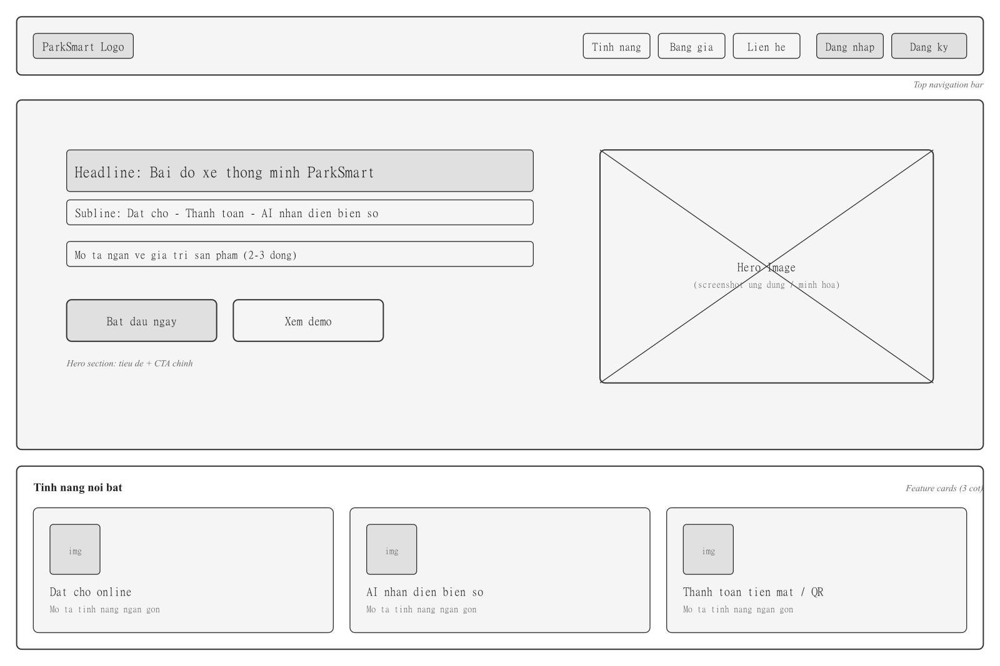

_Hình 3.6a: Mockup wireframe trang chủ ParkSmart (giai đoạn thiết kế)_


_Hình 3.6b: Giao diện thực tế trang chủ sau khi triển khai_

**Bảng 3.4: Thiết kế xử lý giao diện Index (Trang chủ định tuyến)**

| STT | Tên xử lý           | Điều kiện gọi thực hiện                    | Ý nghĩa thực hiện                                                                                    |
| --- | ------------------- | ------------------------------------------ | ---------------------------------------------------------------------------------------------------- |
| 1   | Load_Page_Init      | Khi giao diện trang chủ được mở            | Đọc thông tin người dùng đang đăng nhập, chờ hệ thống xác minh xong mới quyết định hiển thị gì.      |
| 2   | AuthState_Change    | Khi thông tin xác thực người dùng thay đổi | Nếu là quản trị viên thì chuyển sang trang quản trị; nếu là người dùng thường thì giữ tại trang chủ. |
| 3   | Loading_Render      | Khi đang chờ xác thực                      | Hiển thị màn hình chờ để người dùng biết hệ thống đang kiểm tra phiên đăng nhập.                     |
| 4   | UserDashboard_Mount | Khi xác thực xong và là người dùng thường  | Hiển thị bảng điều khiển cá nhân với các thông tin liên quan đến người dùng.                         |

#### 2. Trang User Dashboard

Trang Dashboard cá nhân hiển thị tóm tắt tình trạng đậu xe hiện tại, thống kê nhanh số lượng booking sắp tới và xe đã lưu, cùng các phím tắt đến các tác vụ chính như đặt chỗ mới, xem bản đồ và báo sự cố.

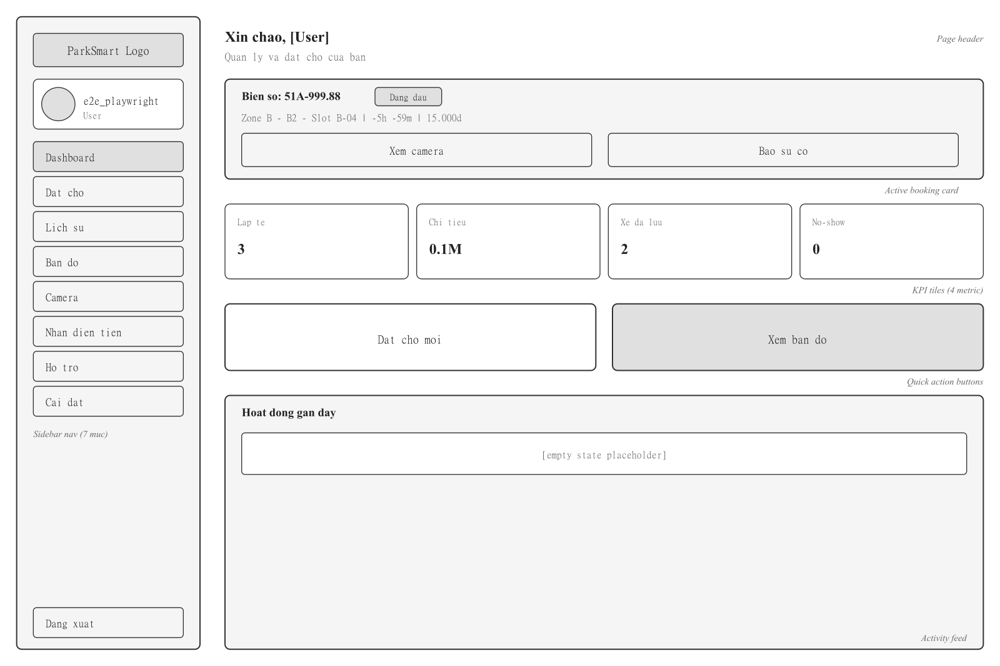

_Hình 3.7a: Mockup wireframe trang Dashboard người dùng_

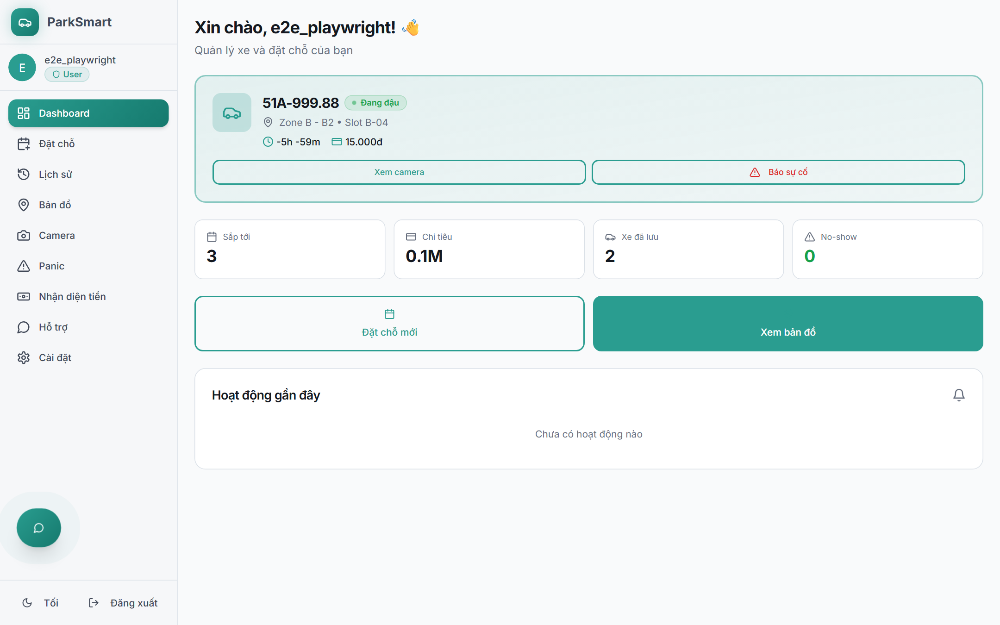

_Hình 3.7b: Giao diện thực tế trang Dashboard sau khi triển khai_

**Bảng 3.5: Thiết kế xử lý giao diện User Dashboard**

| STT | Tên xử lý       | Điều kiện gọi thực hiện                               | Ý nghĩa thực hiện                                                                                                                    |
| --- | --------------- | ----------------------------------------------------- | ------------------------------------------------------------------------------------------------------------------------------------ |
| 1   | Load_Page_Init  | Khi giao diện Dashboard được mở                       | Lấy thông tin xe đang đậu, danh sách booking sắp tới, thông báo chưa đọc và số lượng xe đã lưu để hiển thị tổng quan cho người dùng. |
| 2   | XemCamera_Click | Người dùng nhấn nút "Xem camera" trên thẻ xe đang đậu | Mở trang camera giám sát đúng khu vực mà xe đang đậu để người dùng xem trực tiếp.                                                    |
| 3   | BaoSuCo_Click   | Người dùng nhấn nút "Báo sự cố"                       | Chuyển sang trang báo cáo sự cố khẩn cấp để người dùng nhập thông tin và gửi cho quản lý bãi.                                        |
| 4   | DatChoMoi_Click | Người dùng nhấn nút "Đặt chỗ ngay" hoặc "Đặt chỗ mới" | Mở giao diện đặt chỗ để người dùng bắt đầu chọn bãi, xe, vị trí và thời gian.                                                        |
| 5   | XemBanDo_Click  | Người dùng nhấn nút "Xem bản đồ"                      | Mở trang bản đồ để xem sơ đồ bãi xe và đường đi tới slot đã đặt.                                                                     |
| 6   | LichSu_Click    | Người dùng nhấn vào thẻ thống kê "Sắp tới"            | Mở trang lịch sử đặt chỗ để xem chi tiết các booking sắp tới và đã hoàn thành.                                                       |

#### 3. Trang Booking (Đặt chỗ)

Trang đặt chỗ triển khai luồng wizard 5 bước theo trình tự chọn bãi, chọn xe, chọn vị trí, chọn thời gian và thanh toán. Panel "Chi tiết đơn hàng" cập nhật giá tiền theo thời gian thực mỗi khi người dùng thay đổi lựa chọn.

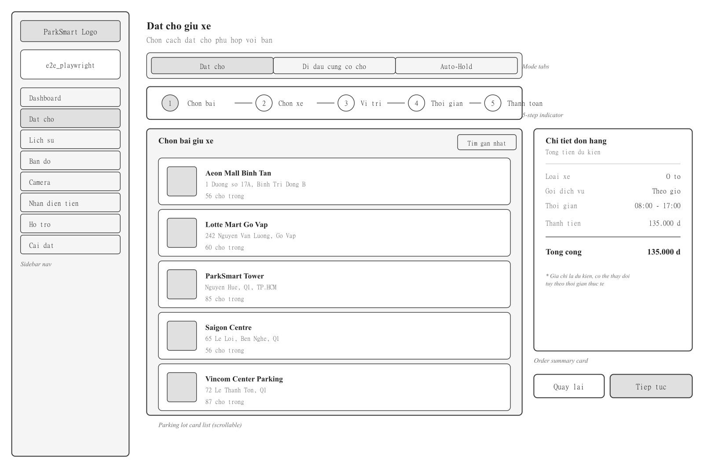

_Hình 3.8a: Mockup wireframe trang Booking — wizard 5 bước_

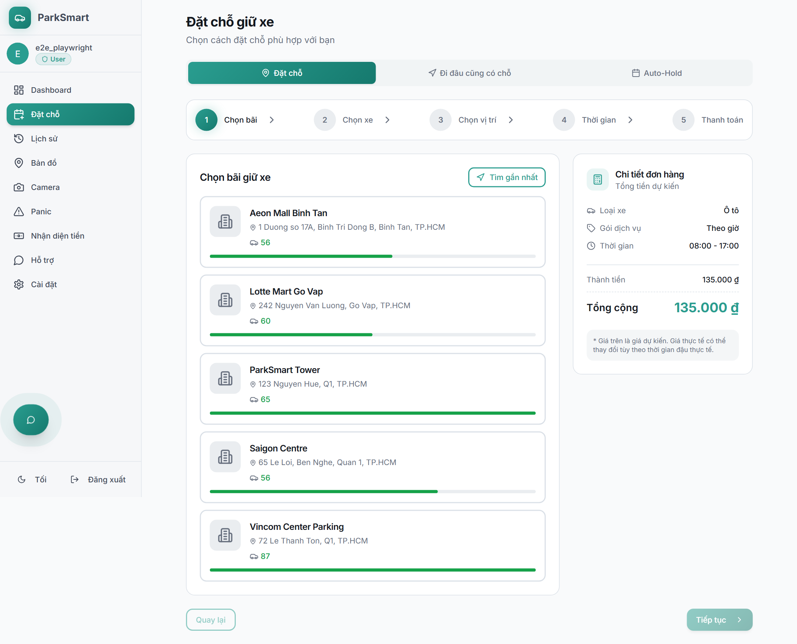

_Hình 3.8b: Giao diện thực tế trang Booking sau khi triển khai_

**Bảng 3.6: Thiết kế xử lý giao diện Booking (Đặt chỗ)**

| STT | Tên xử lý           | Điều kiện gọi thực hiện                                              | Ý nghĩa thực hiện                                                                                                                                |
| --- | ------------------- | -------------------------------------------------------------------- | ------------------------------------------------------------------------------------------------------------------------------------------------ |
| 1   | Load_Page_Init      | Khi giao diện Booking được mở                                        | Lấy danh sách bãi đỗ và danh sách xe đã lưu của người dùng, tự động chọn sẵn xe mặc định nếu có để rút ngắn thao tác.                            |
| 2   | ParkingLot_Change   | Khi người dùng chọn một bãi đỗ                                       | Lấy danh sách tầng và vùng đỗ của bãi vừa chọn để hiển thị ở các bước tiếp theo.                                                                 |
| 3   | Zone_Change         | Khi người dùng chọn một vùng đỗ                                      | Lấy danh sách ô đỗ trong vùng đó và đăng ký nhận cập nhật trạng thái slot theo thời gian thực để biết slot nào vừa bị giữ chỗ.                   |
| 4   | SlotRealtime_Change | Khi slot đang chọn vừa bị người khác giữ chỗ                         | Tự động bỏ chọn slot đó và hiển thị thông báo "Vị trí không còn trống" để người dùng chọn ô khác.                                                |
| 5   | LoaiXe_Change       | Người dùng nhấn nút "Ô tô" hoặc "Xe máy"                             | Cập nhật loại xe và đặt lại các trường tầng, vùng, slot, xe đã chọn để tránh đặt nhầm vị trí của loại xe khác.                                   |
| 6   | XeDaLuu_Click       | Người dùng nhấn vào một xe trong danh sách "Xe đã sử dụng gần đây"   | Tự động điền biển số và loại xe đã lưu vào form, đồng thời đặt lại vị trí để chọn lại theo loại xe đó.                                           |
| 7   | TiepTuc_Click       | Người dùng nhấn nút "Tiếp tục" tại các bước 1-4                      | Kiểm tra dữ liệu ở bước hiện tại đã hợp lệ chưa, nếu hợp lệ thì chuyển sang bước kế tiếp.                                                        |
| 8   | DatCho_Submit       | Người dùng nhấn "Thanh toán ngay" hoặc "Xác nhận đặt chỗ" tại bước 5 | Gửi thông tin đặt chỗ về hệ thống. Nếu chọn thanh toán online thì chuyển sang trang thanh toán; nếu trả tại cổng thì hiển thị mã QR để check-in. |

#### 4. Trang Map (Bản đồ bãi xe)

Trang bản đồ hiển thị sơ đồ bãi xe theo từng tầng và vẽ đường đi từ cổng vào tới slot đã đặt, hỗ trợ chạy hoạt cảnh xe di chuyển mô phỏng để người dùng dễ hình dung lộ trình.

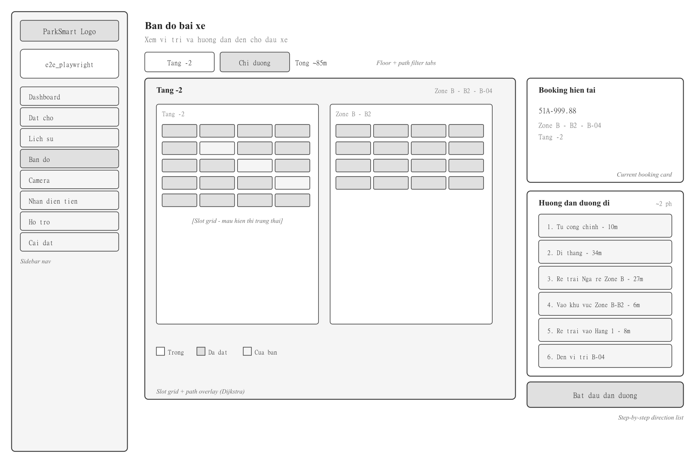

_Hình 3.9a: Mockup wireframe trang Map — bản đồ bãi xe + chỉ đường_

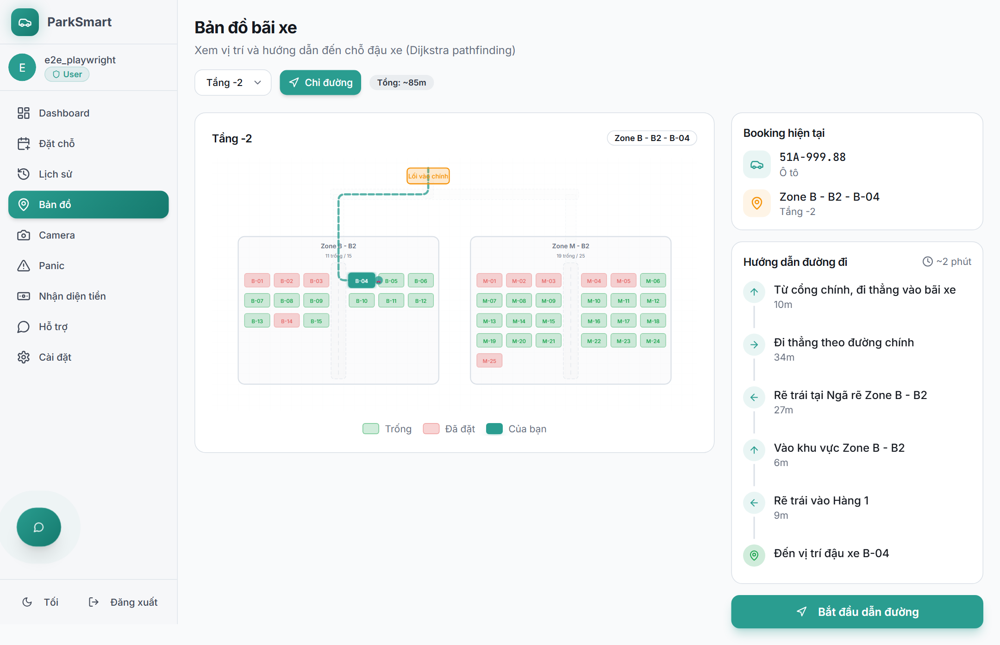

_Hình 3.9b: Giao diện thực tế trang Map sau khi triển khai_

**Bảng 3.7: Thiết kế xử lý giao diện Map (Bản đồ và chỉ đường)**

| STT | Tên xử lý             | Điều kiện gọi thực hiện                             | Ý nghĩa thực hiện                                                                                              |
| --- | --------------------- | --------------------------------------------------- | -------------------------------------------------------------------------------------------------------------- |
| 1   | Load_Page_Init        | Khi giao diện Bản đồ được mở                        | Lấy thông tin booking đang hoạt động của người dùng; nếu chưa có thì hiển thị bản đồ minh hoạ với dữ liệu mẫu. |
| 2   | CurrentParking_Change | Khi có booking đang hoạt động                       | Lấy toàn bộ vùng đỗ của bãi tương ứng để dựng sơ đồ tầng phù hợp.                                              |
| 3   | Zones_Change          | Khi danh sách vùng đỗ đã được lấy về                | Lấy chi tiết các ô đỗ trong từng vùng để dựng layout bản đồ.                                                   |
| 4   | Floor_Change          | Người dùng đổi tầng trên ô chọn tầng                | Tính lại các vùng và ô đỗ thuộc tầng vừa chọn, cập nhật bản đồ hiển thị.                                       |
| 5   | ChiDuong_Click        | Người dùng nhấn nút "Chỉ đường"                     | Bật hoặc tắt panel hướng dẫn đường đi cùng đường vẽ trên bản đồ.                                               |
| 6   | StartNavigation_Click | Người dùng nhấn nút "Bắt đầu" trong panel chỉ đường | Khởi động hoạt cảnh xe di chuyển dọc theo đường đi từ cổng vào tới slot đã đặt trong khoảng 8 giây.            |
| 7   | StopNavigation_Click  | Người dùng nhấn nút "Dừng" trong banner chỉ đường   | Dừng hoạt cảnh đang chạy và quay lại trạng thái xem bản đồ tĩnh.                                               |
| 8   | DatChoNgay_Click      | Người dùng nhấn nút "Đặt chỗ ngay" trên banner demo | Chuyển sang trang đặt chỗ để người dùng tạo booking thật thay cho dữ liệu mẫu đang xem.                        |

#### 5. Trang History (Lịch sử & Thống kê)

Trang lịch sử hiển thị danh sách các booking đã đặt, biểu đồ chi tiêu theo tháng, đồng thời cho phép người dùng huỷ booking, xem mã QR, chuyển sang thanh toán hoặc xem đường đi tới slot trực tiếp ngay trên từng dòng booking.

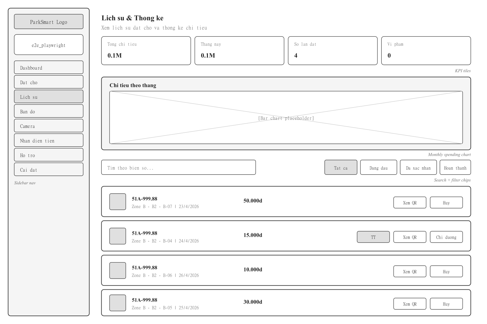

_Hình 3.10a: Mockup wireframe trang Lịch sử đặt chỗ_

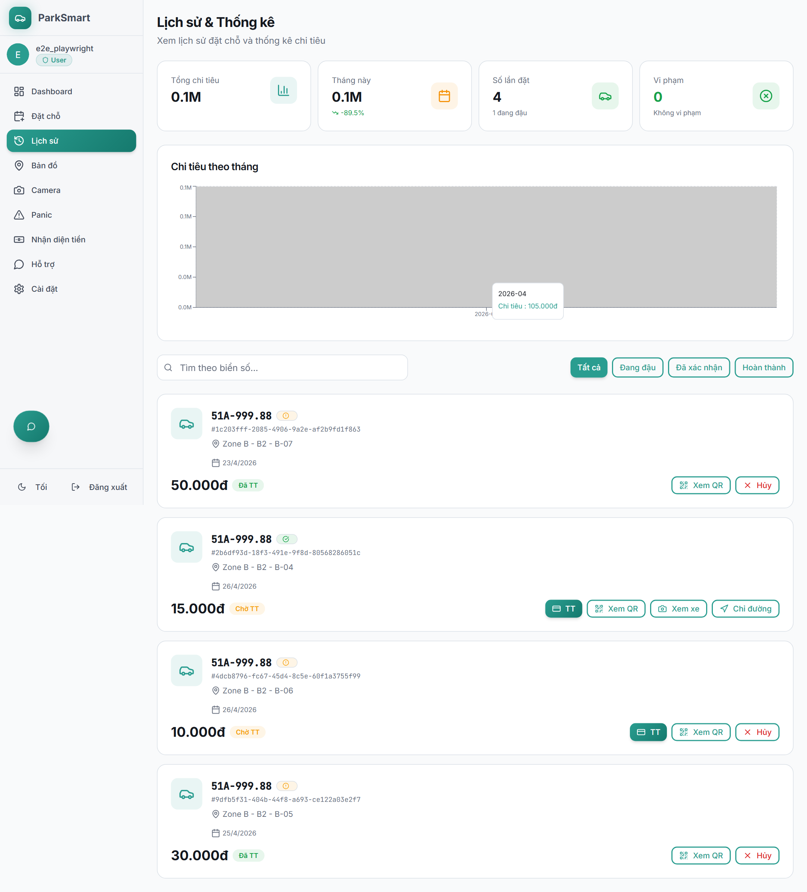

_Hình 3.10b: Giao diện thực tế trang History sau khi triển khai_

**Bảng 3.8: Thiết kế xử lý giao diện History (Lịch sử đặt chỗ)**

| STT | Tên xử lý           | Điều kiện gọi thực hiện                                                             | Ý nghĩa thực hiện                                                                                   |
| --- | ------------------- | ----------------------------------------------------------------------------------- | --------------------------------------------------------------------------------------------------- |
| 1   | Load_Page_Init      | Khi giao diện Lịch sử được mở                                                       | Lấy danh sách booking của người dùng và thống kê tổng chi tiêu theo tháng để vẽ biểu đồ.            |
| 2   | FilterStatus_Change | Khi người dùng đổi bộ lọc trạng thái (Tất cả / Đang đậu / Đã xác nhận / Hoàn thành) | Lấy lại danh sách booking theo trạng thái mới và cập nhật bảng hiển thị.                            |
| 3   | Search_Change       | Người dùng nhập vào ô "Tìm theo biển số"                                            | Lọc danh sách booking đang hiển thị theo biển số xe người dùng nhập.                                |
| 4   | XemQR_Click         | Người dùng nhấn nút "Xem QR" trên một booking                                       | Mở cửa sổ hiển thị mã QR của booking đó để người dùng quét tại cổng vào.                            |
| 5   | Huy_Click           | Người dùng nhấn nút "Huỷ" trên booking đang chờ thanh toán hoặc đã xác nhận         | Mở hộp thoại xác nhận huỷ booking và chờ người dùng xác nhận hoặc bỏ qua.                           |
| 6   | XacNhanHuy_Click    | Người dùng nhấn "Xác nhận huỷ" trong hộp thoại                                      | Gửi yêu cầu huỷ booking về hệ thống, hiển thị thông báo kết quả và cập nhật lại danh sách hiển thị. |
| 7   | ThanhToan_Click     | Người dùng nhấn nút "Thanh toán" trên booking chưa thanh toán                       | Chuyển sang trang thanh toán để người dùng hoàn tất việc thanh toán cho booking đang dở dang.       |
| 8   | ChiDuong_Click      | Người dùng nhấn nút "Chỉ đường" trên booking đã check-in hoặc đã xác nhận           | Mở trang bản đồ và hiển thị đường đi tới slot đã đặt của booking đó.                                |

#### 6. Trang Support (Chatbot AI)

Trang hỗ trợ cung cấp giao diện trò chuyện với trợ lý ảo thông minh tích hợp RAG, cho phép người dùng đặt câu hỏi bằng tiếng Việt tự nhiên về chính sách, quy định, giờ mở cửa và các thao tác trong hệ thống. Bot trả lời kèm gợi ý nhanh, nút xác nhận cho các tác vụ quan trọng và panel đánh giá sau hội thoại.

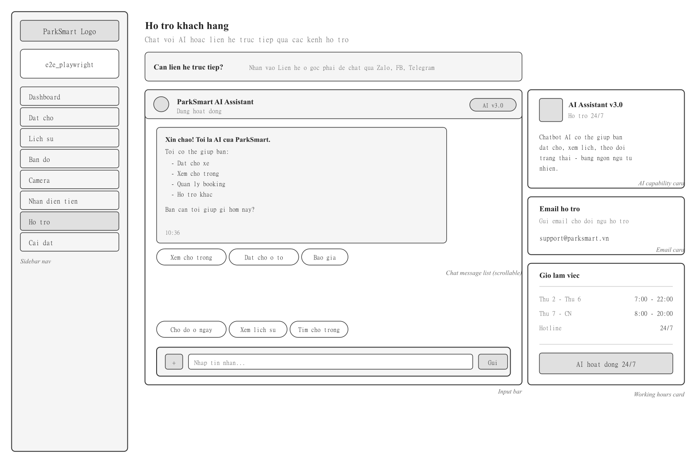

_Hình 3.11a: Mockup wireframe trang Chatbot AI_

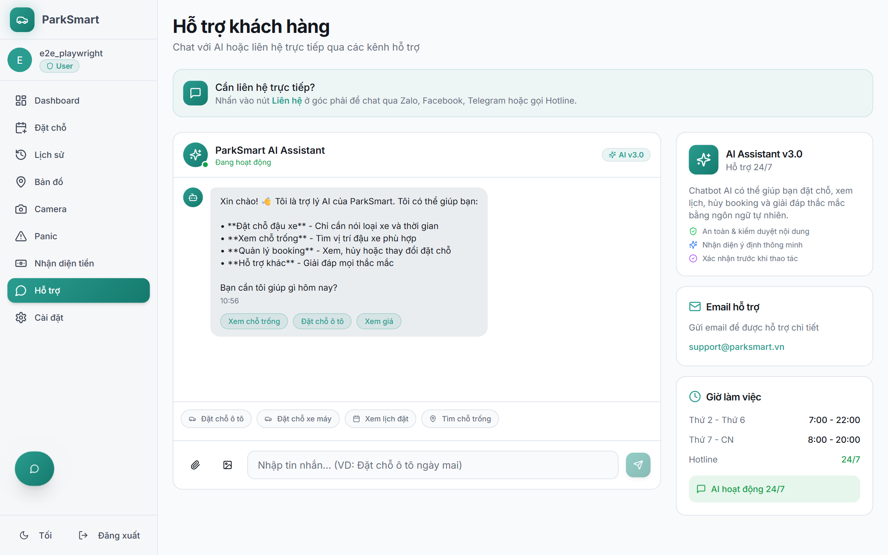

_Hình 3.11b: Giao diện thực tế trang Chatbot AI sau khi triển khai_

**Bảng 3.9: Thiết kế xử lý giao diện Support (Chatbot AI)**

| STT | Tên xử lý         | Điều kiện gọi thực hiện                                              | Ý nghĩa thực hiện                                                                                                       |
| --- | ----------------- | -------------------------------------------------------------------- | ----------------------------------------------------------------------------------------------------------------------- |
| 1   | Load_Page_Init    | Khi giao diện Chatbot được mở                                        | Lấy lịch sử trò chuyện cũ và hiển thị tin nhắn chào mừng để người dùng tiếp tục cuộc hội thoại.                         |
| 2   | Messages_Change   | Khi có tin nhắn mới được gửi hoặc nhận                               | Tự động cuộn xuống cuối khung chat để người dùng luôn thấy tin nhắn mới nhất.                                           |
| 3   | Send_Click        | Người dùng nhấn nút Gửi hoặc bấm Enter trong ô nhập                  | Hiển thị tin nhắn của người dùng, gửi nội dung lên hệ thống và hiển thị câu trả lời của trợ lý kèm các gợi ý liên quan. |
| 4   | QuickAction_Click | Người dùng nhấn vào một trong các phím tắt gợi ý                     | Gửi luôn câu hỏi mẫu tương ứng để trợ lý xử lý mà không cần người dùng tự gõ.                                           |
| 5   | Suggestion_Click  | Người dùng nhấn vào chip gợi ý hiển thị bên dưới câu trả lời của bot | Tiếp tục cuộc hội thoại theo nhánh gợi ý mà bot đề xuất.                                                                |
| 6   | XacNhan_Click     | Khi bot yêu cầu xác nhận và người dùng nhấn "Xác nhận"               | Gửi xác nhận để bot thực thi tác vụ đang chờ (ví dụ tạo booking hoặc huỷ booking).                                      |
| 7   | HuyBo_Click       | Khi bot yêu cầu xác nhận và người dùng nhấn "Huỷ bỏ"                 | Huỷ tác vụ đang chờ và quay về trạng thái hội thoại bình thường.                                                        |
| 8   | DanhGia_Submit    | Người dùng nhấn "Gửi đánh giá" trong panel phản hồi                  | Gửi đánh giá và bình luận của người dùng về cuộc hội thoại, hiển thị thông báo cảm ơn và đóng panel.                    |

#### 7. Trang Payment (Thanh toán)

Trang thanh toán hiển thị mã QR chuyển khoản ngân hàng kèm thông tin số tài khoản, đồng hồ đếm ngược 15 phút và trạng thái thanh toán. Hệ thống tự động kiểm tra trạng thái thanh toán định kỳ và chuyển sang trang lịch sử ngay khi xác nhận thành công.

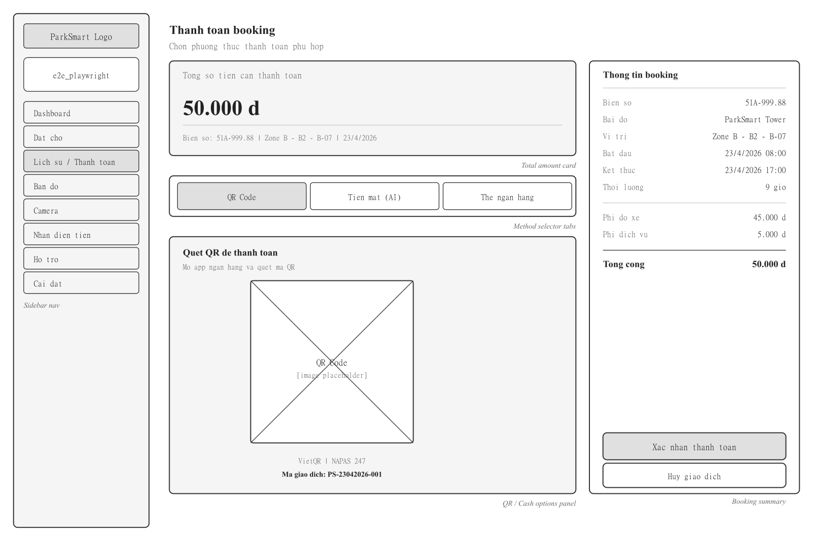

_Hình 3.12a: Mockup wireframe trang Thanh toán_

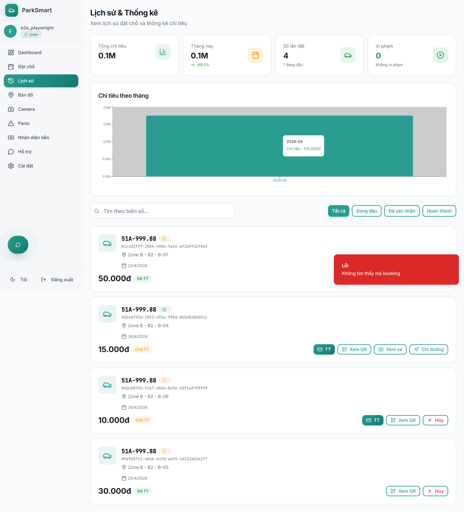

_Hình 3.12b: Giao diện thực tế trang Payment sau khi triển khai_

**Bảng 3.10: Thiết kế xử lý giao diện Payment (Thanh toán đặt chỗ)**

| STT | Tên xử lý           | Điều kiện gọi thực hiện                                             | Ý nghĩa thực hiện                                                                                                              |
| --- | ------------------- | ------------------------------------------------------------------- | ------------------------------------------------------------------------------------------------------------------------------ |
| 1   | Load_Page_Init      | Khi giao diện Thanh toán được mở với mã booking đính kèm            | Lấy chi tiết booking cần thanh toán; nếu không tìm thấy thì hiển thị thông báo lỗi và quay về trang lịch sử.                   |
| 2   | Booking_Change      | Khi đã có thông tin booking                                         | Bắt đầu đếm ngược 15 phút kể từ thời điểm tạo booking; khi hết giờ thì đánh dấu booking đã hết hạn thanh toán.                 |
| 3   | PaymentPolling_Init | Khi trang sẵn sàng và booking chưa được xác nhận thanh toán         | Định kỳ kiểm tra trạng thái thanh toán; khi nhận được xác nhận thành công thì hiển thị thông báo và chuyển sang trang lịch sử. |
| 4   | Copy_Click          | Người dùng nhấn nút sao chép số tài khoản hoặc mã đặt chỗ           | Sao chép nội dung vào bộ nhớ tạm và hiển thị thông báo "Đã sao chép" để người dùng biết.                                       |
| 5   | DaThanhToan_Click   | Người dùng nhấn nút "Tôi đã thanh toán"                             | Chuyển sang trạng thái đang xác minh và rút ngắn chu kỳ kiểm tra để xác nhận thanh toán nhanh hơn.                             |
| 6   | Back_Click          | Người dùng nhấn nút mũi tên quay lại ở đầu trang                    | Quay về trang trước đó (thường là trang đặt chỗ hoặc lịch sử).                                                                 |
| 7   | XemLichSu_Click     | Người dùng nhấn "Xem lịch sử đặt chỗ" sau khi thanh toán thành công | Mở trang lịch sử đặt chỗ để người dùng xem booking vừa hoàn tất.                                                               |

#### 8. Trang Admin Dashboard

Trang quản trị tổng quan hiển thị các chỉ số quan trọng (số người dùng, doanh thu, tỉ lệ lấp đầy bãi), tỉ lệ chiếm chỗ thời gian thực từ camera AI, danh sách booking gần nhất và các phím tắt đến các trang quản trị con.

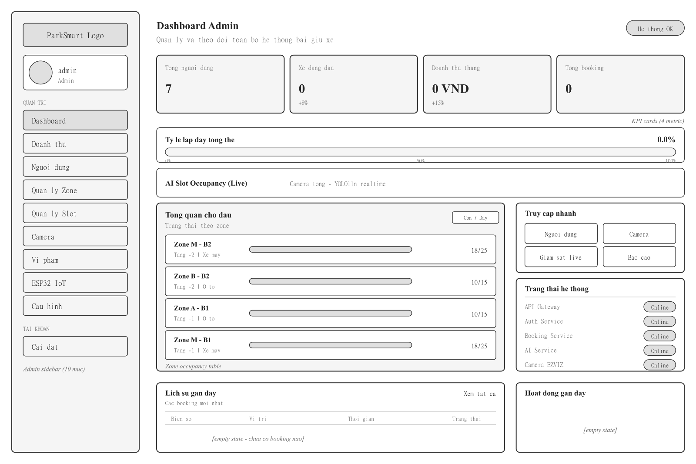

_Hình 3.13a: Mockup wireframe trang Admin Dashboard_

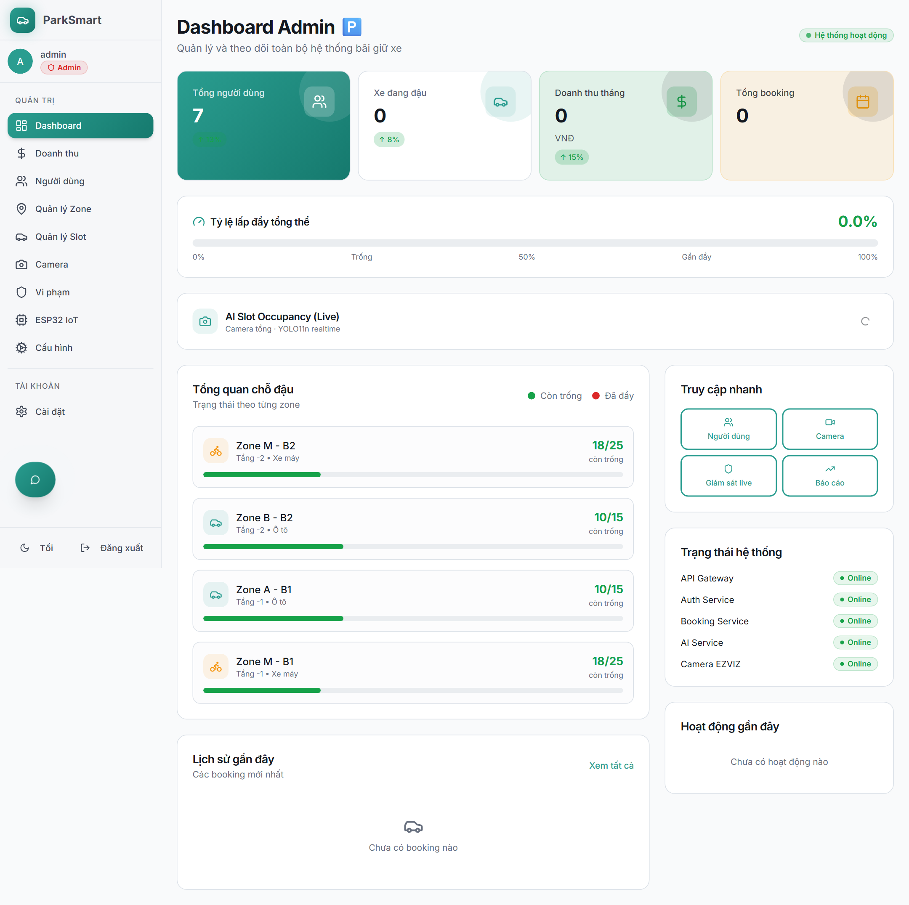

_Hình 3.13b: Giao diện thực tế trang Admin Dashboard sau khi triển khai_

**Bảng 3.11: Thiết kế xử lý giao diện Admin Dashboard**

| STT | Tên xử lý             | Điều kiện gọi thực hiện                                       | Ý nghĩa thực hiện                                                                                                                        |
| --- | --------------------- | ------------------------------------------------------------- | ---------------------------------------------------------------------------------------------------------------------------------------- |
| 1   | Load_Page_Init        | Khi giao diện Quản trị được mở                                | Lấy đồng thời các chỉ số tổng quan và danh sách hoạt động gần đây để hiển thị bảng điều khiển cho quản trị viên.                         |
| 2   | NguoiDung_Click       | Quản trị viên nhấn nút "Người dùng" trong khối Truy cập nhanh | Mở trang quản lý tài khoản người dùng để xem, chỉnh sửa và phân quyền.                                                                   |
| 3   | Camera_Click          | Quản trị viên nhấn nút "Camera"                               | Mở trang cấu hình danh sách camera của hệ thống.                                                                                         |
| 4   | GiamSatLive_Click     | Quản trị viên nhấn nút "Giám sát live"                        | Mở trang xem trực tiếp luồng video từ tất cả camera trong bãi.                                                                           |
| 5   | BaoCao_Click          | Quản trị viên nhấn nút "Báo cáo"                              | Mở trang biểu đồ doanh thu và tỉ lệ lấp đầy theo thời gian.                                                                              |
| 6   | OccupancyBar_Render   | Khi đã lấy được tỉ lệ lấp đầy bãi                             | Hiển thị thanh tiến trình với màu thay đổi theo ngưỡng (xanh khi còn nhiều chỗ, vàng khi gần đầy, đỏ khi quá tải) để cảnh báo trực quan. |
| 7   | AILiveOccupancy_Mount | Sau khi đã lấy xong các chỉ số tổng quan                      | Hiển thị thẻ thông tin tỉ lệ chiếm chỗ thời gian thực, tự động cập nhật theo dữ liệu từ camera AI.                                       |
| 8   | RecentActivity_Render | Khi đã lấy được danh sách hoạt động gần đây                   | Hiển thị tối đa 6 hoạt động mới nhất kèm biểu tượng tương ứng với từng loại sự kiện (check-in, check-out, đặt chỗ, thanh toán, sự cố).   |

---

## 3.4. Kiến trúc hệ thống

### 3.4.1. Kiến trúc Microservices

Hệ thống ParkSmart áp dụng **kiến trúc Microservices** — toàn bộ chức năng nghiệp vụ được tách thành **10 dịch vụ độc lập**, mỗi dịch vụ phụ trách một miền (domain) riêng, sở hữu cơ sở dữ liệu/cache riêng và có thể được phát triển, kiểm thử, triển khai một cách độc lập với các dịch vụ còn lại. Mọi yêu cầu từ phía client (React SPA, Unity Digital Twin, ESP32 IoT) đều đi qua một điểm vào duy nhất là **API Gateway**, đóng vai trò xác thực phiên đăng nhập, kiểm soát truy cập, giới hạn tần suất và định tuyến request đến đúng dịch vụ đích. Mô hình này đảm bảo tính phân tách trách nhiệm, khả năng mở rộng độc lập từng dịch vụ và cô lập lỗi giữa các thành phần.

**Phân nhóm 10 microservices theo công nghệ và miền nghiệp vụ:**

_Bảng 3.1: Phân nhóm 10 microservices của hệ thống ParkSmart_

| Nhóm                               | Dịch vụ                      | Cổng   | Vai trò chính                                                                  |
| ---------------------------------- | ---------------------------- | ------ | ------------------------------------------------------------------------------ |
| **Lớp Edge / Cổng vào**            | gateway-service-go           | 8000   | Xác thực phiên, định tuyến, rate limiting, CORS, kiểm soát truy cập            |
|                                    | realtime-service-go          | 8006   | Hub WebSocket, phát sự kiện thời gian thực tới các trình duyệt và Unity        |
| **Django REST Framework (CRUD)**   | auth-service                 | 8001   | Đăng ký, đăng nhập, OAuth, quản lý người dùng                                  |
|                                    | booking-service              | 8002   | Đặt chỗ, sinh QR, huỷ booking, kiểm tra hết hạn (Celery worker + beat)         |
|                                    | parking-service              | 8003   | Quản lý bãi xe, tầng, vùng đỗ, ô đỗ, cấu hình camera                           |
|                                    | vehicle-service              | nội bộ | Quản lý phương tiện của người dùng                                             |
| **FastAPI (xử lý bất đồng bộ/AI)** | ai-service-fastapi           | 8009   | Nhận diện biển số xe, phát hiện ô đỗ, nhận diện tiền giấy, xử lý sự kiện ESP32 |
|                                    | chatbot-service-fastapi      | 8008   | Trò chuyện đa lượt, đặt chỗ qua hội thoại, RAG cho câu hỏi chính sách          |
|                                    | payment-service-fastapi      | 8007   | Tạo phiên thanh toán, theo dõi trạng thái, tích luỹ tiền mặt tại cổng          |
|                                    | notification-service-fastapi | 8005   | Gửi thông báo đẩy, email, tiêu thụ sự kiện từ hàng đợi                         |

**Hạ tầng dùng chung:** MySQL 8.0 lưu dữ liệu nghiệp vụ chính, Redis 7 đảm nhiệm vai trò cache + lưu phiên đăng nhập + queue cho Celery + pub/sub cho realtime, RabbitMQ làm message broker cho các sự kiện nghiệp vụ giữa các dịch vụ, và Chroma vector store lưu các embedding phục vụ tính năng RAG của chatbot.

**Vai trò của API Gateway:**

API Gateway là điểm vào duy nhất của toàn hệ thống, đảm nhận sáu nhóm trách nhiệm chính. Thứ nhất, gateway quản lý xác thực phiên đăng nhập bằng cookie session; mỗi request được kiểm tra với Redis để lấy thông tin người dùng tương ứng. Thứ hai, gateway thực hiện chèn các header định danh nội bộ trước khi chuyển tiếp request đến dịch vụ đích, giúp các dịch vụ phía sau biết được người dùng nào đang gọi mà không phải tự xác thực lại. Thứ ba, gateway sử dụng một khoá bí mật chung giữa các dịch vụ để chỉ chấp nhận request đến từ chính nó, bảo vệ các dịch vụ phía sau khỏi truy cập trực tiếp từ bên ngoài. Thứ tư, gateway giới hạn số request mỗi phút theo địa chỉ IP nhằm chống lạm dụng. Thứ năm, gateway xử lý chính sách CORS để cho phép React SPA trên domain công khai gọi API. Cuối cùng, gateway thực hiện vai trò reverse proxy — định tuyến request đến đúng dịch vụ đích dựa trên tiền tố URL.

_Bảng 3.2: Bảng định tuyến của API Gateway_

| Tiền tố URL        | Dịch vụ đích                 | Ghi chú                                           |
| ------------------ | ---------------------------- | ------------------------------------------------- |
| `/auth/*`          | auth-service                 | Cho phép truy cập công khai cho đăng ký/đăng nhập |
| `/bookings/*`      | booking-service              | Yêu cầu phiên đăng nhập hợp lệ                    |
| `/parking/*`       | parking-service              | Một số endpoint công khai (danh sách bãi)         |
| `/vehicles/*`      | vehicle-service              | Yêu cầu phiên đăng nhập hợp lệ                    |
| `/ai/*`            | ai-service-fastapi           | ESP32 dùng device token riêng                     |
| `/chatbot/*`       | chatbot-service-fastapi      | Yêu cầu phiên đăng nhập hợp lệ                    |
| `/payments/*`      | payment-service-fastapi      | Yêu cầu phiên đăng nhập hợp lệ                    |
| `/notifications/*` | notification-service-fastapi | Yêu cầu phiên đăng nhập hợp lệ                    |
| `/ws/*`            | realtime-service-go          | Nâng cấp kết nối WebSocket                        |
| `/health/*`        | gateway-service-go           | Kiểm tra sức khoẻ, không yêu cầu xác thực         |

### 3.4.2. Các kiểu giao tiếp giữa các dịch vụ

Trong kiến trúc microservices của ParkSmart, các dịch vụ giao tiếp với nhau theo **ba kiểu chính** tuỳ theo đặc tính nghiệp vụ.

**Kiểu 1 — Giao tiếp đồng bộ qua HTTP REST.** Đây là kiểu giao tiếp phổ biến nhất, được sử dụng cho mọi tương tác giữa client và server cũng như giữa các dịch vụ backend với nhau. Client gọi vào API Gateway; gateway xác thực phiên rồi chuyển tiếp request đến dịch vụ đích kèm theo các header định danh nội bộ. Mỗi dịch vụ backend cũng có thể chủ động gọi sang dịch vụ khác (ví dụ booking-service gọi vehicle-service để xác minh xe của người dùng) qua chính API Gateway hoặc qua tên DNS nội bộ trong cùng mạng container. Mọi request nội bộ đều mang khoá bí mật chung để dịch vụ đích biết request đó đến từ một dịch vụ hợp lệ.

**Kiểu 2 — Giao tiếp bất đồng bộ qua hàng đợi sự kiện (RabbitMQ).** Kiểu này được dùng cho các tác vụ không đòi hỏi phản hồi tức thì và cần được tách rời khỏi luồng request chính, giúp giảm thời gian phản hồi cho người dùng và tránh phụ thuộc cứng giữa các dịch vụ. Khi một sự kiện nghiệp vụ xảy ra (đặt chỗ thành công, thanh toán hoàn tất, sự cố được báo, ô đỗ thay đổi trạng thái), dịch vụ phát sự kiện sẽ đẩy thông điệp lên RabbitMQ; các dịch vụ khác đăng ký lắng nghe sẽ xử lý theo phần việc của mình một cách độc lập. Ví dụ, sau khi booking-service tạo booking thành công, dịch vụ này phát sự kiện "booking_created"; notification-service tiêu thụ sự kiện để gửi email và thông báo đẩy, đồng thời realtime-service broadcast cập nhật trạng thái ô đỗ tới mọi trình duyệt đang xem.

**Kiểu 3 — Đẩy thời gian thực qua WebSocket.** Kiểu này phục vụ các trường hợp client cần được cập nhật ngay khi có thay đổi mà không phải hỏi lại liên tục. Realtime Service duy trì các kết nối WebSocket bền vững với React SPA và Unity Digital Twin; khi nhận được sự kiện từ Redis Pub/Sub hoặc RabbitMQ, dịch vụ này sẽ phát thông điệp đến đúng nhóm client đang quan tâm (ví dụ: chỉ những người dùng đang xem cùng một vùng đỗ mới nhận được cập nhật trạng thái ô đỗ trong vùng đó).

### 3.4.3. Luồng xử lý dữ liệu tổng quát

Hệ thống ParkSmart hiện có **bốn luồng xử lý dữ liệu vận hành chính** cho kịch bản đặt chỗ online.

**Luồng 1 — Đặt chỗ online qua Web App.** Người dùng nhập thông tin phương tiện, chọn bãi, tầng, khu vực và vị trí đỗ trên giao diện React SPA. Request được gửi qua API Gateway đến booking-service để tạo booking mới và giữ chỗ slot tương ứng. Sau khi tạo thành công, hệ thống ghi nhận booking vào cơ sở dữ liệu, phát sự kiện cập nhật trạng thái slot và trả kết quả về cho frontend. Người dùng vào trang lịch sử booking để xem thông tin vừa đặt và lấy mã QR check-in.

**Luồng 2 — Đến bãi và check-in tại cổng bằng QR + biển số.** Người dùng nhấn nút tại cổng để kích hoạt camera, sau đó đưa mã QR để quét. Camera gửi dữ liệu QR cùng ảnh biển số về AI Service; dịch vụ này tra cứu booking tương ứng, chạy pipeline OCR biển số và so khớp với dữ liệu booking. Nếu thông tin hợp lệ (đúng booking, đúng biển số, đúng khung giờ), hệ thống cập nhật trạng thái check-in và gửi lệnh mở barrier qua ESP32/Arduino.

**Luồng 3 — Đi vào ô đỗ đã đặt.** Sau khi vào trong bãi, người dùng nhấn nút tại khu vực ô đỗ và quét QR theo quy trình tại điểm vào ô. Server phối hợp với ESP32 xác minh quyền vào đúng slot đã đặt; khi xác minh thành công, hệ thống mở cơ cấu cửa/barrier của khu vực ô đỗ để xe đi vào và hoàn tất trạng thái đã gửi xe.

**Luồng 4 — Lấy xe và check-out tại ô đỗ/cổng ra.** Khi người dùng lấy xe, hệ thống quét QR để nhận diện booking hiện tại và kiểm tra trạng thái thanh toán. Nếu booking chưa thanh toán, hệ thống hiển thị mã QR thanh toán cho người dùng thực hiện giao dịch; sau khi nhận xác nhận thanh toán thành công, trạng thái booking được cập nhật và lệnh mở barrier cổng ra được gửi để xe rời bãi.

### 3.4.4. Ưu điểm kiến trúc

Hệ thống ParkSmart sở hữu các ưu điểm chính sau:

- **Mở rộng dễ dàng:** Các dịch vụ độc lập, dễ dàng bổ sung thêm camera, barrier, thiết bị IoT hoặc nhân bản dịch vụ AI khi nhu cầu tăng.
- **Tính tự động hóa cao:** Quy trình đặt chỗ, check-in, nhận diện biển số, đếm tiền mặt, mở barrier và cập nhật trạng thái ô đỗ diễn ra hoàn toàn tự động, không cần sự can thiệp của con người.
- **Bảo mật và linh hoạt:** Xác thực người dùng theo phiên, phân quyền theo vai trò, kiểm soát truy cập qua API Gateway, khoá bí mật nội bộ giữa các dịch vụ, token riêng cho thiết bị IoT và camera giám sát suốt quá trình vận hành.
- **Giao tiếp thời gian thực:** Hệ thống hỗ trợ WebSocket và cơ chế pub/sub để cập nhật ngay trạng thái ô đỗ, booking và sự cố lên giao diện mà không phải tải lại trang.
- **Tích hợp AI sâu:** Nhận diện biển số xe, phát hiện ô đỗ trống, nhận diện mệnh giá tiền giấy và trợ lý hội thoại tiếng Việt được tích hợp ngay trong luồng nghiệp vụ.
- **Đa kênh tương tác:** Người dùng có thể thao tác qua giao diện web đáp ứng đa thiết bị, qua trợ lý chatbot, qua hệ thống IoT tại cổng và qua mô phỏng 3D Digital Twin để kiểm thử.
- **Đa dạng công nghệ đúng thế mạnh:** Django DRF cho nghiệp vụ CRUD, FastAPI cho AI và xử lý bất đồng bộ, Go cho Gateway và Realtime — mỗi công nghệ phát huy đúng điểm mạnh trong cùng một nền tảng.
- **Cô lập lỗi tốt:** Khi một dịch vụ phụ gặp sự cố, các dịch vụ còn lại vẫn hoạt động bình thường, hạn chế ảnh hưởng dây chuyền và tăng độ ổn định toàn hệ thống.

### 3.4.5. Nhược điểm kiến trúc

Bên cạnh những lợi ích rõ ràng, kiến trúc microservices cũng mang theo nhiều thách thức đáng chú ý, trước tiên là sự gia tăng về **độ phức tạp vận hành**. Việc duy trì và giám sát đồng thời mười dịch vụ cùng các thành phần hạ tầng (MySQL, Redis, RabbitMQ, Chroma) đòi hỏi nguồn tài nguyên hệ thống dồi dào và các công cụ quản lý chuyên biệt so với kiến trúc nguyên khối truyền thống. Khó khăn tiếp theo là **độ trễ mạng giữa các dịch vụ**: một yêu cầu nghiệp vụ phức tạp đôi khi đòi hỏi nhiều lệnh gọi bắc cầu qua API Gateway và chuỗi dịch vụ nội bộ, làm tăng tổng thời gian phản hồi; vấn đề này hiện đang được kiểm soát thông qua bộ nhớ đệm Redis và các kỹ thuật phi chuẩn hoá dữ liệu (denormalization) hợp lý.

Hệ thống cũng phải đối mặt với bài toán **nhất quán dữ liệu**: khi mỗi dịch vụ sở hữu phạm vi dữ liệu riêng và giao tiếp bất đồng bộ qua hàng đợi sự kiện, hệ thống buộc phải chấp nhận mô hình nhất quán cuối cùng, dẫn đến nguy cơ dữ liệu không đồng bộ tạm thời tại các điểm giao cắt giữa dịch vụ và đòi hỏi các cơ chế bù trừ nếu một bước xử lý thất bại. Cuối cùng, quá trình **kiểm lỗi và theo vết** trở nên khó hơn khi nhật ký bị phân tán trên nhiều container; mặc dù hệ thống đang sử dụng định danh request truyền theo header để đối chiếu các luồng thực thi, một giải pháp theo vết phân tán chuyên sâu vẫn cần thiết khi quy mô triển khai mở rộng.

---

## 3.5. Kết quả đạt được

Hệ thống ParkSmart đã triển khai đầy đủ và đưa vào vận hành các nhóm chức năng nghiệp vụ quan trọng. Phần này trình bày kết quả thực tế của 7 tính năng chính theo trình tự **(1) Ảnh giao diện thực tế**, **(2) Mô tả ngắn** về chức năng, và **(3) Ý nghĩa** của tính năng đó trong tổng thể hệ thống.

### 3.5.1. Đặt chỗ online (Online Booking)


_Hình 3.14: Giao diện chức năng đặt chỗ online_

**Mô tả ngắn**: Người dùng đặt trước ô đỗ xe qua wizard 5 bước trên web (chọn bãi → chọn xe → chọn vị trí → thời gian → thanh toán). Trạng thái ô đỗ được cập nhật theo thời gian thực; sau khi đặt thành công, hệ thống sinh mã QR định danh dùng để check-in tại cổng và hỗ trợ hai phương thức thanh toán: trực tuyến qua VietQR hoặc trả tại cổng.

**Ý nghĩa**: Đây là tính năng cốt lõi mở ra hành trình sử dụng dịch vụ — người dùng có thể đảm bảo chỗ đậu trước khi đến bãi, tránh tình trạng đến nơi mới biết hết chỗ. Việc đặt chỗ online cũng giúp bãi xe quản lý nguồn lực hiệu quả hơn (dự báo lưu lượng, tránh quá tải) và là điều kiện đầu vào cho các tính năng tự động hoá phía sau như check-in bằng QR và chỉ đường tới slot.

### 3.5.2. Bản đồ bãi xe thời gian thực (Real-time Map)


_Hình 3.15: Giao diện bản đồ bãi xe thời gian thực và chỉ đường tới slot_

**Mô tả ngắn**: Trang bản đồ hiển thị sơ đồ bãi xe theo từng tầng, trạng thái từng ô đỗ được phân biệt bằng màu sắc và cập nhật tức thời qua WebSocket. Sau khi check-in, người dùng có thể xem đường đi từ cổng vào tới slot đã đặt và xem mô phỏng hoạt cảnh xe di chuyển theo lộ trình.

**Ý nghĩa**: Tính năng bản đồ giải quyết hai bài toán phổ biến tại các bãi xe lớn: người dùng không biết slot mình đã đặt nằm ở đâu và phải mất thời gian dò tìm. Việc cập nhật trạng thái ô đỗ theo thời gian thực còn hỗ trợ quản lý bãi nắm tổng thể mức độ lấp đầy, phục vụ ra quyết định điều phối lưu lượng xe vào/ra.

### 3.5.3. Chatbot AI (Trợ lý ảo thông minh)


_Hình 3.16: Giao diện chatbot AI hỗ trợ người dùng bằng tiếng Việt_

**Mô tả ngắn**: Chatbot tích hợp mô hình ngôn ngữ lớn Google Gemini và cơ chế Retrieval-Augmented Generation (RAG) với cơ sở tri thức nội bộ về chính sách, quy định và thông tin từng bãi xe. Người dùng có thể trò chuyện bằng tiếng Việt tự nhiên để tra cứu thông tin, đặt chỗ qua hội thoại nhiều lượt, hoặc nhận gợi ý các tác vụ phổ biến.

**Ý nghĩa**: Chatbot đóng vai trò kênh hỗ trợ 24/7 thay thế cho việc liên hệ tổng đài, giảm tải cho nhân viên vận hành và rút ngắn thời gian phản hồi cho người dùng. Cơ chế RAG đảm bảo chatbot trả lời dựa trên dữ liệu đã được kiểm duyệt thay vì bịa thông tin, mang lại độ tin cậy cao và phù hợp cho môi trường nghiệp vụ.

### 3.5.4. Check-in tự động bằng QR + AI biển số


_Hình 3.17: Mã QR booking trên trang lịch sử dùng để check-in tại cổng_

**Mô tả ngắn**: Khi người dùng đến cổng và xuất trình mã QR đã đặt chỗ, hệ thống quét mã đồng thời sử dụng camera AI để nhận diện biển số xe và đối chiếu với booking. Khi thông tin khớp, thiết bị IoT điều khiển barrier tự động mở; sau ít giây barrier đóng lại để tránh nhiều xe lọt vào cùng lúc.

**Ý nghĩa**: Đây là tính năng thay thế hoàn toàn quy trình vé giấy và nhân viên thủ công tại cổng, đem lại trải nghiệm "vào — ra" nhanh chóng cho người dùng và giảm chi phí nhân sự cho bãi xe. Việc kết hợp hai kênh xác minh (QR + AI biển số) còn nâng cao tính an toàn — chỉ xe đúng biển số đã đăng ký mới được mở cổng, hạn chế nguy cơ sử dụng QR của người khác.

### 3.5.5. Nhận diện tiền mặt bằng AI tại cổng

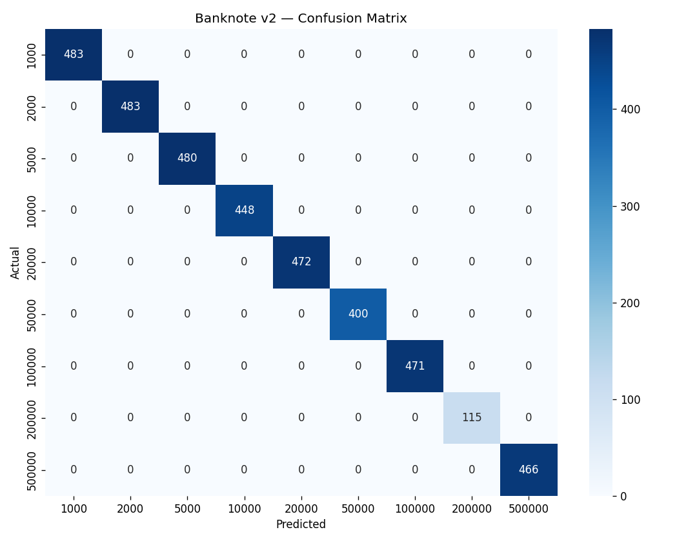

_Hình 3.18: Ma trận nhầm lẫn của mô hình nhận diện 9 mệnh giá tiền Việt Nam_

**Mô tả ngắn**: Khi người dùng chọn phương thức thanh toán "trả tại cổng" và đến cổng ra, hệ thống bật camera nhận diện tiền mặt; người dùng đưa từng tờ tiền trước camera và mô hình AI EfficientNetV2-S sẽ phân loại mệnh giá rồi tích luỹ cho đến khi đủ số tiền cần trả. Mô hình đạt độ chính xác 100% trên tập kiểm thử 3.818 ảnh thuộc 9 mệnh giá tiền Việt Nam (1.000 đ → 500.000 đ).

**Ý nghĩa**: Tính năng này mang lại sự linh hoạt cho người dùng không quen sử dụng các hình thức thanh toán điện tử, đặc biệt với khách lớn tuổi hoặc khách vãng lai. Đồng thời, việc đếm tiền tự động bằng AI giúp loại bỏ rủi ro nhầm lẫn của con người, giúp ghi nhận giao dịch chính xác và tích hợp được với dữ liệu doanh thu của hệ thống.

### 3.5.6. Mô phỏng 3D bãi xe (Digital Twin)


_Hình 3.19: Bảng điều khiển hiển thị tóm tắt tình trạng đậu xe của người dùng_

**Mô tả ngắn**: Hệ thống xây dựng một bản sao kỹ thuật số (Digital Twin) của bãi xe bằng Unity 3D với 158 ô đỗ, 6 camera ảo, mô phỏng đầy đủ luồng xe vào/ra và thiết bị ESP32 ảo. Bản sao này gọi vào cùng API của hệ thống thật và phát hiện ảnh từ camera ảo qua cùng pipeline AI nhận diện biển số.

**Ý nghĩa**: Digital Twin giải quyết bài toán lớn trong giai đoạn nghiên cứu — không có sẵn bãi xe thật và phần cứng IoT để kiểm thử. Nhờ mô phỏng, đội phát triển có thể kiểm thử toàn bộ luồng nghiệp vụ (đặt chỗ → check-in → đỗ xe → check-out) trong điều kiện sát thực mà không phụ thuộc phần cứng, đồng thời cho phép trình diễn hệ thống một cách trực quan trước hội đồng đánh giá.

### 3.5.7. Bảng điều khiển quản trị (Admin Dashboard)


_Hình 3.20: Giao diện trang quản trị tổng quan của hệ thống_

**Mô tả ngắn**: Trang quản trị tập trung hiển thị các chỉ số quan trọng (số người dùng, doanh thu, tỉ lệ lấp đầy bãi), tỉ lệ chiếm chỗ thời gian thực từ camera AI, danh sách hoạt động gần nhất và các phím tắt đến những trang quản trị con như quản lý người dùng, camera, ESP32 và báo cáo doanh thu.

**Ý nghĩa**: Bảng điều khiển quản trị cung cấp cho chủ bãi và quản lý vận hành cái nhìn tổng quan về sức khoẻ của hệ thống chỉ trên một màn hình, giảm thời gian truy vấn dữ liệu phân tán. Đây cũng là cơ sở để ra quyết định kinh doanh — biết được khung giờ cao điểm, doanh thu theo ngày/tuần/tháng, và phát hiện sớm các sự cố bất thường.

---

# Chương 4. KẾT LUẬN VÀ HƯỚNG PHÁT TRIỂN

---

## 4.1. Kết luận

### 4.1.1. Kết quả đạt được

Sau quá trình nghiên cứu, phân tích và triển khai, khoá luận đã hoàn thành mục tiêu xây dựng hệ thống bãi giữ xe thông minh ParkSmart như một sản phẩm đầy đủ chức năng và đã được đưa lên môi trường vận hành thực tế tại địa chỉ `https://parksmart.ghepdoicaulong.shop/`. Hệ thống bao quát toàn bộ vòng đời nghiệp vụ của một bãi giữ xe hiện đại — từ khâu đặt chỗ trực tuyến, kiểm soát ra vào tự động tại cổng, dẫn đường tới ô đỗ, cho tới thanh toán điện tử và thanh toán tiền mặt — và phần lớn các thao tác đều được số hoá, tự động hoá ở mức cao nhất có thể trong điều kiện phần cứng mô phỏng quy mô nhỏ.

Trên phương diện công nghệ, hệ thống là sự kết hợp của nhiều nền tảng và mô hình hiện đại, được lựa chọn cho phù hợp với từng nhóm yêu cầu nghiệp vụ. Lớp dịch vụ phía sau được tổ chức theo kiến trúc microservices với mười dịch vụ độc lập, đồng thời sử dụng ba ngôn ngữ và bộ khung chính: Django REST Framework cho các tác vụ quản lý dữ liệu nghiệp vụ phức tạp, FastAPI cho các luồng xử lý bất đồng bộ và trí tuệ nhân tạo, Go (kết hợp Gin với Gorilla WebSocket) cho lớp Gateway và truyền thông thời gian thực. Lớp giao diện được phát triển trên nền React 18 cùng Vite, Tailwind CSS và bộ thư viện shadcn/ui, mang lại trải nghiệm hiện đại và đáp ứng tốt trên cả máy tính lẫn thiết bị di động. Cơ chế giao tiếp giữa các dịch vụ kết hợp ba kiểu: HTTP REST đồng bộ qua API Gateway, hàng đợi sự kiện RabbitMQ cho các tác vụ bất đồng bộ, và WebSocket cho việc đẩy cập nhật theo thời gian thực tới các trình duyệt và Unity Digital Twin.

Mảng trí tuệ nhân tạo được đầu tư thành ba pipeline chuyên biệt: nhận diện biển số xe sử dụng YOLOv8 phối hợp với TrOCR cùng các phương án dự phòng EasyOCR và Tesseract; phát hiện ô đỗ trống bằng mô hình YOLO11n nhẹ phù hợp với suy luận thời gian thực; và nhận diện chín mệnh giá tiền giấy Việt Nam bằng kiến trúc EfficientNetV2-S kết hợp kỹ thuật Test-Time Augmentation, đạt độ chính xác 100 % trên tập kiểm thử 3.818 ảnh thuộc đầy đủ chín mệnh giá. Bên cạnh các pipeline thị giác máy tính, trợ lý hội thoại được tích hợp mô hình ngôn ngữ lớn Google Gemini với cơ chế Retrieval-Augmented Generation, dựa trên cơ sở tri thức nội bộ về chính sách, quy định và thông tin chi tiết của từng bãi xe — qua đó hạn chế đáng kể hiện tượng "ảo giác" (hallucination) thường gặp ở các mô hình ngôn ngữ thuần tuý.

Về phần cứng IoT, khoá luận đã triển khai hoàn chỉnh một mô-đun thực tế gồm vi điều khiển ESP32 đóng vai trò gateway, Arduino UNO điều khiển hai servo barrier ở cổng vào và cổng ra, màn hình OLED hiển thị thông tin biển số, cùng hai luồng camera (camera quét QR và camera RTSP đọc biển số). Để bù đắp cho hạn chế về quy mô phần cứng và tạo điều kiện kiểm thử ở quy mô lớn hơn, khoá luận xây dựng thêm một bản sao kỹ thuật số (Digital Twin) trên Unity 2022.3 LTS, mô phỏng đầy đủ một bãi xe 158 ô đỗ với 6 camera ảo, cho phép kiểm thử toàn bộ pipeline mà không phụ thuộc vào điều kiện phần cứng thực. Tổng thể, sản phẩm đã chứng minh được tính khả thi của ý tưởng và sẵn sàng làm nền tảng cho các bước phát triển tiếp theo ở quy mô thương mại.

### 4.1.2. Vấn đề đã được giải quyết

Đối chiếu với những hạn chế cố hữu của mô hình bãi giữ xe truyền thống đã phân tích tại Chương 1, hệ thống ParkSmart đã đề xuất và triển khai thành công các giải pháp tương ứng cho hầu hết các vấn đề trọng yếu.

Trước hết, hệ thống đã giảm đáng kể nhu cầu nhân sự thủ công tại cổng nhờ cơ chế kiểm soát ra vào hoàn toàn tự động dựa trên mã QR và AI nhận diện biển số. Quy trình mỗi lượt xe vào hoặc ra giờ đây chỉ kéo dài vài giây thay vì khoảng nửa phút đến một phút như cách làm truyền thống có sự can thiệp của nhân viên phát vé. Việc thay thế vé giấy bằng mã QR kỹ thuật số gắn với mã định danh duy nhất, kết hợp với bước xác minh chéo bằng AI biển số, đã hạn chế triệt để các nguy cơ thất lạc vé, làm giả vé hoặc sử dụng vé của người khác — vốn là những rủi ro thường thấy trong các bãi xe vận hành thủ công.

Đối với người dùng cuối, hệ thống đã thực sự thay đổi trải nghiệm gửi xe theo hướng chủ động và linh hoạt hơn. Người dùng có thể biết trước tình trạng chỗ trống tại từng tầng và từng vùng đỗ; có thể đặt chỗ từ xa qua giao diện web hoặc qua hội thoại tự nhiên với chatbot; có thể thanh toán đa kênh, kết hợp giữa chuyển khoản qua mã VietQR và thanh toán tiền mặt với AI nhận diện mệnh giá tự động; và có thể quan sát bản đồ chỉ đường tới đúng slot đã đặt thay vì phải dò tìm thủ công bên trong bãi. Toàn bộ những thay đổi này góp phần nâng cao đáng kể chất lượng dịch vụ mà bãi giữ xe có thể cung cấp.

Cuối cùng, hệ thống đã giải quyết được bài toán quản trị doanh thu và dữ liệu vận hành — vốn là điểm yếu rõ rệt của các mô hình thu tiền mặt và ghi sổ thủ công. Mọi giao dịch, mọi hành vi check-in, check-out và mọi sự kiện do AI ghi nhận đều được lưu trữ điện tử có hệ thống, phục vụ trực tiếp cho bảng điều khiển quản trị. Chủ bãi nhờ đó có thể theo dõi doanh thu theo các khung thời gian khác nhau, nắm được những giờ cao điểm và thấp điểm, và phát hiện sớm các sự cố bất thường để có biện pháp xử lý kịp thời. Toàn bộ tập dữ liệu vận hành cũng là cơ sở quan trọng để cải tiến hệ thống và xây dựng các tính năng phân tích nâng cao trong tương lai.

### 4.1.3. Ưu điểm và khuyết điểm

#### 4.1.3.1. Ưu điểm

- **Tự động hoá cao:** Luồng nghiệp vụ từ đặt chỗ, check-in, chỉ đường tới thanh toán và check-out được số hoá gần như toàn bộ, giảm phụ thuộc vào thao tác thủ công.
- **Tích hợp AI theo chiều sâu:** Hệ thống triển khai đồng thời nhiều mô-đun AI phục vụ trực tiếp nghiệp vụ thực tế (nhận diện biển số, phát hiện ô đỗ, nhận diện tiền giấy, chatbot tiếng Việt).
- **Kiến trúc linh hoạt và dễ mở rộng:** Mô hình microservices đa ngôn ngữ cùng ba kiểu giao tiếp (HTTP REST, RabbitMQ, WebSocket) giúp tách biệt trách nhiệm, mở rộng độc lập từng dịch vụ và cô lập lỗi tốt.
- **Đa kênh tương tác người dùng:** Người dùng có thể thao tác qua web responsive, chatbot AI, thiết bị IoT tại cổng và môi trường mô phỏng 3D Digital Twin.
- **Bảo mật nhiều lớp:** Cơ chế cookie phiên, khoá bí mật nội bộ giữa các dịch vụ, token cho thiết bị IoT và đối chiếu camera giúp tăng độ an toàn khi vận hành.
- **Mức độ sẵn sàng triển khai tốt:** Hệ thống đã container hoá bằng Docker, chạy ổn định qua Cloudflare Tunnel và có kiểm thử tự động (Playwright, pytest), cho thấy khả năng tiến tới vận hành thực tế.

#### 4.1.3.2. Khuyết điểm

- **Chi phí triển khai thực tế cao:** Hệ thống muốn vận hành ở quy mô thương mại cần đầu tư đồng thời vào phần mềm, camera, barrier, thiết bị IoT, mạng nội bộ và hạ tầng máy chủ.
- **Vận hành phức tạp hơn mô hình truyền thống:** Kiến trúc microservices, AI pipeline và IoT tích hợp giúp hệ thống mạnh hơn nhưng cũng làm tăng độ khó trong triển khai, giám sát và bảo trì.
- **Phụ thuộc vào chất lượng môi trường đầu vào:** Hiệu quả nhận diện biển số, QR và tiền mặt chịu tác động trực tiếp bởi ánh sáng, góc đặt camera, độ sạch thiết bị và điều kiện thực địa.
- **Phụ thuộc vào hạ tầng mạng và thiết bị ngoại vi:** Khi mạng nội bộ, camera hoặc thiết bị cổng hoạt động không ổn định, toàn bộ trải nghiệm tự động hóa có thể bị ảnh hưởng.
- **Yêu cầu bảo trì định kỳ:** Camera, barrier, cảm biến và thiết bị điều khiển cần được kiểm tra, hiệu chuẩn và thay thế định kỳ để duy trì độ tin cậy lâu dài.
- **Khó mở rộng đồng loạt nếu không có tái kiến trúc:** Khi triển khai cho nhiều bãi xe cùng lúc, hệ thống cần thiết kế lại ở mức quản trị và điều phối thay vì chỉ nhân bản cấu hình hiện tại.
- **Phụ thuộc vào một số dịch vụ và công nghệ chuyên biệt:** Các thành phần như mô hình AI, dịch vụ LLM và hệ thống realtime làm tăng năng lực hệ thống nhưng cũng tạo thêm điểm phụ thuộc kỹ thuật trong quá trình vận hành.

---

## 4.2. Hướng phát triển

### 4.2.1. Vấn đề còn tồn tại

Trong phạm vi và thời gian thực hiện của khoá luận, hệ thống vẫn còn một số vấn đề trọng tâm cần tiếp tục hoàn thiện:

- **Chưa tối ưu đầy đủ độ chính xác của các mô hình AI:** Hệ thống vẫn cần thêm dữ liệu huấn luyện và kiểm thử thực địa để tăng độ ổn định cho nhận diện biển số, nhận diện tiền và phát hiện ô đỗ.
- **Chưa hoàn thiện chatbot cho các tình huống hội thoại phức tạp:** Một số trường hợp hỏi đáp đa nghĩa, nhiều ràng buộc hoặc yêu cầu nghiệp vụ liên tiếp vẫn cần cải thiện thêm.
- **Chưa thay thế phần cứng thử nghiệm bằng phần cứng công nghiệp:** Bộ thiết bị hiện tại mới phù hợp cho nguyên mẫu và kiểm thử, chưa phải cấu hình cuối cùng cho vận hành thương mại lâu dài.
- **Chưa hỗ trợ đầy đủ thanh toán điện tử phổ biến tại Việt Nam:** Dự án hiện chưa tích hợp chính thức các cổng như VNPay, MoMo và ZaloPay.
- **Chưa triển khai đầy đủ lớp giám sát và bảo mật cấp doanh nghiệp:** Các giải pháp như Prometheus, Grafana, ELK Stack, 2FA và WAF mới dừng ở định hướng, chưa hoàn thiện trong phiên bản hiện tại.
- **Chưa tái thiết kế kiến trúc cho bài toán đa bãi ở quy mô lớn:** Phiên bản hiện tại chủ yếu kiểm chứng tốt cho phạm vi một bãi xe thông minh, chưa giải quyết trọn vẹn bài toán multi-tenant và điều phối quy mô lớn.

### 4.2.2. Giải pháp và định hướng phát triển

Trên cơ sở các vấn đề còn tồn tại và tiềm năng mở rộng nghiệp vụ, hệ thống được định hướng phát triển theo các nhóm trọng tâm sau:

- **Tối ưu AI và chatbot:** Bổ sung dữ liệu huấn luyện cho các pipeline nhận diện biển số, ô đỗ và tiền giấy nhằm tăng độ ổn định trong điều kiện thực tế; mở rộng cơ sở tri thức RAG và cải tiến khả năng hiểu ngữ cảnh đa lượt cho chatbot.

- **Hoàn thiện hỗ trợ xe máy:** Thu thập dữ liệu và huấn luyện riêng pipeline nhận diện biển số xe máy (kích thước nhỏ, đặt thấp, dễ bị che); bố trí camera góc thấp tại cổng dành riêng cho luồng xe máy; thiết kế khu vực đỗ và barrier phù hợp với kích thước xe máy; điều chỉnh giao diện đặt chỗ và sơ đồ bãi để hiển thị đúng các ô đỗ chuyên dụng cho xe máy.

- **Mở rộng mô hình dịch vụ cho khách vãng lai (drive-in):** Bổ sung luồng "vào bãi trực tiếp không cần đặt trước" — khi xe đến cổng, hệ thống tự chụp biển số, sinh mã QR tạm gắn với thời điểm vào và mở barrier ngay; đến lúc check-out hệ thống đối chiếu biển số với QR tạm để tính tiền theo thời gian thực tế ở bãi và yêu cầu thanh toán trước khi mở barrier ra. Mô hình này phục vụ nhóm khách không có nhu cầu đặt chỗ trước, tăng đáng kể lưu lượng khai thác cho bãi.

- **Mở rộng các gói dịch vụ:** Bổ sung gói vé tháng và vé năm cho khách hàng thường xuyên (cư dân toà nhà, nhân viên văn phòng); hỗ trợ đặt chỗ định kỳ theo lịch tuần cho người đi làm; xây dựng chương trình tích điểm và ưu đãi để giữ chân khách hàng trung thành.

- **Tích hợp định vị và dẫn đường:** Ứng dụng GPS và bản đồ số để hướng dẫn người dùng từ vị trí hiện tại đến bãi gần nhất phù hợp với loại phương tiện, sau đó dẫn đường tiếp tới đúng ô đỗ đã đặt theo thời gian thực.

- **Hỗ trợ xe điện và trạm sạc:** Tích hợp các ô đỗ có trụ sạc xe điện vào sơ đồ bãi, cho phép người dùng đặt chỗ kèm dịch vụ sạc; quản lý trạng thái sạc và tính phí theo thời gian thực; theo dõi mức sạc qua giao diện người dùng.

- **AI giám sát an ninh:** Mở rộng hệ thống camera AI để phát hiện các tình huống bất thường trong bãi như trộm cắp, va chạm giữa các xe, đỗ sai vị trí, người lạ tiếp cận xe; tự động cảnh báo cho quản trị viên và lưu video làm bằng chứng phục vụ xử lý.

- **Phân tích dữ liệu và dự báo nhu cầu:** Phân tích dữ liệu lịch sử booking và dữ liệu camera để dự báo nhu cầu đỗ xe theo khung giờ, ngày trong tuần, sự kiện và thời tiết; đề xuất định giá động (dynamic pricing) theo nhu cầu nhằm tối ưu doanh thu cho chủ bãi.

- **Nâng cấp phần cứng và triển khai Edge AI:** Thay thiết bị mô phỏng bằng motor, camera và cảm biến công nghiệp đạt chuẩn vận hành 24/7; bổ sung cảm biến siêu âm hoặc cảm biến từ trường tại từng ô đỗ; tích hợp cập nhật firmware từ xa và bộ lưu điện dự phòng; chuyển một phần luồng nhận diện AI về thiết bị biên (Jetson Nano hoặc Coral TPU) để giảm tải máy chủ và độ trễ mạng.

- **Mở rộng thanh toán và xây dựng ứng dụng di động:** Tích hợp chính thức các cổng thanh toán VNPay, MoMo và ZaloPay; phát triển ứng dụng di động gốc trên React Native hoặc Flutter; bổ sung hỗ trợ đa ngôn ngữ (Việt - Anh) để phục vụ khách quốc tế và khách du lịch.

- **Bảo mật, giám sát và mở rộng đa bãi:** Triển khai xác thực hai yếu tố và tường lửa ứng dụng web; thiết lập hệ thống giám sát tập trung dựa trên Prometheus, Grafana và ELK Stack; tái thiết kế kiến trúc theo mô hình đa bãi để một instance duy nhất có thể phục vụ đồng thời nhiều bãi giữ xe trong cùng một chuỗi vận hành.

---

# TÀI LIỆU THAM KHẢO

---

## A. Bài báo khoa học

[1] A. Vaswani, N. Shazeer, N. Parmar, J. Uszkoreit, L. Jones, A. N. Gomez, Ł. Kaiser, and I. Polosukhin, "Attention is all you need," in *Proc. 31st Conf. Neural Inf. Process. Syst. (NIPS)*, Long Beach, CA, USA, Dec. 2017, pp. 5998–6008.
Available: https://papers.nips.cc/paper/2017/hash/3f5ee243547dee91fbd053c1c4a845aa-Abstract.html

[2] J. Redmon, S. Divvala, R. Girshick, and A. Farhadi, "You only look once: Unified, real-time object detection," in *Proc. IEEE Conf. Comput. Vis. Pattern Recognit. (CVPR)*, Las Vegas, NV, USA, Jun. 2016, pp. 779–788.
doi: 10.1109/CVPR.2016.91
Available: https://doi.org/10.1109/CVPR.2016.91

[3] M. Tan and Q. V. Le, "EfficientNetV2: Smaller models and faster training," in *Proc. 38th Int. Conf. Mach. Learn. (ICML)*, vol. 139, Jul. 2021, pp. 10096–10106.
Available: https://proceedings.mlr.press/v139/tan21a.html

[4] M. Li, T. Lv, J. Chen, L. Cui, Y. Lu, D. Florencio, C. Zhang, Z. Li, and F. Wei, "TrOCR: Transformer-based optical character recognition with pre-trained models," in *Proc. AAAI Conf. Artif. Intell.*, vol. 37, no. 11, Washington, DC, USA, Feb. 2023, pp. 13094–13102.
doi: 10.1609/aaai.v37i11.26538
Available: https://doi.org/10.1609/aaai.v37i11.26538

[5] N. Reimers and I. Gurevych, "Sentence-BERT: Sentence embeddings using Siamese BERT-networks," in *Proc. Conf. Empirical Methods Natural Lang. Process. and 9th Int. Joint Conf. Natural Lang. Process. (EMNLP-IJCNLP)*, Hong Kong, China, Nov. 2019, pp. 3982–3992.
doi: 10.18653/v1/D19-1410
Available: https://aclanthology.org/D19-1410

[6] P. Lewis, E. Perez, A. Piktus, F. Petroni, V. Karpukhin, N. Goyal, H. Küttler, M. Lewis, W.-t. Yih, T. Rocktäschel, S. Riedel, and D. Kiela, "Retrieval-augmented generation for knowledge-intensive NLP tasks," in *Proc. 34th Conf. Neural Inf. Process. Syst. (NeurIPS)*, Vancouver, BC, Canada, Dec. 2020, pp. 9459–9474.
Available: https://papers.nips.cc/paper/2020/hash/6b493230205f780e1bc26945df7481e5-Abstract.html

[7] M. Fowler and J. Lewis, "Microservices: A definition of this new architectural term," martinfowler.com, Mar. 25, 2014.
Available: https://martinfowler.com/articles/microservices.html
Accessed: Apr. 28, 2026.

## B. Tài liệu kỹ thuật

[8] Django Software Foundation, "Django documentation — Django 5.2," 2026.
Available: https://docs.djangoproject.com/en/5.2/
Accessed: Apr. 28, 2026.

[9] T. Christie, "Django REST framework documentation," 2026.
Available: https://www.django-rest-framework.org/
Accessed: Apr. 28, 2026.

[10] S. Ramírez, "FastAPI — Modern, fast (high-performance) web framework for Python APIs," 2026.
Available: https://fastapi.tiangolo.com/
Accessed: Apr. 28, 2026.

[11] The Go Authors, "The Go programming language specification," 2026.
Available: https://go.dev/doc/
Accessed: Apr. 28, 2026.

[12] Meta Platforms Inc., "React — A JavaScript library for building user interfaces," 2026.
Available: https://react.dev/
Accessed: Apr. 28, 2026.

[13] G. Jocher, A. Chaurasia, and J. Qiu, "Ultralytics YOLO documentation," 2026.
Available: https://docs.ultralytics.com/
Accessed: Apr. 28, 2026.

[14] OpenCV Team, "OpenCV — Open Source Computer Vision Library documentation," version 4.10.0, 2026.
Available: https://docs.opencv.org/
Accessed: Apr. 28, 2026.

[15] Google LLC, "Gemini API documentation — Google AI for developers," 2026.
Available: https://ai.google.dev/gemini-api/docs
Accessed: Apr. 28, 2026.

[16] Chroma, "Chroma — The AI-native open-source embedding database," 2026.
Available: https://docs.trychroma.com/
Accessed: Apr. 28, 2026.

[17] Oracle Corp., "MySQL 8.0 reference manual," 2026.
Available: https://dev.mysql.com/doc/refman/8.0/en/
Accessed: Apr. 28, 2026.

[18] Redis Ltd., "Redis documentation — In-memory data store," 2026.
Available: https://redis.io/docs/
Accessed: Apr. 28, 2026.

[19] Broadcom Inc., "RabbitMQ documentation," 2026.
Available: https://www.rabbitmq.com/docs
Accessed: Apr. 28, 2026.

[20] Docker Inc., "Docker documentation," 2026.
Available: https://docs.docker.com/
Accessed: Apr. 28, 2026.

[21] Espressif Systems, "ESP32 technical reference manual," version 5.1, 2024.
Available: https://www.espressif.com/sites/default/files/documentation/esp32_technical_reference_manual_en.pdf
Accessed: Apr. 28, 2026.

[22] Arduino, "Arduino documentation — Reference, tutorials and guides," 2026.
Available: https://docs.arduino.cc/
Accessed: Apr. 28, 2026.

[23] Unity Technologies, "Unity user manual 2022.3 (LTS)," 2026.
Available: https://docs.unity3d.com/2022.3/Documentation/Manual/
Accessed: Apr. 28, 2026.

---

# PHỤ LỤC

---

## Phụ lục A: Danh sách API Endpoints

### A.1. Auth Service (Django DRF — Port 8001)

| Method              | Endpoint                       | Mô tả                              | Auth  |
| ------------------- | ------------------------------ | ---------------------------------- | ----- |
| POST                | `/auth/register/`              | Đăng ký tài khoản mới              | No    |
| POST                | `/auth/login/`                 | Đăng nhập (session-based)          | No    |
| POST                | `/auth/logout/`                | Đăng xuất (xóa session)            | Yes   |
| GET                 | `/auth/me/`                    | Lấy thông tin user hiện tại        | Yes   |
| POST                | `/auth/change-password/`       | Đổi mật khẩu                       | Yes   |
| POST                | `/auth/forgot-password/`       | Yêu cầu reset password (gửi email) | No    |
| POST                | `/auth/reset-password/`        | Reset password từ token            | No    |
| GET                 | `/auth/google/`                | Lấy URL OAuth Google               | No    |
| GET                 | `/auth/google/callback/`       | Callback OAuth Google              | No    |
| GET                 | `/auth/facebook/`              | Lấy URL OAuth Facebook             | No    |
| GET                 | `/auth/facebook/callback/`     | Callback OAuth Facebook            | No    |
| GET                 | `/auth/admin/dashboard/stats/` | Thống kê admin dashboard           | Admin |
| GET/PUT             | `/auth/admin/config/`          | Cấu hình hệ thống                  | Admin |
| GET/POST/PUT/DELETE | `/auth/admin/users/`           | CRUD users (admin)                 | Admin |

### A.2. Booking Service (Django DRF + Celery — Port 8002)

| Method         | Endpoint                          | Mô tả                           | Auth     |
| -------------- | --------------------------------- | ------------------------------- | -------- |
| GET            | `/bookings/`                      | Danh sách bookings (user's own) | Yes      |
| POST           | `/bookings/`                      | Tạo booking mới                 | Yes      |
| GET            | `/bookings/{id}/`                 | Chi tiết booking                | Yes      |
| PUT/PATCH      | `/bookings/{id}/`                 | Cập nhật booking                | Yes      |
| DELETE         | `/bookings/{id}/`                 | Hủy booking                     | Yes      |
| POST           | `/bookings/{id}/check-in/`        | Check-in booking                | Internal |
| POST           | `/bookings/{id}/check-out/`       | Check-out booking               | Internal |
| POST           | `/bookings/{id}/cancel/`          | Cancel booking                  | Yes      |
| GET            | `/bookings/current-parking/`      | Booking đang active             | Yes      |
| GET            | `/bookings/upcoming/`             | Bookings sắp tới                | Yes      |
| GET            | `/bookings/stats/`                | Thống kê booking                | Yes      |
| POST           | `/bookings/payment/`              | Khởi tạo thanh toán             | Yes      |
| POST           | `/bookings/payment/verify/`       | Xác minh thanh toán             | Yes      |
| POST           | `/bookings/check-slot-bookings/`  | Kiểm tra slot đã booking        | Yes      |
| GET/POST       | `/bookings/packagepricings/`      | CRUD package pricing            | Admin    |
| GET/PUT/DELETE | `/bookings/packagepricings/{id}/` | Chi tiết package pricing        | Admin    |

### A.3. Parking Service (Django DRF — Port 8003)

| Method               | Endpoint                 | Mô tả                | Auth  |
| -------------------- | ------------------------ | -------------------- | ----- |
| GET/POST             | `/parking/lots/`         | CRUD parking lots    | Mixed |
| GET/PUT/DELETE       | `/parking/lots/{id}/`    | Chi tiết parking lot | Mixed |
| GET/POST             | `/parking/floors/`       | CRUD floors          | Mixed |
| GET/PUT/DELETE       | `/parking/floors/{id}/`  | Chi tiết floor       | Mixed |
| GET/POST             | `/parking/zones/`        | CRUD zones           | Mixed |
| GET/PUT/DELETE       | `/parking/zones/{id}/`   | Chi tiết zone        | Mixed |
| GET/POST             | `/parking/slots/`        | CRUD car slots       | Mixed |
| GET/PUT/PATCH/DELETE | `/parking/slots/{id}/`   | Chi tiết car slot    | Mixed |
| GET/POST             | `/parking/cameras/`      | CRUD cameras         | Admin |
| GET/PUT/DELETE       | `/parking/cameras/{id}/` | Chi tiết camera      | Admin |

### A.4. Vehicle Service (Django DRF — Internal)

| Method    | Endpoint                      | Mô tả           | Auth |
| --------- | ----------------------------- | --------------- | ---- |
| GET       | `/vehicles/`                  | Danh sách xe    | Yes  |
| POST      | `/vehicles/`                  | Thêm xe mới     | Yes  |
| GET       | `/vehicles/{id}/`             | Chi tiết xe     | Yes  |
| PUT/PATCH | `/vehicles/{id}/`             | Cập nhật xe     | Yes  |
| DELETE    | `/vehicles/{id}/`             | Xóa xe          | Yes  |
| POST      | `/vehicles/{id}/set-default/` | Đặt xe mặc định | Yes  |
| GET       | `/vehicles/default/`          | Lấy xe mặc định | Yes  |

### A.5. AI Service (FastAPI — Port 8009)

| Method | Endpoint                  | Mô tả                 | Auth     |
| ------ | ------------------------- | --------------------- | -------- |
| POST   | `/ai/esp32/check-in/`     | ESP32 check-in flow   | Device   |
| POST   | `/ai/esp32/check-out/`    | ESP32 check-out flow  | Device   |
| POST   | `/ai/esp32/register/`     | Đăng ký ESP32 device  | Device   |
| POST   | `/ai/esp32/heartbeat/`    | Device heartbeat      | Device   |
| GET    | `/ai/esp32/status/`       | Trạng thái ESP32      | Admin    |
| POST   | `/ai/detection/plate/`    | Nhận dạng biển số     | Internal |
| POST   | `/ai/detection/banknote/` | Nhận dạng tiền giấy   | Yes      |
| POST   | `/ai/detection/slot/`     | Detect slot occupancy | Internal |
| POST   | `/ai/cameras/frame/`      | Nhận frame từ camera  | Internal |
| GET    | `/ai/cameras/`            | Danh sách cameras     | Admin    |
| GET    | `/ai/parking/status/`     | Trạng thái bãi xe AI  | Yes      |
| GET    | `/ai/parking/slots/`      | Slot status từ AI     | Yes      |
| POST   | `/ai/training/upload/`    | Upload training data  | Admin    |
| GET    | `/ai/metrics/`            | AI service metrics    | Admin    |
| GET    | `/ai/health/`             | Health check          | No       |

### A.6. Chatbot Service (FastAPI — Port 8008)

| Method  | Endpoint                       | Mô tả                    | Auth     |
| ------- | ------------------------------ | ------------------------ | -------- |
| POST    | `/chatbot/chat/`               | Gửi tin nhắn chatbot     | Yes      |
| GET     | `/chatbot/conversations/`      | Danh sách conversations  | Yes      |
| GET     | `/chatbot/conversations/{id}/` | Chi tiết conversation    | Yes      |
| DELETE  | `/chatbot/conversations/{id}/` | Xóa conversation         | Yes      |
| GET/PUT | `/chatbot/preferences/`        | User preferences chatbot | Yes      |
| GET     | `/chatbot/notifications/`      | Proactive notifications  | Yes      |
| POST    | `/chatbot/actions/booking/`    | Chatbot booking action   | Internal |
| GET     | `/chatbot/health/`             | Health check             | No       |

### A.7. Payment Service (FastAPI — Port 8007)

| Method | Endpoint                      | Mô tả                 | Auth |
| ------ | ----------------------------- | --------------------- | ---- |
| POST   | `/payments/initiate/`         | Khởi tạo thanh toán   | Yes  |
| POST   | `/payments/verify/`           | Xác minh thanh toán   | Yes  |
| GET    | `/payments/history/`          | Lịch sử thanh toán    | Yes  |
| POST   | `/payments/cash-session/`     | Bắt đầu cash session  | Yes  |
| POST   | `/payments/cash-session/add/` | Thêm tiền vào session | Yes  |
| GET    | `/payments/health/`           | Health check          | No   |

### A.8. Notification Service (FastAPI — Port 8005)

| Method | Endpoint                    | Mô tả               | Auth     |
| ------ | --------------------------- | ------------------- | -------- |
| GET    | `/notifications/`           | Danh sách thông báo | Yes      |
| POST   | `/notifications/send/`      | Gửi thông báo       | Internal |
| PATCH  | `/notifications/{id}/read/` | Đánh dấu đã đọc     | Yes      |
| GET    | `/notifications/health/`    | Health check        | No       |

### A.9. Gateway Service (Go Gin — Port 8000)

| Method | Endpoint            | Mô tả                    | Auth    |
| ------ | ------------------- | ------------------------ | ------- |
| GET    | `/health/`          | Gateway health check     | No      |
| GET    | `/health/ready/`    | Readiness probe          | No      |
| GET    | `/health/live/`     | Liveness probe           | No      |
| GET    | `/health/services/` | All services health      | No      |
| ANY    | `/{service}/*path`  | Reverse proxy to service | Depends |

### A.10. Realtime Service (Go Gorilla WS — Port 8006)

| Method | Endpoint                | Mô tả                        | Auth |
| ------ | ----------------------- | ---------------------------- | ---- |
| WS     | `/ws/`                  | WebSocket connection         | Yes  |
| WS     | `/ws/parking/{lot_id}/` | Parking lot specific channel | Yes  |
| GET    | `/health/`              | Health check                 | No   |

---

## Phụ lục B: Cấu hình Docker Compose

```yaml
# docker-compose.yml — ParkSmart Microservices (15 containers)

services:
  # ======== INFRASTRUCTURE ========

  mysql:
    image: mysql:8.0

    container_name: parksmartdb_mysql

    restart: unless-stopped

    environment:
      MYSQL_ROOT_PASSWORD: ${DB_PASSWORD}

      MYSQL_DATABASE: parksmartdb

      MYSQL_USER: ${DB_USER}

      MYSQL_PASSWORD: ${DB_PASSWORD}

    ports:
      - "3307:3306"

    volumes:
      - mysql_data:/var/lib/mysql

      - ./init-mysql.sql:/docker-entrypoint-initdb.d/init.sql

    healthcheck:
      test: ["CMD", "mysqladmin", "ping", "-h", "127.0.0.1"]

      interval: 10s

      timeout: 5s

      retries: 10

      start_period: 60s

  redis:
    image: redis:7-alpine

    container_name: parksmartdb_redis

    restart: unless-stopped

    ports:
      - "6379:6379"

    volumes:
      - redis_data:/data

    healthcheck:
      test: ["CMD", "redis-cli", "ping"]

      interval: 10s

  rabbitmq:
    image: rabbitmq:3-management-alpine

    container_name: parksmartdb_rabbitmq

    restart: unless-stopped

    environment:
      RABBITMQ_DEFAULT_USER: ${RABBITMQ_USER}

      RABBITMQ_DEFAULT_PASS: ${RABBITMQ_PASS}

    ports:
      - "5672:5672" # AMQP

      - "15672:15672" # Management UI

    healthcheck:
      test: ["CMD", "rabbitmq-diagnostics", "ping"]

      interval: 30s

  # ======== DJANGO SERVICES (4) ========

  auth-service:
    build: ./auth-service

    container_name: auth-service

    ports: ["8001:8000"]

    depends_on:
      mysql: { condition: service_healthy }

      redis: { condition: service_healthy }

  booking-service:
    build: ./booking-service

    container_name: booking-service

    ports: ["8002:8000"]

    depends_on:
      mysql: { condition: service_healthy }

      rabbitmq: { condition: service_healthy }

      redis: { condition: service_healthy }

  booking-celery-worker:
    build: ./booking-service

    container_name: booking-celery-worker

    command: celery -A booking_service worker -l info

    depends_on: [mysql, redis, rabbitmq]

  booking-celery-beat:
    build: ./booking-service

    container_name: booking-celery-beat

    command: celery -A booking_service beat -l info

    depends_on: [redis]

  parking-service:
    build: ./parking-service

    container_name: parking-service

    ports: ["8003:8000"]

    depends_on:
      mysql: { condition: service_healthy }

  vehicle-service:
    build: ./vehicle-service

    container_name: vehicle-service

    # No external port — internal only

    depends_on:
      mysql: { condition: service_healthy }

  # ======== FASTAPI SERVICES (4) ========

  ai-service:
    build: ./ai-service-fastapi

    container_name: ai-service

    ports: ["8009:8009"]

    depends_on:
      mysql: { condition: service_healthy }

    volumes:
      - ai_models:/app/models # AI model files

      - ai_media:/app/media # Captured frames

  chatbot-service:
    build: ./chatbot-service-fastapi

    container_name: chatbot-service

    ports: ["8008:8008"]

    depends_on:
      mysql: { condition: service_healthy }

      redis: { condition: service_healthy }

      rabbitmq: { condition: service_healthy }

  payment-service:
    build: ./payment-service-fastapi

    container_name: payment-service

    ports: ["8007:8007"]

    depends_on:
      mysql: { condition: service_healthy }

  notification-service:
    build: ./notification-service-fastapi

    container_name: notification-service

    ports: ["8005:8005"]

    depends_on:
      mysql: { condition: service_healthy }

  # ======== GO SERVICES (2) ========

  realtime-service:
    build: ./realtime-service-go

    container_name: realtime-service

    ports: ["8006:8006"]

    depends_on:
      redis: { condition: service_healthy }

  gateway-service:
    build: ./gateway-service-go

    container_name: gateway-service

    ports: ["8000:8000"]

    depends_on:
      redis: { condition: service_healthy }

      auth-service: { condition: service_started }

volumes:
  mysql_data:

  redis_data:

  rabbitmq_data:

  ai_models:

  ai_media:

networks:
  default:
    name: parksmart-network
```

**Ghi chú:**

- Tất cả services chia sẻ `parksmart-network` (Docker bridge)
- MySQL, Redis, RabbitMQ dùng persistent volumes
- Infrastructure services có health check, application services chờ infrastructure ready
- Biến môi trường quản lý qua file `.env` (gitignored), mẫu tại `.env.example`

---

## Phụ lục C: ESP32 / Arduino Wiring Diagram

### C.1. Sơ đồ kết nối ESP32

```

                    ┌──────────────────────────┐

                    │         ESP32             │

                    │         DevKit            │

                    │                          │

        [Button]────┤ GPIO4     Check-in Button │

        [Button]────┤ GPIO5     Check-out Button│

                    │                          │

                    │ GPIO16 ──TX──► Arduino RX │  ← UART2 (9600bps)

                    │ GPIO17 ◄──RX── Arduino TX │

                    │                          │

                    │ GPIO21 ──SDA──┐           │  ← I2C

                    │ GPIO22 ──SCL──┤ OLED      │

                    │               │ SSD1306   │

                    │               │ 128×64    │

                    │                          │

                    │ GPIO2  ──LED (Status)     │

                    │                          │

                    │ 3.3V  ──VCC────────────┐ │

                    │ GND   ──GND────────────┤ │

                    │                          │

                    │   WiFi: HTTP REST/JSON   │

                    │   → AI Service :8009     │

                    └──────────────────────────┘

```

### C.2. Sơ đồ kết nối Arduino

```

                    ┌──────────────────────────┐

                    │        Arduino            │

                    │        Uno / Nano         │

                    │                          │

   ESP32 GPIO16 ──►│ RX (Pin 0 hoặc SoftSerial)│  ← UART (9600bps)

   ESP32 GPIO17 ◄──│ TX (Pin 1 hoặc SoftSerial)│

                    │                          │

                    │ Pin10 ──Signal──►[Servo 1]│  ← Entry Barrier

                    │                  (SG90)   │

                    │ Pin9  ──Signal──►[Servo 2]│  ← Exit Barrier

                    │                  (SG90)   │

                    │                          │

                    │ Pin13 ──LED (Status)      │

                    │                          │

                    │ 5V   ──VCC Servos         │

                    │ GND  ──GND Common         │

                    └──────────────────────────┘

```

### C.3. Giao thức UART tùy chỉnh

| Lệnh            | Hướng           | Mô tả                       | Thông số Servo             |
| --------------- | --------------- | --------------------------- | -------------------------- |
| `OPEN_1\n`      | ESP32 → Arduino | Mở barrier cổng vào (entry) | Pin10: PWM 1500μs → 3000μs |
| `CLOSE_1\n`     | ESP32 → Arduino | Đóng barrier cổng vào       | Pin10: PWM 3000μs → 1500μs |
| `OPEN_2\n`      | ESP32 → Arduino | Mở barrier cổng ra (exit)   | Pin9: PWM 1500μs → 3000μs  |
| `CLOSE_2\n`     | ESP32 → Arduino | Đóng barrier cổng ra        | Pin9: PWM 3000μs → 1500μs  |
| `STATUS\n`      | ESP32 → Arduino | Query trạng thái barriers   | —                          |
| `ACK_OPEN_1\n`  | Arduino → ESP32 | Xác nhận đã mở entry        | —                          |
| `ACK_CLOSE_1\n` | Arduino → ESP32 | Xác nhận đã đóng entry      | —                          |
| `ACK_OPEN_2\n`  | Arduino → ESP32 | Xác nhận đã mở exit         | —                          |
| `ACK_CLOSE_2\n` | Arduino → ESP32 | Xác nhận đã đóng exit       | —                          |
| `STATUS_OK\n`   | Arduino → ESP32 | Trạng thái bình thường      | —                          |
| `HEARTBEAT\n`   | ESP32 → Server  | Kiểm tra kết nối (mỗi 10s)  | —                          |

**Thông số truyền thông:**

- Baud rate: 9600 bps
- Data bits: 8
- Parity: None
- Stop bits: 1
- Line ending: `\n` (newline)
- Debounce nút nhấn: 300ms
- Auto-close barrier: 5 giây sau khi mở
- Heartbeat interval: 10 giây
- Offline threshold: 30 giây không có heartbeat
- UART Sanitizer: Lọc ký tự non-ASCII (byte rác do nhiễu điện)

### C.4. Sơ đồ kết nối tổng thể

```

                                         ┌────────────┐

                                    WiFi │  AI Server  │

                               ┌────────►│  :8009     │◄─── Camera RTSP

                               │ HTTP    │  (FastAPI)  │     (EZVIZ)

                               │ REST    └──────┬─────┘

                               │                │

                        ┌──────┴──────┐         │        ┌──────────────┐

    [Check-in Btn]──────┤    ESP32    │         │        │ Camera QR    │

    [Check-out Btn]─────┤             │         └────────│ (DroidCam)   │

    [OLED SSD1306]──I2C─┤  GPIO 21/22│                   └──────────────┘

    [Status LED]────────┤  GPIO 2    │

                        │             │

                        │  GPIO16 TX──┤────UART 9600───┐

                        │  GPIO17 RX──┤◄───────────────┤

                        └─────────────┘                │

                                                ┌──────┴──────┐

                                                │   Arduino    │

                                                │              │

                                    ┌───────────┤  Pin10       │

                                    │  Signal   │  Pin9        ├───────────┐

                                    │           │              │   Signal  │

                                    ▼           └──────────────┘           ▼

                            ┌──────────────┐                    ┌──────────────┐

                            │  Servo SG90  │                    │  Servo SG90  │

                            │  Entry Gate  │                    │  Exit Gate   │

                            │  (Barrier 1) │                    │  (Barrier 2) │

                            └──────────────┘                    └──────────────┘

```

---
