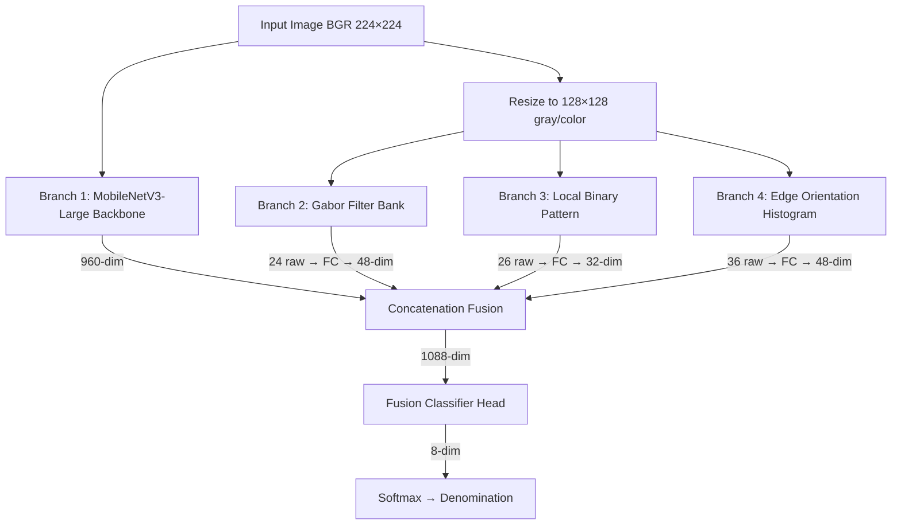

# ADR-005: Enhanced Multi-Branch Banknote Classifier (MobileNetV3 + Texture)

## Trạng thái: Accepted

## Bối cảnh

### Vấn đề hiện tại

1. **Misclassification**: tờ 1000 VND bị nhận nhầm thành 2000 VND (69.4% confidence) vì cả hai mệnh giá đều có tông màu nâu vàng tương tự.

2. **Overfitting nghiêm trọng**: Model hiện tại (cả MobileNetV3 lẫn EfficientNet-B3) đạt 100% val accuracy tại epoch 1 — dấu hiệu rõ ràng của **data leakage**. Nguyên nhân:
   - Dataset được tạo từ video frames + pre-augmented variants (`hflip`, `bright`, `rot`)
   - Filename pattern: `{denom}_real_{face}_{timestamp}_{framenum}_{augtype}.jpg`
   - Khi random split: frame gốc (`_orig`) vào train, variant (`_hflip`) vào val → model "nhớ" pixel pattern thay vì học features thực sự

3. **Production model chỉ dùng CNN features (image pixels)**: MobileNetV3-Large (17MB) classify 224×224 images mà không có bất kỳ handcrafted texture features nào → không phân biệt được mệnh giá có màu sắc tương tự.

4. **Training model (EfficientNet-B3, 51MB) không used**: Quá nặng cho production, và cũng bị overfit do cùng data split issue.

### Requirements

- Thêm texture/pattern features (họa tiết) để phân biệt mệnh giá similar-color
- Giữ backward compatible với pipeline hiện có
- Model size ≤ 30MB, inference ≤ 100ms trên CPU
- Training phải work trên CPU (user không có GPU)
- 8 classes: 1000, 2000, 5000, 10000, 20000, 50000, 100000, 500000

---

## Phương Án Xem Xét

### Option A: MobileNetV3-Large Multi-Branch (4 branches)

- Backbone MobileNetV3-Large (pretrained, 960-dim) + 3 handcrafted feature branches (Gabor + LBP + Edge)
- Ưu: nhẹ (~18MB), inference nhanh (~70ms CPU), tận dụng pretrained backbone
- Nhược: phụ thuộc vào handcrafted feature quality

### Option B: EfficientNet-B3 Multi-Branch (như train_and_evaluate.py hiện tại)

- Ưu: backbone mạnh hơn (1536-dim), đã có code
- Nhược: **51MB vượt giới hạn 30MB**, cần `timm` dependency, chậm trên CPU (~200ms)

### Option C: MobileNetV3 + Color histogram only

- Ưu: đơn giản nhất
- Nhược: color histogram không giải quyết root cause (similar colors), thiếu texture discrimination

## Quyết Định

**Option A: MobileNetV3-Large Multi-Branch** vì:
- Duy nhất đáp ứng cả 3 constraints: size ≤ 30MB, inference ≤ 100ms, texture discrimination
- Không cần thêm external dependency (chỉ dùng torchvision + OpenCV đã có)
- Tương thích với production pipeline hiện tại

---

## Architecture

### Component Diagram



### Branch Details

#### Branch 1: MobileNetV3-Large Backbone (CNN spatial features)

| Property | Value |
|----------|-------|
| Input | RGB tensor 224×224, normalized ImageNet |
| Architecture | `torchvision.models.mobilenet_v3_large(weights=None)` with classifier removed |
| Output dim | **960** (global average pooling of last conv layer) |
| Learns | Spatial patterns, guilloche texture, printed numbers, layout composition |
| Params | ~4.2M (frozen first 15 epochs, then unfrozen) |

**Cách lấy features**: set `model.classifier = nn.Identity()` → forward trả về 960-dim vector.

#### Branch 2: Gabor Texture Features (oriented pattern detection)

| Property | Value |
|----------|-------|
| Input | Grayscale 128×128 (from BGR, `cv2.cvtColor` + `cv2.resize`) |
| Orientations | 4: 0°, 45°, 90°, 135° |
| Spatial frequencies | 3: λ=10 (fine text/numbers), λ=3.3 (guilloche), λ=2.0 (coarse layout) |
| Kernel size | 21×21, σ=4.0, γ=0.5 |
| Per-kernel stats | mean, std of filter response |
| Raw feature dim | **24** (4 orient × 3 freq × 2 stats) |
| Branch FC | Linear(24, 64) → BN(64) → GELU → Dropout(0.3) → Linear(64, 48) → GELU |
| Output dim | **48** |

**Tại sao Gabor**: Gabor filters phát hiện cấu trúc định hướng — mỗi mệnh giá có mật độ guilloche lines (họa tiết viền) khác nhau. 1000 VND có pattern đơn giản, 2000 VND có cross-hatch dày hơn.

**Reuse**: Hàm `extract_gabor_features()` đã có trong `train_and_evaluate.py`, giữ nguyên logic, chỉ copy sang `ai_classifier.py`.

#### Branch 3: LBP Features (micro-texture encoding)

| Property | Value |
|----------|-------|
| Input | Grayscale 128×128 |
| Method | Simplified 3×3 LBP, **vectorized** (NOT pixel-by-pixel loop) |
| Encoding | 8 neighbors → 8-bit code → 256 possible values |
| Histogram | **26 bins** (uniform LBP: 24 uniform + 2 non-uniform) |
| Branch FC | Linear(26, 64) → BN(64) → GELU → Dropout(0.3) → Linear(64, 32) → GELU |
| Output dim | **32** |

**CRITICAL: Triển khai vectorized LBP**

Current `extract_lbp_features()` trong `train_and_evaluate.py` dùng **Python for-loop pixel-by-pixel** (128×128 = 16,384 iterations) → quá chậm cho inference (~500ms). 

Implementer **PHẢI** viết lại bằng numpy vectorized operations:
```
# Pseudo-code — NOT implementation
shifts = [(−1,−1), (−1,0), (−1,+1), (0,+1), (+1,+1), (+1,0), (+1,−1), (0,−1)]
for bit, (dy, dx) in enumerate(shifts):
    lbp_code += (shifted_image >= center) << bit
histogram = np.bincount(lbp_code.ravel(), minlength=256)
# Map to 26-bin uniform pattern histogram
```

Mục tiêu: **< 5ms** trên CPU với numpy vectorized.

**Tại sao LBP**: LBP encode vi kết cấu (micro-texture) — polymer banknotes có vi kết cấu surface khác nhau mà camera capture được ở close-up.

#### Branch 4: Edge Orientation Histogram (structural patterns)

| Property | Value |
|----------|-------|
| Input | Grayscale 128×128 |
| Edge detection | Sobel Gx, Gy (kernel size 3) |
| Features (3 groups) | |
| — Orientation hist | 18 bins (0°-180°, unsigned gradient direction) |
| — Spatial edge density | 4×4 grid = 16 cells, edge ratio per cell |
| — Global stats | mean magnitude, edge coverage ratio |
| Raw feature dim | **36** (18 + 16 + 2) |
| Branch FC | Linear(36, 64) → BN(64) → GELU → Dropout(0.3) → Linear(64, 48) → GELU |
| Output dim | **48** |

**Tại sao Edge**: Mỗi mệnh giá có landscape/landmark khác nhau ở mặt sau (1000: Thừa Thiên Huế, 2000: nhà máy dệt Nam Định). Edge orientation histogram capture structural layout differences.

### Fusion Strategy

```
concat(960 + 48 + 32 + 48) = 1088-dim vector
    ↓
Dropout(0.4)
    ↓
Linear(1088, 256) → BatchNorm(256) → GELU
    ↓
Dropout(0.25)
    ↓
Linear(256, 8)  → output logits
```

**Tại sao concatenation (không phải attention/gating)**: 
- Simple, proven effective cho multi-modal fusion ở scale nhỏ này
- Handcrafted features chiếm 128/1088 = 11.8% input → đủ influence mà không overwhelm CNN features
- Attention mechanism thêm ~100K params và latency cho marginal gain ở 8-class problem

### Model Size Budget

| Component | Params | Size (float32) |
|-----------|--------|----------------|
| MobileNetV3-Large backbone (no classifier) | ~4,226,000 | ~16.1 MB |
| Gabor branch FC | 24×64 + 64 + 64×48 + 48 = 3,760 | 15 KB |
| LBP branch FC | 26×64 + 64 + 64×32 + 32 = 3,808 | 15 KB |
| Edge branch FC | 36×64 + 64 + 64×48 + 48 = 5,488 | 21 KB |
| Fusion head | 1088×256 + 256 + 256 + 256×8 + 8 = 280,832 | 1.1 MB |
| BatchNorm layers | ~1,024 | 4 KB |
| **Total** | **~4,517,000** | **~17.3 MB compressed** |

✅ Nằm trong giới hạn 30MB.

### Inference Time Budget (CPU)

| Stage | Estimated Time |
|-------|---------------|
| Image preprocessing (resize, normalize) | ~3 ms |
| MobileNetV3 forward pass (224×224 CPU) | ~35-45 ms |
| Gabor feature extraction (12 filter2D on 128×128) | ~8-12 ms |
| LBP feature extraction (vectorized numpy) | ~2-4 ms |
| Edge feature extraction (Sobel + histogram) | ~2-3 ms |
| FC branches forward (3 tiny networks) | ~1 ms |
| Fusion + classifier forward | ~1 ms |
| **Total** | **~55-70 ms** |

✅ Nằm trong giới hạn 100ms.

---

## Data Split: Anti-Leakage Strategy

### Root Cause Analysis

Dataset filenames reveal the leakage:
```
1000_real_back_20260304_110707_000001_orig.jpg   ← source frame
1000_real_back_20260304_110707_000003_hflip.jpg  ← augmented from nearby frame
1000_real_back_20260304_110707_000004_bright.jpg ← augmented from nearby frame
```

Frame `000001_orig` và `000003_hflip` là gần như identical (consecutive video frames + flip). Random split cho chúng vào train/val khác nhau → model memorize pixel patterns → 100% val accuracy nhưng fail trên ảnh thực.

### Split Algorithm: Group-by-Session

```
Step 1: Parse filename → extract group key
  Pattern: {denom}_real_{face}_{date}_{time}_{framenum}_{augtype}.jpg
  Group key: {denom}_{face}_{date}_{time}
  Example: "1000_real_back_20260304_110707"
  
Step 2: ONLY use "_orig" images for val
  - Loại bỏ tất cả pre-augmented variants (_hflip, _bright, _rot*) khỏi val set
  - Train set: sử dụng TẤT CẢ images (orig + augmented)
  - Val set: CHỈ dùng _orig images
  
Step 3: Split groups, not individual images
  - Xác định unique recording sessions per denomination
  - Nếu chỉ có 1 session: split by frame number range
    - Frames 1-240 (first 80%) → train
    - Frames 241-302 (last 20%) → val (chỉ _orig)
  - Nếu có nhiều sessions: split by session
  
Step 4: Verify no leakage
  - Assert: no val filename's base (without augtype) exists in train set
  - Log: unique source frames in train vs val
```

**Expected result**: Val accuracy sẽ DROP đáng kể (dự kiến 70-85% thay vì 100%). Đây là kết quả CHÍNH XÁC — phản ánh real-world performance. Model multi-branch sẽ cải thiện con số này bằng texture features.

---

## Training Configuration

### Augmentation Pipeline

```python
# Train transforms (applied ONLINE during training, not pre-saved)
train_transforms = Compose([
    Resize(256),
    RandomResizedCrop(224, scale=(0.7, 1.0), ratio=(0.85, 1.15)),
    RandomHorizontalFlip(p=0.5),
    RandomRotation(degrees=15),
    RandomPerspective(distortion_scale=0.15, p=0.3),
    ColorJitter(
        brightness=0.5,     # wide range for varied lighting
        contrast=0.5,       # handle washed-out photos
        saturation=0.5,     # critical: desaturated photos confuse color
        hue=0.08,           # slight hue shift for camera variations
    ),
    RandomGrayscale(p=0.05),  # force texture learning over color
    GaussianBlur(kernel_size=5, sigma=(0.1, 2.0)),  # p=0.2
    RandomAdjustSharpness(sharpness_factor=2.0, p=0.15),
    # Custom: Low-saturation augmentation (p=0.15)
    # → reduce saturation by 50-80% to simulate washed-out camera photos
    ToTensor(),
    Normalize(mean=[0.485, 0.456, 0.406], std=[0.229, 0.224, 0.225]),
    RandomErasing(p=0.15, scale=(0.02, 0.12)),
])

# Val transforms (NO augmentation)
val_transforms = Compose([
    Resize(256),
    CenterCrop(224),
    ToTensor(),
    Normalize(mean=[0.485, 0.456, 0.406], std=[0.229, 0.224, 0.225]),
])
```

### Custom: Low-Saturation Augmentation

Implementer cần tạo custom transform:
```
class RandomDesaturation:
    """Simulate washed-out photos by reducing saturation."""
    def __init__(self, p=0.15, saturation_range=(0.2, 0.5)):
        # With probability p, multiply S channel by factor in saturation_range
    def __call__(self, img: PIL.Image) -> PIL.Image:
        # Convert to HSV, scale S channel, convert back
```

Đây là key augmentation cho bài toán — ảnh thực tế thường bị washed-out, làm cho 1000 VND và 2000 VND nhìn gần giống nhau.

### Training Hyperparameters

| Parameter | Value | Lý do |
|-----------|-------|-------|
| Backbone | MobileNetV3-Large (pretrained ImageNet) | lightweight + pretrained |
| Image size | 224×224 | MobileNetV3 native resolution |
| Feature extraction size | 128×128 | balance speed/quality cho Gabor/LBP/Edge |
| Batch size | 32 (CPU) / 64 (GPU) | CPU memory-friendly |
| Learning rate | 3e-4 (branches) / 3e-5 (backbone after unfreeze) | standard fine-tuning |
| Optimizer | AdamW, weight_decay=1e-4 | |
| Scheduler | CosineAnnealingWarmRestarts(T_0=10, T_mult=2) | |
| Epochs | 60 max | CPU-friendly |
| Early stopping patience | 12 epochs | |
| Backbone freeze | First 10 epochs | warm up branches trước |
| Label smoothing | 0.1 | prevent overconfidence |
| Gradient clipping | max_norm=1.0 | |
| Loss | CrossEntropyLoss with class weights | handle class imbalance |

### Training Phases

```
Phase 1 (Epoch 1-10): Backbone frozen
  - Only train: Gabor branch + LBP branch + Edge branch + Fusion head
  - LR: 3e-4
  - Purpose: warm up handcrafted feature branches
  
Phase 2 (Epoch 11-60): Full fine-tuning
  - All parameters trainable
  - LR: 3e-5 (10× lower for backbone, full LR for branches)
  - Batch size: may reduce to 16 if CPU memory limited
```

---

## Backward Compatibility Strategy

### Checkpoint Format

Enhanced model checkpoint:
```python
{
    "arch": "mobilenetv3_multibranch_v3",   # ← key identifier
    "model_state_dict": model.state_dict(),
    "class_to_idx": {"1000": 0, ...},
    "idx_to_class": {0: "1000", ...},
    "classes": ["1000", "2000", ...],
    "num_classes": 8,
    "gabor_feat_dim": 24,
    "lbp_feat_dim": 26,
    "edge_feat_dim": 36,
    "img_size": 224,
    "feature_size": 128,
    "epoch": N,
    "val_acc": X.XX,
}
```

### Model Loading Logic in ai_classifier.py

```
def _try_load_model(model_path):
    checkpoint = torch.load(model_path, map_location="cpu", weights_only=False)
    
    if isinstance(checkpoint, dict) and checkpoint.get("arch", "").startswith("mobilenetv3_multibranch"):
        → load enhanced multi-branch model
        → set self._model_type = "enhanced"
        
    elif isinstance(checkpoint, (dict, OrderedDict)):
        → load legacy MobileNetV3 plain state_dict  
        → set self._model_type = "legacy"
    
    else:
        → warning, use stub fallback
```

### Inference Dispatch

```
def classify(img_bgr):
    if self._model_type == "enhanced":
        → extract Gabor/LBP/Edge features from img_bgr
        → preprocess image tensor
        → forward(image_tensor, gabor_feat, lbp_feat, edge_feat)
    elif self._model_type == "legacy":
        → preprocess image tensor only
        → forward(image_tensor)  (original MobileNetV3 path)
    else:
        → stub fallback
```

### Model File Strategy

| File | Role |
|------|------|
| `banknote_mobilenetv3.pth` (17MB, existing) | Legacy model — keep as fallback |
| `banknote_enhanced_v3.pth` (~18MB, new) | Enhanced multi-branch model |

Pipeline loads `banknote_enhanced_v3.pth` by default; falls back to `banknote_mobilenetv3.pth` if not found.

---

## Hệ Quả

### Tích cực
- Texture features giúp phân biệt mệnh giá similar-color (1000 vs 2000)
- Anti-leakage split cho honest evaluation metrics
- Model vẫn nhẹ (18MB) và nhanh (~70ms CPU)
- Backward compatible: pipeline tự detect model type

### Trade-offs
- Training chậm hơn trên CPU do feature extraction per-image (Gabor, LBP, Edge)
- Val accuracy sẽ giảm (từ 100% fake xuống 70-85% real) — đây là EXPECTED và CORRECT
- Cần re-train model mới, không thể upgrade `banknote_mobilenetv3.pth` in-place

### Rủi ro → Mitigation
- **Gabor extraction chậm**: Pre-compute kernels once, cache in model `__init__` → amortized cost
- **LBP pixel loop bottleneck**: PHẢI vectorize bằng numpy shifts — não pixel loop
- **CPU training quá lâu**: Giảm epoch count, tăng early stopping, skip Phase 2 nếu Phase 1 đã đạt > 85%
- **Model size vượt**: MobileNetV3-Large backbone chiếm 95% size → nếu cần giảm thêm, chuyển sang MobileNetV3-Small (2.5M params, ~10MB)

---

## Implementation Notes

### Feature Extraction Functions (phải tách thành module riêng)

Cả training và inference đều cần cùng một bộ feature extractors. Tạo file `feature_extractors.py` chứa:
- `extract_gabor_features(img_bgr, n_orient=4, n_freq=3) → np.ndarray[24]`
- `extract_lbp_features(img_bgr, n_bins=26) → np.ndarray[26]`  ← **VECTORIZED**
- `extract_edge_features(img_bgr) → np.ndarray[36]` ← **MỚI**

### Edge Cases Phải Handle

1. **Grayscale input**: nếu img_bgr chỉ có 1 channel → convert sang 3-channel trước
2. **Tiny images**: nếu img < 32×32 → pad to 128×128 trước feature extraction
3. **All-black/white images**: feature extractors trả về zero vectors → model vẫn classify dựa vào CNN branch alone
4. **Model file missing**: fallback gracefully qua legacy → stub chain

### DON'T

- KHÔNG dùng `timm` library — chỉ dùng `torchvision.models`
- KHÔNG training `RandomVerticalFlip` — banknotes hiếm khi bị lật dọc trong thực tế
- KHÔNG dùng pixel-by-pixel Python loop cho LBP — phải vectorize
- KHÔNG xóa `_stub_classify` fallback — vẫn cần cho trường hợp không có model nào
