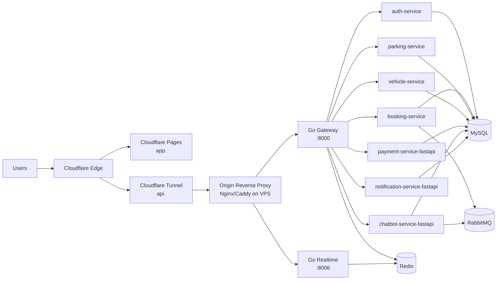

# FIX-ALL + Cloudflare Release Plan (Release-Ready Target)

**Ngày:** 2026-03-13  
**Vai trò:** Architect  
**Input chính:** `docs/research/ISSUE-SECURITY-BLOCKERS-2026-03-13-release-readiness-cloudflare.md`

## 1) Kiến trúc target release-ready

### 1.1 Target topology (khả thi với codebase hiện tại)

### 1.2 Quy tắc routing production

- FE public: `https://app.<domain>` từ Cloudflare Pages.
- API public: `https://api.<domain>/api/*` (reverse proxy strip `/api` trước khi forward tới `gateway-service-go:8000`).
- WebSocket public: `wss://api.<domain>/ws/*` (reverse proxy forward tới `realtime-service-go:8006`).
- Chỉ expose public qua Cloudflare: FE domain và API domain. MySQL/Redis/RabbitMQ không expose internet.

### 1.3 Vì sao không dùng Cloudflare Workers cho backend hiện tại

- Backend hiện stateful và phụ thuộc runtime Docker (Python services + Go gateway + Redis + MySQL + RabbitMQ).
- Lift-and-shift sang Workers/DO sẽ là redesign lớn ngoài scope FIX-ALL.
- Target release này dùng Tunnel để public origin an toàn, không thay đổi business architecture.

---

## 2) Thiết kế Cloudflare deployment cụ thể

### 2.1 Frontend trên Cloudflare Pages

- **Project root:** `spotlove-ai`
- **Build command:** `npm ci && npm run build`
- **Build output directory:** `dist`
- **Framework preset:** `Vite`
- **Production branch:** `main`
- **Environment variables (Pages):**
  - `VITE_API_URL=https://api.<domain>/api`
  - `VITE_WS_URL=wss://api.<domain>/ws`
  - `VITE_GATEWAY_SECRET=<secret>`

### 2.2 Backend qua Cloudflare Tunnel

#### Pattern khuyến nghị

- `cloudflared` chạy trên VPS/origin host nơi chạy Docker Compose.
- Tunnel ingress forward toàn bộ `api.<domain>` về reverse proxy nội bộ (ví dụ `http://localhost:8088`).
- Reverse proxy tách route:
  - `/api/*` -> `gateway-service-go:8000` (rewrite bỏ `/api`)
  - `/ws/*` -> `realtime-service-go:8006` (giữ upgrade headers)

#### Lý do chọn reverse proxy trước gateway/realtime

- Giữ FE contract ổn định (`/api`, `/ws`) dù service nội bộ dùng nhiều port.
- Tránh mở nhiều public hostname không cần thiết.
- Dễ thêm rate limit/CORS policy tập trung.

### 2.3 DNS/SSL/Caching/WAF/Rate Limit baseline

#### DNS

- `app.<domain>`: CNAME tới Pages target.
- `api.<domain>`: route qua Tunnel (`cloudflared tunnel route dns`).

#### SSL/TLS

- Chế độ TLS: `Full (strict)`.
- Origin cert hợp lệ (Cloudflare Origin Certificate hoặc cert chuẩn CA).

#### Caching baseline

- `app.<domain>`: cache static assets mặc định Pages.
- `api.<domain>/api/*`: `Cache Level: Bypass`.
- `api.<domain>/ws/*`: bypass cache, cho phép WebSocket upgrade.

#### WAF baseline

- Bật Managed WAF Ruleset (OWASP baseline).
- Bật Bot Fight Mode (nếu không ảnh hưởng traffic hợp lệ).
- Rule deny truy cập direct tới origin IP (chỉ allow Cloudflare IP ranges nếu có firewall host).

#### Rate limiting baseline

- `POST /api/auth/login`: 10 req / phút / IP.
- `POST /api/auth/register`: 5 req / phút / IP.
- `POST /api/chatbot/*`: 30 req / phút / IP.
- `GET/POST /api/*` còn lại: 120 req / phút / IP (baseline, tinh chỉnh sau quan sát).

---

## 3) Danh sách thay đổi file cụ thể cho implementer (P0/P1)

## P0 (must-have trước deploy)

- [ ] Sửa pipeline path mismatch trong `.github/workflows/ci.yml`:
  - thay `dailytracking-backend` -> `backend-microservices`
  - thay `dailytracking-frontend` -> `spotlove-ai`
  - đảm bảo lệnh lint/test/build chạy đúng repo hiện tại
- [ ] Thêm workflow deploy FE lên Pages: `.github/workflows/deploy-cloudflare-pages.yml`.
- [ ] Thêm skeleton tunnel config: `infra/cloudflare/cloudflared/config.example.yml`.
- [ ] Thêm skeleton reverse proxy config: `infra/cloudflare/reverse-proxy/api.conf.example`.
- [ ] Tạo `spotlove-ai/.env.example` chứa đầy đủ biến `VITE_API_URL`, `VITE_WS_URL`, `VITE_GATEWAY_SECRET`.
- [ ] Bump dependencies FE có advisory High và cập nhật `spotlove-ai/package-lock.json`.

## P1 (ngay sau P0, trước production cutover)

- [ ] Cập nhật `backend-microservices/.env.example` bổ sung biến host/protocol phục vụ proxy/tunnel production.
- [ ] Thêm runbook deploy + rollback: `docs/notes/cloudflare-deploy-runbook.md`.
- [ ] Cập nhật `spotlove-ai/README.md` phần deploy Cloudflare Pages + env production.
- [ ] Thêm `docs/testing/release-gate-cloudflare.md` làm checklist gate liên-agent.

## Non-goals (không làm trong FIX-ALL này)

- Không refactor microservices sang Workers.
- Không thay đổi business flow/auth flow lớn.
- Không thay DB engine hoặc tái kiến trúc event bus.

---

## 4) Rollback plan nếu deploy lỗi

## 4.1 Nguyên tắc rollback

- Rollback theo lớp: FE trước, sau đó API/Tunnel.
- Không rollback DB schema bằng tay khi chưa có migration rollback plan rõ ràng.

## 4.2 Rollback FE (Pages)

- Trong Cloudflare Pages: promote deployment trước đó (last known good).
- Nếu lỗi env: revert biến môi trường về snapshot trước deploy và redeploy commit cũ.

## 4.3 Rollback API/Tunnel

- Bước 1: disable/route lại Tunnel hostname `api.<domain>` về origin cũ (hoặc maintenance endpoint).
- Bước 2: rollback reverse proxy config về phiên bản trước.
- Bước 3: restart `cloudflared` + reverse proxy + verify health.
- Bước 4: nếu vẫn lỗi, tạm thời unpublish endpoint public và kích hoạt incident notice.

## 4.4 Rollback DNS

- Giữ TTL thấp (60-120s) trong cutover window.
- Lưu sẵn record cũ để restore nhanh.

---

## 5) Acceptance criteria cho gate tester/security/qc/devops

## 5.1 Tester gate

- [ ] FE: `npm run test` pass và `npm run build` pass tại `spotlove-ai`.
- [ ] Backend critical suites (chatbot/payment) pass trong test env hợp lệ (không lỗi DB 1045/2003).
- [ ] WebSocket smoke: client connect `wss://api.<domain>/ws/...` thành công, nhận ít nhất 1 message ping/pong hoặc event hợp lệ.

## 5.2 Security gate

- [ ] `npm audit --audit-level=high` không còn High/Critical chưa có exception được duyệt.
- [ ] Không có hardcoded secrets mới trong diff.
- [ ] WAF managed rules đang bật và có ít nhất 1 rule rate limit auth endpoints.
- [ ] TLS mode `Full (strict)` đang áp dụng cho zone.

## 5.3 QC gate

- [ ] Gate file `docs/testing/release-gate-cloudflare.md` được tick đầy đủ, có evidence links/logs.
- [ ] Coverage report được cập nhật theo chuẩn team (unit/integration) hoặc có approved waiver.
- [ ] Không còn path mismatch trong CI; pipeline main branch chạy xanh.

## 5.4 DevOps gate

- [ ] Secrets tồn tại trong GitHub: `CF_API_TOKEN`, `CF_ACCOUNT_ID`, `CF_PAGES_PROJECT` (+ `CF_TUNNEL_TOKEN` nếu deploy tunnel qua CI).
- [ ] Deploy workflow FE chạy thành công từ `main`.
- [ ] `api.<domain>` trả 2 health checks:
  - `GET /api/health` (qua gateway)
  - WS handshake tại `/ws/...`
- [ ] Rollback drill được chạy thử 1 lần trên staging và ghi log.

---

## 6) Checklist hành động ngay theo agent (handoff-ready)

## Implementer

- [ ] Hoàn tất toàn bộ P0 file changes.
- [ ] Hoàn tất P1 file changes không đụng business logic.
- [ ] Mở PR với phạm vi đúng FIX-ALL Cloudflare readiness.

## Tester

- [ ] Chạy regression FE + backend critical path trong env chuẩn.
- [ ] Xác nhận WS realtime handshake và message flow tối thiểu.
- [ ] Đính kèm evidence vào `docs/testing/release-gate-cloudflare.md`.

## Security

- [ ] Chạy dependency audit sau upgrade.
- [ ] Verify policy TLS/WAF/rate-limit ở Cloudflare dashboard.
- [ ] Ký duyệt risk exceptions (nếu còn) bằng văn bản.

## QC

- [ ] Đối chiếu artifact test/security/devops với acceptance criteria mục 5.
- [ ] Chỉ PASS khi đủ evidence và CI xanh.

## DevOps

- [ ] Tạo/verify Cloudflare resources (Pages project, Tunnel, DNS records, WAF rules).
- [ ] Kích hoạt deploy workflow và chạy smoke test public.
- [ ] Chuẩn bị rollback command sheet trước production cutover.

---

## 7) Quyết định kiến trúc

- Quyết định: **Pages (FE) + Tunnel (API/WS) + origin reverse proxy** là target release-ready cho đợt hiện tại.
- Trạng thái: **Accepted (scope ISSUE-SECURITY-BLOCKERS-2026-03-13).**
